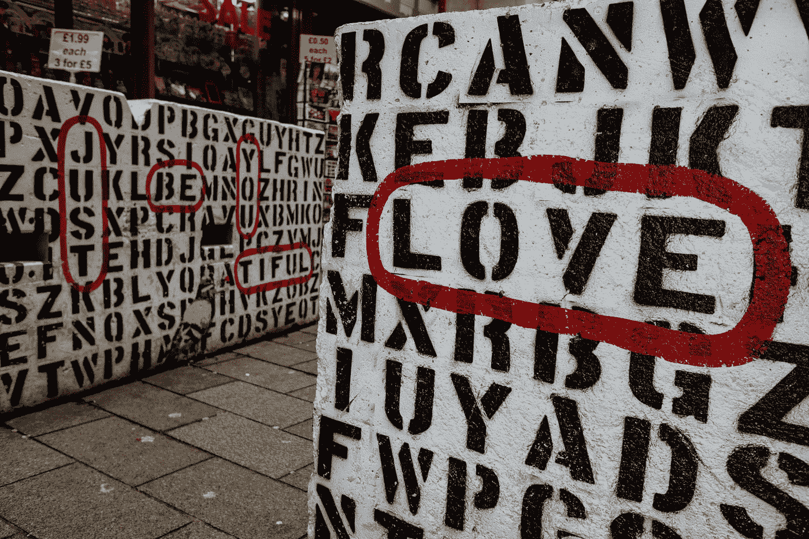

# 一些用于文本规范化的 Python 函数

> 原文：<https://medium.com/analytics-vidhya/some-handy-functions-for-text-cleaning-and-manipulation-42bece1f390b?source=collection_archive---------27----------------------->

凯文在 [Unsplash](https://unsplash.com?utm_source=medium&utm_medium=referral) 上[悲伤](https://unsplash.com/@grievek1610begur?utm_source=medium&utm_medium=referral)的照片

清理文本是一项挑战，尤其是当我们处理社交媒体帖子时。下面我想分享一些我在社交媒体帖子的文本分类模型中进行文本清理和规范化过程时发现有用的功能:

## 1.绘文字

【https://pypi.org/project/emoji/】文档: