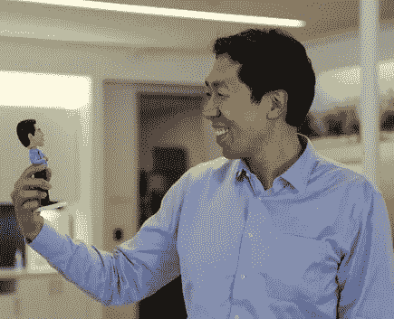
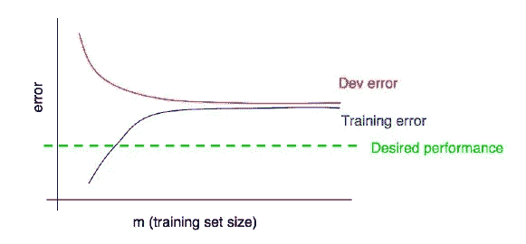

# Andrew NG 的书《机器学习的渴望》中的一些重要的 ML 指针

> 原文：<https://medium.com/analytics-vidhya/some-important-ml-pointers-from-andrew-ngs-book-machine-learning-yearning-6d27bcefb62?source=collection_archive---------28----------------------->

*成为更好的机器学习实践者的重要概念*

我从 Andrew NG 在 Coursera 上的机器学习课程开始了我的数据科学之旅，我猜其他数百万学生和专业人士也开始了类似的旅程。因此，我忍不住想得到他出版的唯一一本在网上免费提供的书——《机器学习的渴望》。你可以在这里下载:【https://www.deeplearning.ai/machine-learning-yearning/】T2

为了成功地提供有用的数据产品，为我们工作的公司带来利润，这本书可能是塞翁失马，焉知非福。

通过这篇博客，我想总结一下他在本书中提到的一些重要概念，这些概念可能不会按照他提到的任何特定顺序排列。

1.  **训练集和测试集的数据集分布**:在本书的主要部分，他重申了训练集和测试集(或验证集)中数据集分布的观点。大多数机器学习或深度学习模型都是为了在训练模型时对手头不可用的新数据进行归纳而构建的。例如:假设您正在构建一个分类器来检测猫，您的训练数据包含来自互联网的猫图像(可能具有更高的“像素”质量，可能是静止的图像)，而我们正在构建的分类器/模型用于移动应用程序，其中用户不断上传从智能手机拍摄的图像(运动图片/较低的像素质量)。测试集(此处为移动图像)的分布与训练集有很大不同。在这种情况下，Andrew NG 要求我们小心谨慎，确保模型建立在使用它的相同数据分布上，否则模型将毫无用处。
2.  有时，机器学习实践者有非常具体的目标，但他们对在训练集中放入多少数据感到困惑。继续前面的例子，假设我们的目标只是预测从手机上拍摄的猫的图像。在这种情况下，您可能会认为训练集应该只包含从移动设备拍摄的照片以获得更好的准确性，但事实证明这取决于计算成本。如果对计算能力没有限制，大型神经网络实际上可以在给定更多数据的情况下学习猫的不同特征，即使互联网和移动图像之间的一些属性如亮度等可能不同。事实上，这些特征学习过程可以改进分类器，从而使其成为更健壮和更通用的产品，
3.  **错误分析**:大多数机器学习实践者必须分析一些指标，以便决定哪一个表现最好。首先，Andrew 要求我们定义一个衡量标准来决定哪个模型更好。如果有很多事情(或指标)需要记住，如运行时间、成本、精度、召回等，他建议最好使用这 n 个指标中的(n-1)个作为满意指标，然后优化最后一个(第 n 个)指标。接下来，他建议最好保留一个度量的最佳值，并将其作为执行错误分析的基准。在像猫图像检测这样的一些应用中，很容易定义最佳度量，因为人类可以很容易地以精确的准确度识别猫，因此在这种情况下的最佳误差将是 0%，这将作为我们模型的基准。作为另一个例子，假设您正在构建一个语音识别系统，并且发现 14%的音频剪辑具有如此多的背景噪声或者难以理解，以至于甚至一个人都不能识别所说的内容。在这种情况下，即使是最“最优”的语音识别系统也可能有大约 14%的误差，因此给出 15%误差的模型实际上可能是好的。如果你正在解决一个甚至人类都很难解决的问题(例如，预测推荐什么电影，或者向用户展示什么广告)，那么很难估计最佳的错误率。在这种情况下，机器比人表现更好，并使用其他错误分析技术。
4.  分析来自开发集的**错误分类的结果非常重要，以了解我们的模型在哪里表现不佳，以便我们做出明智和慎重的决定，迭代到更好的模型。在作出任何决定之前，应该有实质性的收获。下面是他为 dev 集中的错误分类示例建议的表格类型的快照:**

可以很容易地分析该表，并且可以采取迭代和明智的决策来改进该模型。

5.有时候，仅仅增加**训练集的大小**对进一步改进模型没有任何帮助。在下面的图表中，我们可以看到开发误差和训练误差已经形成了平稳状态。随着 m(训练集大小)的增加，它并没有得到很大的改善。在这种情况下，我们必须尝试寻找其他改进，如模型架构、超参数和偏差-方差分析。例如，在给定的图中，很明显存在偏差，因为训练误差超过了期望的最佳性能。在这种情况下，我们应该尝试改变模型，如建立一个更深的模型，以改善训练误差，减少偏差。

6.当谈到建立**机器学习和深度学习管道时，**有时建立非端到端的管道比端到端的管道更好。下图将展示为自动驾驶汽车构建管道的不同之处。我们可以将所有相机图像(通过在驾驶时通过传感器捕捉)输入到我们的模型中，或者我们可以将我们的问题分为检测汽车和行人(两个独立的模型)，然后使用它来为汽车规划路径，然后给我们提供所需的转向方向。它以各种形式帮助我们。我们可以建立几个不复杂的模型来得到我们想要的。此外，通过分别分析管道的每个组件，错误分析变得更加容易。

这本书详细解释了每一个概念，但我只是想总结一下，这样可以帮助那些能够简单掌握所有概念的人，并促进其他人的阅读。

如果你愿意，请尽可能多的鼓掌来激励我写更多。真的很有帮助。要阅读我的其他数据科学博客，请点击以下链接:

 [## Saket Garodia -培养基

### 阅读媒介上 Saket Garodia 的作品。每天学习数据科学 https://www.linkedin.com/in/saket-garodia/.…

medium.com](/@saketgarodia) 

非常感谢你的阅读。

不断学习和分享。