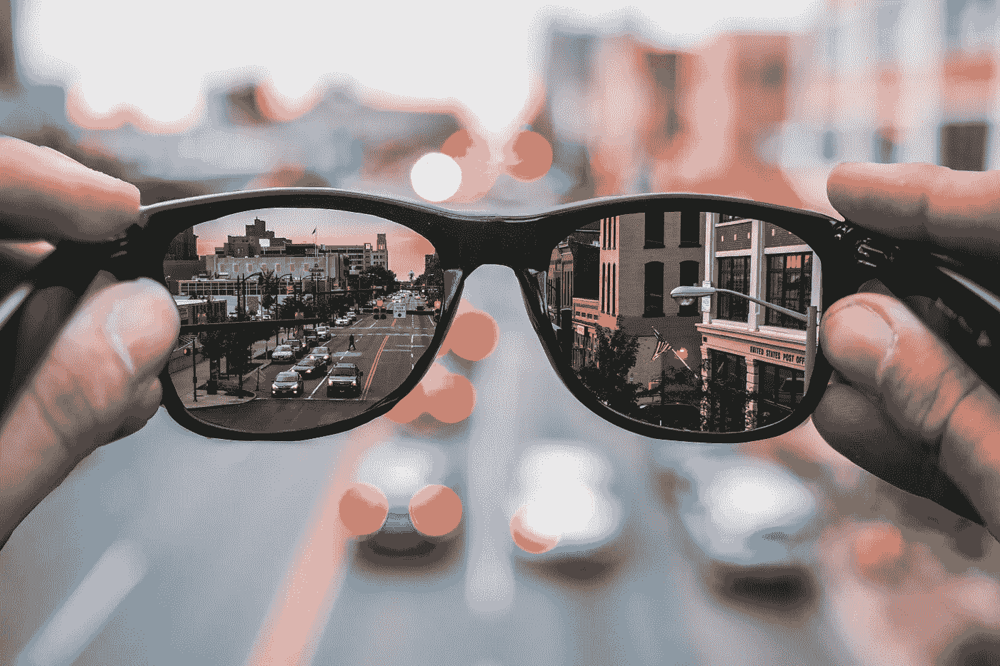
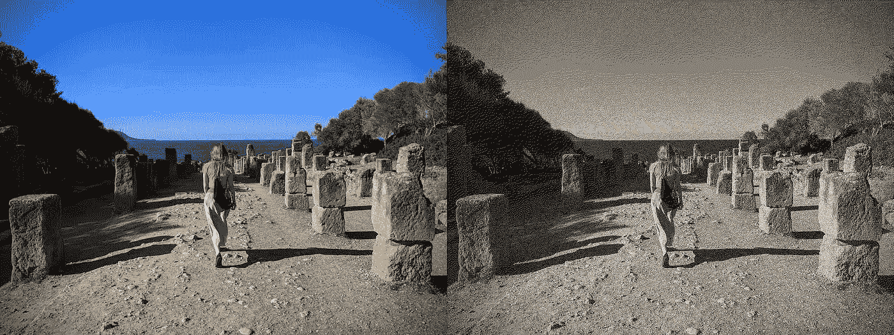
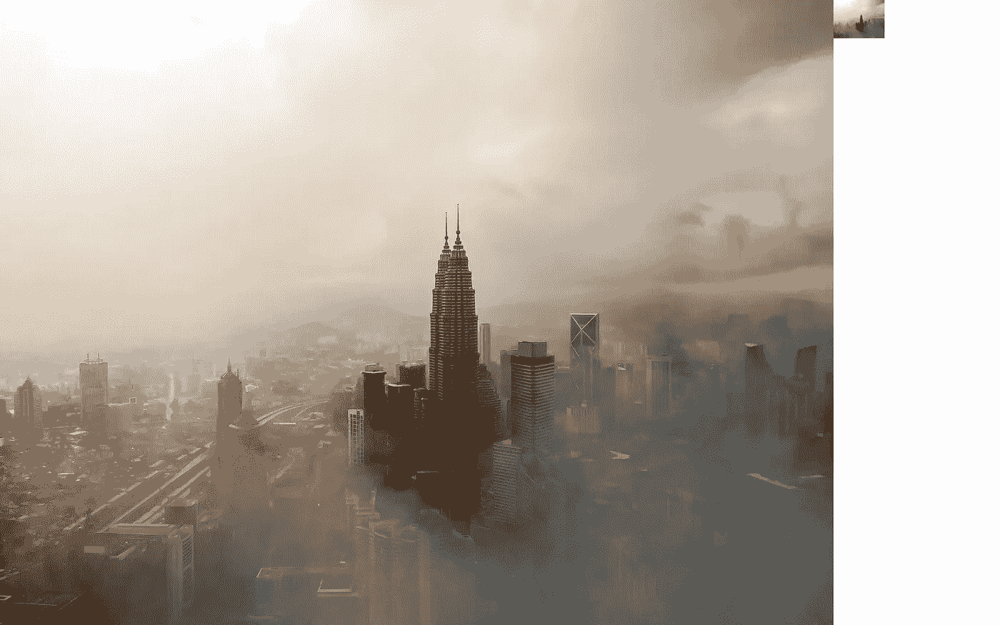
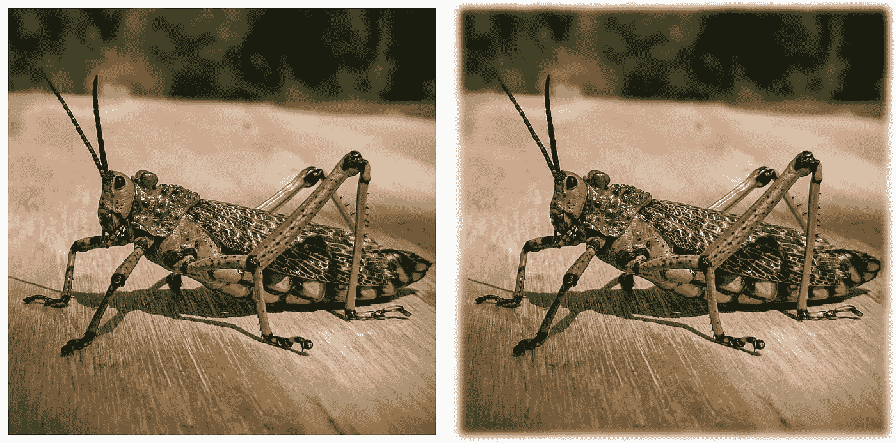
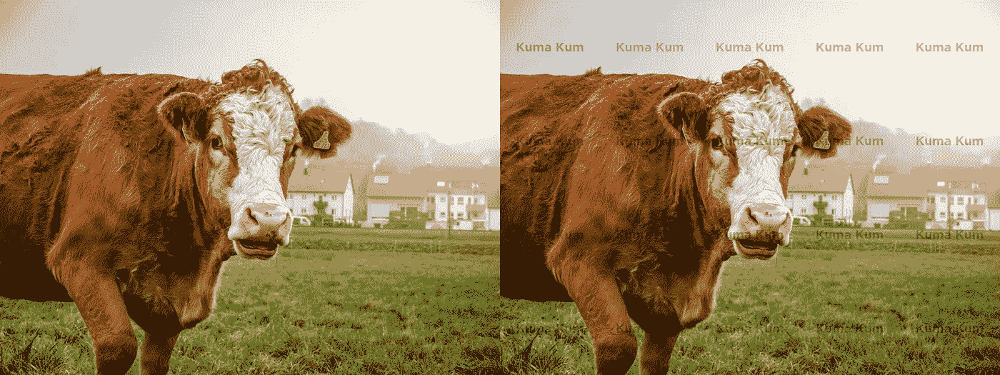

# Python 枕头中的一些有趣的技巧

> 原文：<https://medium.com/analytics-vidhya/some-interesting-tricks-in-python-pillow-8fe5acce6084?source=collection_archive---------7----------------------->

只是在时间片段，python 图像处理库。



马修·法斯纳赫特在 [Unsplash](https://unsplash.com/s/photos/manipulation?utm_source=unsplash&utm_medium=referral&utm_content=creditCopyText) 上的照片

照片由[丹尼尔·马尔辛科夫斯基](https://unsplash.com/@dmarcinkowski?utm_source=unsplash&utm_medium=referral&utm_content=creditCopyText)在 [Unsplash](https://unsplash.com/s/photos/panorama?utm_source=unsplash&utm_medium=referral&utm_content=creditCopyText) 上拍摄

图像处理基本上是一个将*数字化图像转换成期望图像的过程。大多数时候，当人们想到图像处理时， *photoshop* 会出现在脑海中。这是改变和改善图像最常用的工具之一。不过这个帖子重点是 [*Python*](https://www.python.org/) 图像操纵库，确切的说是枕头。*

> 根据[Python 的搭便车指南](https://docs.python-guide.org/scenarios/imaging/)，大多数图像处理和操作技术可以使用两个库有效地执行:Python 图像库(PIL)和开源计算机视觉(OpenCV)。

Pillow 是 PIL (Python 图像库)的一个分支，由 [Alex Clark 和贡献者](https://github.com/python-pillow/Pillow/graphs/contributors)启动和维护。最初基于 PIL 法典，它演变成一个更好、更现代、更友好的 PIL 版本。它支持打开和操作许多不同文件格式的图像。

如果你熟悉 [*Python 编程语言*](https://www.python.org/) ，很有可能你已经遇到并可能使用过 Pillow。

## **基本安装**

首先，你需要在你的机器上安装 *python* 。还要确保*Python*[*pip*](https://pypi.org/project/pip/)*(Python 包索引)*已经安装并且是最新的。要安装*枕头，运行下面的命令:*

```
*$ pip install Pillow*
```

*现在您已经成功安装了 Pillow，下面有一些代码片段，您可能会觉得非常方便(至少我是这样)。 ***注意*** *下面的样本是基本的图像操作，如调整大小、模糊、灰度转换等等*。*

## *转换为灰度(黑白)*

*下面的代码片段将图像( *test_image.jpg* )转换为基本灰度。将其保存为新图像(*test _ image _ gray . jpg*)。*

```
*from PIL import Image# open colour image
img = Image.open("test_image.jpg")# convert image to black and white
img = img.convert("1")# save new image
img.save("test_image_grayscale.jpg")# show image in preview
img.show()*
```

**

*照片由 [Ina Sonne](https://www.instagram.com/sonne.ina/) 在 [Instagram](https://www.instagram.com/) 上拍摄*

## *生成缩略图*

*通常，我们需要快速缩略图几个图像。下面的片段就可以做到这一点。*

```
*from PIL import Image# open image
img **=** Image.open("test_image.jpg")# set the maximum width and height for the thumbnail
max_thumbnail_size **=** (200, 200)# applying size for thumbnail
img.thumbnail(max_thumbnail_size)# creating thumbnail
img.save("test_image_thumb.jpg")# show image in preview
img.show()*
```

**

*图片由 [Ishan @seefromthesky](https://unsplash.com/@seefromthesky?utm_source=unsplash&utm_medium=referral&utm_content=creditCopyText) 在 [Unsplash](https://unsplash.com/s/photos/malaysia?utm_source=unsplash&utm_medium=referral&utm_content=creditCopyText) 上拍摄*

## *替换颜色(RGB)*

*下面的代码替换所有的白色像素，用黄色替换。为了调整多种颜色的图像，需要进行更多的调整。尽管如此，下面的代码片段对于纯色背景的图片来说效果很好。*

```
*from PIL import Image# open image
img = Image.open("test_image.jpg")
img = img.convert("RGB")datas = img.getdata()new_image_data = []for item in datas:
    # change all white (also shades of whites) pixels to yellow
    if item[0] in list(range(190, 256)):
        new_image_data.append((255, 204, 100))
    else:
        new_image_data.append(item)# update image data
img.putdata(new_image_data)# save new image
img.save("test_image_altered_background.jpg")# show image in preview
img.show()*
```

**

*图片来自[谷歌电子表格 API](https://developers.google.com/sheets/api)*

## *添加边框*

*它接受应用于图像的边框的颜色和大小。边框可以是整数值，例如 5，这表示所有边框(左、上、右和下)都具有相同的大小。它还接受元组，即(5，10，5，10)，每边具有不同的值。*

```
*from PIL import Image, ImageOps# open image
img = Image.open("test_image.jpg")# border color
color = "green"# top, right, bottom, left
border = (20, 10, 20, 10)new_img = ImageOps.expand(img, border=border, fill=color)# save new image
new_img.save("test_image_result.jpg")# show new bordered image in preview
new_img.show()*
```

*当如上所述对图像样本应用边框时，它应该如下图所示。*

**

*图片来自[谷歌电子表格 API](https://developers.google.com/sheets/api)*

## *添加模糊边缘*

*相对于前面的例子，本节由几个步骤组成。第一部分需要创建一个模糊的图像(蒙版)，并使用该图像作为原始图像的蒙版。下面将详细介绍如何创建 ***模糊边缘图像*** 的步骤和过程。*

```
*from PIL import Image, ImageFilter# blur radius and diameter
radius, diameter = 20, 40# open an image
img = Image.open("test_image.jpg")# Paste image on white background
background_size = (img.size[0] + diameter, img.size[1] + diameter)
background = Image.new('RGB', background_size, (255, 255, 255))
background.paste(img, (radius, radius))# create new images with white and black
mask_size = (img.size[0] + diameter, img.size[1] + diameter)
mask = Image.new('L', mask_size, 255)
black_size = (img.size[0] - diameter, img.size[1] - diameter)
black = Image.new('L', black_size, 0)# create blur mask
mask.paste(black, (diameter, diameter))# Blur image and paste blurred edge according to mask
blur = background.filter(ImageFilter.GaussianBlur(radius / 2))
background.paste(blur, mask=mask)background.save("test_image_blurred.jpg", quality=100))# show blurred edged image in preview
background.show()*
```

**

*照片由 [Ina Sonne](https://www.instagram.com/sonne.ina/) 在 [Instagram](https://www.instagram.com/) 上拍摄*

## *添加水印*

*使用水印是书中最古老的防止图像被盗版的技巧之一。即使有几种新的方法来逃避图像上的水印(如果你好奇，可以了解一下)，它仍然非常有效。下面代码示例说明了如何在图像中添加连续水印。*

```
*from PIL import Image, ImageDraw, ImageFont# open image to apply watermark to
img = Image.open("watermark_test.jpg")
img.convert("RGB")# get image size
img_width, img_height = img.size# 5 by 4 water mark grid
wm_size = (int(img_width * 0.20), int(img_height * 0.25))
wm_txt = Image.new("RGBA", wm_size, (255, 255, 255, 0))# set text size, 1:40 of the image width
font_size = int(img_width / 40)# load font e.g. [gotham-bold.ttf](https://www.dafontfree.net/freefonts-gotham-f127516.htm)
font = ImageFont.truetype(path.format("gotham-bold.ttf"), font_size)
d = ImageDraw.Draw(wm_txt)wm_text = "Kuma Kum"# centralize text
left = (wm_size[0] - font.getsize(wm_text)[0]) / 2
top = (wm_size[1] - font.getsize(wm_text)[1]) / 2# RGBA(0, 0, 0, alpha) is black
# alpha channel specifies the opacity for a colour
alpha = 75# write text on blank wm_text image
d.text((left, top), wm_text, fill=(0, 0, 0, alpha), font=font)# uncomment to rotate watermark text
# wm_txt = wm_txt.rotate(15,  expand=1)
# wm_txt = wm_txt.resize(wm_size, Image.ANTIALIAS)for i in range(0, img_width, wm_txt.size[0]):
    for j in range(0, img_height, wm_txt.size[1]):
        img.paste(wm_txt, (i, j), wm_txt)# save image with watermark
img.save("watermark-image.jpg")# show image with watermark in preview
img.show()*
```

**

*照片由[库马·库姆](https://unsplash.com/@kumakum?utm_source=unsplash&utm_medium=referral&utm_content=creditCopyText)在 [Unsplash](https://unsplash.com/s/photos/ina-sonne?utm_source=unsplash&utm_medium=referral&utm_content=creditCopyText) 上拍摄*

*所以你走吧！*

*您可以使用枕头库做更多事情。以上只是几个基本的样本，我经常使用，认为特别有用。自己尝试一下，完整的代码片段和更多…可以通过[点击这里](https://gist.github.com/namieluss)找到。*