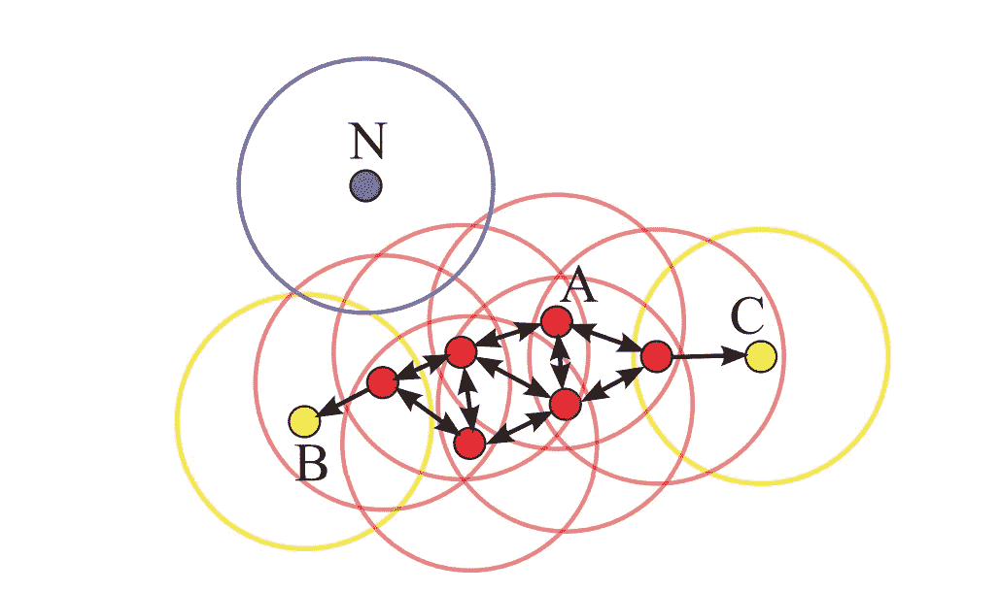
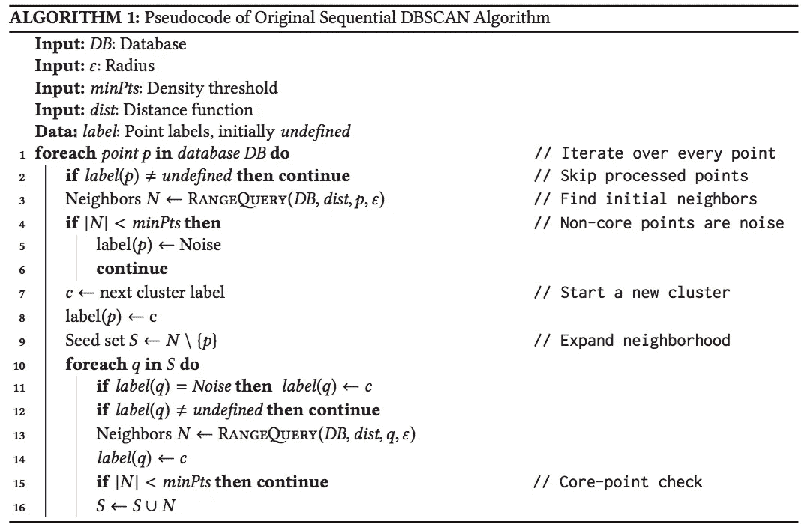

# 关于 DBSCAN 算法的几点注记

> 原文：<https://medium.com/analytics-vidhya/some-notes-on-dbscan-algorithm-61a2e9acce29?source=collection_archive---------13----------------------->

DBSCAN 集群模型图解(来源:[https://dl.acm.org/doi/pdf/10.1145/3068335](https://dl.acm.org/doi/pdf/10.1145/3068335)

在这篇文章中，我想讨论一些关于 DBSCAN 算法的见解。通常，当我看一个算法的时候，我会试着看看每一行伪代码是做什么的，为什么？

算法 1:原始顺序 DBSCAN 算法的伪代码(来源:【https://dl.acm.org/doi/pdf/10.1145/3068335】T2)

# 第 12 行:q 是核心还是基点？