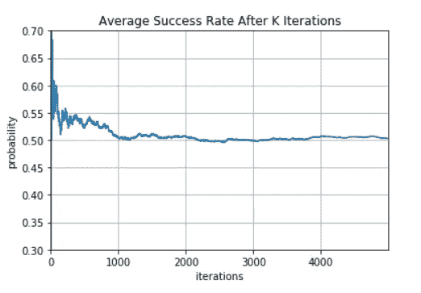
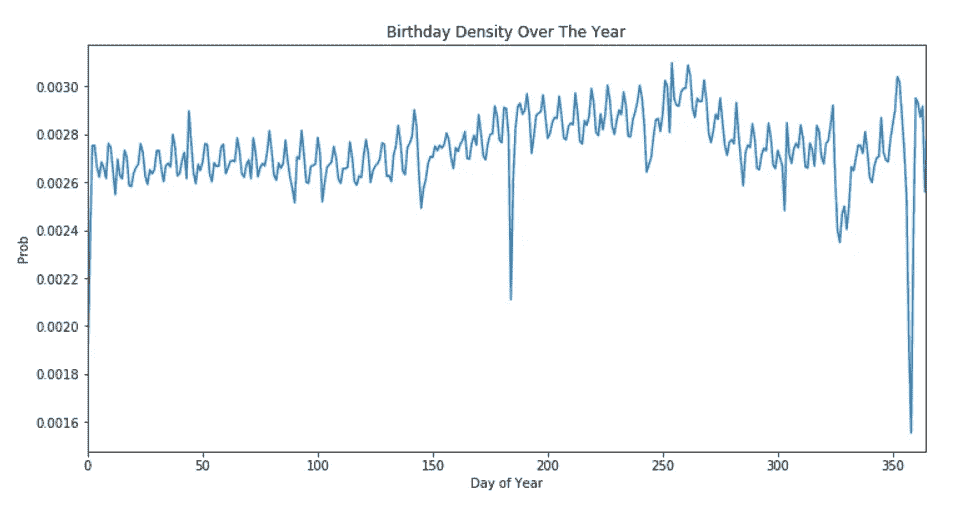
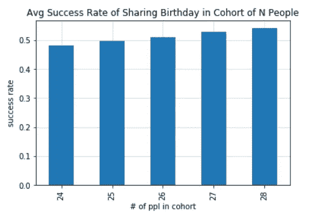

# 一些 Python，一些模拟，还有生日悖论

> 原文：<https://medium.com/analytics-vidhya/some-python-some-simulation-and-the-birthday-paradox-49cc91be3bd2?source=collection_archive---------15----------------------->

阿迪·戈尔茨坦在 [Unsplash](https://unsplash.com?utm_source=medium&utm_medium=referral) 上的照片

也许你听说过生日悖论:在一个 25 人的房间里，有 50%的可能性两个人过同一天生日，而对 70 个人来说，这种可能性变成了 99.9%。虽然在历史上被称为“生日问题”，但如此迅速地得出如此确定的概率这一令人惊讶的事实，已将这一著名的概率练习视为一个表面上的悖论。

主要的潜在假设是，一年中的每一天都同样可能是某人的生日。但我们从人口统计数据中得知，情况并非如此，生日在一年中遵循一个可预测的模式，分布更加偏向一年中的后几个月。这自然回避了一个问题:一旦我们调整概率分布来解释周期性出生率，生日问题会如何变化？这是一个很难的数学练习，模拟和大数定律可以帮助你。

# 最初的配方

原来的生日问题是这样的:假设一个房间里有 23 个人。将它们排成一行，然后计算每个人不与前 N 个人同一天生日的条件概率。这就好比没有替换的抽样:(365/365)*(364/365)*……*(343/365)= 49.27%

49%代表在那个队列中没有人同一天生日的概率。然而，与此相反的是，至少有两个人同一天生日。所以我们得到 1-.4927=.5073 或 50.73%。

# 一些 Python 和一点模拟

我们也可以通过一些模拟来得出这个概率。这里的驱动假设是，每天都同样可能是某人的生日，所以我们可以从 365 个生日的均匀分布中抽取 23 个人，看看是否有人同一天生日。我们重复这个 K 次，我们应该看到一半的时间，有一个共同的生日，一半的时间没有。

我们得到以下结果:

模拟 1:均匀出生分布

代码非常简单。我们使用 Pandas Sample 方法来指定我们想要多少次绘制，并指定我们想要使用替换来绘制。如果两个生日的长度匹配，生日的唯一计数将小于原始长度，我们记录为 1 表示成功。如果我们没有得到一个匹配，我们记录一个 0，然后取成功的平均值来得到成功率。额外的 Avg 数组捕获累积平均成功率，以显示我在上面的图表中显示的大数定律的应用。

这确实是大数定律的一个很好的应用。大约需要 1000 次抽取，抽样平均值才能收敛到其真实的潜在概率。这一思想为现代推断统计理论提供了基础。看到一个有趣的应用和可视化是很酷的。

# 根据普查数据重新加权

现在让我们考虑从人口普查数据得出的实际生日分布。FiveThirtyEight 的优秀统计学家已经完成了收集这些数据并将其汇总成 2000 年至 2014 年每一天的生日计数的繁重工作。我去掉了闰年，因为我这样做只是为了好玩，而不是写论文。我用从数据中导出的基本分布加权的采样方法重新运行了模拟。但首先，看一下年度模式。我对剩余年份的每日计数进行了平均。

有几件事很突出:

1.  在元旦、独立日、平安夜和圣诞节，出生率有相当大的下降
2.  人们真的不喜欢在周末生孩子
3.  八月和九月是更受欢迎的出生月份

以下是输出的模拟代码:

模拟 2:出生分布不均

模拟方法与上面的相同，除了如图所示，我循环了不同的队列规模，因为我不确定哪个规模会产生 50-50 的分裂。此外，我在 Pandas 样本方法中使用了“权重”选项，将经验分布应用于样本抽取。

看起来 25 个人的小组最接近 50%的概率。这与最初的 23 个非常接近，我对此并不感到惊讶，因为真实的分布虽然波动明显，但并没有偏离平均值太多。

# 外卖食品

假设一年中出生率的均匀分布实际上会让你在这个问题上走得很远。真实的经验分布是有趣的，但似乎没有偏离到足够重要的程度。

更重要的是，在解决分析上的难题和围绕困难的想法产生直觉时，模拟的使用非常有用。这就是为什么在许多统计学入门课上，模拟被用来解释从假设检验到中心极限定理的一切。此外，它是非参数统计的一个组成部分，也是为估计量生成可靠的抽样属性近似值的一个非常有价值的工具。例如，这就是自举标准错误派上用场的地方。

我没有包括我从探索潜在的人口普查数据中创建的其他可视化，但它绝对值得深入研究。你可以很快梳理出一些非常酷的见解。