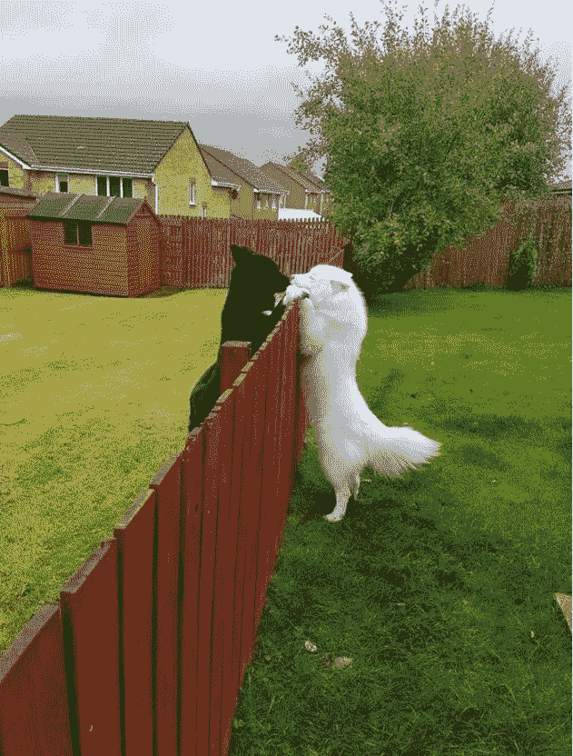
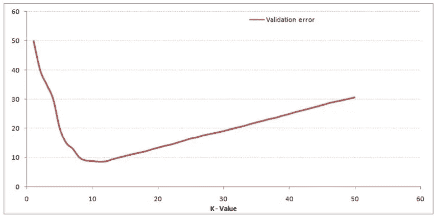
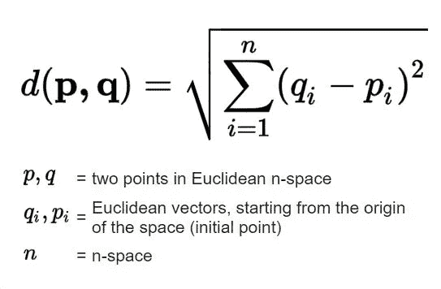
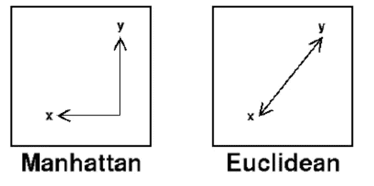
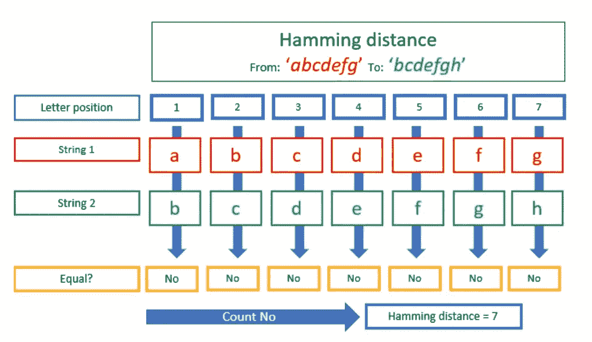

# 关于 KNN 分类的更多信息

> 原文：<https://medium.com/analytics-vidhya/something-more-about-knn-classification-bedbc2d383ab?source=collection_archive---------20----------------------->

如果是数据科学，你不能错过 KNN

我可爱的邻居！

# 介绍

用于分类的最基本算法之一(当然你对机器学习很熟悉)。该算法是在机器学习中使用的更简单的技术之一，并且由于其易用性和低计算时间而受到业内许多人的青睐。KNN 是一种根据最相似的点对数据点进行分类的模型。它使用特征相似性来预测新点将落入的聚类。

> KNN 是一种被认为**非参数化**的算法，也是**懒惰学习**的一个例子。现在让我们谈一谈这个问题。

*   **非参数化**由于没有对潜在的数据分布模式做出假设，该模型完全由提供给它的数据组成，但没有假设数据的结构是正常的。
*   **懒惰学习** KNN 没有训练步骤，数据点仅在预测时使用。由于没有训练步骤，预测步骤的成本很高。热切的学习者算法在训练步骤中热切地学习。

# **算法的预感**

与 KNN 一样，输出被分配给其 *K 个最近邻中最常见的一个类，*K 表示所考虑的邻的数量。现在，下一个问题是如何确定 K 的值，因为基于训练数据的模型是经过 wrt 测试数据验证的，并基于该数据计算误差，所以基本上迭代过程是通过改变 K(通常从 *1 到所有记录计数的平方根*)进行的，并且在图中绘制每个 K 值的相应误差值，然后可以基于最低误差选择 K 值，由于其形状，该图有时也被称为肘形图。

验证图(肘形图)

在验证图中，错误率最初降低并达到最小值。在最小值点之后，它随 K 的增加而增加。误差达到最小值时的 K 值应用于所有预测。

# 现在如何决定我的邻居？

基于新点和每个训练点之间的距离来决定邻居。有各种方法来计算这个距离，其中最常见的方法是欧几里德距离、曼哈顿距离(用于连续距离)和汉明距离(用于分类距离)。

**欧几里德距离:**欧几里德距离计算为新点(x)和现有点(y)的平方差之和的平方根。

**欧几里德距离**

**曼哈顿距离:**两个向量(或点)a 和 b 之间的曼哈顿距离定义为∑*I*|*ai*-*bi*|在向量的维数上。

如果我们需要计算网格状路径中两个数据点之间的距离，我们使用曼哈顿距离，也称为**城市街区距离**，或**出租车几何形状**。

对曼哈顿和欧氏距离的简单理解

**汉明距离:**汉明距离衡量两个相同长度的字符串之间的相似性。相同长度的两个字符串之间的汉明距离是对应字符不同的位置的数量。

汉明距离根据位置比较两个字符串中的每个字母。因此，单词 1 的第一个字母与单词 2 的第一个字母进行比较，然后根据位置比较两个字符串中的每个字母。

# 摘要

k-最近邻(KNN)算法是一种简单的监督机器学习算法，可用于解决分类和回归问题。它易于实现和理解，但有一个主要缺点，即随着所用数据的增长，速度会明显变慢。

虽然本文中没有讨论回归，但请记住回归的一般概念，KNN 通过查找查询和数据中所有示例之间的距离，选择指定数量的最接近查询的示例(K)，然后投票选择最频繁的标签(在分类的情况下)或平均标签(在回归的情况下)。

## 如果你学到了新的东西或者喜欢阅读这篇文章，请鼓掌👏并分享给其他人看。也可以随意发表评论。