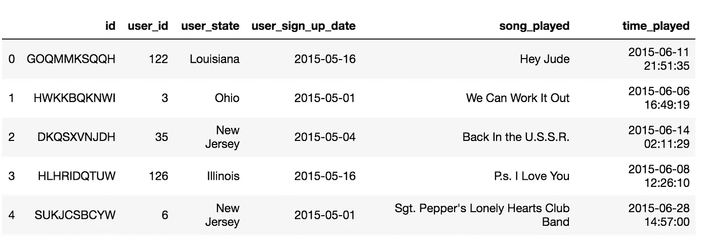
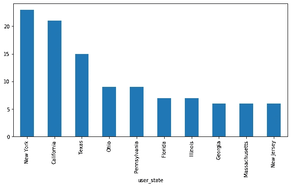
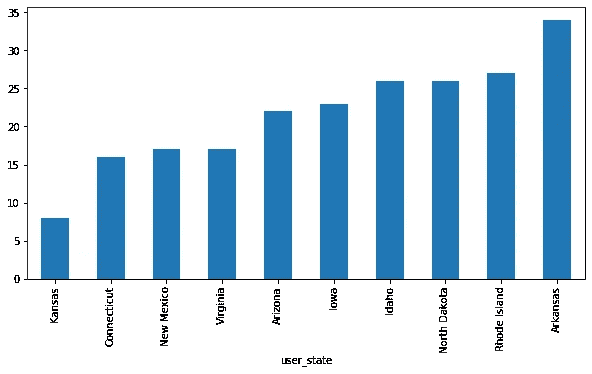
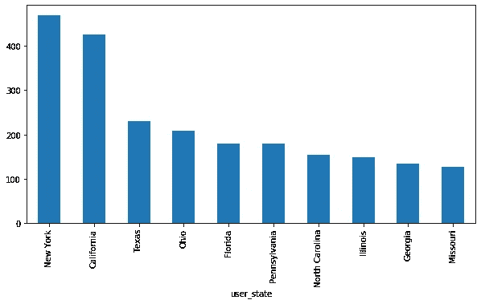
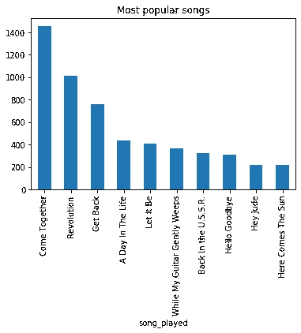
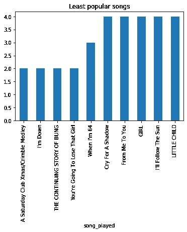

# 使用机器学习的歌曲推荐

> 原文：<https://medium.com/analytics-vidhya/song-recommendation-using-machine-learning-de4e0ea81118?source=collection_archive---------20----------------------->

这篇文章是关于使用最少的用户数据建立一个简单的歌曲推荐模型。下表是数据集的预览。我的 jupyter 笔记本解决方案可以在这里找到:[https://github . com/vnb/Data-Science-Portfolio/blob/master/Song % 20 recommendation . ipynb](https://github.com/vnb/Data-Science-Portfolio/blob/master/Song%20Recommendation.ipynb)

大约有 200 个不同的用户由他们的“用户 id”标识，4000 行中的每一行都有一个唯一的“id ”,表示用户采取的一个动作，在这种情况下是播放一首歌曲。歌曲列表也限于甲壳虫乐队，因此更容易制定简单的 ML 算法来基于用户之前听过的歌曲预测用户播放的下一首歌曲可能是什么。

根据数据，以下是基于总独立用户数和用户活动数的前 10 名和后 10 名状态。用户活动可以被定义为用户采取播放歌曲的动作的总次数，该歌曲由收听这些歌曲的不同时间戳来标识。这些信息可以根据每个状态进行汇总，得出以下结果

基于唯一用户计数的前 10 个状态和后 10 个状态

基于用户活动的前 10 名和后 10 名状态

# 特征工程

为了能够为上述数据构建模型，需要构建一组新的要素。由于用户数量有限且播放列表很小(仅包含披头士的歌曲),因此可以很容易地创建新的指标:

1.  每个用户播放歌曲的总次数
2.  一首歌曲被所有用户播放的总次数-每天的总数
3.  按状态列出的所有用户播放歌曲的总次数
4.  用户按日期播放每首歌曲的顺序

这些指标有助于从播放列表中找到最受欢迎和最不受欢迎的歌曲

最受欢迎和最不受欢迎的歌曲

第二组指标与日期相关。由于不能在模型中直接使用日期时间，因此可以使用日期时间的增量，并进一步转换为整数值。这样做将确保关于注册日期之间的时间和每次播放之间的时间差的信息被保留。

# 模型

为了创建歌曲推荐系统，该模型必须能够预测用户接下来最有可能播放的歌曲。可以删除与日期相关的列，因为与日期相关的所有信息都保留在之前创建的新功能中，然后使用“pandas.get_dummy”将分类数据(如 user_state 和 user_id)转换为一次性编码。

一旦完成，任何分类器都可以用来训练和测试数据集，但我发现 adaBoost 分类器在预测用户接下来可能会听的歌曲方面是最准确的(就 F1 分数而言)。该模型可以随着同一组用户收听更多的歌曲而不断更新，以便改进歌曲推荐模型。