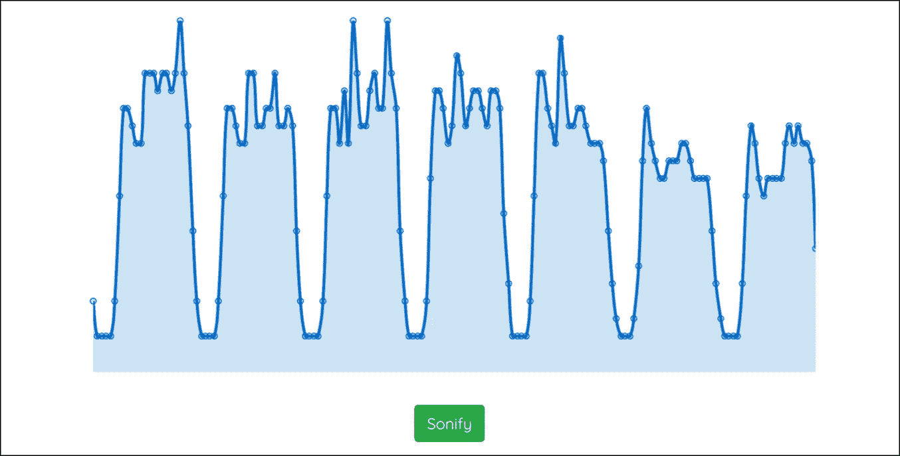

# 发音—听数据

> 原文：<https://medium.com/analytics-vidhya/sonification-listen-to-data-429291b23357?source=collection_archive---------12----------------------->

人们通常会探究他们的数据看起来像什么。但是你有没有想过你的数据*听起来*像什么？

就像可视化帮助你通过你的眼睛消费数据一样，**数据发音**对你的耳朵也有同样的作用。发音可以通过利用不同的乐器、合成器、音量、速度、音高、乐器密度或动态以多种方式表达数据。这可能导致任何事情，从将单个数据点作为音符呈现，到基于大型科学数据集制作完整的音乐作品。艾伦·史密斯[将收益曲线](https://www.ft.com/content/80269930-40c3-11e9-b896-fe36ec32aece)发音化，布莱恩·福[让你听到纽约的收入不平等](https://www.mic.com/articles/177877/data-sonification-lets-you-literally-hear-income-inequality)，甚至 T10 气候变化也可以被听到 T11。

作为一名[歌手兼词曲作者](https://nhinternesch.exposure.co/conical)和[高级数字分析顾问](https://hinternesch.com/?at_medium=affiliate&at_campaign=Medium&at_creation=DataSonification&at_format=link)，数据语音化真正击中了我的甜蜜点。因此，我开始探索这个领域，构建了一个迷你网络应用程序，让你可以听到自己的数据点:
[*https://nhinternesch.github.io/datasonification*](https://nhinternesch.github.io/datasonification/)

[*测试一下！*](https://nhinternesch.github.io/datasonification/)

简而言之，该网站…

*   获取数据输入—手动输入的数据点或直接来自互联网 API[的动态分析数据](https://www.atinternet.com/en/)
*   使用[*chart . js*](https://www.chartjs.org/)JavaScript 图表库来可视化数据
*   将数据点转换为可比较的指数，以简化数据和音符的对齐
*   给 c 大调音阶上的一个音符分配每个音域
*   使用 [*Tone.js*](https://tonejs.github.io/) 框架在浏览器中播放音符序列

当然，这个网站只是一个小小的例子。坦率地说，也是一个无用的人。但它帮助我真正理解了潜在的概念。它赋予发音一个具体的形状，使它变得可触知。听新闻网站每小时的流量，并且能够在人们睡着的时候听到 T1，这很有趣。就像它给了我一个咯咯的笑声，当我在听电子商务数据和黑色星期五的销售导致了我的耳机有史以来最高音调的音符。诸如此类的小例子似乎是着眼于大局的良好开端。数据语音化仍处于其潜在发展的早期阶段，但在更广泛的范围内，**这个概念有更大的影响**:

*   能够*听图表*给了**视障者**一种理解数据可视化的方式。
*   使用**创造性的方式呈现数据**有助于我们**抓住观众的注意力**并传递信息。用例的范围可以从前面提到的[气候变化示例](https://www.kqed.org/science/1918660/listen-1200-years-of-earths-climate-transformed-into-sound)到在办公室实时收听最新 SEM 活动的在线转换。它帮助分析师(…或艺术家…)围绕数据“ [*策划一个体验*](https://www.mic.com/articles/177877/data-sonification-lets-you-literally-hear-income-inequality) ”。
*   最近语音用户界面的出现正在推动技术的使用远离显示器，挑战我们在越来越无屏幕的日常生活背景下嵌入数据可用性。

数据是我们现代世界中最有价值的资产。发音不仅是一种呈现和消费数据的创新方式。就其核心而言，它也是一个让每个人都可以获得数据的工具。

*—如果有人对源代码感兴趣，或者想聚在一起讨论数据堵塞问题，请随时联系***。—**