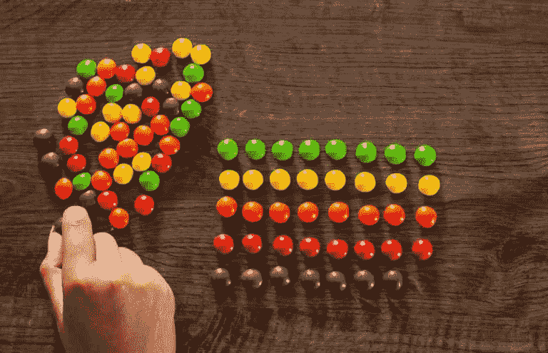

# JavaScript 中的排序算法

> 原文：<https://medium.com/analytics-vidhya/sorting-algorithms-in-javascript-a20a7f33337c?source=collection_archive---------23----------------------->

自从我第一次听说排序算法，它们就一直是有趣的同义词！

从列表中组织元素是我们日常生活中经常需要的东西，通常顺序非常简单，就像数字或尊重一些优先级标志。然而，现在的开发人员对他们的实现非常抽象。



虽然问题很简单，但解决方案并不是很直接，就我自己而言，我经常看到自己重温最常见的算法。几个月前，我决定用 JS 实现 4 个最常用的排序算法:

*   插入排序；
*   冒泡排序；
*   合并排序；
*   快速排序。

希望这篇文章能帮助你理清它们的概念，并为你提供一个简单的实现。

# **插入排序**

```
function insertionSort(arrayToSort) { 
  for (let i = 1; i < arrayToSort.length; i++) {  
    let j = i;  
    while (j > 0 && arrayToSort[j-1] > arrayToSort[j]) {   
      swap(arrayToSort, j-1, j);
      j--;   
    } 
  } 
  return arrayToSort;
}
```

插入排序的工作方式是从列表中逐个取出元素，然后将这些值与当前列表中已经访问过的值进行比较。在 *n* 次迭代结束时，我们保证了 *n* 个元素被排序。

*最坏情况 O(n^{2})比较
*最好情况 O(n)比较

# 冒泡排序

```
function bubbleSort(arrayToSort) {
  for (let i = 0; i < arrayToSort.length; i++) {
    for (let j = 0; j < (arrayToSort.length - i - 1); j++) {
      if (arrayToSort[j] > arrayToSort[j+1]) {
        swap(arrayToSort, j, j+1);
      }
    }   
  }
  return arrayToSort;
}
```

冒泡排序既简单又低效。效率将取决于作为输入给出的列表，但是大多数时候只有在使用几乎排序/排序列表时才是有效的。

*最坏情况下的 O(n^{2})比较
*最好情况下的 O(n^{2})比较—如果添加额外的检查来验证数组是否已经排序，则可能为 O(n)

# 合并排序

```
function mergeSort(arrayToSort) {
  if (arrayToSort.length === 1) {
    return arrayToSort;
  }
  const middle = Math.floor(arrayToSort.length / 2);
  const left = arrayToSort.slice(0, middle); 
  const right = arrayToSort.slice(middle); return merge(mergeSort(left), mergeSort(right));
}function merge(left, right) {
  let result = [];
  while (left.length && right.length) {
    if (left[0] > right[0]) {
      result.push(right.shift());
    } else {
      result.push(left.shift());
    }
  }
  while (left.length) {
    result.push(left.shift());
  }
  while (right.length){
    result.push(right.shift());
  }
  return result;
}
```

合并排序有利于合并已经排序的列表。实现从将输入列表分解成两个独立的列表开始，递归地分解成更小的部分，重点是保持独立列表有组织，并保持左侧比右侧“小”。

*最坏情况 O(n log n)比较
*最好情况 O(n log n)比较

# 快速排序

```
function quickSort(arrayToSort) {
  if (arrayToSort.length <= 1) {
    return arrayToSort;
  }
  let left = [];
  let right = [];
  let result = [];
  let pivot = arrayToSort.shift();

  for (let i=0; i < arrayToSort.length; i++) {
    if (arrayToSort[i] > pivot) {
      right.push(arrayToSort[i]);
    } else {
      left.push(arrayToSort[i]);
    }
  }
  return result.concat(quickSort(left), pivot, quickSort(right));
}
```

快速排序对大列表很有用。使用分而治之的方法。算法选择一个中枢，并从该中枢将列表分成更小的列表块。请记住，选择一个好的枢轴(枢轴应该尽可能接近中间值，在当前的实现中，我选择第一个元素)可以极大地提高效率。使用多线程方法可以很容易地分配该算法的执行。

*最坏情况 O(n log n)比较
*最好情况 O(n log n)比较

我在一些算法中使用了交换函数。这个函数应该是这样的:

```
function swap(arrayToSwap, firstIndex, secondIndex) {
  const temp = arrayToSwap[firstIndex];
  arrayToSwap[firstIndex] = arrayToSwap[secondIndex];
  arrayToSwap[secondIndex] = temp;
}
```

还有很多关于排序算法的信息，请随意探索。我还创建了一个公共的 GitHub repo，代码如下:
[https://github.com/JMGomes/SortingAlgorithms/](https://github.com/JMGomes/SortingAlgorithms/)

在那个回购上，你会发现**我用一个名为 *customCompare()*** *的抽象函数替换了普通的比较语句(value1 > value2)。*这允许用户使用更复杂的比较语句，例如读取对象属性。

使用这个 repo，**您还可以传递您的自定义输入数组，并通过每个算法的执行时间进行比较。**在我看来，这是最好玩的部分。

谢谢