# 计数排序—简单的解释器

> 原文：<https://medium.com/analytics-vidhya/sorting-counting-sort-9c867a005b2a?source=collection_archive---------21----------------------->

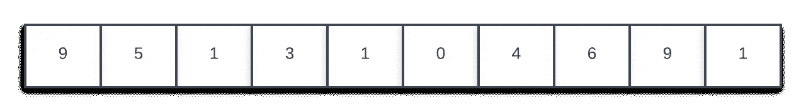

考虑这个数组。你注意到的第一件事是什么？是的，没错。此数组在小范围内有重复值。计数数组使用存储元素频率的思想。这是一种不基于比较的排序。它不把它的元素互相比较。让我们看看进展如何！

# 思考

我们可以用什么来存储频率？一张地图？是的，我们可以用地图。但是我们将使用一个数组。你可以问为什么？在地图中，使用散列函数。这些函数用于将键转换为值。这在时间和空间上是昂贵的。然而，如果我们把一个数组的代表元素的索引和那些索引上的值看作这些元素的频率，我们可以在更少的空间和时间内完成这项工作。迷茫了？让我们看看下面的图片-

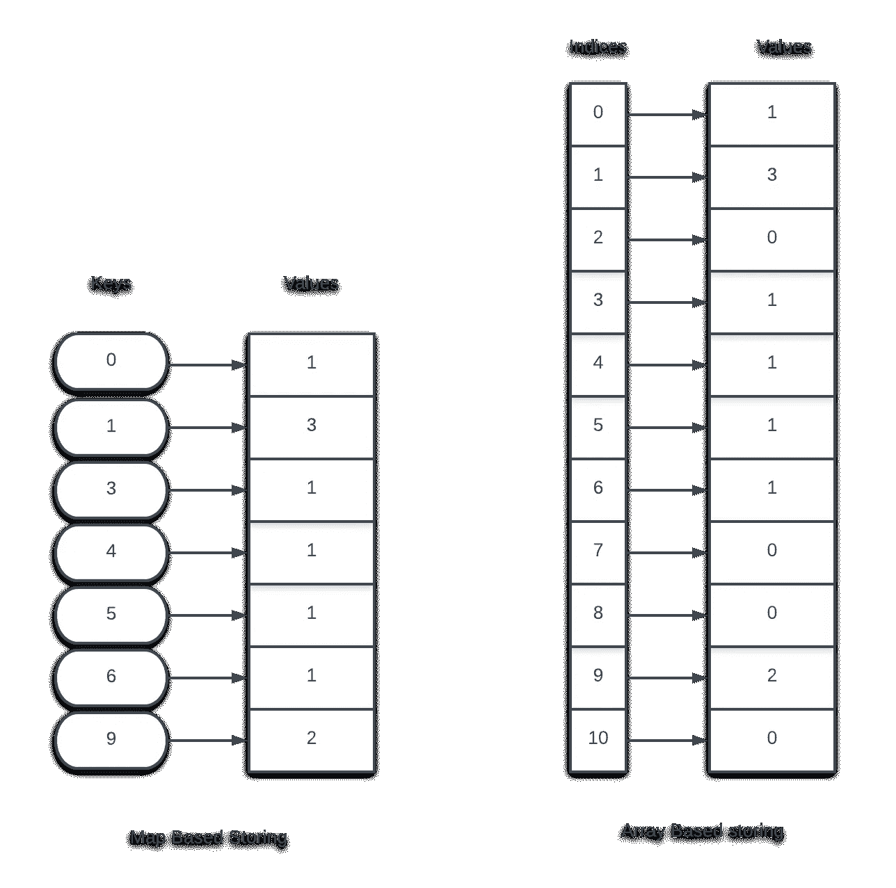

看到这里，你可能会认为基于地图的存储看起来更便宜，但事实并非如此。在第一种情况下，键占用额外的空间，但是在第二种情况下，索引只是地址。只有当元素在一个范围内均匀分布时，这种方法才有用。如果元素是稀疏的，数组的大部分都不会被使用。我们现在清楚了数组的用法。存储频率。在这之后，我们可以用一个简单而巧妙的方法。第一个是我以前用的非正式的。

## 简单的想法

在频率阵列中，索引是递增顺序。根据它的计数，我们可以转到每个索引，并将当前元素添加到结果数组中。让我想想，

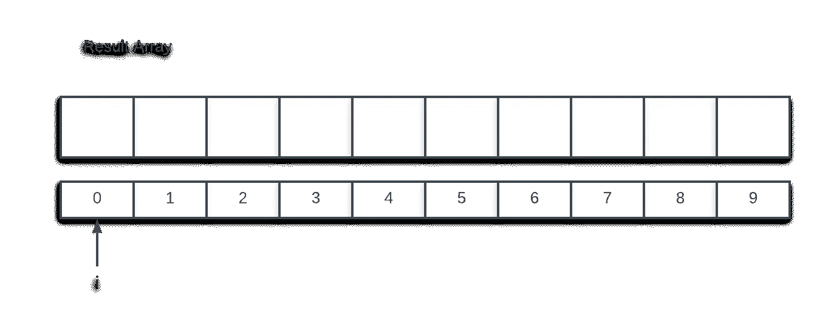

结果数组是空的，迭代器 I 指向 0，下一个空位置。我们去计数/频率数组。找到第一个非零值，这里是 0。零的计数是 1，所以它将被插入 1 次，并且 I 将相应地递增。

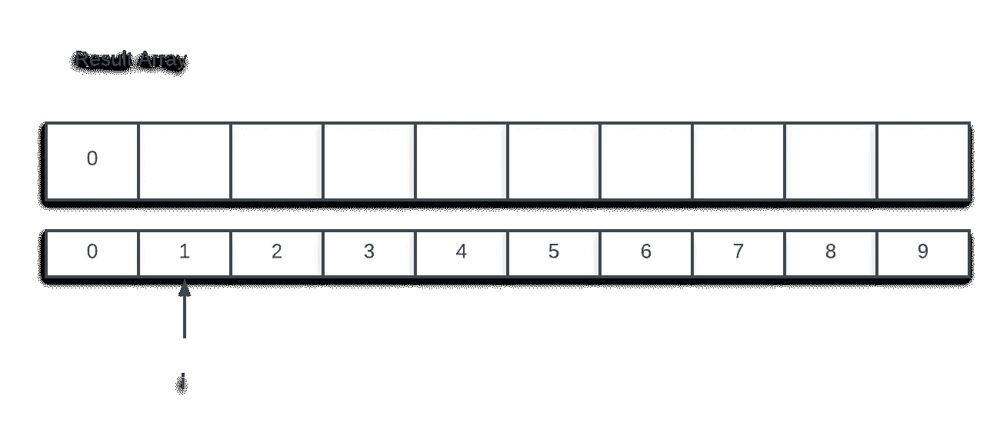

同样，1 将被插入 3 次。

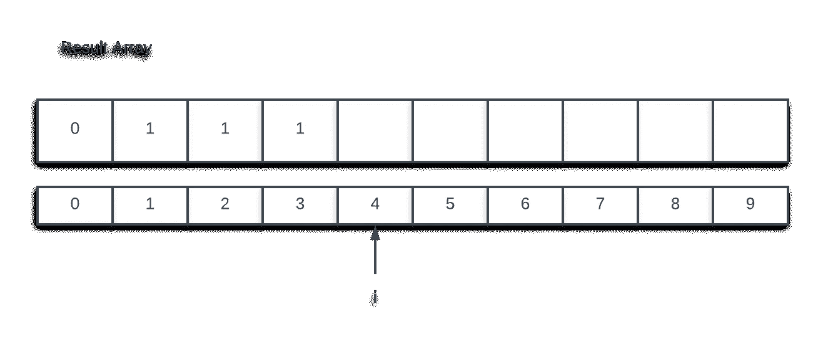

在 count 数组中，下一个索引是 2，但它的值为零，因此不会被插入。我们将继续前进，这个过程将继续下去！

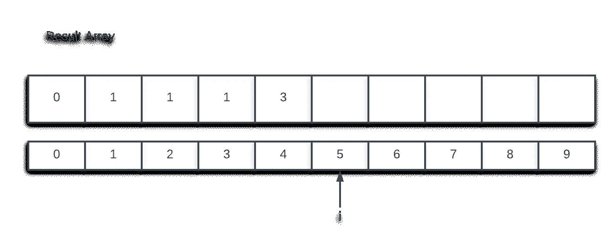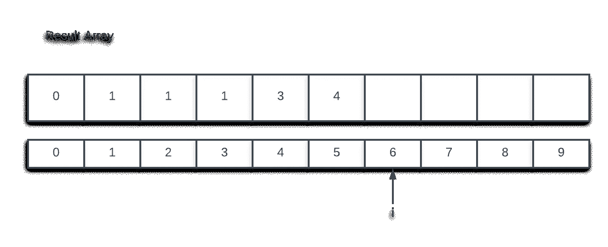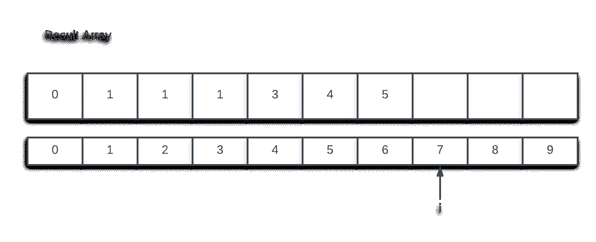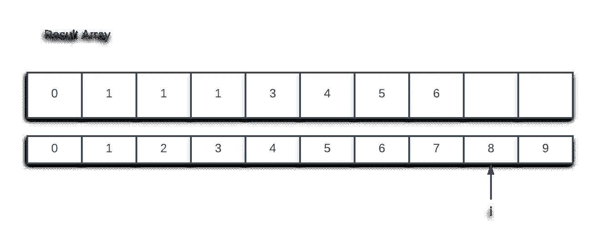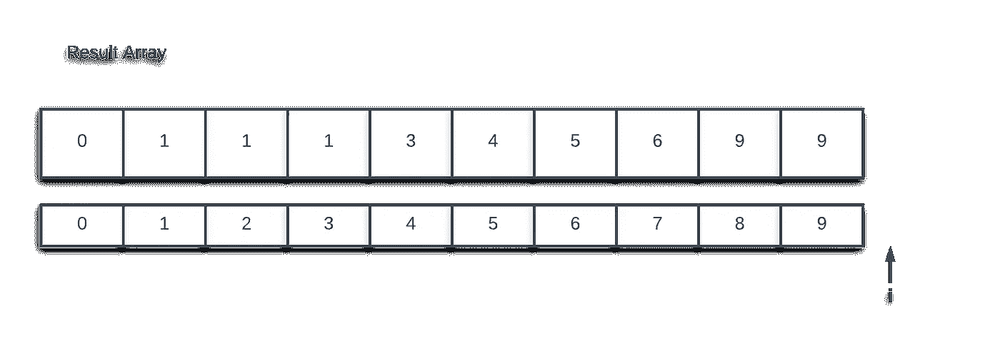

## 伪代码

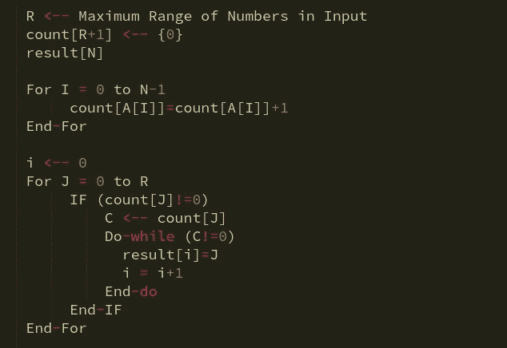

有人可能认为有两个嵌套循环，所以复杂度是二次的，但这里不是这样。内部循环总是按照元素在数组中出现的次数运行。时间复杂度是关于比较的次数。在这里，如果你仔细观察，所有的过程都只进行了元素出现的次数。如果一个元素不存在，它不会进入第二个循环。所以时间复杂度是线性的或者 O(N)。

# 实际算法

这是计数排序的形式算法。得到频率数组后，我们不会存储累计频率。每个索引将存储到目前为止的频率总和。在图中，您会注意到突出显示的频率实际上是引入新数字和累积频率发生变化的位置。

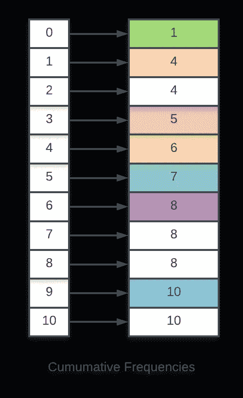

让我们继续算法。对于输入数组中的每个元素 X，

1.  转到相同的索引 X，并减少频率数组中的值
2.  将递减的值视为 X 在结果数组中的位置，假设该值为 *i.*
3.  将 X 放入结果数组中的第 *i* 个位置。

首先，让我们看看图片，然后我会告诉你它为什么工作-

在第一次迭代中——对于输入数组中的 9，我们转到频率数组中的索引 9。将其值从 10 减少到 9。然后转到结果数组中的第 9 个位置。

对于 5，我们转到频率数组中的第 5 个位置，将其值从 7 递减到 6。然后转到结果数组中的第 6 个位置。

这个过程以同样的方式继续。

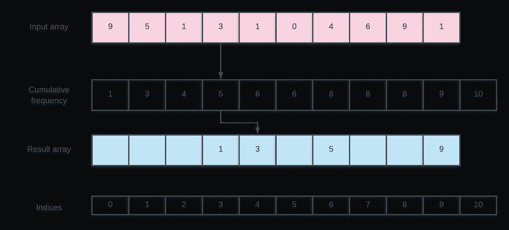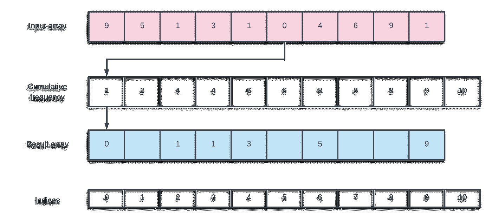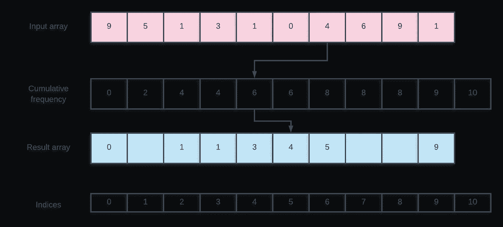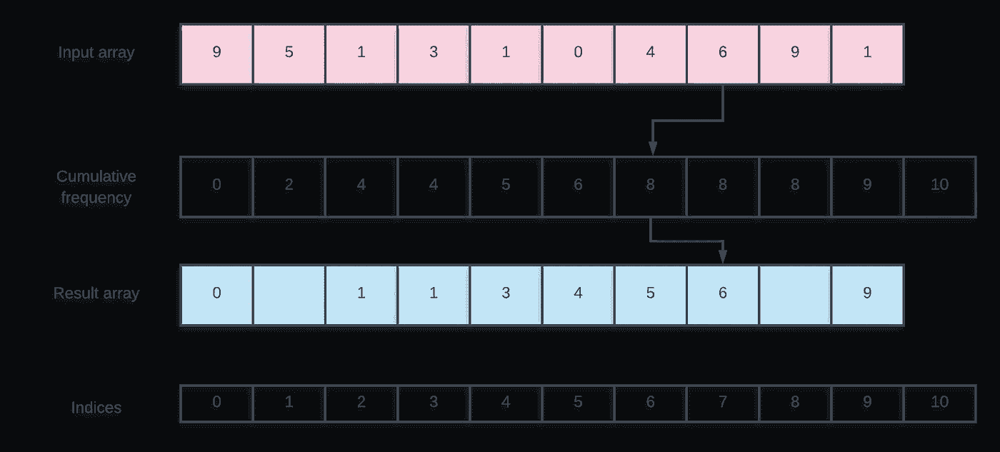

# 伪代码

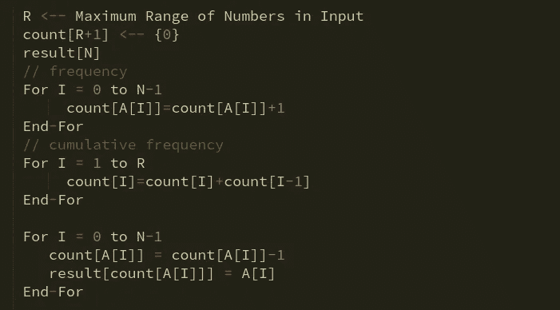

# 为什么会这样？

如果我们仔细观察，累积频率数组中每个元素 X 的计数，代表排序结果数组中到 X(含)为止的元素个数。换句话说，我们可以说，count of X 是显示 X 在结果数组中的位置，index 等于 position-1；这就是我们减量的原因。例如，3 处的值是 5，这告诉我们 3 在结果数组中的第 5 个位置，这在我们查看最终排序的数组时是可见的。希望你听到了。

# 时间和空间复杂性

有三个循环，但没有一个是嵌套的。所以时间复杂度是线性的或 O(R)，这意味着运行这个过程所需的时间将与数字的范围成比例。这就是为什么我们需要一个均匀分布的小范围的数字来使这个算法有效地工作。谈论空间复杂性——这个术语意味着运行算法所需的额外空间。这也是 O(R)，因为我们需要一个等于范围的数组来存储频率。这是算法的高级概述。我希望你喜欢这篇文章。

快乐学习！