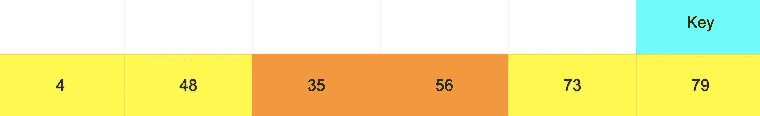

# python 中的排序

> 原文：<https://medium.com/analytics-vidhya/sorting-in-python-81ce576c37b9?source=collection_archive---------17----------------------->


## 排序是什么？

排序只不过是将项目按特定的顺序排列。换句话说，排序是根据我们的偏好对元素进行排序。根据我们的要求，优先级可以是升序或降序。

在本文中，我们将讨论两种排序算法及其差异。

1.  插入排序
2.  合并排序

# 插入排序

考虑一个元素列表

```
x = [73, 79, 56,  4, 48, 35]
```

**升序执行策略**

第一步:

```
key_element = x[key]x[:key] is the list that contains all the elements before the key elementx[:key] is sorted
```

第二步:

```
if some of the elements in x[:key] is greater than x[key]do pairwise swaps until all the elements in the x[:key+1] is sorted
```

第三步:

```
if all the elements in that x[:key+1] is sorted then move the key to the next index until there's no index left
```

**实施例**


```
key = 0key_element = 73arr_left = x[:key] = []
```

键的左边没有元素。

没有比较。

不需要成对交换。

将键向右移动一步


```
key = 1arr_left = [:key] = [73]key_element = x[key] = 79
```

将 79 与左边的元素进行比较

79 > 73

不需要成对交换。

将键向右移动一步


```
key = 2key_element = 56arr_left = [73, 79]
```

注意 arr_left 是排序的

从右到左比较 key 元素和 arr_left 的元素

比较(56，79)

56<79

互换(56，79)

```
def swap(x,y):

    temp = x

    x = y

    y = temp

    return x,y
```


比较(56，73)

56<73

互换(56，73)


不需要更多的比较。

向右移动键。


```
key = 3key_element = x[3] = 4arr_left = [56, 73, 79]
```

比较(4，79)

4 < 79

互换(4，79)


比较(4，73)

4 < 73

互换(4，73)


比较(4，56)

4< 56

交换(4，56)


不需要更多的比较。

不再需要交换。

向右移动键。


```
key = 4key_element = 48arr_left = [4,56,73,79]
```

比较(48，79)

48 < 79

互换(48，79)


比较(48，73)

48 < 73

互换(48，73)


比较(48，56)

48 < 56

互换(48，56)


比较(48，4)

48 > 4

不需要交换。

与 arr_left 的比较到此结束，因为 arr_left 已排序，所以元素 4 之前的元素大于 4

向右移动键


```
key = 5key_element = 35arr_left = [4, 48, 56, 73, 79]
```

比较(35，79)

35 < 79

互换(35，79)


比较(35，73)

35 < 73

互换(35，73)


比较(35，56)

35 < 56

互换(35，56)



比较(35，48)

35 < 48

互换(35，48)


比较(35，4)

35 > 4

没有互换

比较到此结束

因为在键的右边没有更多的元素。不用再轮班了

实现到此结束

最终排序列表


## **Python 代码**

**时间复杂度**

```
number_of_keys = nnumber_of_swaps_for_each_key = n (in the worst case)total time required = n*n upper bound = O(n*n)
```

# 合并排序

再次考虑相同的元素列表

```
x = [73, 79, 56,  4, 48, 35]
```

## 实施策略

```
Process : Divide the list into two halfs sort the left half sort the right half Merge both the halfs Repeat this process as much as possible
```

## 实现示例


## 合并两个子半部

例如，考虑[73，79，56]和[4，48，35]


```
def merge(arr1, arr2):

    i = 0 j = 0

    result = [] while(i< len(arr1) or j< len(arr2)): if(i< len(arr1) and j< len(arr2)): if(arr1[i] > arr2[j]): result.append(arr2[j]) j = j + 1 else: result.append(arr1[i]) i = i + 1 elif(i< len(arr1) and j == len(arr2)): result.append(arr1[i]) i = i + 1 else: result.append(arr2[j]) j = j + 1

    return result
```

这样，我们递归地合并我们生成的所有子一半

这将给我们排序后的数组

> 这是一种分而治之的方法

## Python 代码

## 该算法的时间复杂度

```
Number of divisions = lognTime to merge two sub halves (at the worst case) : nTotal time = logn * nUpper bound time = O(n*logn) 
```

让我们用一大组数字来比较这两种排序算法

考虑一个包含 10000 个数字的列表

检查使用两种排序技术对这个数字列表进行排序所花费的时间

与插入排序相比，合并排序的执行速度要快得多。