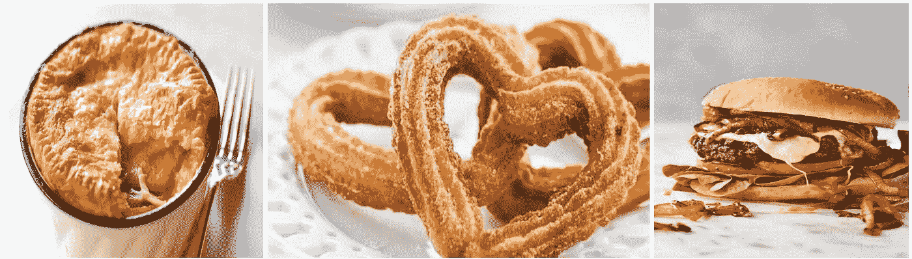
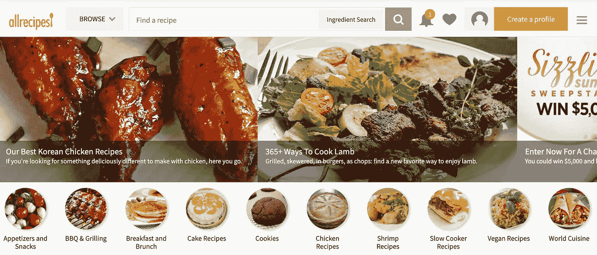
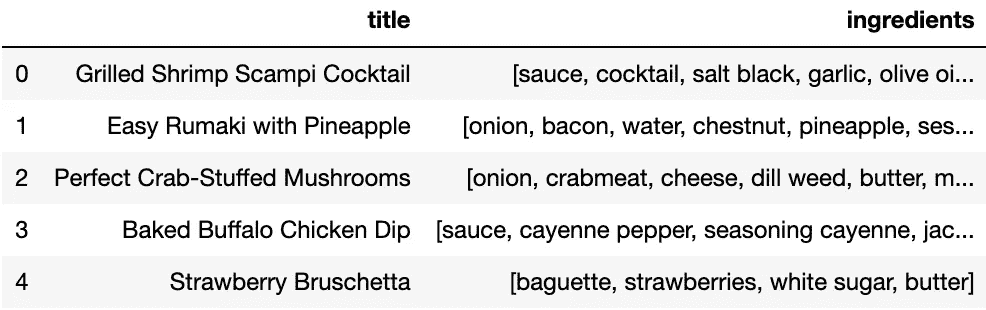

# 听起来好吃吗？数据科学项目演练

> 原文：<https://medium.com/analytics-vidhya/sound-tasty-a-project-walkthrough-5be396b15bdb?source=collection_archive---------21----------------------->



今天我要写一个我做的有趣的项目。不幸的是，我对食物的品味有点有限。我倾向于只吃我知道的东西，这是一个问题，因为如果你愿意尝试的话，外面有太多难以置信的食物了！我们上车吧。

我从识别我想从 Allrecipes.com 得到的食谱数据开始



搜索了一会儿后，我找不到可以使用的 API，所以我研究了网站布局，组装了一个 Selenium web 驱动程序，用作 web-scraper。我设置了我的代码来浏览网站的主要类别 url，并从大约前 100 个食谱中复制标题和配料。以下是网页抓取代码:

```
# # browser = Chrome()for url in urls:
#     print(url)
#     browser.get(url)#     for _ in range(6):
#         browser.execute_script("window.scrollTo(0,             document.body.scrollHeight);")
#         time.sleep(3 + random.random()*10)#     link_list = browser.find_elements_by_xpath('//*[contains([@class](http://twitter.com/class),"fixed-recipe-card__info")]/a')#     recipe_page_list = [link.get_attribute('href') for link in link_list]#     len(recipe_page_list)#     with open('recipes_list.json', 'a') as f:#         for recipe in recipe_page_list:#             browser.get(recipe)#             recipe_dict = {}

#             try:
#                 recipe_dict['title'] = browser.find_element_by_xpath('//*[[@id](http://twitter.com/id)="recipe-main-content"]').text
#             except:
#                 recipe_dict['title'] = browser.find_element_by_xpath('//*[contains([@class](http://twitter.com/class), "intro article-info")]/h1').text

#             try:
#                 lala_list = browser.find_elements_by_xpath('//*[contains([@id](http://twitter.com/id),"lst_ingred")]')
#                 item_list = []
#                 for element in lala_list:#                     item_list += element.find_elements_by_css_selector('span')#                 ingredients = [item.text for item in item_list[:-1]]
#                 recipe_dict['ingredients'] = ingredients

#             except:
#                 lala_list = browser.find_elements_by_xpath('//*[contains([@class](http://twitter.com/class), "ingredients-item-name")]')#                 ingredients = [item.text for item in lala_list]
#                 recipe_dict['ingredients'] = ingredients#             json.dump(recipe_dict, f)
#             f.write('\n')
#             time.sleep(3 + random.random()*10)
```


我不得不尝试 6 次获取我的数据，更新不同格式的旧食谱，以及超时和数据存储问题。这个网络追踪器也被 Allrecipes.com 的活动追踪器卡住了。我的解决方案是在 Selenium 实例上安装一个广告拦截器。

太好了！现在我有了数据，我计划分解成分词，这样我就可以使用 Gensim 的 word2vec 来比较成分词嵌入。所以来打扫卫生！

我从存储数据的 JSON 文件中加载数据，并将其放入 EDA 的 Pandas 数据框中。第一个任务是处理丢失的值，幸运的是，没有那么多。然后我去掉了标点符号。接下来，我必须处理如何在配料中找到有意义的词，以及如何处理停用词和度量。这是我的数据看起来的样子。

```
['2 pounds unpeeled large shrimp',
 '2 tablespoons olive oil',
 '1 teaspoon minced garlic',
 '1/4 teaspoon salt',
 '1/8 teaspoon freshly ground black pepper',
 '1 cup cocktail sauce',
 '1 lemon, cut into wedges']
```

我这个项目的目标只是绘制出口味，并推荐与你喜欢的口味相似的新食物，所以测量被取消了。至于像“未削皮的大”这样的描述或像“切成楔形”这样的说明，我对我认为有价值的信息做出判断，并删除了其余的信息。为了准备 word2vec，我将所有的成分分成剩余成分单词的列表。这给我留下了这样的成分表:

```
['shrimp',
 'olive',
 'oil',
 'garlic',
 'salt',
 'black',
 'pepper',
 'cocktail',
 'sauce',
 'lemon']
```

现在的问题是,“橄榄”和“油”被认为是两种不同的成分，而显然它们应该只是一种成分。所以我使用 Gensim 的短语检测来寻找经常在一起的单词，并将它们作为成分重新加入。虽然不是 100%准确，但它确实把我们带到了一个更好的地方，拥有一个“柠檬虾”向量不会改变“柠檬”向量或“虾”向量，所以我认为这是可以接受的。

```
['sauce',
 'cocktail',
 'salt black garlic',
 'olive oil',
 'pepper',
 'lemon shrimp']
```

在所有的清理工作之后，我终于有了一个可以用于 Gensim 的 word2vec 的数据框



下一步是使用 word2vec 的相似性比较来查找与用户输入的配料相似的单词，然后构建一个函数来返回具有这些相似配料的食谱。我添加了一个可调按钮，从用户输入的名为“多么冒险”的内容中查找非常相似、不太相似或非常不同的配料

```
model.wv.most_similar(positive=["cheddar cheese"])[('mushrooms', 0.9990376234054565),
 ('beef', 0.9988831281661987),
 ('monterey jack', 0.9986639022827148),
 ('green chile', 0.9985662698745728),
 ('sauce', 0.9985474348068237),
 ('green onions', 0.9985294342041016),
 ('cheese', 0.9985264539718628),
 ('seasoning', 0.9983548521995544),
 ('tomato sauce', 0.9983314275741577),
 ('cayenne pepper', 0.9981967210769653)]
```

为了完成这一切，我提取了数据和 word2vec 模型，并构建了一个 Flask 应用程序来在 Amazon Ec2 实例上运行该项目。

让声音变得美味让我很开心，我很乐意听到反馈或改进的想法！