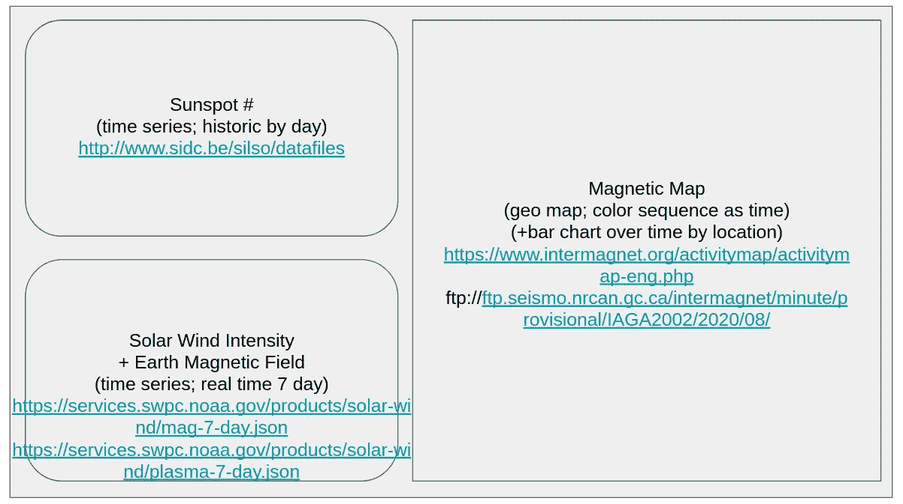
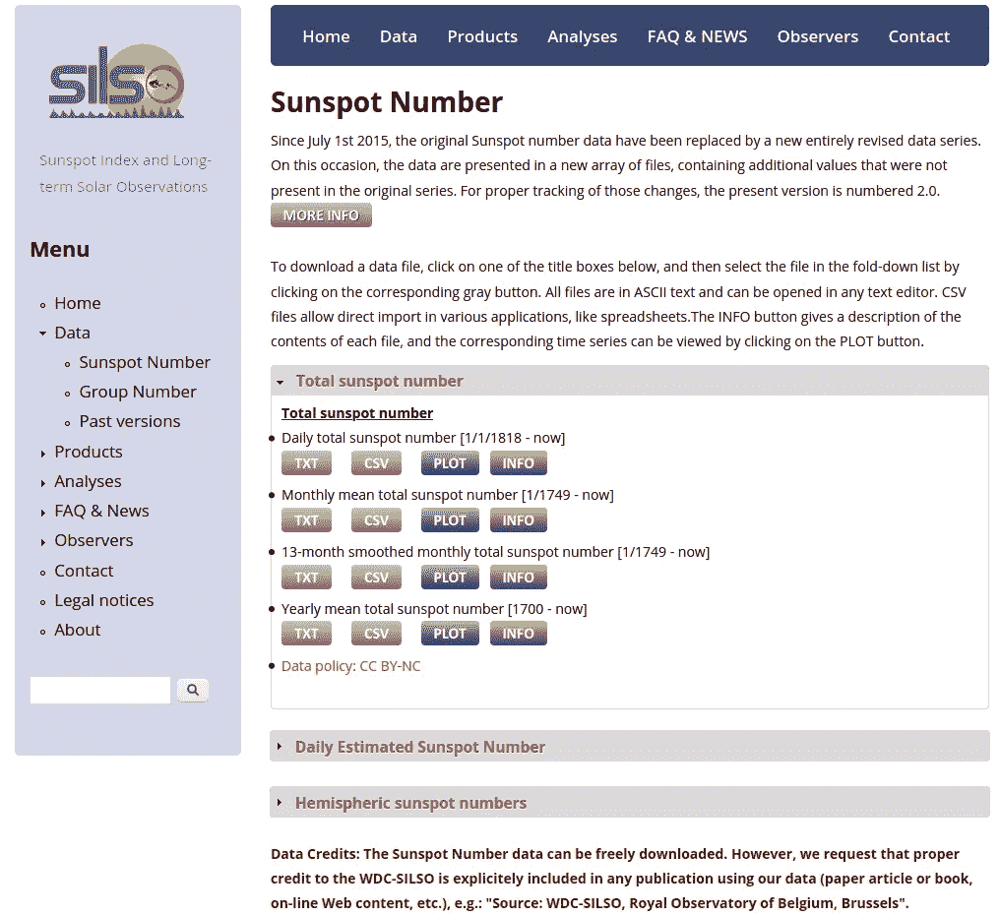
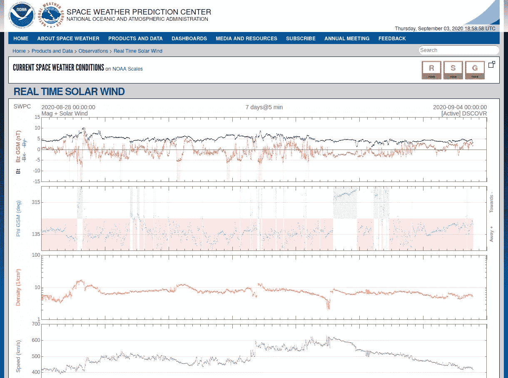
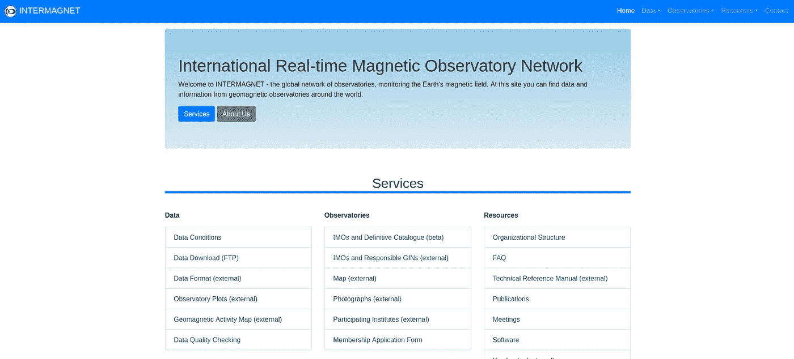
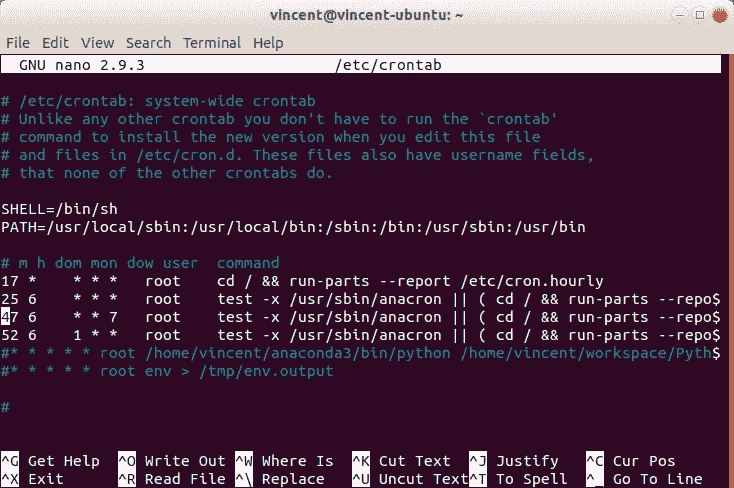

# 太空气象仪表板:第 1 部分——使用 Python、SQLite 和 Cron 制作基本的 ETL/数据管道

> 原文：<https://medium.com/analytics-vidhya/space-weather-dashboard-part-1-making-a-basic-etl-data-pipeline-using-python-sqlite-and-cron-ee590b718f86?source=collection_archive---------11----------------------->


在地球上空运行的国际空间站

随着全球人类集体努力穿越由新冠肺炎造成的疫情，它向我们所有人提供了一个严峻的提醒:我们居住的星球正在不断变化。新的岛屿不断产生，构造板块不断相互推拉，全球气温达到与全球变暖现象相关的新高。但从更普遍的意义上来说，人们越来越意识到每天围绕和影响我们的看不见的力量，并且更善于采取积极主动的措施来最小化我们无法控制的事件的负面影响。

*案例和要点—* 社会已经一致同意(在很大程度上)戴口罩、保持社交距离和洗手是减轻病毒影响的有效方法。*但是其他看不见的威胁呢，比如地震、干旱和极端天气事件？*

在所有这些情况下，我们应对危机的一个关键组成部分是收集尽可能多的数据，以帮助我们更好地做出决策。例如，科学家们很早就知道天气可以用数据(如压力、湿度、温度)来描述和预测，人类的规划可以从我们的气象站、卫星和其他仪器收集的大量数据中受益匪浅(想想你目前安装在手机上的可靠的天气应用程序吧！).但是天气的一个经常被忽视的方面并不涉及地球大气中必然发生的情况。更确切地说，它关注的是地球大气层外的条件*。这种天气被称为太空天气。*


Spaceweather.com 是一个专门报道太空天气的网站

太空天气会有严重的后果(例如，见[1967 年 5 月的大风暴](https://agupubs.onlinelibrary.wiley.com/doi/full/10.1002/2016SW001423))。事实上，我们经济的许多方面不仅取决于了解当前的空间天气状况，还取决于能够可靠预测未来空间天气状况的预报。例如，美国国家海洋和大气管理局有几个仪表板，专门用于显示与在以下领域工作的人员相关的信息:

*   [航空](https://www.swpc.noaa.gov/communities/aviation-community-dashboard)
*   [电力](https://www.swpc.noaa.gov/communities/electric-power-community-dashboard)
*   [应急管理](https://www.swpc.noaa.gov/communities/emergency-management)
*   [全球定位系统](https://www.swpc.noaa.gov/communities/global-positioning-system-gps-community-dashboard)
*   [收音机](https://www.swpc.noaa.gov/communities/radio-communications)

上面的仪表板非常适合他们的目的，并为在上述行业工作的许多人提供了宝贵的信息。*但是，如果您面临着一个组织或业务问题，需要构建一个与 NOAA 提供的上述解决方案有很大不同的更加定制的仪表板解决方案，该怎么办呢？*

对于数据专业人员来说，有许多生成仪表板和数据可视化的选项，包括现成的解决方案，如 [Tableau](https://www.tableau.com/) 或 [Looker](https://looker.com/) 。然而，如果你想要比 Tableau/Looker 更加可定制的东西，那么你可能想要尝试的一个具有大量定制潜力的工具是 Python 库 [Dash](https://plotly.com/dash/) 。

在这个由两部分组成的系列文章中，我们首先(在第 1 部分——本文中)介绍如何构建一个数据管道来收集、清理和存储本地“数据仓库”中的数据，然后深入研究使用 Dash/Plotly 构建自定义空间天气仪表板的细节(第 2 部分——下一篇文章),但首先将解释(第 1 部分；以供定制的空间天气仪表板使用。因此，如果您是一名数据专家或爱好者，有兴趣了解如何构建一个基本的多源数据管道，以便与一个定制的 Python 生成的 web 仪表板一起使用，那么这些文章就是为您准备的！

**模拟仪表板布局**

在我们开始构建我们的数据管道基础设施之前，我们首先需要弄清楚我们的仪表板将是什么样子，这将决定我们需要从哪些数据源中提取数据。我们将重点关注空间天气分析和预报中最常见的天气因素。这些因素包括:

*   [太阳黑子的数量](https://en.wikipedia.org/wiki/Sunspot)(在任何给定的日历日，以#/计数为单位)，
*   [太阳风](https://en.wikipedia.org/wiki/Solar_wind)(实时，包括等离子体密度、速度和温度)
*   [地球磁场](https://en.wikipedia.org/wiki/Earth%27s_magnetic_field)(实时，单位特斯拉)，以及

对于这些因素中的每一个，我们都需要从相关的数据源中提取相关的变量/指标。在谷歌搜索了一会儿后，我找到了以下可靠的数据来源来获取上述信息:

*   [S.I.D.C .布鲁塞尔国际太阳黑子数](http://www.sidc.be/silso/datafiles)(鸣谢/来源:WDC-SILSO，比利时皇家天文台，布鲁塞尔)
*   [NOAA 太阳风等离子体](https://www.swpc.noaa.gov/products/real-time-solar-wind)和[磁场](https://services.swpc.noaa.gov/products/solar-wind/mag-7-day.json)(由[发现者卫星](https://en.wikipedia.org/wiki/Deep_Space_Climate_Observatory)报道)，以及
*   [Intermagnet](https://intermagnet.github.io/) (一个“全球天文台网络，监测地球磁场”)

这些数据源中的每一个都将最终填充我们的仪表板中看到的数据。这是我用谷歌幻灯片制作的仪表盘的快速模型:



太空天气仪表板模型

对于上面的每个数据源，我们将执行 ETL 过程的核心步骤: ***提取、转换和加载*** 。更具体地说，我们将创建几个 Python 脚本，这些脚本将分别从上述数据源中 ***提取数据*** ， ***将提取的数据*** 转换成可用的格式，然后 ***将转换后的数据*** 加载到 SQLite 数据库中，以便在我们的仪表板应用程序中使用(使用开源 Python 工具 Dash)。我们还将设置一个定期调度的作业来定期执行 ETL 过程(使用 Linux cron 实用程序)，以便我们的仪表板中显示的信息是最新的。

**数据源#1 (SIDC 太阳黑子计数)的 ETL 过程**



SIDC(比利时皇家天文台的一部分)太阳黑子数据网站

对于每日太阳黑子数据，SIDC 以两种基本格式提供这些信息:文本和 CSV。我决定使用文本格式来说明如何处理这种格式的数据。首先，我们要导入相关的 Python 库，用于从 url 发出请求，然后使用 *urlopen* 函数打开 SIDC url:

```
import urllib.requestfileobject = urllib.request.urlopen("[http://www.sidc.be/silso/DATA/SN_d_tot_V2.0.txt](http://www.sidc.be/silso/DATA/SN_d_tot_V2.0.txt)")
```

查看数据，很明显需要单独解析原始行，以便将原始文本转换成可用的结构。接下来，让我们使用 Pandas Dataframe 对象定义数据的格式:

```
import pandas as pd
import numpy as npdf = pd.DataFrame(columns = ["Date", "Sunspot_count", "Sunspot_sd", "Observ_No"])
```

类似地，让我们使用 *sqlite3* Python 库为我们的 SQL 表定义模式(如果该表已经存在，则删除它，因为当我们使用 *cron* 自动化这个过程时):

```
import sqlite3
conn = sqlite3.connect("space.db", isolation_level=None)
cur = conn.cursor()cur.execute('''
    CREATE TABLE sunspots (
    id INTEGER PRIMARY KEY AUTOINCREMENT,
    date DATE,
    sunspot_count INTEGER,
    sunspot_sd REAL,
    sunspot_obs_no INTEGER
    );
    ''')
```

上面的代码创建一个到 *space.db* 的数据库连接(如果该文件不存在，则创建该文件)，然后创建一个*黑子*表，该表将存储观测日期、(平均)黑子数、黑子数标准偏差和观测次数。

为了将我们的文本文件处理成与我们刚刚定义的 SQL 表结构兼容的格式，我们定义了一个 chunking 函数，用于在我们的数据库中执行插入事务，并将我们的数据分割成块( *divData* ):

```
def chunks(data, rows=10000):
    """ Divides the data into 10000 rows each """

    for i in range(0, len(data), rows):
        yield data[i:i+rows]sunspots = [line for line in fileobject]

divData = chunks(sunspots) # divide into 10000 rows each
```

然后在双 *for* 循环结构中执行插入，方法是拆分每一行，解码字节，格式化日期(为了与 SQLite 日期格式兼容，非零填充):

```
for chunk in divData:
    cur.execute('BEGIN TRANSACTION')

    for line in chunk:
        row_bytes = line.split() date = row_bytes[0].decode("utf-8") + "-" + row_bytes[1].decode("utf-8") + "-" + row_bytes[2].decode("utf-8")
        row_txt = [date, row_bytes[4].decode("utf-8"), row_bytes[5].decode("utf-8"), row_bytes[6].decode("utf-8")]
        row_txt[0] = dt.strptime(row_txt[0], "%Y-%m-%d").strftime("%Y-%m-%d") a_series = pd.Series(row_txt, index = df.columns)

        query = 'INSERT INTO sunspots (date, sunspot_count, sunspot_sd, sunspot_obs_no) VALUES ("%s", "%s", "%s", "%s")' % (a_series["Date"], a_series["Sunspot_count"], a_series["Sunspot_sd"], a_series["Observ_No"]) cur.execute(query)

    cur.execute('COMMIT')
```

在上面的转换步骤中，我们通过分隔符(默认为 tab)来拆分每一行，定义一个新的文本格式(在 *row_txt* 中)，并将新的文本格式转换成一个 Pandas Series 对象( *a_series* )，该对象具有由我们的原始 Dataframe 对象定义的列结构(还要注意，我们必须使用 *decode* 函数将数据从字节解码成 Python UTF-8 字符串)。接下来，我们通过将 *a_series* 的值插入到*查询*变量中来组装 SQL 查询。最后，使用 *cur.execute(query)* 执行查询。

最后一步，让我们关闭与数据库的连接:

```
conn.close()
```

**数据源#2 (NOAA 太阳风和磁力计)的 ETL 过程**



NOAA 实时太阳风

为了将我们的 NOAA 数据处理到我们的 SQL 数据库中，我们必须执行与第一步不同的步骤序列，因为 [NOAA 数据是以 JSON 格式](https://services.swpc.noaa.gov/products/solar-wind/)提供的。Python 库 urllib 和 json 可以协同工作，从 NOAA 源读取数据:

```
import json
import urlliburl_mag="[https://services.swpc.noaa.gov/products/solar-wind/mag-7-day.json](https://services.swpc.noaa.gov/products/solar-wind/mag-7-day.json)"
url_plasma="[https://services.swpc.noaa.gov/products/solar-wind/plasma-7-day.json](https://services.swpc.noaa.gov/products/solar-wind/plasma-7-day.json)"mag=urllib.request.urlopen(url_mag)
plasma=urllib.request.urlopen(url_plasma)mag_json=json.loads(mag.read())
plasma_json=json.loads(plasma.read()) 
```

在检查数据时，它包括标题行，因此在遍历 *mag_json* 和 *plasma_json* 的行时，必须忽略这些标题行。

类似于处理 SIDC 数据的过程，我们现在在 *space.db* 中创建两个 SQLite 表，它们将存储加载的数据( *drop table* 语句为了简洁起见被省略):

```
import sqlite3
conn = sqlite3.connect("space.db", isolation_level=None)
cur = conn.cursor()cur.execute('''
    CREATE TABLE mag (
    id INTEGER PRIMARY KEY AUTOINCREMENT,
    date_time DATETIME,
    bx REAL,
    by REAL,
    bz REAL,
    bt REAL
    );
    ''')cur.execute('''
    CREATE TABLE plasma (
    id INTEGER PRIMARY KEY AUTOINCREMENT,
    date_time DATETIME,
    density REAL,
    speed REAL,
    temp REAL
    );
    ''')
```

数据将再次被遍历以构建插入查询，这些查询将由我们的游标对象执行，然后提交到我们的数据库(使用我们在前面的脚本中定义的分块函数):

```
# where divData is magnetic field data
for chunk in divData:
    cur.execute('BEGIN TRANSACTION')

    for line in chunk:
        query = 'INSERT INTO mag (date_time, bx, by, bz, bt) VALUES ("%s", "%s", "%s", "%s", "%s")' % (line[0][:19], line[1], line[2], line[3], line[6])
        cur.execute(query)

    cur.execute('COMMIT')# where divData is plasma data
for chunk in divData:
    cur.execute('BEGIN TRANSACTION')

    for line in chunk:
        query = 'INSERT INTO plasma (date_time, density, speed, temp) VALUES ("%s", "%s", "%s", "%s")' % (line[0][:19], line[1], line[2], line[3])
        cur.execute(query)

    cur.execute('COMMIT')
```

**数据源#3 的 ETL 过程(Intermagnet 全球观察站)**



Intermagnet 网站

Intermagnet 网站的数据(FTP://FTP . seismo . nrcan . GC . ca/inter magnet/minute/temporary/iaga 2002/2020/08/)恰好也是文本(字节)格式，与 SIDC 的数据相似。然而，每个天文台在单独的文件中报告数据，并且每个文件与一天的观测值相关联。此外，这些数据存储在 FTP 服务器上，这是另一个需要考虑的事实。

让我们首先导入 *ftplib* 库，并导航到我们正在寻找的信息的正确目录:

```
import ftplib#Open ftp connection
ftp = ftplib.FTP('ftp.seismo.nrcan.gc.ca', 'anonymous',
'user')#List the files in the current directory
print("File List:")
files = ftp.dir()import datetimenow=datetime.datetime.now()
ftp.cwd("intermagnet/minute/provisional/IAGA2002/" + str(now.year) + "/" + str(now.strftime("%m")))
# files = ftp.dir()
```

接下来，我们可以提取这个 FTP 目录的文件列表，构造我们的数据帧，并创建我们的 SQLite 表(类似于上面的内容):

```
file_list = ftp.nlst()import pandas as pd
import numpy as npdf = pd.DataFrame(columns = ["Date_time", "Bx", "By", "Bz", "Bf"])import sqlite3
conn = sqlite3.connect("space.db", isolation_level=None)
cur = conn.cursor()cur.execute('''
    CREATE TABLE geo_mag (
    id INTEGER PRIMARY KEY AUTOINCREMENT,
    station CHARACTER(3),
    lat REAL,
    long REAL,
    date_time DATETIME,
    bx REAL,
    by REAL,
    bz REAL,
    bf REAL
    );
    ''')
```

对于过去 24 小时左右的数据，遍历大量文件的一种方法是实现以下代码:

```
for file in file_list:
    station = ''
    lat = 0
    long = 0

    date_today = str(now.year) + str(now.strftime("%m")) + str(now.strftime("%d"))

    if(date_today in file):
        ftp.retrbinary("RETR " + file, open(file, 'wb').write)
        temp=open(file, 'rb')

        data_rows = 0

        geo_mag = [line for line in temp]

        divData = chunks(geo_mag) # divide into 10000 rows each

        for chunk in divData:
            cur.execute('BEGIN TRANSACTION')

            for line in chunk:
                if(data_rows == 1):
                    row_bytes = line.split()
                    date_time = row_bytes[0].decode("utf-8") + " " + row_bytes[1].decode("utf-8")[:8]
                    row_txt = [date_time, row_bytes[3].decode("utf-8"), row_bytes[4].decode("utf-8"), row_bytes[5].decode("utf-8"), row_bytes[6].decode("utf-8")]

                    a_series = pd.Series(row_txt, index = df.columns)

                    query = 'INSERT INTO geo_mag (station, lat, long, date_time, bx, by, bz, bf) VALUES ("%s", "%s", "%s", "%s", "%s", "%s", "%s", "%s")' % (station, lat, long, a_series["Date_time"], a_series["Bx"], a_series["By"], a_series["Bz"], a_series["Bf"])
                    cur.execute(query)
                else:
                    if('IAGA Code' in line.decode("utf-8") or 'IAGA CODE' in line.decode("utf-8")):
                        station = line.decode('utf-8').split()[2]
                        print(station)
                    elif('Latitude' in line.decode("utf-8")):
                        lat = line.decode('utf-8').split()[2]
                    elif('Longitude' in line.decode("utf-8")):
                        long = line.decode('utf-8').split()[2]
                    elif('DATE       TIME' in line.decode("utf-8")):
                        data_rows = 1

            cur.execute('COMMIT')
```

**为每个 ETL 脚本设置 Cron 作业**

现在，我们已经成功地将数据导入到本地 SQLite 数据库中，完成数据管道的最后一步是向我们的计算机添加一组命令，这些命令将初始化我们的脚本，使其以我们的输入所确定的预定频率运行。在 Linux 系统上，运行这些类型的任务调度作业的主要工具是[*cron*](https://en.wikipedia.org/wiki/Cron)*utility。有了 *cron* ，我们可以设置我们的脚本在一周的某一天的某一小时的某一分钟运行！因此，如果我们希望我们的仪表板在给定的一天填充新的信息，例如，我们可以设置一组 *cron 作业*在清晨运行(例如，在早上 7 点之前)，这应该为我们的空间天气数据库产生相对最新的数据。*

**

*在我的本地机器上找到了一个示例 crontab 文件(root 用户)*

*从太阳黑子数据开始，我们将创建一个 cron 作业，每天早上 5 点运行。为此，我们打开 crontab 文件:*

```
*sudo nano /etc/crontab*
```

*然后在 crontab 文件中为我们的 Python 脚本添加一行，详细信息如下:*

```
*0 5 * * * root /home/vincent/anaconda3/bin/python /home/vincent/workspace/Python/Space\ Weather\ Data\ Pipeline/sunspots.py >> /home/vincent/workspace/Python/Space\ Weather\ Data\ Pipeline/out1.txt  2>&1*
```

*类似地，对于磁场和等离子体数据，我们在 crontab 文件中为每个要运行的数据管道脚本添加另外两行(例如，在早上 6 点和 7 点):*

```
*0 6 * * * root /home/vincent/anaconda3/bin/python /home/vincent/workspace/Python/Space\ Weather\ Data\ Pipeline/mag_plasma.py >> /home/vincent/workspace/Python/Space\ Weather\ Data\ Pipeline/out2.txt  2>&10 7 * * * root /home/vincent/anaconda3/bin/python /home/vincent/workspace/Python/Space\ Weather\ Data\ Pipeline/geo_mag_map.py >> /home/vincent/workspace/Python/Space\ Weather\ Data\ Pipeline/out3.txt  2>&1*
```

*要让 cron 作业正常运行(或者让它们运行起来)可能需要一点修补。)，但是一旦你解决了权限、用户、环境变量等问题。现在，您应该已经建立了一个工作数据管道，可以从三个不同的数据源中提取数据了！还要注意，每个 cron 行将脚本的输出(>>)输出到一个日志文件中，该文件可用于错误记录和测试。*

**

*太空天气影响(鸣谢[weather.gov](https://www.weather.gov/safety/space)*

***结论***

*由于刚刚构建的数据基础架构，看到您的数据库实际上被真实数据填充，这是令人满意的。但是在我们的例子中，建立一个工作数据管道只是构建我们最终产品的解决方案的一半*。另一半实际上是*可视化*和*解释*数据，这比仅仅读取存储在 SQL 表中的数据行更容易。**

*因此，在第二篇配套文章[中，我们将深入探讨如何使用 Python](/analytics-vidhya/space-weather-dashboard-part-2-designing-the-layout-of-a-custom-space-weather-dashboard-in-dash-66622775e084) [Dash](https://plotly.com/dash/) 库(by [Plotly](https://plotly.com/) )将我们新创建的数据管道/仓库作为高度可定制的仪表板界面的输入。使用 Dash，我们不仅能够在基于 web 的仪表板界面中可视化我们的数据，我们还可以定制和定制界面的布局、外观和感觉，达到其他现成工具(如 Tableau 或 Looker)无法达到的水平(我刚才提到过它是开源的吗？).*

*Github 上的代码:[https://github.com/vincent86-git/Space_Weather_Dash](https://github.com/vincent86-git/Space_Weather_Dash)*

**本文给出的结果依赖于在地磁观测站收集的数据。我们感谢支持他们的国家机构和 INTERMAGNET 促进高标准的磁观测实践(www.intermagnet.org)。**