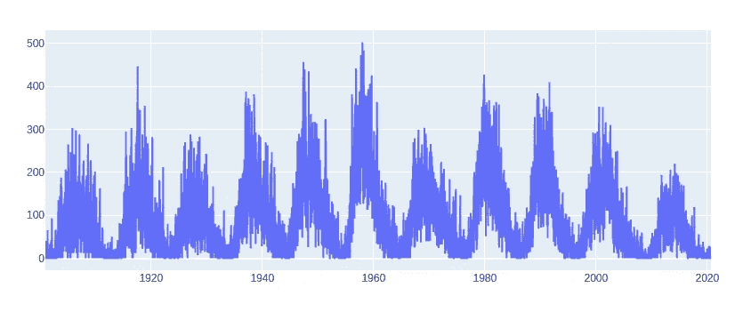
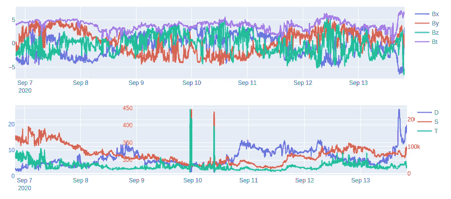
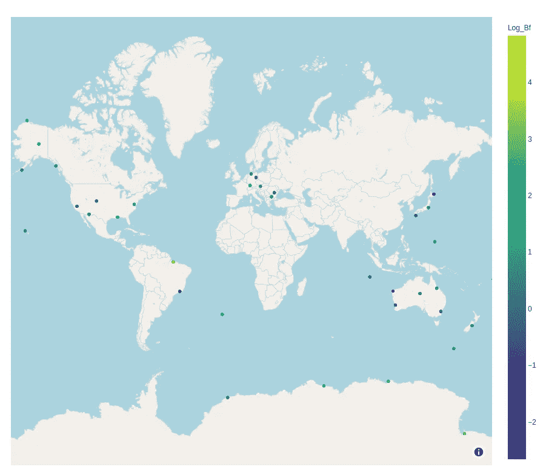
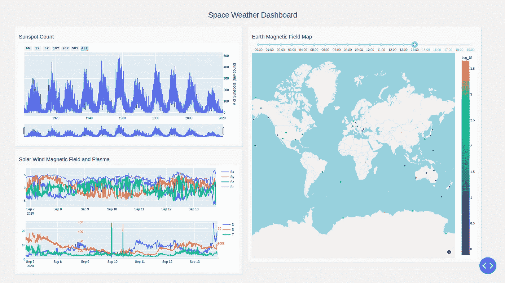
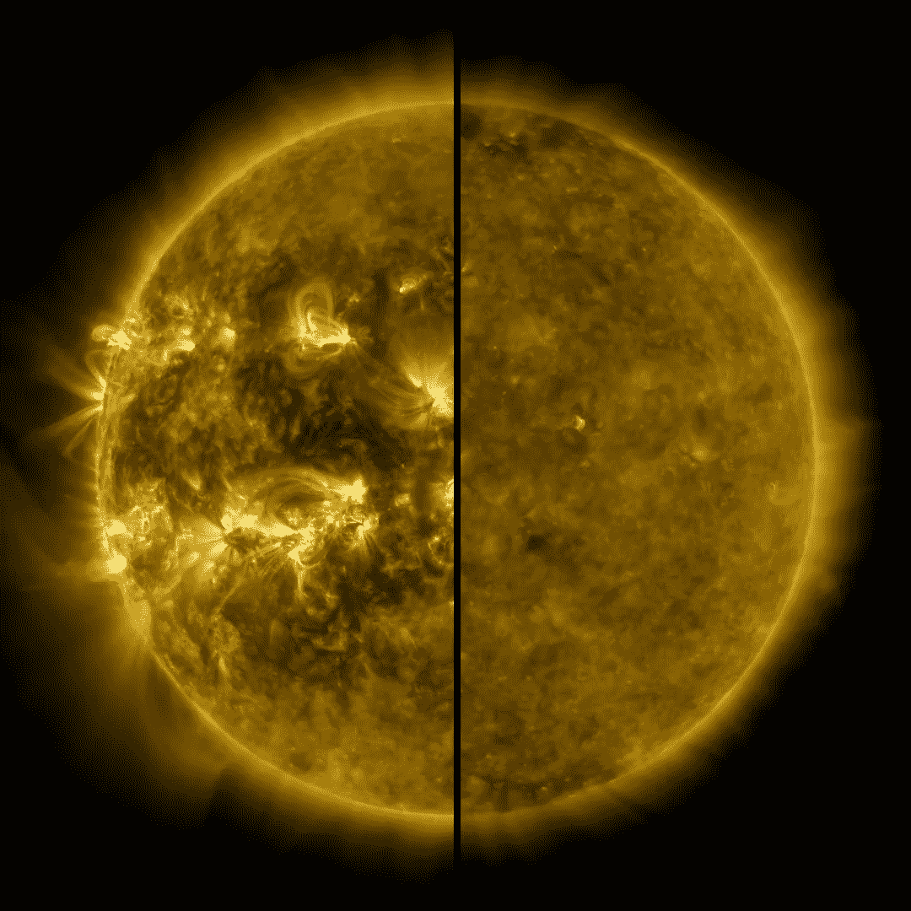

# 空间天气仪表板:第 2 部分—在 Dash 中设计自定义空间天气仪表板的布局

> 原文：<https://medium.com/analytics-vidhya/space-weather-dashboard-part-2-designing-the-layout-of-a-custom-space-weather-dashboard-in-dash-66622775e084?source=collection_archive---------16----------------------->


SpaceX SAOCOM 1A 任务长曝光照片(鸣谢[Unspash.com](https://unsplash.com/photos/6SbFGnQTE8s)和 SpaceX)

在[的上一篇文章](/analytics-vidhya/space-weather-dashboard-part-1-making-a-basic-etl-data-pipeline-using-python-sqlite-and-cron-ee590b718f86)中，我们经历了构建一个快速而肮脏的数据管道的过程，用与空间天气相关的三个信息源(例如，太阳黑子、磁场、等离子体密度/速度/温度)来填充本地数据库。现在我们已经将这些数据提取、转换并加载到我们的数据仓库系统中，我们将在最终产品中使用这些数据:一个交互式仪表板，它具有我们在相对较新的仪表板和数据可视化工具的帮助下设计的自定义布局——由 [Plotly](https://plotly.com/) 设计的 [Dash](https://plotly.com/dash/) 。

在我们深入太空气象仪表盘的细节之前，让我们快速回顾一下 Dash 到底是什么。维基百科将 Dash 描述为一个"[开源 Python 和 R 框架，用于构建基于 web 的分析应用程序。](http://open-source Python and R framework for building web-based analytic applications.)《Dash 用户指南》更详细地解释了 Dash 的实际工作原理:

> “Dash 基于 Flask、Plotly.js 和 React.js 编写，非常适合用纯 Python 构建具有高度自定义用户界面的数据可视化应用程序。它特别适合任何使用 Python 处理数据的人。
> 
> 通过几个简单的模式，Dash 抽象出了构建基于 web 的交互式应用程序所需的所有技术和协议。Dash 非常简单，您可以在一个下午的时间里围绕您的 Python 代码绑定一个用户界面。
> 
> Dash 应用程序在 web 浏览器中呈现。您可以将应用程序部署到服务器，然后通过 URL 共享它们。由于 Dash 应用程序是在网络浏览器中查看的，因此 Dash 本身就具备跨平台和移动性。"

从我使用 Dash 的经验来看(当然是有限的)，它的一个主要好处是能够以简单和逻辑的方式制作[高度精细和可定制的基于 web 的分析界面](https://dash-gallery.plotly.host/Portal/)，仅使用 Python 和相关库(不需要学习如何编写 React.js 代码！).

**为空间天气仪表盘设置 Python 代码**

如前所述，我们的重点是空间天气分析和预报中最常见的天气因素，包括:

*   [太阳黑子的数量](https://en.wikipedia.org/wiki/Sunspot)(在任何给定的日历日，#/count)，
*   [地球磁场](https://en.wikipedia.org/wiki/Earth%27s_magnetic_field)(实时，单位特斯拉)，以及
*   [太阳风](https://en.wikipedia.org/wiki/Solar_wind)(实时，包括等离子体密度、速度和温度)

我们的 SQLite 数据库中已经有了这些数据，这很好。因此，让我们从 dashboard Python 脚本开始，导入相关的 Dash 和 Plotly 库:

```
import dash
import dash_core_components as dcc
import dash_html_components as html
from dash.dependencies import Input, Output
import plotly.express as px
import plotly.graph_objs as go
```

让我们也导入一些其他库来帮助我们处理数据和连接到我们的数据库:

```
import pandas as pd
import numpy as np
import sqlite3
import ipdb
from datetime import datetime as dt
```

Dash 构建在 Flask 库之上，这意味着我们可以为 dashboard CSS 文件定义外部样式表。然后使用 *external_stylesheets* 作为输入参数初始化 Dash 应用程序:

```
external_stylesheets = ['https://codepen.io/chriddyp/pen/bWLwgP.css']

app = dash.Dash(__name__, external_stylesheets=external_stylesheets)
```

并连接到数据库:

```
conn = sqlite3.connect("space.db")
cur = conn.cursor()
```

**黑子数据/可视化**

我们将首先提取与太阳黑子(每日计数)相关的数据，然后将这些数据加载到一个 Plotly 图中。太阳黑子数据包含在*太阳黑子*表中，因此我们可以通过 SQL 查询提取自 1900 年 1 月 1 日以来的太阳黑子数，并将结果插入数据帧，如下所示:

```
cur.execute("SELECT * FROM sunspots WHERE CAST(strftime('%Y', date) AS INTEGER) > 1900")sunspots = cur.fetchall()df_ss = pd.DataFrame(columns = ["Date", "Sunspot_count", "Sunspot_sd", "Observ_No"])

df_ss = df_ss.append([pd.Series(row[1:], index = df_ss.columns) for row in sunspots])
```

为了生成我们的时间序列图，我们将使用*plot ly . graph _ objs*(as*go*)库实例化一个折线图，x 轴是黑子日期，y 轴是黑子数:

```
fig2 = go.Figure(data=[go.Scatter(x=df_ss.Date, y=df_ss.Sunspot_count)])
```

使用 *fig2.show()* 我们可以看到我们的太阳黑子图是什么样子:



自 1900 年以来的太阳黑子计数数据( [11 年太阳黑子周期](https://en.wikipedia.org/wiki/Solar_cycle)清晰可见)

**太阳风数据/可视化**

现在，我们对存储在 *mag* 表中的太阳风数据重复上述过程。

首先，我们提取数据，然后加载到数据帧中:

```
cur.execute("SELECT * FROM mag")

mag = cur.fetchall()df_mg = pd.DataFrame(columns = ["Datetime", "Bx", "By", "Bz", "Bt"])df_mg = df_mg.append([pd.Series(row[1:], index = df_mg.columns) for row in mag])
```

接下来，我们实例化我们的 *Figure()* 对象，并添加对应于太阳风 Bx、By、Bz 和 Bt 向量的多个轨迹:

```
fig1.add_trace(
    go.Scatter(
        x=df_mg.Datetime,
        y=df_mg.Bx,
        name="Bx"
    ))

fig1.add_trace(
    go.Scatter(
        x=df_mg.Datetime,
        y=df_mg.By,
        name="By"
    ))

fig1.add_trace(
    go.Scatter(
        x=df_mg.Datetime,
        y=df_mg.Bz,
        name="Bz"
    ))

fig1.add_trace(
    go.Scatter(
        x=df_mg.Datetime,
        y=df_mg.Bt,
        name="Bt"
    ))
```

我们也需要对我们的太阳风密度、速度和温度做同样的事情:

```
cur.execute("SELECT * FROM plasma")df_pl = pd.DataFrame(columns = ["Datetime", "density", "speed", "temp"])plasma = cur.fetchall()

df_pl = df_pl.append([pd.Series(row[1:], index = df_pl.columns) for row in plasma])

fig = go.Figure()

fig.add_trace(go.Scatter(
    x=df_pl.Datetime,
    y=df_pl.density,
    name="D"
))

fig.add_trace(go.Scatter(
    x=df_pl.Datetime,
    y=df_pl.speed,
    name="S",
    yaxis="y2"
))

fig.add_trace(go.Scatter(
    x=df_pl.Datetime,
    y=df_pl.temp,
    name="T",
    yaxis="y3"
))
```

使用 *update_layout()* 方法，我们可以更新图表的布局，以包含我们用于同一图表的 3 个不同 y 轴刻度的刻度线:

```
fig.update_layout(
    yaxis=dict(
        tickfont=dict(
            color="#1f77b4"
        ),
        side="left"
    ),
    yaxis2=dict(
        tickfont=dict(
            color="#ff7f0e"
        ),
        anchor="free",
        overlaying="y",
        side="left",
        position=0.3
    ),
    yaxis3=dict(
        tickfont=dict(
            color="#d62728"
        ),
        anchor="x",
        overlaying="y",
        side="right"
    )
)
```

输出产品:



**地磁数据/可视化**

我们最后添加到仪表板上的图表是一张地图，显示了分布在世界各地的各个记录站的本地磁场强度(数据由 Intermagnet 提供)。鉴于我们的最后两个图形是相当简单的折线图，显示这些地磁数据将需要使用 Dash/Plotly 工具箱中的不同工具:[*【scatter _ mapbox()*](https://plotly.com/python/scattermapbox/)。

值得注意的是， *scatter_mapbox()* 接受几个参数，包括我们感兴趣绘制的数据帧对象、所述数据帧的纬度和经度列、缩放的颜色等。

然而，在我们开始绘制数据之前，我们需要进行所有常规的数据提取，为我们绘制的图形准备数据:

```
cur.execute("SELECT station, strftime('%H',date_time) AS hour, avg(lat), avg(long), max(bf)-min(bf) AS bf_range FROM geo_mag WHERE bf != 99999 AND bf != 88888 GROUP BY station, hour")geo_mag = cur.fetchall()df_gm = pd.DataFrame(columns = ["Station","Time", "Lat", "Long", "Bf"])

df_gm = df_gm.append([pd.Series(row, index = df_gm.columns) for row in geo_mag])

df_gm['Log_Bf'] = np.log(df_gm['Bf'])
```

我们的查询比上面的查询稍微复杂一些，因为我们感兴趣的是磁场的小时偏差(参见 [Intermagnet 的表格数据](https://www.intermagnet.org/activitymap/activitymap-val-eng.php?year=2020&month=09&day=13&component=f)，其中提到了“小时范围”)。这就是为什么我们需要取磁场的最大值和最小值之间的差，按站和小时分组(为了一致性，离群值也被去除)。

我们还计算了一个导出列，即总磁场的对数( *Log_Bf* )以便在我们的地图绘图中进行颜色缩放。

现在我们的地磁数据存储在一个数据帧中，我们可以实例化我们的地图对象，使用 *Log_Bf* 作为我们的色标参数:

```
fig3 = px.scatter_mapbox(df_gm, lat="Lat", lon="Long", hover_name="Station", hover_data=["Time","Bf"], color="Log_Bf", color_continuous_scale=px.colors.sequential.Viridis, zoom = 0.65, center=dict(lat=17.41, lon=9.33), height=780)fig3.update_layout(mapbox_style="open-street-map")
```

结果如下:



根据 [Intermagnet 的表格数据](https://www.intermagnet.org/activitymap/activitymap-val-eng.php?year=2020&month=09&day=13&component=f)检查/验证数据

**汇总所有信息:仪表板布局**

有了我们新生成的图形，我们可以开始构建我们的[布局](https://dash.plotly.com/layout)的过程。我们将使用 *app.layout* 来分配我们的布局，这将在我们代码末尾的 *app.run_server()* 行中使用:

```
app.layout = html.Div([
    html.Div([html.H3(children='Space Weather Dashboard')], id="title"),

    html.Div([
        html.Div([
            html.H6('Sunspot Count'),
            dcc.Graph(id='sunspots', figure=fig2),
        ], className="row pretty_container"),

        html.Div([     
            html.H6('Solar Wind Magnetic Field and Plasma'),
            dcc.Graph(id='mag', figure=fig1),
            dcc.Graph(id='plasma', figure=fig4)
        ], className="row pretty_container"),
    ], className="six columns"),

    html.Div([
        html.H6('Earth Magnetic Field Map'),
        dcc.Graph(id='geo_mag_map', figure=fig3)   
    ], className="six columns pretty_container")
])
```

在 dash 中配置布局的一个好处是能够使用 *dash_core_components* 和 *dash_html_components* ，它们作为模块化的构建模块，可以用来构建最终的 Dash 应用。例如，Dash *html* 库可以用来在 html 中生成 header ( *H1，H2…* )或 *div* 标签，或者通过简单地将一个 figure 对象传递到 *dcc 中来呈现绘图和图形。*图()。然后可以在 CSS 中配置布局的美感(内联、本地或外部)。

**配置仪表板回调**

在我们对仪表板进行最后的润色之前，让我们首先为 Dash 应用程序添加一点交互性。 [Dash 回调文档](https://dash.plotly.com/basic-callbacks)将*回调函数*描述为“每当输入组件的属性改变时，Dash 自动调用的 Python 函数”

在我们的例子中，我们将在地图框图中添加一个时间滑块来显示时间维度(例如，地磁场随时间的变化)。可以通过添加一个 *dcc 将时间滑块添加到我们的布局中。Slider()* 对象紧跟在 *html 之后。H6(《地球磁场图》)，*:

```
dcc.Slider(
            id='time-slider',
            min=0,
            max=len(df_gm.Time.unique())-1,
            value=0,
            marks={int(i):(str(j)+":00") for i,j in zip(range(len(df_gm.Time.unique())), df_gm.Time.unique())}
        ),
```

请注意，我们以小时为单位显示时间滑块的刻度。

对于实际的交互方面，我们需要创建一个 Dash 回调函数。在我们的例子中，我们希望应用程序的功能是这样的，当用户调整滑块时，地图更新/刷新所有显示的数据。这可以使用下面的自定义回调函数来实现:

```
@app.callback(
    Output('geo_mag_map', 'figure'),
    [Input('time-slider', 'value')])
def update_figure(selected_time):

    actual_selected_time={int(i):str(j) for i,j in zip(range(len(df_gm.Time.unique())), df_gm.Time.unique())}[selected_time]

    filtered_df = df_gm[df_gm.Time == actual_selected_time]

    fig_new = px.scatter_mapbox(filtered_df, lat="Lat", lon="Long", hover_name="Station", hover_data=["Time","Bf"], color="Log_Bf", 
                      color_continuous_scale=px.colors.sequential.Viridis, zoom = 0.65, center=dict(lat=17.41, lon=9.33), height=780) fig_new.update_layout(mapbox_style="open-street-map")
    fig_new.update_layout(margin={"r":0,"t":0,"l":0,"b":0})

    return fig_new
```

请注意，上面的许多代码都是从最初创建的*图 3* (在我们的代码的前面)中复制的，稍微增加了一点，我们使用我们的 filtered dataframe， *filtered_df* (通过我们在滑块中的选择进行筛选)，作为输入到我们的 *mapbox* 对象中的 dataframe。

最后，让我们为太阳黑子时间序列图添加一个范围选择器(6 个月，1/5/10/20/50 年，全部):

```
fig2.update_layout(
    xaxis=dict(
        rangeselector=dict(
            buttons=list([
                dict(count=6,
                     label="6m",
                     step="month",
                     stepmode="backward"),
                dict(count=1,
                     label="1y",
                     step="year",
                     stepmode="backward"),
                dict(count=5,
                     label="5y",
                     step="year",
                     stepmode="backward"),
                dict(count=10,
                     label="10y",
                     step="year",
                     stepmode="backward"),
                dict(count=20,
                     label="20y",
                     step="year",
                     stepmode="backward"),
                dict(count=50,
                     label="50y",
                     step="year",
                     stepmode="backward"),
                dict(step="all")
            ])
        ),
        rangeslider=dict(
            visible=True
        ),
        type="date"
    )
)
```

**最终仪表板布局**

在对我们的图形布局进行了一些小的更新以调整边距、高度/宽度等之后。(使用以下代码):

```
fig1.update_layout(
    height=200,
    margin=dict(t=10, b=10, l=20, r=20)
)fig2.update_layout(
    height=380,
    margin=dict(t=20, b=20, l=20, r=20)
)

fig2.update_layout(
    yaxis=dict(
        title="# of Sunspots (raw count)",
        side="right"
    )
)fig3.update_layout(margin=dict(t=20, b=20, l=20, r=20))fig4.update_layout(
#     title_text="multiple y-axes example",
    height=200,
    margin=dict(t=10, b=10, l=20, r=20)
)
```

并将另一个 [Dash app](https://dash-gallery.plotly.host/dash-oil-and-gas/) 中的 *style.css* 文件添加到我们的 */assets* 目录中，我们得到最终产品:



看起来相当光滑！不是吗？我发现非常有趣的一件事是，根据左上角的图表，我们正处于 11 年太阳黑子周期的平静期。事实上，根据科学家的说法，[2019 年 12 月](https://scitechdaily.com/solar-cycle-25-has-begun-experts-from-nasa-and-noaa-explain-what-it-means/)第 24 太阳周期结束，第 25 太阳周期开始。虽然设置我们的仪表板可能需要一点时间，但是一旦基本的框架(如上)组装好了，对您的基本仪表板布局进行一些整洁的添加/定制就相对容易了。

改进我们的空间天气仪表板的一些可能的想法:

*   将条形图添加到地图底部(右侧)以通过单击进行筛选；添加回调函数将地图链接到底部条形图(类似于图间地图图[这里的](https://www.intermagnet.org/activitymap/activitymap-eng.php))。
*   改变滑块，使其包含一个“播放”按钮，用于显示地图随时间的变化。
*   对太阳黑子数据进行预测建模(例如，叠加拟合曲线)
*   将 [x 射线数据](https://services.swpc.noaa.gov/json/goes/primary/xrays-7-day.json)与 [x 射线耀斑数据](https://services.swpc.noaa.gov/json/goes/primary/xray-flares-7-day.json)(来自 NOAA)叠加，以查看两者之间的相关性。



活跃的太阳与安静的太阳(鸣谢:NASA/SDO)

Dash 的定制选项几乎是无穷无尽的。因此，只要您有一点时间来学习一种新的、有用的基于 Python 的工具，请查看 [Dash](https://plotly.com/dash/) 以满足您的报告、商业智能和数据可视化需求！

Github 上的代码:[https://github.com/vincent86-git/Space_Weather_Dash](https://github.com/vincent86-git/Space_Weather_Dash)

*本文介绍的结果依赖于在地磁观测站收集的数据。我们感谢支持他们的国家机构和 INTERMAGNET 促进高标准的磁观测实践(www.intermagnet.org)。*