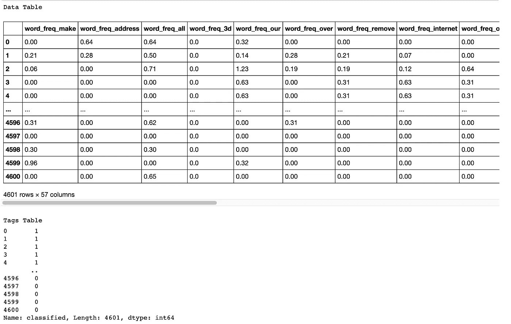
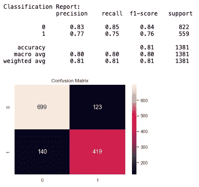
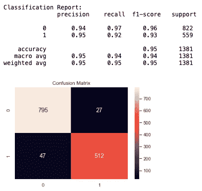
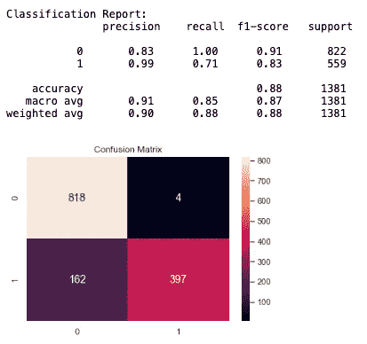

# 垃圾邮件还是火腿？使用 Python 的电子邮件分类器(MultinomialNB v/s XGBoost 分类器)

> 原文：<https://medium.com/analytics-vidhya/spam-email-detector-73518ba46340?source=collection_archive---------6----------------------->


图片来自[cattu](https://www.needpix.com/photo/462592/spam-mail-email-mailbox-garbage-trash)(pixabay.com)

你好。不久前，我正坐在电脑前，等待我的供应商发来一份大订单的邮件。在一天结束时变得焦躁不安后，我打电话给那个家伙，解释了延迟的原因。他向我保证，尽管我在收件箱里找不到它，他还是在早上就把它寄出去了。够困惑，我开始通过我所有的文件夹刮，让我惊讶的是，我发现它在我的垃圾邮件文件夹休息。我很好奇，最终了解到谷歌是如何在不通知我的情况下自动分类我所有的电子邮件的。可以肯定的是，这种情况可能会发生在我们很多人身上。所以我决定为自己做一个垃圾邮件或火腿分类器，看看我能不能让它工作。如果你想学习为自己制作一个，请继续阅读！

此外，查看我的其他帖子，了解更多机器学习算法的应用。一定要检查，然后通过评论分享你的见解，并与你的朋友分享，看看他们对此有何看法。您也可以按照我的文章创建这样的模型，并根据您的兴趣进行调整。

# 什么是垃圾邮件？

垃圾邮件是不请自来且不受欢迎的垃圾邮件，大量发送到任意的收件人列表中。通常，垃圾邮件是出于商业目的发送的。它可以通过僵尸网络，即被感染的计算机网络大量发送。虽然有些人认为这是不道德的，但许多企业仍然使用垃圾邮件。每封邮件的成本低得令人难以置信，而且企业可以持续地发送大量邮件。垃圾邮件也可能是恶意尝试访问您的计算机。[阅读更多..](https://www.cisco.com/c/en/us/products/security/email-security/what-is-spam.html)

# 关于项目

这是我在学习数据科学和机器学习概念的同时从事的一个项目。这里的目标是识别电子邮件是垃圾邮件还是火腿。我们将获取一个带有标签的电子邮件数据集，并应用分类技术。我们可以稍后在未分类的电子邮件消息上测试该模型的准确性和性能。类似的技术可以应用于其他 NLP 应用，如情感分析等。

# 数据

我使用的垃圾数据库数据集来自 [UCI 的 ML 知识库](https://archive.ics.uci.edu/ml/datasets/Spambase)，可以从链接下载。

“spambase.data”的最后一列表示电子邮件是否被视为垃圾邮件(1)或(0)，即未经请求的商业电子邮件。大多数属性表明特定的单词或字符是否在电子邮件中频繁出现。游程长度属性(55–57)测量连续大写字母序列的长度。以下是属性的定义:

*   word _ freq _ word 类型的连续实数[0，100]属性=电子邮件中匹配 WORD 的单词的百分比，即 100 *(该单词在电子邮件中出现的次数)/电子邮件中的总单词数。在这种情况下,“单词”是由非字母数字字符或字符串结尾限定的任何字母数字字符串。
*   char _ freq _ char 类型的连续实数[0，100]属性=电子邮件中与 CHAR 匹配的字符的百分比，即 100 *(字符出现次数)/电子邮件中的总字符数
*   capital _ run _ length _ average 类型的连续实数[1，…]属性=连续大写字母序列的平均长度
*   1 连续整数[1，capital _ run _ length _ longest 类型的属性=最长不间断大写字母序列的长度
*   1 连续整数[1，capital _ run _ length _ total 类型的属性=连续大写字母序列的长度总和=电子邮件中大写字母的总数
*   1 垃圾邮件类型的名义{0，1}类属性=表示电子邮件是否被视为垃圾邮件(1)或(0)，即未经请求的商业电子邮件。

# 模型

我们使用多项式朴素贝叶斯分类器，然后使用 XGBoost 分类器来拟合模型，以寻求结果的改进。最后，准确度分数和混淆矩阵告诉我们模型的效果如何。

## **多项式朴素贝叶斯分类器**

在统计学中，朴素贝叶斯分类器是一个简单的“概率分类器”家族，它基于应用贝叶斯定理，在特征之间具有强(朴素)独立性假设。它们是最简单的贝叶斯网络模型。朴素贝叶斯分类器是高度可扩展的，在学习问题中需要许多与变量(特征/预测器)数量成线性的参数。[阅读更多..](https://en.wikipedia.org/wiki/Naive_Bayes_classifier)

## **XGBoost 回归器**

XGBoost 是一个优化的分布式梯度增强库，旨在高效、灵活和可移植。它在梯度推进框架下实现机器学习算法。XGBoost 提供了一种并行的树提升(也称为 GBDT，GBM ),可以快速准确地解决许多数据科学问题。相同的代码运行在主要的分布式环境(Hadoop、SGE、MPI)上，可以解决超过数十亿个例子的问题。[阅读更多..](https://github.com/dmlc/xgboost)

# 开发模型

**第一步:**加载必要的包，读取数据。这里提供的数据没有带标签的列，因此可以选择更新标签以便更好地理解数据。为了保持整洁，我没有粘贴代码来包含本文中的列，尽管您可以在本文末尾附加的完整代码中找到它。

```
**import** **pandas** **as** **pd**
**import** **numpy** **as** **np**
**import** **re**data = pd.read_csv('spambase_data', names=cols, header=**None**)
X = data.iloc[:, :-1]
y = data.classifiedprint('Data Table **\n**')
display(X)
print('**\n\n**Tags Table')
display(y)
```

输出:



现在我们知道我们有 4600 封电子邮件样本。此外，我们注意到数据集已经从单词转换为数字，因此我们可以立即开始构建 ML 模型。你可以阅读我写的关于创建一个[假新闻检测器](https://medium.com/@palri/fake-news-detector-cbc47b085d4https://medium.com/@palri/fake-news-detector-cbc47b085d4)的文章，我在文章中详细讨论了将文字转换成数字的过程。

**第二步:**将数据集分成训练和测试子集。

```
**from** **sklearn.model_selection** **import** train_test_split **as** tts

X_train, X_test, y_train, y_test = tts(X, y, test_size=0.3, random_state=0)
```

**第三步:**使用训练子集建立多项式分类器模型，然后在测试集上测试模型的有效性。

```
**from** **sklearn.naive_bayes** **import** MultinomialNB
**from** **sklearn.metrics** **import** accuracy_score

mnb = MultinomialNB()
mnb.fit(X_train, y_train)

predicted = mnb.predict(X_test)

score = accuracy_score(y_test, predicted)
print('Accuracy Score: **\n**', (100*score))
```

输出:

```
Accuracy Score: 80.95582910934105
```

我们取得了大约 81%的分数。这意味着大约 20%的邮件会被错误分类。

由于我们正在对垃圾邮件和非垃圾邮件进行分类，因此避免误报分类(即将非垃圾邮件归类为垃圾邮件)至关重要。为此，我们将检查我们的分类的分布。

**步骤 4:** 创建分类报告和混淆矩阵(我已经使用了 [seabron](https://seaborn.pydata.org/) 库来创建混淆矩阵的更具说明性的输出，您也可以使用默认的[sk learn . Confusion _ Matrix()](https://scikit-learn.org/stable/modules/generated/sklearn.metrics.confusion_matrix.html)视图来评估我们的模型执行得如何:

```
**import** **seaborn** **as** **sn**
**from** **sklearn.metrics** **import** confusion_matrix **as** cm
**from** **sklearn.metrics** **import** classification_report **as** cr

cm1 = cm(y_test, predicted, labels=[0, 1])
df_cm = pd.DataFrame(cm1, range(2), range(2))
sn.set(font_scale=1)
sn.heatmap(df_cm, annot=**True**, annot_kws={'size':14}, fmt='d').set_title('Confusion Matrix')

print('**\n**Classification Report: **\n**', cr(y_test, predicted))
```

输出:



多项式分类器的结果

看起来我们有大约 10%的假阳性分类。这可不好。这可能是我的供应商的电子邮件出现在我的垃圾邮件文件夹中的原因吗？请在评论区告诉我。

我们发现如此高的误报率会使人们丢失一些重要的电子邮件。现在让我们使用一个更复杂的分类器，随机森林分类器的集合 XGBoost。

**第五步:**用训练集建立 XGBoost 模型，在测试集上测试，打印出分类报告和混淆矩阵。

注意:默认情况下，XGBoost 作为回归变量工作，所以我们得到的结果是连续的数字，作为概率。我们需要根据需要将概率转换成二进制分类。

```
**from** **xgboost** **import** XGBRegressor

xgb = XGBRegressor(n_estimators=120, leanring_rate=0.075)
xgb.fit(X_train, y_train)
*#xgb.fit(X_train, y_train, early_stopping_rounds=10, eval_set=[(X_test, y_test)], verbose=False)*

predicted1 = xgb.predict(X_test)score1 = accuracy_score(y_test, (predicted1 > 0.5))
print('Accuracy Score on XGBoost: **\n**', (100*score1))cm2 = cm(y_test, predicted1 > 0.5, labels=[0, 1])
df_cm = pd.DataFrame(cm2, range(2), range(2))
sn.set(font_scale=1)
sn.heatmap(df_cm, annot=**True**, annot_kws={'size':14}, fmt='d').set_title('Confusion Matrix')print('**\n**Classification Report: **\n**', cr(y_test, (predicted1 > 0.5)))
```

输出:

```
Accuracy Score on XGBoost: 
 94.6415640839971
```



XGBoost 结果为假阳性

使用 XGBoost 回归器，我们已经将假阳性分类减少到 3%以下。此外，我们已经将所有错误分类减少到 6%以下，将准确率提高到 95%左右。

尽管准确率很高，但将 3%的垃圾邮件标记为垃圾邮件可能是不可接受的。为了解决这个问题，我们现在将限制任何假阳性结果。

**第六步:**我们会照原样重复第五步，只有一个小改动。在将预测输出转换为概率时，我们将指示模型只将那些概率大于 0.9 的垃圾邮件标记为垃圾邮件。

```
score1 = accuracy_score(y_test, (predicted1 > 0.9))
print('Accuracy Score on XGBoost: **\n**', (100*score1))cm2 = cm(y_test, predicted1 > 0.9, labels=[0, 1])
df_cm = pd.DataFrame(cm2, range(2), range(2))
sn.set(font_scale=1)
sn.heatmap(df_cm, annot=**True**, annot_kws={'size':14}, fmt='d').set_title('Confusion Matrix')print('**\n**Classification Report: **\n**', cr(y_test, (predicted1 > 0.9)))
```

输出:

```
Accuracy Score on XGBoost: 
 87.97972483707458
```



允许最小假阳性的 XGBoost 结果

在将火腿误分类为垃圾邮件的同时，我们放弃了自己的准确率，降到了 88%。我相信阅读一些额外的垃圾邮件比遗漏一些非常重要的电子邮件要好，比如订单！

# 结果

我们已经使用两种不同的算法成功地创建并实现了机器学习模型。我们发现，在我们的情况下，XGBoost 的集合随机森林算法比基于朴素贝叶斯的多项式算法效果更好。

我们看到精度和准确度是成反比的，达到一个会导致另一个的损失。

# 未来的工作

我打算通过添加一个图形用户界面(GUI)来扩展这个项目，用户可以粘贴任何文本片段，并在结果中获得其分类。给我写信，如果你有一些技巧来实现这一点！

# 参考

你可以在 [GitHub](https://github.com/rpalri/Spam_Detection_ML) 上找到我的代码。

如果你喜欢我的作品，请通过分享和关注我的故事来表达你的欣赏。当我不断学习新的东西时，这会让我有动力与你们分享！

如果你不喜欢我的作品，请分享你的想法和建议。这将有助于我下次为您改进和开发更好的阅读材料！

谢谢你。