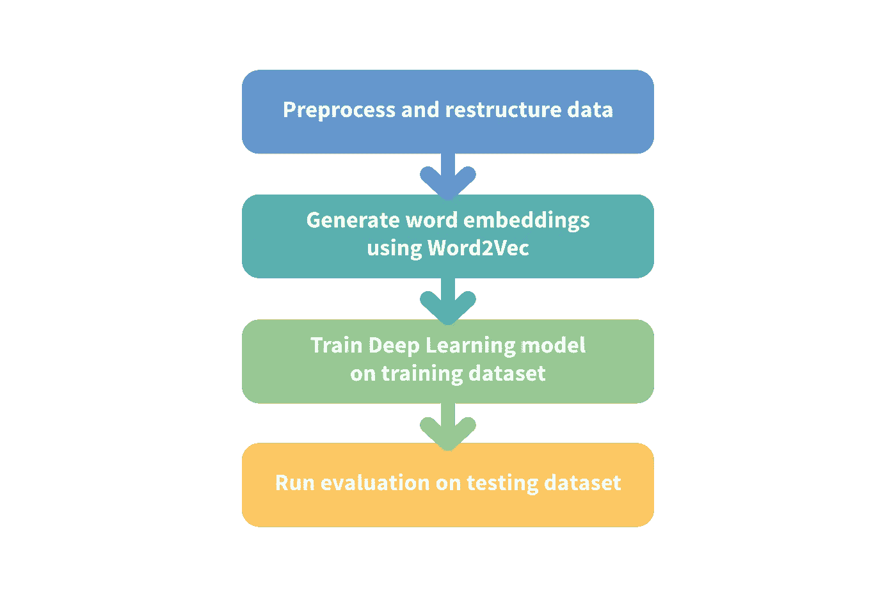
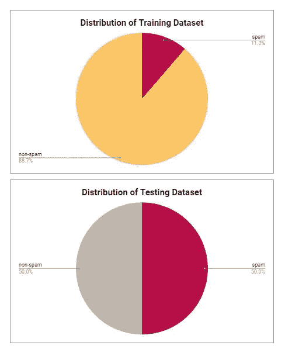

# 使用 DeepLearning4J 过滤垃圾邮件

> 原文：<https://medium.com/analytics-vidhya/spam-mail-filtering-with-deeplearning4j-445aac14a722?source=collection_archive---------10----------------------->

**文档分类**是自然语言处理(NLP)领域中的常见用例之一，在许多应用中得到了很好的应用。这个例子用垃圾邮件过滤的用例来演示文档分类。结果表明，通过使用深度学习，我们可以基于上下文有策略地过滤掉大多数垃圾邮件。

# 履行

图一。垃圾邮件过滤实施的工作流程

## 工作流程

垃圾邮件过滤的工作流程如图 1 所示。工作流程从数据清理和重组开始，以将数据准备成可用于培训的格式。

原始数据集可以从[这里](http://www.dt.fee.unicamp.br/~tiago/smsspamcollection/)检索。在未压缩的文件夹中，可以看到整个数据集都在 SMSSpamCollection.txt 中，在文件中有带“ham”和“non-spam”字样的标签，分别对应着垃圾数据和非垃圾数据。

图二。数据集的分布

数据集的分布显示在上图中。该数据集不平衡，非垃圾邮件数据点(4827 个样本)多于垃圾邮件数据点(747 个样本)。在这个例子中，不平衡数据用分类模型建模。有一个警告，由于数据量大，网络可能更好地适应非垃圾邮件模式。使用平衡的数据集可以更好地提高性能。

数据处理步骤从读入原始文本文件 SMSSpamCollection.txt 开始。该文本文件包含多行文本，其中每个文本字符串构成一个邮件内容。每一个都被分别检索并保存到一个独立的文本文件中。图 3 显示了分离的最终结果。然后，数据集被分成训练数据集和测试数据集(分成单独的子文件夹)。

图 3。在一个单独的 txt 文件中的电子邮件文本的插图。

## 获取代码库

这个例子的程序存储在下面的 Github 库中。

【https://github.com/codenamewei/nlp-with-use-case 

参考目录**垃圾邮件过滤**中的用例示例。为了更好地理解，下面将进一步解释代码库。

该计划基于开源的基于 Java 的深度学习框架——deep learning 4j(DL4J)。如果你是 DL4J 新手，可以参考我的另一篇文章[这里](/@codenamewei/ultimate-guide-to-getting-started-with-deeplearning4j-d497603cbe0b)对它的介绍和安装。

## 预训练 Word2Vec 模型的加载

在通过执行文件 SpamMailFiltering.java 来运行主程序之前，您需要下载预先训练好的文本嵌入。为了用文本形式的输入数据训练神经网络，文本必须被转换成嵌入。在这个例子中，使用了将文本转换为嵌入的预训练模型。如果你想了解更多关于 Word2Vec 的内容，这里有一个很好的[链接](https://jalammar.github.io/illustrated-word2vec/)。

这个例子从使用 Google 新闻语料库加载预先训练的 Word2Vec 模型开始。这个预训练的模型用 30 亿个运行单词训练，输出 300 维英语单词向量。从[这里](https://s3.amazonaws.com/dl4j-distribution/GoogleNews-vectors-negative300.bin.gz)下载，在 SpamMailFiltering.java 把***WORD _ VECTORS _ PATH***改成保存文件的路径。

图 4。将单词向量路径分配给 GoogleNews-vectors-negative300.bin.gz 的本地目录路径

## 运行代码

设置**字向量路径**后，通过执行**SpamMailFiltering.java 运行代码。**在神经网络训练的同时，打开 [http://localhost:9000](http://localhost:9000) 虚拟训练进度。

图 5。模型训练的可视化。

该程序可能需要相当长的时间来运行在 CPU 后端。加载大型谷歌新闻语料库非常耗时。或者，切换到 CUDA 后端将需要更短的执行时间。这样做很简单，只需更改 [pom.xml](https://github.com/codenamewei/nlp-with-use-case/blob/master/SpamMailFiltering/pom.xml#L25-L26) 中的一行即可。同时，你可以让程序运行，休息一下，去☕.喝杯咖啡

下面的描述提供了该过程的更详细的演练。

## 数据矢量化

训练和测试数据存储在目录中，其结构如下所示。有 train 和 test 文件夹，每个文件夹中都有垃圾邮件和非垃圾邮件子目录文件夹。

图 6。数据目录结构

这些数据通过定制的 SpamMailDataSetIterator 进行矢量化，如图 7 所示。该过程包括读入每个文本文件，对具有固定截短长度文本串执行记号化，以及将数据样本分成具有优选批量大小的批。

图 7。垃圾邮件数据设置程序初始化

## 网络体系结构

接下来，长短期记忆(LSTM)模型被配置为对数据建模。由于 LSTM 能够捕捉长期相关性，因此通常用于对顺序数据进行建模。点击此[链接](https://colah.github.io/posts/2015-08-Understanding-LSTMs/)了解更多关于 LSTM 的信息。

图 8。LSTM 神经网络体系结构

如图 8 所示，网络从 300 个单元的 LSTM 层开始，这是预训练单词嵌入的维度。如果原始长度超过预定长度，每封邮件文本将被截断到预定长度。网络继续输出 2 个类别，即垃圾邮件和非垃圾邮件标签。

## 评估结果

在 1 个时期后对测试数据集的评估显示了如图 6 所示的有希望的结果。在 150 封垃圾邮件样本中，103 封被正确识别为垃圾邮件，而 47 封被错误地标记为假阴性。

图九。评估结果。

我还在一封垃圾邮件样本上测试了该模型，以评估输出。配文**“恭喜恭喜！致电 FREEFONE 08006344447，申领您保证的 2000 英镑现金或 5000 英镑礼品。现在就赎回来！”**，这是一个值得注意的有奖骗局，该模型导致垃圾邮件的概率为 98%。这表明该模型能够区别识别垃圾邮件和非垃圾邮件的信心。

图 10。垃圾邮件样本的概率输出。

## 下一步是什么

我将在自然语言处理类别中发布更多文章，并提供实际演练的源代码。敬请期待！

## 参考和未来

*   [https://medium . com/@ codename Wei/ultimate-guide-to-getting-started-with-deep learning 4j-d 497603 CBE 0b](/@codenamewei/ultimate-guide-to-getting-started-with-deeplearning4j-d497603cbe0b)
*   [https://colah.github.io/posts/2015-08-Understanding-LSTMs/](https://colah.github.io/posts/2015-08-Understanding-LSTMs/)
*   [https://jalammar.github.io/illustrated-word2vec/](https://jalammar.github.io/illustrated-word2vec/)