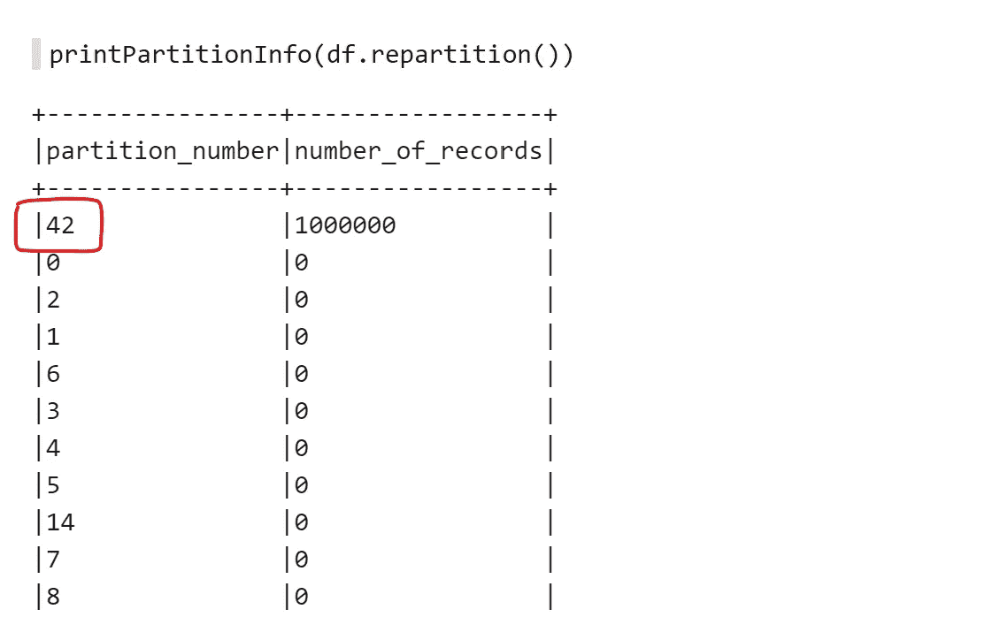

# Spark 2.2.0 数据帧重新分区

> 原文：<https://medium.com/analytics-vidhya/spark-2-2-0-dataframe-repartitioning-b3943323d95b?source=collection_archive---------3----------------------->

## 讨厌的隐藏陷阱解释！


尽管 Spark 是一个非常聪明的数据处理引擎，并且将大数据开发人员从所涉及的分布式基础设施的所有本质细节中解放出来，但这里那里还是有一些需要明确处理的地方。其中之一就是分区。由于 Spark 通常将数据存储在节点集群的内存中，因此数据应该在机器之间保持平衡，否则性能会受到影响。想象一下，你在一个超级市场有 10 个收银员，90%的顾客去找其中一个，剩下的去找另外 9 个收银员。这不是一个健康的情况。

Spark 提供了几种在集群节点间公平分配数据的方法。这可以使用散列来完成，使得散列到相同键的所有行将进入相同的分区。还有处理输入数据有偏差情况的存储桶。我最近在 Spark 2.2.0 中遇到了一个令人讨厌的行为，它导致 Spark 作业运行非常缓慢，甚至可能根本无法完成。这个问题似乎是从 2.3.0 开始修复的，但我找不到吉拉问题特别提到这个问题。Spark 2.3.0 [发行说明](https://spark.apache.org/releases/spark-release-2-3-0.html)在“性能和稳定性”部分有一些关于重新分区的参考，所以它可能是处理我将在下面解释的问题的修复之一。

## 准备输入数据

假设我们有下面这个有一百万行的虚构数据帧。


让我们定义一个小函数来打印出数据帧的分区信息。


根据集群中节点的数量和其他一些 Spark 配置，我们可能会得到不同的输出，但通常应该是一组记录数大致相等的分区。


## 玩分区

假设出于某种原因需要更多的分区，这可以使用`dataset.repartition`函数来实现，该函数有许多重载，但其中一个重载需要所需数量的分区。


这很有意义，因为我们有 8 个分区，每个分区有 125，000 条记录，而不是 2 个分区，每个分区有 50 万条记录。但是让我们尝试一个没有任何参数的额外重载。实际上这不是很准确，我所说的重载采用可变长度参数，这意味着它可以接受零长度。以下是 Spark 2.2.0 所有`repartition`过载的一瞥。

```
**def** repartition(numPartitions: Int): Dataset[T]
**def** repartition(numPartitions: Int, partitionExprs: Column*): Dataset[T]
**def** repartition(partitionExprs: Column*): Dataset[T]
```

在最后一个重载中，我们可以传递一个用于分区过程的列(或表达式)数组。Spark 对这些列的值进行散列，然后对整数散列结果进行取模操作，将记录分配给正确的分区。那么，如果我们根本不传递任何列，会是什么情况呢？



嘣，简直是灾难。所有记录都被分配到一个分区中，所有其他分区都是空的。这可能会导致一些内存不足的异常，但这不是我所面临的问题。我有一个非常 CPU 密集的阶段，由于所有记录都被分配到一个分区，这导致了整个 Spark 作业的严重延迟。单个分区由单个执行器处理，这限制了可用于处理数据的 CPU 内核的数量。因此，即使没有抛出 OOM 异常，延迟也是不可接受的。

另一个很酷的发现是上面截图中突出显示的分区号。它是 42，这个数字在 Spark 中是非常独特的，因为它在许多地方被用作种子🌱


## 那么，为什么所有数据都在一个分区中呢？

回到我们的问题:这有点像猜测，但这是我的解释。当使用空列列表调用 repartition 时，这会导致所有记录散列到相同的值，该值实际上是默认种子。假设默认的分区数量(由 Spark-SQL 配置控制)大于 42，那么所有记录都将存放在分区 42 中。即使该配置小于 42，模数操作符也将为所有记录生成一个数字，这只是一个不同的分区 Id。执行哈希运算的代码如下所示:

这只是猜测，但是在第 8 行，如果 children (columns 参数)为空，那么 while 循环将永远不会进入，并且 **eval** 函数的结果将始终是种子值。

作为双重检查，使用像 person Id 这样的唯一列进行分区可以在分区之间很好地分配记录。


对常量列进行同样的尝试会导致所有记录都位于一个分区中的相同问题。


## 我的 2 美分

升级到 2.3 或更高版本会很棒，但是最坏的情况是不要使用空列列表的重新分区，如果你使用一些列列表，确保它会导致分区间的平均分布。如果目标是在节点间均匀分布行，只需使用`dataset.repartition(rand())`。

## 问题的症状

在帖子的最后列出问题症状很尴尬，但我查看了一些运行缓慢的作业的 Spark 历史，发现了一些值得分享的模式。

首先，当我们使用空表达式进行重新分区时，所有数据都位于单个分区中，这反映如下:


这是一个运行时间过长的阶段，而且 200 个任务中有 199 个已经成功，只有一个任务尚未完成。您可以想象这 199 个任务是每个分区都没有记录的任务。这里的 200 是`spark.sql.shuffle.partitions`的默认值。

接下来，如果我们深入到运行时间最长的阶段，并根据持续时间对任务进行排序，很明显会有一个运行速度较慢的任务，它的神奇 ID 为 42。所有其他任务都以成功状态完成。


以上是我们从 Spark 控制台/历史记录中检测此类问题的方法，以防由于偏斜或其他原因出现类似的模式。