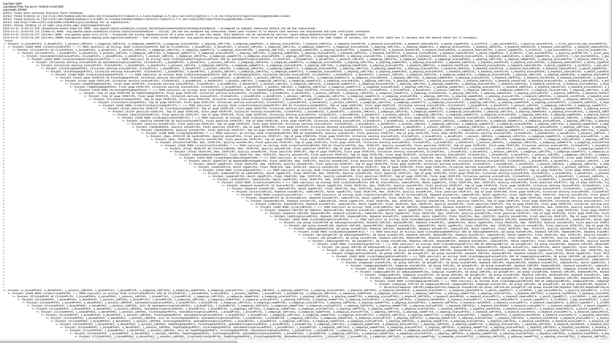

# 火花 3 —理解解释格式

> 原文：<https://medium.com/analytics-vidhya/spark-3-understanding-explain-formatted-d4f33c1dee86?source=collection_archive---------3----------------------->

在这篇文章中，我将分解 ***的新输出，解释*** 命令。不过先来看看 3.0 之前是怎样的。

有些人可能从来没有使用过 ***解释*** ，但是当你想知道真正发生了什么的时候，它真的很有用。

有时候，我们写了漂亮的代码，并期望 ***Catalyst*** 为我们解决所有问题，对不起，伙计们，但事实并非如此。催化剂让我们的生活变得轻松了许多，但不幸的是，它并没有完成所有的工作。知道它实际在做什么的最好方法之一是在 DataFrame 上调用 ***解释*** 。

要仅打印物理计划，请执行以下操作:

```
dataframe.explain()
```

如果要打印逻辑计划和物理计划:

```
dataframe.explain(true)
```

> *请注意，在这篇文章中，我不会详细讨论催化剂* *或* *执行计划。关于那些计划有很多很棒的* [*文章*](https://databricks.com/glossary/catalyst-optimizer) *。*

好吧，我们开始吧。

下面是我们要分析的代码:

```
val resultDF = *getLastStatus*(df1.union(df2))def *getLastStatus*(df: DataFrame): DataFrame = {
  df.groupBy('form_id)
    .agg(
      *max*('creator_user_id) as 'creator_user_id,
      *min*('created_at) as 'created_at,
      *max*('updated_at) as 'updated_at,
      *max*('deleted_at) as 'deleted_at
    )
}
```

两个数据帧都具有以下模式:

```
 |-- form_id: string (nullable = true)
 |-- event_id: string (nullable = true)
 |-- event_version: long (nullable = true)
 |-- type: string (nullable = true)
 |-- creator_user_id: long (nullable = true)
 |-- created_at: timestamp (nullable = true)
 |-- updated_at: timestamp (nullable = true)
 |-- deleted_at: timestamp (nullable = true)
 |-- workspace_id: string (nullable = true)
 |-- field_position: long (nullable = true)
 |-- field_id: string (nullable = true)
 |-- field_title: string (nullable = true)
 |-- field_reference: string (nullable = true)
 |-- field_type: string (nullable = true)
 |-- group_reference: string (nullable = true)
 |-- required: boolean (nullable = true)
 |-- field_templated: boolean (nullable = true)
 |-- field_attachment_type: string (nullable = true)
 |-- layout_attachment_type: string (nullable = true)
 |-- choice_position: long (nullable = true)
 |-- choice_id: string (nullable = true)
 |-- choice_label: string (nullable = true)
 |-- received_at: date (nullable = true)
 |-- last_updated_at: timestamp (nullable = true)
```

> 火花 2.4.5

让我们调用 ***解释*** 来看执行计划

```
resultDF.explain(true)
```

最后，下面这个巨大的代码怪物就是结果。信不信由你，这只是两个数据帧和一个 ***组由*** 组成的*联合的结果。*

```
*== Parsed Logical Plan ==
'Project [form_id#24, creator_user_id#193L, created_at#195, updated_at#197, deleted_at#199, coalesce('updated_at, 'created_at, 'deleted_at) AS last_event_timestamp#205]
+- Aggregate [form_id#24], [form_id#24, max(creator_user_id#28L) AS creator_user_id#193L, min(created_at#29) AS created_at#195, max(updated_at#30) AS updated_at#197, max(deleted_at#31) AS deleted_at#199]
   +- Union
      :- Relation[form_id#24,event_id#25,event_version#26L,type#27,creator_user_id#28L,created_at#29,updated_at#30,deleted_at#31,workspace_id#32,field_position#33L,field_id#34,field_title#35,field_reference#36,field_type#37,group_reference#38,required#39,field_templated#40,field_attachment_type#41,layout_attachment_type#42,choice_position#43L,choice_id#44,choice_label#45,received_at#46,last_updated_at#47] json
      +- Relation[form_id#96,event_id#97,event_version#98L,type#99,creator_user_id#100L,created_at#101,updated_at#102,deleted_at#103,workspace_id#104,field_position#105L,field_id#106,field_title#107,field_reference#108,field_type#109,group_reference#110,required#111,field_templated#112,field_attachment_type#113,layout_attachment_type#114,choice_position#115L,choice_id#116,choice_label#117,received_at#118,last_updated_at#119] json== Analyzed Logical Plan ==
form_id: string, creator_user_id: bigint, created_at: timestamp, updated_at: timestamp, deleted_at: timestamp, last_event_timestamp: timestamp
Project [form_id#24, creator_user_id#193L, created_at#195, updated_at#197, deleted_at#199, coalesce(updated_at#197, created_at#195, deleted_at#199) AS last_event_timestamp#205]
+- Aggregate [form_id#24], [form_id#24, max(creator_user_id#28L) AS creator_user_id#193L, min(created_at#29) AS created_at#195, max(updated_at#30) AS updated_at#197, max(deleted_at#31) AS deleted_at#199]
   +- Union
      :- Relation[form_id#24,event_id#25,event_version#26L,type#27,creator_user_id#28L,created_at#29,updated_at#30,deleted_at#31,workspace_id#32,field_position#33L,field_id#34,field_title#35,field_reference#36,field_type#37,group_reference#38,required#39,field_templated#40,field_attachment_type#41,layout_attachment_type#42,choice_position#43L,choice_id#44,choice_label#45,received_at#46,last_updated_at#47] json
      +- Relation[form_id#96,event_id#97,event_version#98L,type#99,creator_user_id#100L,created_at#101,updated_at#102,deleted_at#103,workspace_id#104,field_position#105L,field_id#106,field_title#107,field_reference#108,field_type#109,group_reference#110,required#111,field_templated#112,field_attachment_type#113,layout_attachment_type#114,choice_position#115L,choice_id#116,choice_label#117,received_at#118,last_updated_at#119] json== Optimized Logical Plan ==
Aggregate [form_id#24], [form_id#24, max(creator_user_id#28L) AS creator_user_id#193L, min(created_at#29) AS created_at#195, max(updated_at#30) AS updated_at#197, max(deleted_at#31) AS deleted_at#199, coalesce(max(updated_at#30), min(created_at#29), max(deleted_at#31)) AS last_event_timestamp#205]
+- Union
   :- Project [form_id#24, creator_user_id#28L, created_at#29, updated_at#30, deleted_at#31]
   :  +- Relation[form_id#24,event_id#25,event_version#26L,type#27,creator_user_id#28L,created_at#29,updated_at#30,deleted_at#31,workspace_id#32,field_position#33L,field_id#34,field_title#35,field_reference#36,field_type#37,group_reference#38,required#39,field_templated#40,field_attachment_type#41,layout_attachment_type#42,choice_position#43L,choice_id#44,choice_label#45,received_at#46,last_updated_at#47] json
   +- Project [form_id#96, creator_user_id#100L, created_at#101, updated_at#102, deleted_at#103]
      +- Relation[form_id#96,event_id#97,event_version#98L,type#99,creator_user_id#100L,created_at#101,updated_at#102,deleted_at#103,workspace_id#104,field_position#105L,field_id#106,field_title#107,field_reference#108,field_type#109,group_reference#110,required#111,field_templated#112,field_attachment_type#113,layout_attachment_type#114,choice_position#115L,choice_id#116,choice_label#117,received_at#118,last_updated_at#119] json== Physical Plan ==
*(4) HashAggregate(keys=[form_id#24], functions=[max(creator_user_id#28L), min(created_at#29), max(updated_at#30), max(deleted_at#31)], output=[form_id#24, creator_user_id#193L, created_at#195, updated_at#197, deleted_at#199, last_event_timestamp#205])
+- Exchange hashpartitioning(form_id#24, 200)
   +- *(3) HashAggregate(keys=[form_id#24], functions=[partial_max(creator_user_id#28L), partial_min(created_at#29), partial_max(updated_at#30), partial_max(deleted_at#31)], output=[form_id#24, max#217L, min#218, max#219, max#220])
      +- Union
         :- *(1) FileScan json [form_id#24,creator_user_id#28L,created_at#29,updated_at#30,deleted_at#31] Batched: false, Format: JSON, Location: InMemoryFileIndex[file:/Users//desarrollo//dops_spark_jobs/target/scala-2...., PartitionFilters: [], PushedFilters: [], ReadSchema: struct<form_id:string,creator_user_id:bigint,created_at:timestamp,updated_at:timestamp,deleted_at...
         +- *(2) FileScan json [form_id#96,creator_user_id#100L,created_at#101,updated_at#102,deleted_at#103] Batched: false, Format: JSON, Location: InMemoryFileIndex[file:/Users//desarrollo//dops_spark_jobs/target/scala-2...., PartitionFilters: [], PushedFilters: [], ReadSchema: struct<form_id:string,creator_user_id:bigint,created_at:timestamp,updated_at:timestamp,deleted_at...*
```

*该计划分为四个部分，这可能是从中提取的最简单的内容:*

```
*== Parsed Logical Plan ==
== Analyzed Logical Plan ==
== Optimized Logical Plan ==
== Physical Plan ==*
```

*然后，你可以看到像这样非常有用的东西:*

```
*PartitionFilters: [], PushedFilters: []*
```

*除非你是亚采克·拉斯科斯基，否则我祝你好运。*

**

*如果你不相信我，去找沃利。*

**

> *火花 3.0*

*可能是你们都在等待的。*

*新的*解释*有以下签名*

```
*def explain(mode: String): Unit*
```

*其中*模式*可以是下列值之一:*

> ***简单的**，**扩展的，**， **codegen，cost 或 formatted***

## *简单和扩展模式*

*如果我们将它们与 Spark 2.4.5 进行比较，这两个版本非常简单*

```
*df.explain("simple") == df.explain()
df.explain("extended") == df.explain(true)*
```

## *代码生成和成本模式*

*这两个都是比较低级的，尤其是 *Codegen。**

```
*df.explain("codegen")*
```

*将打印 spark 生成的所有代码，例如*

```
*Generated code:
/* 001 */ public Object generate(Object[] references) {
/* 002 */   return new GeneratedIteratorForCodegenStage1(references);
/* 003 */ }
/* 004 */
/* 005 */ // codegenStageId=1
/* 006 */ final class GeneratedIteratorForCodegenStage1 extends org.apache.spark.sql.execution.BufferedRowIterator {
/* 007 */   private Object[] references;
/* 008 */   private scala.collection.Iterator[] inputs;
/* 009 */   private scala.collection.Iterator inputadapter_input_0;
/* 010 */   private org.apache.spark.sql.catalyst.expressions.codegen.UnsafeRowWriter[] project_mutableStateArray_0 = new org.apache.spark.sql.catalyst.expressions.codegen.UnsafeRowWriter[1];
/* 011 */
/* 012 */   public GeneratedIteratorForCodegenStage1(Object[] references) {
/* 013 */     this.references = references;
/* 014 */   }*
```

*如果统计数据可用，那么**成本模式**可能有助于获取统计数据。*

```
*df.explain("cost")*
```

*这将为您提供统计信息，如数据帧的大小，例如*

```
*+- Union, Statistics(sizeInBytes=12.2 KiB)*
```

# *格式化*

> *可能是你在这里的原因*

*请记住，我们正在分析这段代码:*

```
*val resultDF = *getLastStatus*(df1.union(df2))def *getLastStatus*(df: DataFrame): DataFrame = {
  df.groupBy('form_id).
    agg(
      *max*('creator_user_id) as 'creator_user_id,
      *min*('created_at) as 'created_at,
      *max*('updated_at) as 'updated_at,
      *max*('deleted_at) as 'deleted_at
    )
}*
```

*这是在 Spark 3.0 中打印执行计划的奇特方式，正如你所看到的，阅读起来非常清晰(完整的计划在底部)。*

```
*resultDF.explain("formatted")*
```

*所有的步骤都有编号，这有助于你更好地理解它。*

```
*== Physical Plan ==
* HashAggregate (8)
+- Exchange (7)
 +- * HashAggregate (6)
 +- Union (5)
 :- * Project (2)
 : +- BatchScan (1)
 +- * Project (4)
 +- BatchScan (3)*
```

*在步骤(1)、(2)、(3)、(4)中，读取两个数据帧并仅选择执行聚合(6)所需的列，如您在**输出**字段中所见。如果您还记得，我的 DataFrame 有超过 20 列。*

```
*(1) BatchScan 
Output: [updated_at#30, creator_user_id#28L, deleted_at#31, created_at#29, form_id#24]

(2) Project [codegen id : 1]
Output : [form_id#24, creator_user_id#28L, created_at#29, updated_at#30, deleted_at#31]
Input : [form_id#24, creator_user_id#28L, created_at#29, updated_at#30, deleted_at#31]

(3) BatchScan 
Output: [updated_at#102, creator_user_id#100L, form_id#96, created_at#101, deleted_at#103]

(4) Project [codegen id : 2]
Output : [form_id#96, creator_user_id#100L, created_at#101, updated_at#102, deleted_at#103]
Input : [form_id#96, creator_user_id#100L, created_at#101, updated_at#102, deleted_at#103]*
```

*然后是两个数据帧的并集(5)。*

```
*(5) Union*
```

*然后是每个执行器内部的部分聚集(6)。*

```
*(6) HashAggregate [codegen id : 3]
Input: [form_id#24, creator_user_id#28L, created_at#29, updated_at#30, deleted_at#31]*
```

*然后洗牌(7)*

```
*(7) Exchange 
Input: [form_id#24, max#226L, min#227, max#228, max#229]*
```

*最后是最后一个集合体(8)*

```
*(8) HashAggregate [codegen id : 4]
Input: [form_id#24, max#226L, min#227, max#228, max#229]*
```

*完整的计划*

```
*== Physical Plan ==
* HashAggregate (8)
+- Exchange (7)
 +- * HashAggregate (6)
 +- Union (5)
 :- * Project (2)
 : +- BatchScan (1)
 +- * Project (4)
 +- BatchScan (3)(1) BatchScan 
Output: [updated_at#30, creator_user_id#28L, deleted_at#31, created_at#29, form_id#24]

(2) Project [codegen id : 1]
Output : [form_id#24, creator_user_id#28L, created_at#29, updated_at#30, deleted_at#31]
Input : [form_id#24, creator_user_id#28L, created_at#29, updated_at#30, deleted_at#31]

(3) BatchScan 
Output: [updated_at#102, creator_user_id#100L, form_id#96, created_at#101, deleted_at#103]

(4) Project [codegen id : 2]
Output : [form_id#96, creator_user_id#100L, created_at#101, updated_at#102, deleted_at#103]
Input : [form_id#96, creator_user_id#100L, created_at#101, updated_at#102, deleted_at#103]

(5) Union 

(6) HashAggregate [codegen id : 3]
Input: [form_id#24, creator_user_id#28L, created_at#29, updated_at#30, deleted_at#31]

(7) Exchange 
Input: [form_id#24, max#226L, min#227, max#228, max#229]

(8) HashAggregate [codegen id : 4]
Input: [form_id#24, max#226L, min#227, max#228, max#229]*
```

*综上所述，Spark 非常用户友好。*

*我发现基本上没有经验的人可以马上创建他们的 ETL，但是他们很可能表现不佳并且浪费资源。因此有钱。*

*了解这些计划将有助于您优化工作负载。*

*如果它们不重要，为什么他们要在新版本中改进它们？*

**