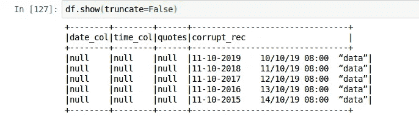

# 火花 CSV 深潜-第二部分

> 原文：<https://medium.com/analytics-vidhya/spark-csv-deep-dive-part-ii-6d3389904f71?source=collection_archive---------9----------------------->

这是我上一篇文章的延续

[](/@somanathsankaran/pyspark-csv-reader-deep-dive-6096cb2c2880) [## pyspark csv 阅读器深度潜水

### 大家好，spark 是大数据世界中的一个伟大框架。

medium.com](/@somanathsankaran/pyspark-csv-reader-deep-dive-6096cb2c2880) 

这篇文章包括处理

1.清洗日期和时间戳

2.压缩选项

在这里，我们将处理日期格式和时间格式

我准备了一个适合我们所有用例的坏数据集


现在，我们将尝试导入更容易的数据库样式的模式，并使用 Dtypes 验证模式


查看模式数据



**第一步:。清洗日期和时间戳**

如上所示，由于发布日期和时间戳格式，所有内容都为空。默认情况下，spark 会以` ` yyyy-MM-dd'T'HH:mm:ss 格式显示时间戳或日期。SSSXXX '

在 spark 中，我们可以选择在加载数据时使用 dateFormat="dd-MM-YYYY "，timestampFormat="dd/MM/YY HH:mm "来指定日期格式和时间戳格式


现在我们可以看到日期和时间戳列已经修复

**第三步:压缩选项**

火花 csv 阅读器有能力阅读以下压缩文件

```
bzip2, deflate, uncompressed, lz4, gzip, snappy
```


但问题是所有的数据将作为一个单一的任务加载，所以请微调执行器的内存来容纳所有的数据

第四步:探索其他选择

如果我们对 scala 语法有一些基本的了解，我们都可以探索其他选项

# CSVOptions.scala

下一个教程:[https://medium . com/@ somanathsankaran/spark-select-and-select-expr-deep-dive-d 63 ef 5 e 04 c 87](/@somanathsankaran/spark-select-and-select-expr-deep-dive-d63ef5e04c87)

Github 链接:Github 链接:[https://Github . com/SomanathSankaran/spark _ medium/tree/master/spark _ CSV](https://github.com/SomanathSankaran/spark_medium/tree/master/spark_csv)

****学习并让别人学习！！****