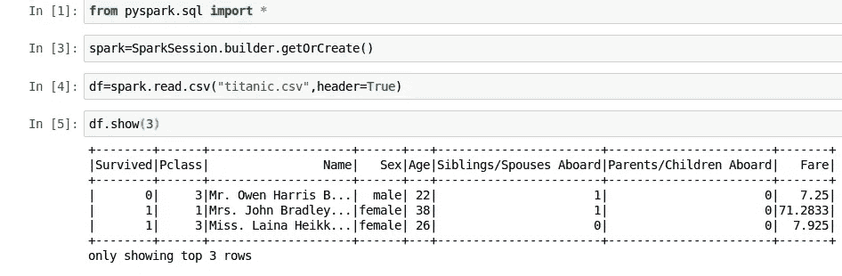

# 火花分组和过滤深潜

> 原文：<https://medium.com/analytics-vidhya/spark-group-by-and-filter-deep-dive-5326088dec80?source=collection_archive---------3----------------------->

Jez Timms 在 [Unsplash](https://unsplash.com?utm_source=medium&utm_medium=referral) 上拍摄的照片

大家好，这是我的火花深度潜水系列的第四篇文章

下面是我以前的博客链接，这样你可以从头开始

 [## 火花选择和选择表达式深潜

### 这是我在深度阅读 csv 之后的第三篇 spark 深度阅读系列文章

medium.com](/@somanathsankaran/spark-select-and-select-expr-deep-dive-d63ef5e04c87) 

分组和筛选是数据分析师的重要组成部分之一

过滤器对于减少 spark 扫描的数据非常有用，尤其是当我们有分区列时

我们要处理的这个帖子

1.  单列分组依据
2.  多列分组依据
3.  按聚集组合分组的高级算术函数
4.  带有日期字段的分组依据
5.  收集列表和收集集
6.  基于单个列的过滤器
7.  基于多列的过滤器
8.  使用类似 Sql 的表达式过滤
9.  给熊猫用户的提示

**第一步:创建输入数据**

我们将使用 spark.read.csv 来读取输入数据(关于从 csv 源加载数据的详细信息，请参考我以前的帖子)

**第二步:基于单列的分组依据**

Group by 可以很容易地与单个列一起使用，我们可以使用 pandas 样式将列名分组为 string 或 spark 列，并调用 count()，如下所示

它还可以与 min、max 等聚合函数一起使用，如下所示

但是问题是因为我们没有定义模式，所有的列都作为字符串加载，所以 spark 抱怨它不是一个数字列，尽管实际上它是，所以我们应该在指定或定义模式时使用 cast

使用模式加载 Df

我正在加载提供数据库风格的模式，如下所示

这里的新东西是我们可以使用**反勾(`)来转义列名**中的空格，就像“兄弟姐妹/配偶在船上”一样

现在我们可以在幸存者中找到最大年龄

**第三步:多列分组依据**

我们可以传递 string 或 f.col sysntax 的列列表

假设我们想找出男性和女性死亡和幸存的最小年龄，这可以按如下方式实现

**步骤 3:按聚集组合分组的高级算术函数**

一个常见的用例是按特定的列分组，并使用 diff 聚合函数，比如按年龄分组，然后在单个查询中查找最大年龄最小费用等

**带字典的聚集**

这可以通过使用 agg 函数，然后传递列和要应用的函数来实现(例如，Min，Max 作为 python 字典，如下所示)

**多列聚集**

我们也可以对多列使用相同的方法，例如按 2 列分组并有一个计数(*)

**Agg 附名单:**

因为 Agg 接受列表达式，所以我们可以定义列表中所有列，我们可以使用*list 语法来解包并作为每个元素发送

**第四步:带日期字段的分组依据**

一个常见的用例是通过使用 pyspark.sql.functions 模块中的 month，year 函数将日期字段按月、年分组

将当前日期添加到现有字段，创建新的 DF 并检查日期类型

如果 date_string 是 YYYY-MM-dd 格式，它也可以处理字符串日期字段

**第五步:收藏列表和收藏集**

如果我们想在分组后查看数据而不是聚合(count(*)或 count_distinct ),这些函数会非常有用

收集列表包含所有元素，而收集集没有重复项，如下所示

**第六步:基于单列的过滤**

可以通过使用 string 和 f.col 来完成过滤

用字符串过滤

带列过滤器

**第七步:基于多列的过滤**

我们可以使用字符串形式的 and 或& symbol "| "符号来基于多个列进行过滤

**第八步:过滤 Sql Like 表达式**

一个常见的用例是使用 like 进行过滤以匹配模式，

比方说，我们想要查找名字像 John 男性，

它可以按如下所示进行组合

**第九步:给熊猫用户的提示**

如果您是熊猫用户，您可以使用链接语法来过滤列，如下所示

今天就到这里吧！！:)

Github 链接:[https://github . com/SomanathSankaran/spark _ medium/tree/master/spark _ CSV](https://github.com/SomanathSankaran/spark_medium/tree/master/spark_csv)

****学习并让别人学习！！****