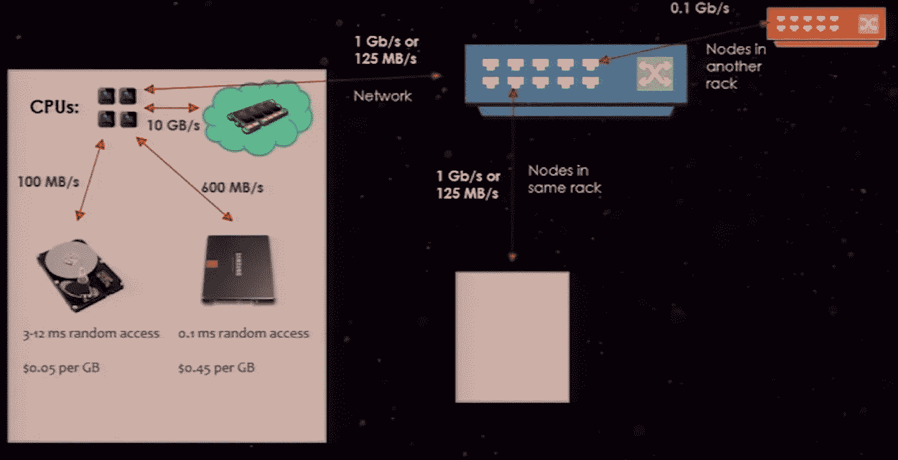

# 火花等级

> 原文：<https://medium.com/analytics-vidhya/spark-hierarchy-953c1eb56a81?source=collection_archive---------5----------------------->

本文将让您对大数据和 Spark 世界中使用的术语有一个基本的了解。

Spark 硬件层次结构

**硬件层级**

**集群**:

1.  驾驶员
2.  **执行者**

*   核心/插槽——每个执行器都可以被视为服务器，它们都有核心。核心可以被视为一个插槽，用于放置工作负载。每个内核可以处理一个工作。

**记忆**

每个服务器也有内存。但并不是所有的都给了 Spark。平均 90%的内存都给了 Spark。
在高层次上，这种记忆分为储存记忆和工作记忆。

> 存储内存是缓存或保存数据的地方。
> 
> 工作内存是 Spark 进行所有内存计算的地方

**存储内存**

*   存储持久化对象
*   默认配置限制—总存储的 50%

**工作记忆**

*   将由 spark 工作负载使用
*   总存储的 50%将用于 spark 工作负载

**磁盘**

每台服务器还具有本地连接/装载的存储。

*   内存/固态硬盘/NFS 硬盘
*   更好的磁盘将确保数据的快速洗牌

这些磁盘非常重要，因为-很多时候，Spark 会进行*洗牌(数据四处移动)。在中间阶段，当数据四处移动时，这些数据会进入磁盘。磁盘越快，洗牌越快。*

> 要了解更多关于 Spark 内存管理的信息，请参考这篇[文章。](/@tharun026/spark-memory-management-583a16c1253f)

**软件层级**

Spark 软件层次结构

**转变**(懒惰):

*   窄(转换所需的所有数据同时可供 CPU 使用)
*   宽(数据需要在节点间移动)(需要随机移动)

**动作**

当我们调用一个操作时，我们剥离了 spark 已经进行的所有转换。操作根据转换启动一个或多个作业。

*   作业
    —一个作业可以有多个阶段。
*   阶段
    —这是将要完成的一部分工作。
    — 1 个阶段可以有很多任务。
*   作业和阶段是编排的一部分
*   任务(直接与硬件交互)
*   一个阶段中的每个任务都做同样的事情，只是在另一个数据段上。
*   如果一个任务需要做一些不同的事情，它需要在另一个阶段的内部。
*   一个任务由一个内核在一个分区上完成。

**洗牌**

每当 Spark 无法在单个分区上执行任务，或者需要来自其他分区的数据进行计算时，就会发生洗牌。

在上图中，我们在 3 个分区中有 3 个名字，我们试图得到每个第一个字符的名字的数量。获取每个名称的第一个字符可以独立完成。但是 groupBy 任务要求所有的 A 都在一个分区中，因此需要 Shuffle。Shuffle 将所有的 A 收集到一个分区中，然后计算每个第一个字符的名字。

洗牌

在混洗过程中，每个分区的数据都根据哈希键写入磁盘。在这种情况下，阶段 1 根据第一个字符将数据写入磁盘。阶段 2 从磁盘中提取数据并获取计数。

**火花数据读取速度**

火花数据读取速度

Spark 快得惊人的一个主要原因是它在内存中完成所有的处理。Spark 大量利用内存，因为 CPU 可以以 10 GB/s 的速度从内存中读取数据。然而，如果 Spark 从内存磁盘中读取数据，速度将降至约 100 MB/s，SSD 读取将在 600 MB/s 的范围内。

如果 CPU 必须通过网络读取数据，速度将下降到大约 125 MB/s。

我希望现在您能够理解 Spark 中的基本术语。如果你想了解 Spark 在每个执行器中是如何利用内存的，可以参考这篇 [*文章*](/@tharun026/spark-memory-management-583a16c1253f) *。* 如果想进高级星火，参考这篇 [*文章*](/analytics-vidhya/understanding-resource-allocation-configurations-for-a-spark-application-9c1307e6b5e3) 。