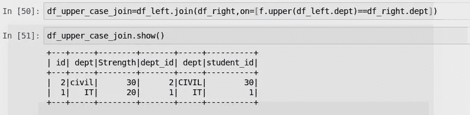

# 火花连接深潜

> 原文：<https://medium.com/analytics-vidhya/spark-join-deep-dive-2e10395682c4?source=collection_archive---------9----------------------->

连接是 ETL 管道中常见的步骤之一。这是我在这个系列的第五次

 [## 火花分组和过滤深潜

### 大家好，这是我的火花深度潜水系列的第四篇文章

medium.com](/@somanathsankaran/spark-group-by-and-filter-deep-dive-5326088dec80) 

让我们在今天的文章中看到以下内容

1.  连接的类型
2.  指定具有相同列名的连接键
3.  用不同的列名指定连接键

4.在连接条件中应用条件，如“上部”、“修剪”

5.带有示例的联接类型

6.指定多个连接条件

7.联接并选择不明确的列

**第一步:创建数据集**

让我们使用 spark 创建 2 个样本数据帧，每个数据帧有 3 列。创建数据框架

DF_Left:是 dept 表，有三个字段:

df_right:由 dept、dept_id 和 student_id 组成

**加入类型:**

Spark 支持以下类型的连接

1.  内部连接
2.  左 _ 外连接/右外连接
3.  完全 _ 外部连接
4.  左 _ 半/左 _ 反连接
5.  交叉连接

**内部连接:**

使用 **Inner 关键字**内连接将只包含匹配两个表中连接键值的行，并且内连接是 spark 中的默认连接，我们不需要显式指定“inner ”,如下所示

**指定连接键:**

连接键可以使用

1.  **指定具有相同列名的连接键**:

On 子句可用于将连接键作为字符串或字符串列表提供，如果键名称在两个 DF 中都匹配，就像 dep 字段的情况一样，如下所示

2.**用 diff 列名指定连接键**:如果列名不同，我们可以按顺序提供包含左键和右键的列表，如 dept id

**3。在连接条件中应用上切边等条件**

在上面的例子中，我们通常需要指定诸如修剪鞋面等条件，即使 dept civil 是相同的，但由于大小写敏感，它不会被连接。因此，在使用 pyspark.sql.functions 作为 f 将 dept 字段转换为大写字母后，我们将使用 upper function 进行连接。

**带示例的联接类型**

Left_Join:它将包含 left_table 中的所有行，如果找到匹配项，则在右表中有相应的值，否则右 df 字段将为 null

例如，由于 id 3，4 在右侧 df 中缺失，我们将如下所示具有空值，并且在右侧 df 中存在但在左侧表中缺失的 dept_id 5 也将不存在。

左连接可以通过使用值为 Left 或 left_outer 的关键字**来执行，但是我会推荐 left_outer，因为它对读者来说很清楚**

**右外连接**:

它与左外连接相反，将包含右 df 和

如果找到匹配，则在左侧表中有相应的值，否则左侧 df 字段将为空

例如，由于左侧表格中缺少 dept_id 5，我们将在左侧 df 字段中填充 null，如下所示

完全外部连接:

它是左外连接和右外连接的组合，将包含所有行

从两个数据帧中

例如，在下面的例子中，由于 id 3，4 在右 df 中缺失，我们将在右 df 字段中具有空值，并且由于 dept_id 5 在左表中缺失，我们将在左 df 字段中填充空值，如下所示

**左半连接**:

它类似于子查询，但经过优化，我更喜欢左半连接

子查询。因此，我们的输出在左 df 中只有 id，它们出现在右 df 中，如 1 和 2

顾名思义，它将包含在右表**中找到匹配键的所有行，左半连接和左外连接的区别在于它将只包含左表中的字段，而不是两个表都包含**。

你可以比较左外图像和左半连接截图，看看有什么不同

**左反加入**

它是左半连接的反义词。它类似于 not in 子查询

因此，如果我们看到输出，我们将在左侧 df 中只有 id，而在右侧 df 中没有 id，如 3 和 4

**交叉连接**:

交叉连接就是将右表中的每一行与另一行连接起来

因此，如果左 df 有 4 行，右 df 有 3 行，我们将有 4*3 =12 行

**如果我们没有用 Join** 指定连接条件，则会发生交叉连接

**由于交叉连接会分解数据集，默认情况下 spark 不允许交叉连接**

我们必须使用 spark.sql 设置 spark . SQL . cross join . enabled = true，并执行交叉连接，如下所示

**指定多个连接条件:**

我们可以将多个条件与条件元组结合起来，并使用 or 逻辑运算符，使用&和|符号，如下所示

**连接并选择不明确的列**

通常，左和右 df 将具有相同的列名

就像 dept 的情况一样

一个简单的解决方案是使用

列表理解

如果我们在 left_df 中有相同的列名，我们将在列名前面加上“right_df_ ”,否则保留如下所示的列名，并用这些列创建一个新的 df

使用新列创建新的 df 并选择 df

今天就到这里吧！！:)

Github 链接:[https://github . com/SomanathSankaran/spark _ medium/tree/master/spark _ CSV](https://github.com/SomanathSankaran/spark_medium/tree/master/spark_csv)

***请把我在 spark 中必须涉及的话题发给我，并给我提供改进写作的建议:)***

**学习，也让别人学习！！**