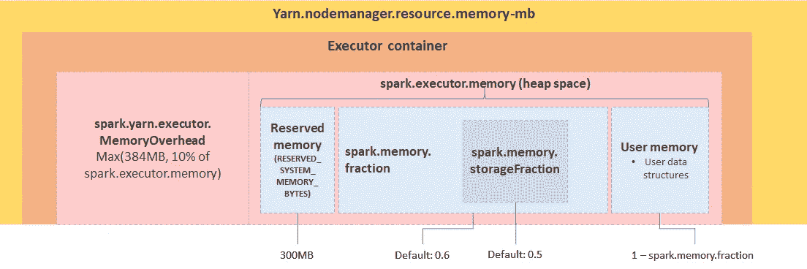
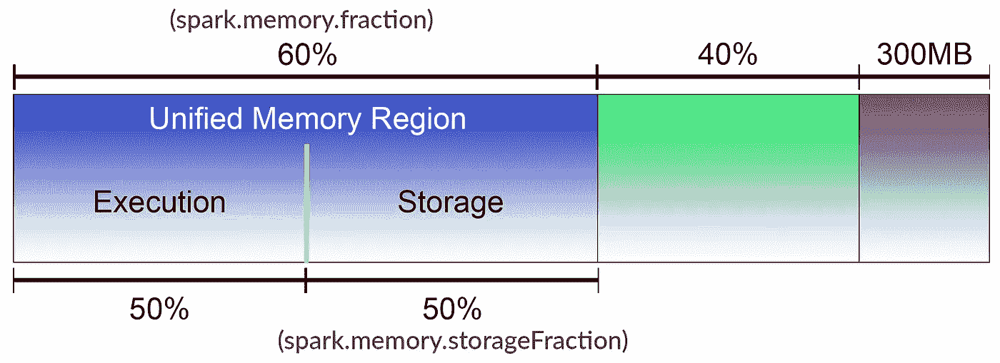
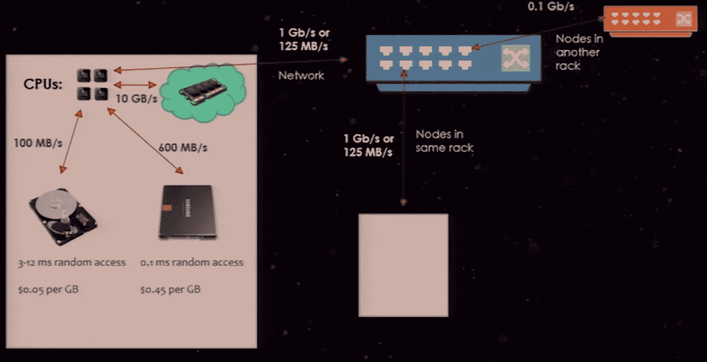

# 火花存储器管理

> 原文：<https://medium.com/analytics-vidhya/spark-memory-management-583a16c1253f?source=collection_archive---------2----------------------->

让我们试着理解内存是如何在 spark 执行器内部分配的。

火花执行器内存分解

在每个执行器中，Spark 为内存开销分配最少 384 MB，其余的分配给实际工作负载。

计算内存开销的公式— max(执行器内存* 0.1，384 MB)。

*   第一个场景，如果您的 executor 内存是 5 GB，那么内存开销= max( 5 (GB) * 1024 (MB) * 0.1，384 MB)，这将导致 max( 512 MB，384 MB)，最后是 512 MB。这将在每个执行器中为 spark 处理留下 4.5 GB 的空间。
*   第二种情况，如果您的 executor 内存是 1 GB，那么内存开销= max( 1(GB) * 1024 (MB) * 0.1，384 MB)，这将导致 max( 102 MB，384 MB)，最后是 384 MB。
    这将在每个执行器中为 spark 处理留下 640 MB。

**在堆内存上**

默认情况下，Spark 只使用内存堆。执行器中的堆上内存区域可以大致分为以下四个块:

*   存储内存:主要用于存储 Spark 缓存数据，如 RDD 缓存、展开数据等。
*   执行内存:主要用于存储 Shuffle、Join、Sort、Aggregation 等计算过程中的临时数据。
*   用户内存:主要用于存储 RDD 转换操作所需的数据，如 RDD 依赖关系的信息。
*   保留内存:内存是为系统保留的，用于存储 Spark 的内部对象

内存分配

要理解这一点，你必须考虑 Spark 的两个默认参数。

*   spark.memory.fraction —标识统一内存区域和用户内存之间共享的内存。
    在这种情况下，是 60%。比方说，如果我们有 1 GB 的 spark executor 内存，600MB 将分配给统一内存区域，400MB 分配给用户内存。
*   spark.memory.storageFraction —标识执行内存和存储内存之间共享的内存。Spark 提供的默认值是 50%。但是根据执行存储器上的负载，存储存储器将被减少以完成任务。

火花网络速度

Spark 大量利用内存的原因之一是因为 CPU 可以以 10 GB/s 的速度从内存中读取数据。而如果 Spark 从内存磁盘中读取数据，速度将降至约 100 MB/s，SSD 读取速度将在 600 MB/s 范围内。

如果 CPU 必须通过网络读取数据，速度将下降到大约 125 MB/s。

**常见问题清单**

*   足够的并发分区。如果你有 20 个内核，确保你至少有 20 个分区或者更多。
*   通过过滤您需要的数据来最小化内存消耗。
*   最小化混洗的数据量。洗牌很贵。
*   了解标准库，在正确的地方使用正确的函数。