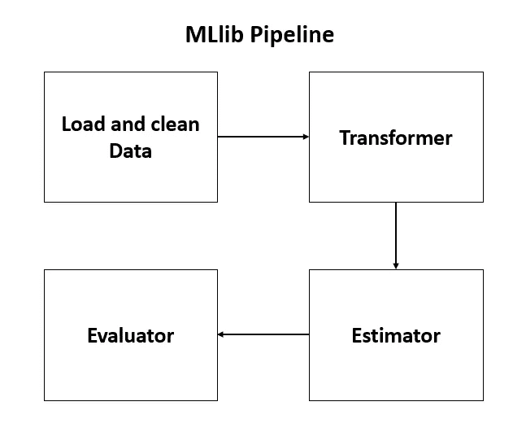

# 火花 MLlib，ML 管道

> 原文：<https://medium.com/analytics-vidhya/spark-mllib-6f70a7062e3b?source=collection_archive---------17----------------------->

MLlib 是 Apache Spark 的机器学习库。包括高质量的算法，比 MapReduce 快一百倍。

## MLlib 的高级目标

*   让实用的机器学习变得可扩展和简单。
*   简化可扩展机器学习管道的开发和部署。

## MLlib 中的不同组件

MLlib 包含许多算法和实用程序。

1.  算法—分类、回归、聚类

2.管道——构建、评估、调优、持久化(保存和加载模型和管道)

3.特征化—提取、转换

4.实用程序-线性代数、统计

## Spark MLlib 数据类型

支持存储在单机上的本地向量和矩阵，以及分布式矩阵。

*   局部向量-支持密集和稀疏两种类型的局部向量。

```
Dense format: [1.0,0.0,3.0]
Sparse format: (3,[0,2],[1.0,3.0])
```

*   标记点——标记点是与标记/响应相关联的密集或稀疏向量。例如:在二进制分类中，标签应该是 0(负)或 1(正)。
*   局部矩阵—局部矩阵具有整数类型的行和列索引，以及存储在单台计算机中的双精度类型值。
*   分布式矩阵-分布式矩阵具有长类型行和列索引以及双精度类型值。它以分布式方式存储在一个或多个 rdd 中。类型:RowMatrix，IndexedRowMatrix，CoordinatedMatrix

## Spark MLlib 基本统计

MLlib 通过 statistics 包中的函数 colStats()提供 RDD(矢量)的汇总统计数据。 **colStats() —** 返回列方向的最小值、最大值、平均值、方差、非零值的数量以及总计数。

```
from pyspark.mlllib.stat import Statisticssc = ...........# sparkContext
mat = ..........# an RDD of vectors # Computing column summary statisticssummary = Statistics.colStats(mat)
print(summary.mean())
print(summary.variance())
print(summary.numNonzeros())
```

MLlib 还可以使用统计信息包执行两个数据系列之间的关联。根据输入的类型，如果有两个 rdd[Double]或一个 RDD[vector]，则输出将是 Double 或相关矩阵。

```
from pyspark.mlllib.stat import Statisticssc = ...........# sparkContextseries1 = ......# series 1 
series2 = ......# must have same cardinality as series 1#Computes correlation using pearson;s method by default. print(Statistics.corr(series1, serie2, method= 'pearson'))data = .........# RDD of vectors
print(Statistics.corr(data, method= 'pearson'))
```

## ML 管道是如何工作的？



1.  变形金刚—

*   特征提取的预处理链。
*   将数据转换成可消费的格式。
*   获取输入列，将其转换为输出列。
*   很少的例子会是—标准化数据、符号化、将分类值转换为数值。

```
transform()
```

2.估计量

*   对数据进行训练(拟合)的学习算法。
*   返回一个模型，这是一种转换器。
*   几个例子是——字符串索引器，一个热门的编码器

```
fit()
```

3.求值程序

*   根据特定指标评估模型性能— ROC，RMSE
*   有助于模型调整过程的自动化。比较模型性能并选择生成预测的最佳模型。
*   示例:BinaryClassificationEvaluator、CrossValidator 等。

[](https://github.com/radhikagupta6/Spark_ml_Pipelines/blob/main/Classification_problem_with_ML_pipelines.ipynb) [## radhikagupta 6/Spark _ ml _ Pipelines

### Permalink GitHub 是 5000 多万开发人员的家园，他们一起工作来托管和审查代码、管理项目以及…

github.com](https://github.com/radhikagupta6/Spark_ml_Pipelines/blob/main/Classification_problem_with_ML_pipelines.ipynb)