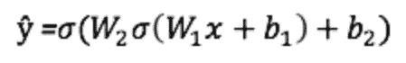
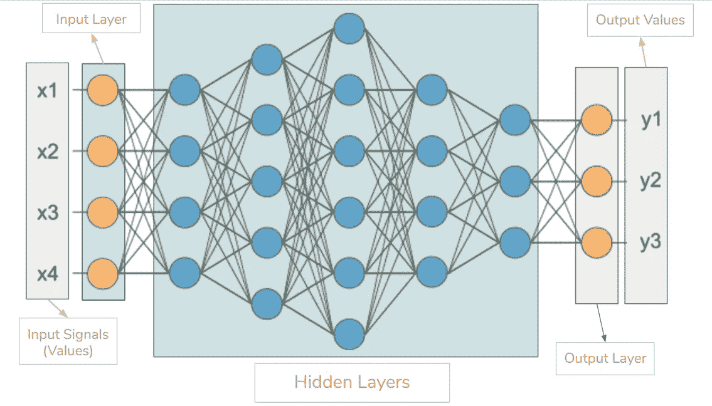
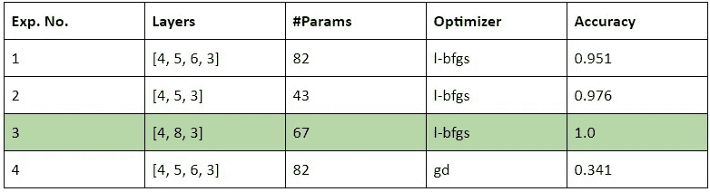

# 亲身体验 Spark MLlib 的多层感知器分类器(MLPC)

> 原文：<https://medium.com/analytics-vidhya/spark-mllibs-multilayer-perceptron-classifier-mlpc-hands-on-32ac4014eee9?source=collection_archive---------3----------------------->

在我的[上一篇文章](/data-science-simplified/simplified-guide-to-hidden-layer-neural-networks-by-dl-practitioner-with-python-code-4e498504716b)中，我已经介绍并讨论了隐层神经网络(HNN)的架构。MLlib 基于相同的架构实现其多层感知器分类器(MLPC)。有多层节点，每层都是完全连接的。具有权重和偏差的节点的线性组合被输入到激活函数中，并且可以表示如下:

前馈公式([来源](https://towardsdatascience.com/how-to-build-your-own-neural-network-from-scratch-in-python-68998a08e4f6)

> 隐藏层使用 **sigmoid** *激活函数*，而输出层使用 **softmax** *激活函数*来计算输出。逻辑损失函数用于在反向支持学习期间优化权重和偏差。提供的输入数量等于特征向量，输出数量等于标签总数。

# MLlib 类定义和参数:

***多层感知器分类器*对于任何机器学习算法，都有几个称为“超参数”的参数，微调它们有助于提高模型的准确性。对于多层感知器分类器，以下参数用于超参数的目的:**

*   **tol:** 收敛容差描述了那些开始向产生正确结果的输出收敛的权重集。默认值为 *1e-06。*较小的值产生更精确的结果，而较大的值可能导致过度拟合。
*   **seed:** 这是一个随机种子值，将使用它来生成随机数。提供该值可确保生成真正的随机数。该参数确保每次测试算法时产生相同的随机值。
*   **层:**该参数接受代表输入、隐藏和输出层的整数列表。格式如下[780，200，100，10] 780 表示输入值的个数，200 和 100 表示隐藏层，10 表示输出层。更多的隐藏层将使神经网络更复杂，但不能确保更高的精度。
*   **blockSize:** 它是每次迭代中要包含的输入的数量。例如，blockSize = 100 意味着在算法的一次迭代中要包括 100 个输入。默认值为 128。较小的块大小以延长学习时间为代价提高了精度，反之亦然。
*   **步长:**这是算法的学习速率，通常在 0.0 到 1.0 之间。基本上就是模型学习的快慢。默认值为 0.03。较小的值可以提高精度，而较大的值会导致过度拟合。
*   **解算器:**该参数指定应使用哪个优化程序来寻找局部最小值，如梯度下降。默认值为 l-bfgs。

# 代码示例:

在这一节中，我们将看到[一个使用样本数据制作多层感知器分类器的例子](https://github.com/ahmed141/my-code-rep/blob/master/Python/Machine%20Learning/pySpark/MLlib-mlpc-medium.ipynb)。

首先，我们需要导入以下模块来启动 spark 会话，构建和训练模型，并最终评估模型。

初始化一个 spark 会话，并加载 *libsvm* 格式的样本数据。然后将数据分成 7:3 比例的训练集和测试集。

样本数据集有四个输入要素和三个输出类。在我们的实验中，我们将通过改变不同的超参数来构建如图所示的 DNN，并分析它们的效果。

**图:**示例中使用的示例架构，具有四个输入特性和三个输出类([源](https://hackernoon.com/everything-you-need-to-know-about-neural-networks-8988c3ee4491))

下面的代码片段是 pyspark 中这样一个模型的实现，有两个隐藏层，分别是 5 个和 6 个神经元。

最后，返回一个经过训练的 MLPC 模型，准备对测试数据进行评估。使用*多类分类评估器*对模型进行测试，以*准确度*作为评估标准*。*

## 实验:

通过改变层数和求解器(优化)方法进行了三个实验。这些实验的结果在下表中给出。

表:MLPC 超参数调整实验的结果，绿色突出显示为性能最佳的配置。

从上表中我们可以观察到，性能最好的模型是具有 l-bfgs 优化器且只有一个隐藏层的模型，添加另一个隐藏层会使评估结果更差。这是因为对于这个特定的数据，模型开始过度拟合训练数据，从而在测试集上表现不佳。因此，从这些实验中可以得出一个重要的结论:增加更多的隐藏层并不总是有帮助的。

# 为什么要用 PySpark 的 MLlib？

尽管有其他可用的框架可用于在实际意义上实现机器学习。MLlib 提供了一些附加的功能，这些功能在大多数浏览器中是没有的。

MLlib 的一些主要功能如下:

*   它支持许多著名的 ML 算法:支持的常见学习算法包括分类、回归、聚类和协同过滤。
*   **高效轻松的特征化**:特征提取、变换、降维、选择。
*   **管道支持:**这些是用于构建、评估和调优 ML 管道的工具。
*   **持久化:**保存和加载算法、模型和管道。
*   支持常用的工具:线性代数、统计、数据处理等。
*   **可伸缩性(轻松处理大量数据):**PySpark 的分布式特性，支持在集群和**分布式**方式中处理大量数据，快速高效。

# 为什么要用 MLlib 的 MLPC:

有了 MLlib 中绝大多数可供使用的机器学习算法，人们可能会问哪一个更好。每种模型都有其优点和缺点，使用特定的模型在很大程度上取决于手头的问题。以下是使用 MLlib 的 MLPC 的一些优点:

使用 MLPC 最普遍的特点是它可以自己找到特征之间的关系。另一个优点是，它可以有任意数量的输出，可以一次训练一个 n 数组分类器，而支持向量机只有一个。MLPC 也是固定大小的，因为它们是参数化的，而支持向量机是非参数化的。有了足够大和多样化的数据集，MLPC 可以比 SVM 和决策树更准确。此外，它可以处理在线数据，即如果新数据不断到来，MLPC 可以更新，而决策树将需要重新训练。