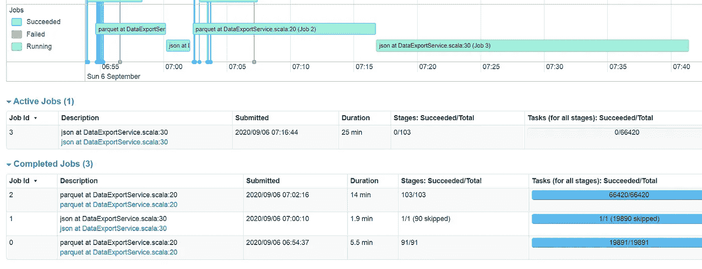
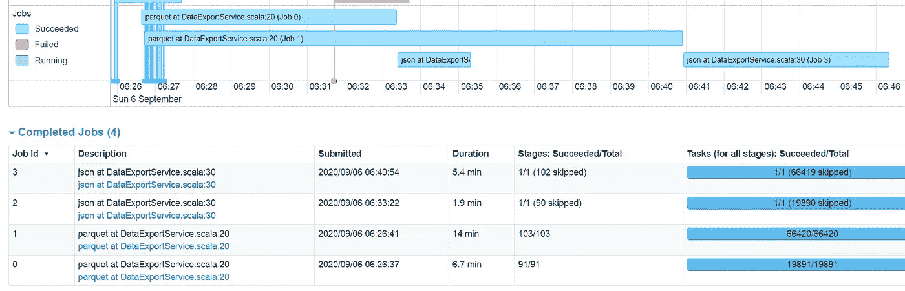

# Spark 并行作业执行

> 原文：<https://medium.com/analytics-vidhya/spark-parallel-job-submission-38b41220397b?source=collection_archive---------0----------------------->


Spark 以分解大任务和并行运行单个任务而闻名。但是，这并不意味着它可以并行运行两个独立的作业。本文将帮助您最大限度地提高 Spark 的并行性。

## 异步编程

这是一种并行编程，允许一个工作单元独立于主应用程序线程运行。当工作完成时，它通知主线程工作线程的完成或失败。在 Scala 中，你可以使用 *Future* 来实现这一点。

## Scala 期货

期货是 Scala 中执行异步编程的一种方式。一个 *Future* 为您提供了一种在 spark 应用程序中并发运行作业的简单方法。

让我们看看我们编写 Spark 代码的通常方式，然后看看*未来*能如何帮助我们。

```
*val* employee = spark.read.parquet("s3://****/employee")
*val* salary = spark.read.parquet("s3://****/salary")
*val* ratings = spark.read.parquet("s3://****/ratings")

*println*("Joining employee with salary")
employee.join(salary, Seq("employee_id"))
  .exportToS3AndJSON("s3://****/employee_salary")

*println*("Joining employee with ratings")
employee.join(ratings, Seq("employee_id"))
  .exportToS3AndJSON("s3://****/employee_ratings")
```

在上面的代码中，我们读取了 3 个数据集——员工、工资和评级。

*   在第一个语句中，我们基于 Employee_ID 连接 Employee 和 Salary 表，并将结果保存为 parquet 和 JSON 格式。
*   在第二个语句中，我们基于 Employee_ID 连接 Employee 和 Ratings 表，并再次以 parquet 和 JSON 格式保存结果。

第一个和第二个语句没有任何关系，但是 Spark 会按顺序运行它。如果你看一下 Spark UI 的图片，你会对此有一个更好的了解。



Spark UI

作业 ID 0 —首先启动并运行 5.5 分钟，第一个作业完成后，将开始第二个作业，依此类推。你也可以通过查看事件时间表来推断出同样的结论。所有作业都不会重叠，每个作业都是在前一个作业完成后拾取的。

如果作业 0 利用了 50%的群集，则剩余的 50%将未被利用。

让我们了解如何通过使用 scala futures 来提高利用率。下面是同样的代码，但是加入了未来的。

```
*import* java.util.concurrent.Executors
*import* scala.concurrent.duration.Duration
*import* scala.concurrent.{Await, ExecutionContext, Future}*//Allowing a maximum of 2 threads to run
val* executorService = Executors.*newFixedThreadPool*(2)
*implicit val* executionContext = ExecutionContext.*fromExecutorService*(executorService)*val* employee = spark.read.parquet("s3://****/employee")
*val* salary = spark.read.parquet("s3://****/salary")
*val* ratings = spark.read.parquet("s3://****/ratings")*val futureA = Future {
   println*("Joining employee with salary")
   employee.join(salary, Seq("employee_id"))
     .exportToS3AndJSON("s3://****/employee_salary")
   *println*("Future A Complete")
   }val futureB = Future {
   *println*("Joining employee with ratings")
   employee.join(ratings, Seq("employee_id"))
     .exportToS3AndJSON("s3://****/employee_ratings")
   *println*("Future B Complete")
   }Await.result(futureA, Duration.inf)
Await.result(futureB, Duration.inf)
```

这些变化包括

*   导入 ExecutionContext 以访问线程池。
*   定义要运行的线程数量。
*   将转换包含在未来的构造中。
*   Await.result 方法调用声明它将等待未来执行。

让我们通过查看 Spark UI 来了解一下这项工作现在是如何执行的。



在这里，您可以看到作业 0 和 1 几乎同时开始。您还可以从事件时间线中看到，这两个作业正在并行运行。

如果你喜欢这篇文章，请点击👏所以其他人会在媒体上看到它。