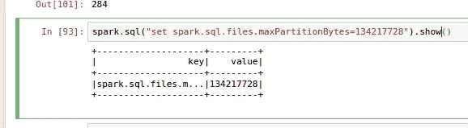
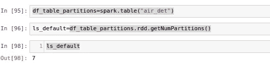

# 火花并行性深潜-I(阅读)

> 原文：<https://medium.com/analytics-vidhya/spark-parallelism-deep-dive-i-reading-8d63e22f3bce?source=collection_archive---------5----------------------->

Jez Timms 在 [Unsplash](https://unsplash.com?utm_source=medium&utm_medium=referral) 上拍摄的照片

这是我在火花深潜系列中的一个故事。

【https://medium.com/@somanathsankaran 

Spark 是一个分布式并行处理框架，它的并行性是由分区定义的。让我们详细讨论一下 spark 的分区。

spark 中有 3 种类型的并行。

1.  阅读中的平行
2.  洗牌中的平行
3.  写作中的平行

这个博客是关于在阅读时数据是如何分区的

**并行读取:**

spark 中的并行性取决于正在读取的源。

1.  平面文件格式
2.  蜂巢餐桌

**平面文件格式**:

对于 read csv、json 等平面文件格式，分区数量基于以下属性。

**spark . SQL . files . maxpartitionbytes = 134217728(默认值)**

例如，如果我们读取一个简单的 csv 文件，我们将得到 1 个分区，如下所示

现在我已经更改了下面的属性，现在我们再次读取同一个文件，我们将得到分区的数量

**配置单元表:**

在配置单元表的情况下，分区的数量取决于相同的属性，为了演示相同的情况，我将读取一个配置单元表，其默认值为 **134217728 字节**

默认分区数量

更改后的分区数量

**结论:**

因此得出结论，spark 默认分区不再基于 hadoop 配置，从 spark 2.2 开始，上述属性将决定读取时的分区数量。因此，利用这个属性来提高读取性能

下一篇博客将是关于洗牌时的分区

今天就到这里吧！！:)

Github 链接:[https://github . com/SomanathSankaran/spark _ medium/tree/master/spark _ CSV](https://github.com/SomanathSankaran/spark_medium/tree/master/spark_csv)

***请给我发 spark 中我必须涉及的话题，并给我改进写作的建议:)***

**学习，也让别人学习！！**