# 火花并行深入探讨-第二部分

> 原文：<https://medium.com/analytics-vidhya/spark-parallelism-deep-dive-part-ii-95a06e2443c4?source=collection_archive---------11----------------------->

这是我在《火花深潜》中的一个故事

[https://medium.com/@somanathsankaran](/@somanathsankaran)

Spark 是一个分布式并行处理框架，它的并行性是由分区定义的。让我们详细讨论一下 spark 的分区。

spark 中有 3 种类型的并行。

1.  阅读中的平行
2.  洗牌中的平行
3.  写作中的平行

阅读中的并行性在之前的博客中已经讨论过了

 [## 火花并行性深潜-I(阅读)

### 这是我在火花深潜系列中的一个故事。

medium.com](/analytics-vidhya/spark-parallelism-deep-dive-i-reading-8d63e22f3bce) 

混洗中并行将发生在 3 个过程中

1.  分组依据
2.  加入
3.  窗口函数

在洗牌时看到分区之前，我们将在阅读时看到分区

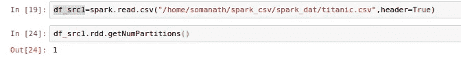

**分组通过**

让我们取一个样本 df 并按 Id 分组。

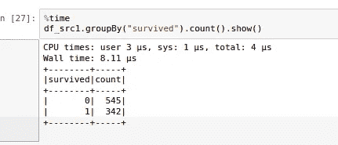

在 spark sql 选项卡下看到 UI 时

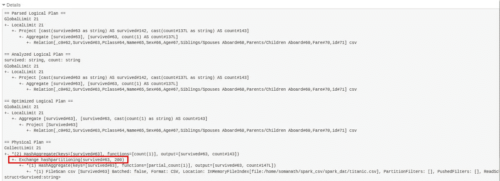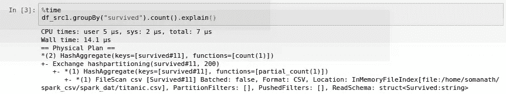

在看到图像时，我们可以看到交换正在发生，因为我们需要一些分组，它被分配了 200 个分区

为什么会这样呢？尽管数据可以加载到单个分区中。这是因为以下属性

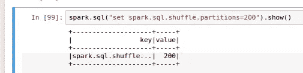

因此，让我们将值设置为 1，因为数据很小，我们不需要任何洗牌

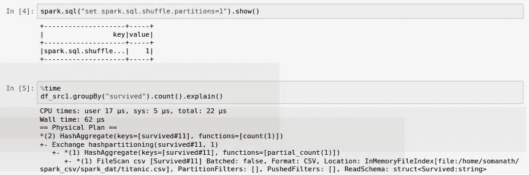

现在我们可以看到一个交换，分区数量为 1

现在有另一个属性将控制洗牌分区

**用列**重新划分 api

如果我们基于相同的字段(如唯一 id 或日期)重复进行分组和连接，这将非常有用。

因此，让我们按 id 重新划分，看看情况如何

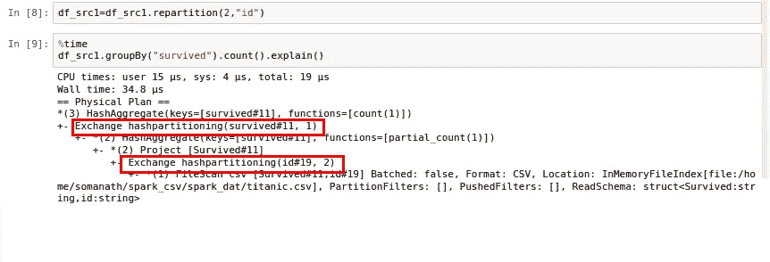

因此，如果我们看到上面，我们可以看到 2 个交换

1.  这是由于按 id 重新分区
2.  这是由于 spark.sql.shuffle.partitions 设置为 1 而导致的洗牌

那么按 id 重新分区有什么用呢？如果我们基于某个被反复使用的特定列进行分组，这是为了避免混乱。因此，如果我们按 id 分组并进行计数，让我们看看会发生什么

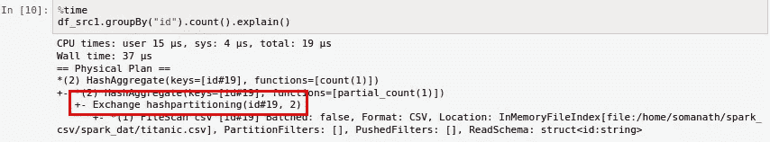

因此，如上所示，我们将只有一个洗牌或交换发生

**加入**

现在，让我们使用上面的 df_src1，它按 id 重新分区为 2 个分区，新的 df_src2 是第二个 csv 文件，让我们看看发生了多少次洗牌

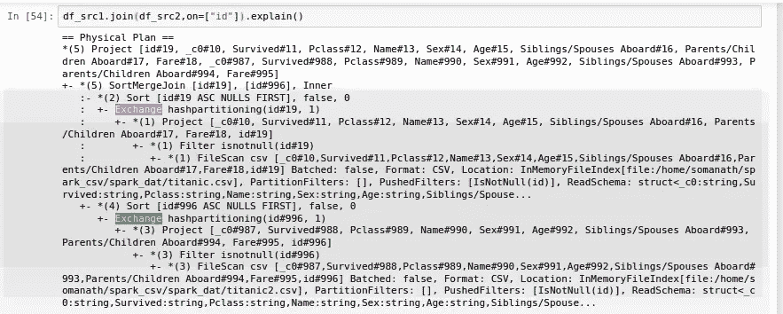

正如我们在这里看到的，我们有 1 个交换，随机分区的数量是 2，这是(df_src1.rdd.getNumpartitions 和 spark.sql.shuffle.partitions (1)的最小值，因为 df_src2 没有重新分区)

因此，总结来说，如果您要使用基于同一列的重复连接，您可以基于某个列进行重新分区，这样就不会有任何交换，如果有不同的 df，并且由同一列一次又一次地连接，只要您按照某个唯一的字段统一进行重新分区

**窗口功能**

情况 1 通过重新分区的列进行分区

我们将只有一个洗牌，如下所示

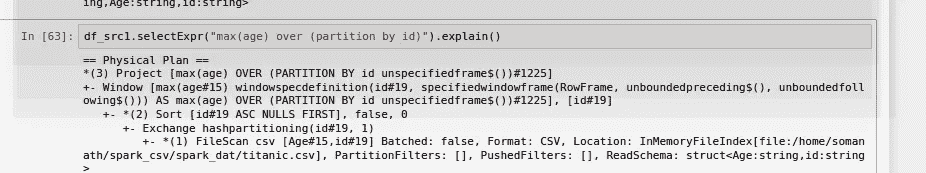

案例 2 基于未重新分区的列

这里，我们在 queryplan 1 中有两个交换，一个用于重新分配值，另一个用于洗牌交换

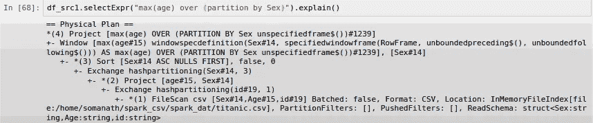

**结论:**

***因此，总结来说，如果你期望在一个唯一的键上有很多分组，最好使用列重组*** 来控制洗牌

**或者，如果我们要处理各种字段的大量聚合，我们可以控制它**

今天就到这里吧！！:)

Github 链接:[https://github . com/SomanathSankaran/spark _ medium/tree/master/spark _ CSV](https://github.com/SomanathSankaran/spark_medium/tree/master/spark_csv)

***请给我发 spark 中我必须涉及的话题，并给我改进写作的建议:)***

**学习并让别人学习！！**