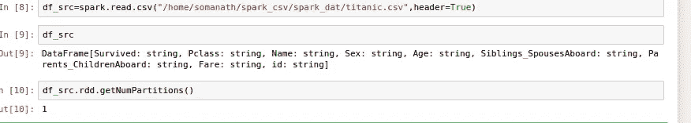
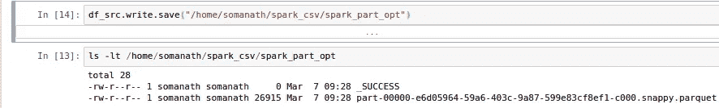
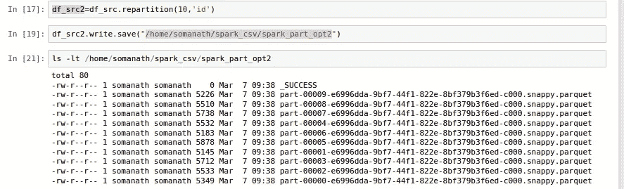
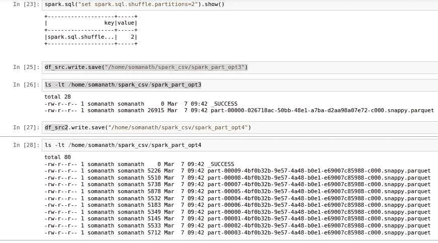
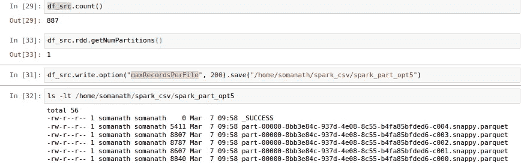

# 火花并行深潜写作

> 原文：<https://medium.com/analytics-vidhya/spark-parallelism-deep-dive-writing-ea9b9394831?source=collection_archive---------4----------------------->

这是我在《火花深潜》中的一个故事

[https://medium.com/@somanathsankaran](/@somanathsankaran)

Spark 是一个分布式并行处理框架，它的并行性是由分区定义的。让我们详细讨论一下 spark 的分区。

spark 中有 3 种类型的并行。

1.  阅读中的平行
2.  洗牌中的平行
3.  写作中的平行

在以前的博客中已经讨论了读写的并行性

 [## 火花并行性深潜-I(阅读)

### 这是我在火花深潜系列中的一个故事。

medium.com](/analytics-vidhya/spark-parallelism-deep-dive-i-reading-8d63e22f3bce)  [## 火花并行深入探讨-第二部分

### 这是我在《火花深潜》中的一个故事

medium.com](/@somanathsankaran/spark-parallelism-deep-dive-part-ii-95a06e2443c4) 

写作中的平行分为两部分

1.  写入时控制文件
2.  写入时控制文件大小

**一边写一边控制文件**

让我们读取一个示例数据帧，看看它有多少个分区

现在让我们用拼花格式写 df

在研究书面目录时，我们可以发现部分文件的数量等于输入分区的数量

让我们打乱数据，看看数据是如何分布的

因此 spark 会根据 rdd 的分区数量将数据写入多个部件文件

让我们检查 spark.shuffle 分区是否对写入有影响

我将 shuffle.partition 更改为较小的值，以检查是否发生了任何更改

所以从上面的图像来看，在书写的时候没有洗牌分区的效果

因为写入的数据依赖于 rdd 分区

**写入时控制文件大小**

因此，一旦我们写入数据，单个分区下的所有数据都将写入单个文件，该文件的大小可能不均匀。

因此，让我们尝试控制单个分区下的最大文件大小，以便我们可以有更均匀分布的大小(128 mb)

我们有一个属性，利用它我们可以控制每个 rdd 分区下每个文件的记录数

**所以我们可以利用 maxRecordsPerFile 来控制每个文件写入的记录数量**

因为我们有 887 条记录，所以我们将每个文件的记录分为 200 条

如下所示

从上图中我们可以看到，即使只有一个分区，我们也有 5 个文件，我们可以根据您的数据使用 max records 来获得大小为 128 mb 的文件

**结论:**

***因此得出结论，spark 写入部分文件由 rdd.partitions 控制，我们可以利用每个文件的最大记录数将数据保存为统一大小的文件***

今天就到这里吧！！:)

Github 链接:[https://github . com/SomanathSankaran/spark _ medium/tree/master/spark _ CSV](https://github.com/SomanathSankaran/spark_medium/tree/master/spark_csv)

****学习并让别人学习！！****