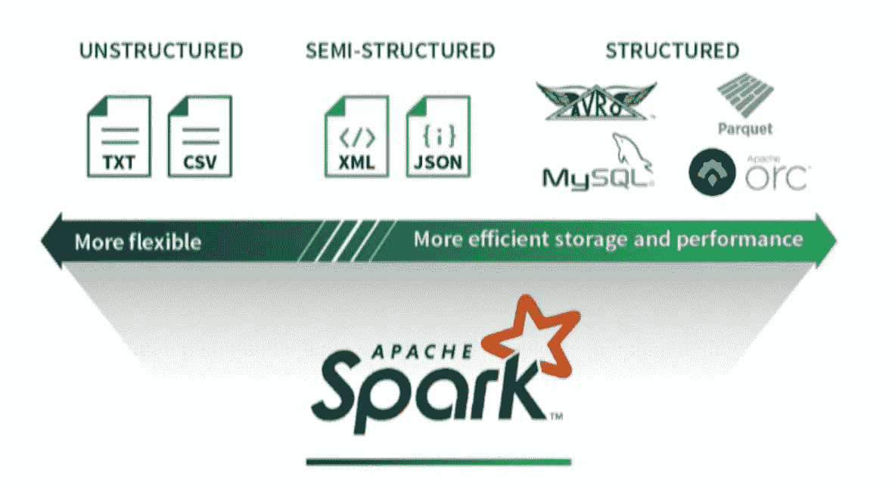
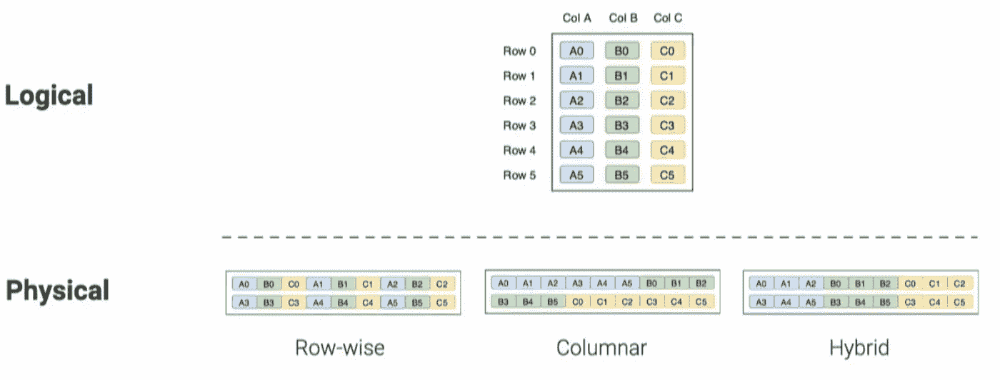
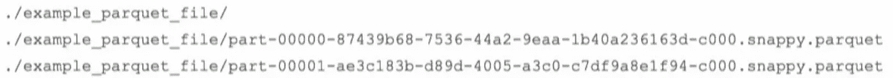
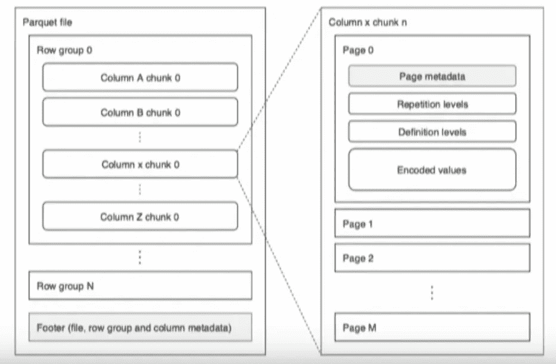
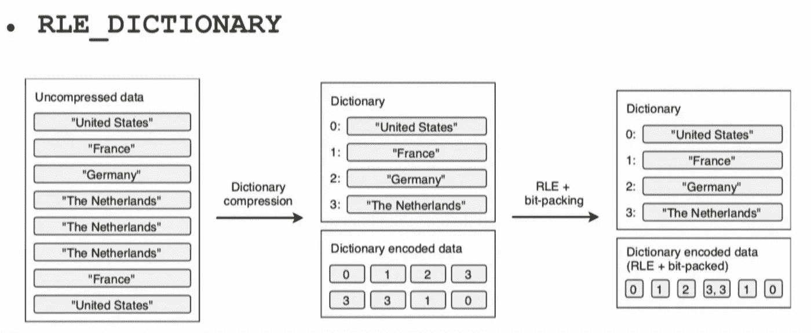
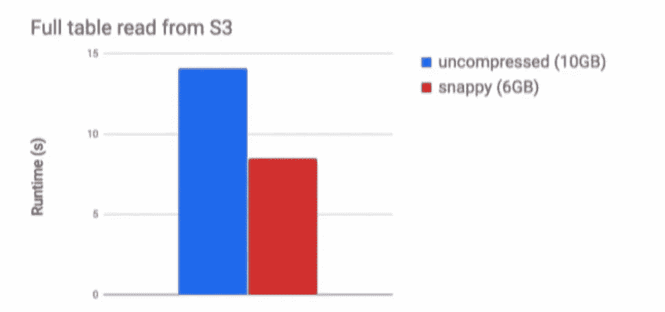
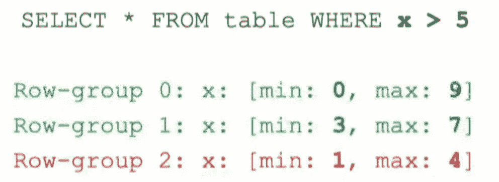
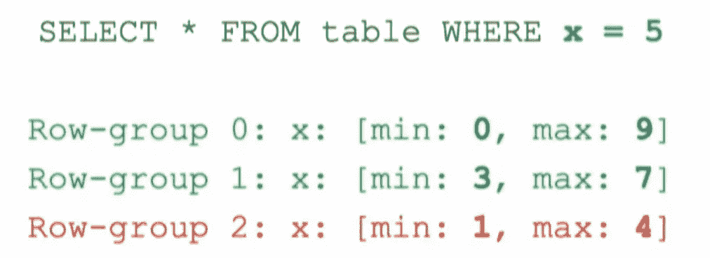
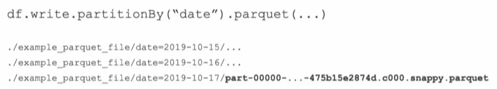

# 火花拼花锉

> 原文：<https://medium.com/analytics-vidhya/spark-parquet-file-cac4af92981d?source=collection_archive---------2----------------------->

在本文中，我们将讨论 Spark 中最广泛使用的文件格式。

首先，让我们了解 Spark 中可用的数据存储模型以及 Parquet 在其中的地位。

数据源和格式

我们有 3 种可以在 Spark 中处理的数据格式。

*   *非结构化*格式给了你很大的灵活性，但是它有很高的解析开销。
*   *半结构化*格式不需要有定义明确的模式，但需要有记录的清晰概念。
*   结构化格式的解析开销最小，存储效率最高。我们有行和列的概念以及定义良好的模式。

# 物理存储布局模型

**按行存储(水平分区)**

按行存储类似于数据的逻辑表示，速度快，适合所有 OLTP 事务。当您需要插入整个记录或根据键更新记录时，这种存储模型更好。在这两种情况下，您都需要将记录的所有细节紧密耦合在一起，而行存储模型可以做到这一点。
该模型基于整行工作。因此，如果您只想从整个数据集中读取有限的列，这个结构会执行大量的 I/O 操作，遍历您不需要的列值。

**列级存储(垂直分区)**

列级存储是背靠背存储单个列的所有值的地方，最适合 OLAP 应用程序。在 OLAP 应用程序中，我们只对列的子集感兴趣，比如说，如果您只对列 A 感兴趣，那么您可以用较少的 I/O 操作来读取它，因为您将该列中的所有值耦合在一起。当我们执行更新/插入操作时，这个模型会使我们失败，因为它想要识别每条记录在列存储中的位置，为此，它必须遍历每列中的所有值。

**混合动力车型**

混合模型同时应用行级和列级存储。在这种情况下，每 3 行应用一次水平分区，在这 3 行中，它进行垂直分区。
这种模型适合快速读取数据，而且如果您想进行更新或插入，它可以很容易地识别记录的位置。

> 混合模式由*拼花*和 *ORC 使用。*

# 镶木地板

Parquet 遵循混合模型，是 Spark/Hadoop 生态系统中使用最多的格式之一。它是由 Twitter 和 Cloudera 联合开发的。

**拼花:数据组织**

*   它通常不是单个文件。
*   水平分区(行组)的大小为 **128 MB** (默认)。比方说，如果您有一个 1GB 大小的文件，它将被分成 10 个分区。

行组

*   在行组中，我们有垂直分区(列块)

*   在列块中，我们将实际数据存储在我们称之为数据页的地方。
*   每个数据页都包含元数据详细信息，如最小值、最大值、该页中的值数和编码值。
*   在行组级别也有元数据，它们与行组一起存储在页脚中。

**拼花地板:编码方案**

*   普通
    这是最简单的编码。值是背靠背编码的。每当不能使用更有效的编码时，就使用普通编码。
*   RLE _ 字典(游程长度编码)
    这种编码方案主要使用字典压缩来存储数据，当我们有重复或重复的值时，它会节省大量内存。字典编码构建在给定列中遇到的值的字典。如果字典变得太大，无论是大小还是不同值的数量，编码都将退回到普通编码。首先写入字典页，然后写入列块的数据页。

在上面的例子中，我们有 8 个不同国家名称的记录。RLE _ 字典方案将每个国家的名称映射到字典中的一个键(字典压缩)。游程编码识别出密钥 3 连续重复三次。因此，它被组合在一起，我们有 3，3(即，密钥)和重复的次数。RLE 不是显式存储重复值，而是存储重复值及其重复次数。

> 每个列块一个字典，并且有大小限制。

让我们看看 Parquet 提供了哪些优化。

**优化:字典编码**

*   由于编码，我们有更小的文件，这有助于 I/O 操作。Parquet 还为您提供了增加字典大小的灵活性。
*   另一种选择是减小行组的大小，这样它将有更少的记录，这间接导致每个列组中唯一值的数量减少。

**优化:页面压缩**

*   Parquet 还允许您压缩数据页面。(爽快，gzip，lzo)
*   可以使用 spark 命令设置压缩编解码器。

> spark . SQL . parquet . compression . codec

*   要记住的一个关键点是，当您压缩数据时，在您的过程中读取数据时，它必须是未压缩的。

解压缩速度与 I/O 节省的权衡

**优化:谓词下推**

谓词下推—第一种情况

当 Spark 运行这个查询时，它首先读取存储元数据的拼花地板的页脚。Spark 利用这些元数据来实现行组跳过。在本例中，我们有 3 个行组，从元数据来看，Spark 知道它不必将行组 2 放入内存。
利用行组中最小/最大统计数据的 Spark 配置—*Spark . SQL . parquet . filter pushdown .*这是默认启用的。

谓词下推—第二种情况

在这种情况下，我们寻找等于 5 的值。Spark 基于元数据跳过 row-group2。但是它还有 2 个行组要遍历。Spark 现在查看列块的字典。让我们考虑一下行组 0，它有全 0 和一个 9。这个栏目块的字典里不会有 5。因此，Spark 将跳过这个行组。
启用字典过滤的 parquet 配置—*parquet . filter . dictionary . enabled*

**优化:分区**

分割

分区是 Spark 提供的一个特性。如果我们知道过滤器经常出现的领域，这是非常有用的。在上面的例子中，数据按日期字段进行分区，parquet 为日期字段中的每个惟一值创建子目录。

**提示**

避免将数据分成太多的小文件或大块存储。试着在你的文件大小之间找到一个平衡点。

附:这是一份来自 Databricks 的 Spark 峰会视频的抄本。

如果你喜欢这篇文章，请点击👏所以其他人会在媒体上看到它。