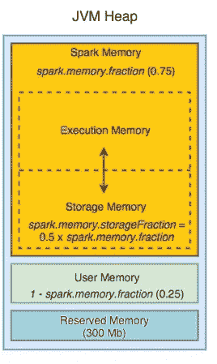
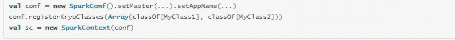
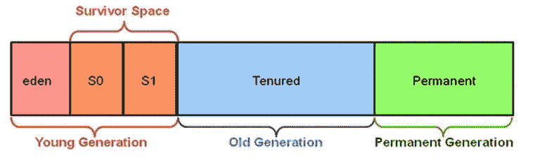
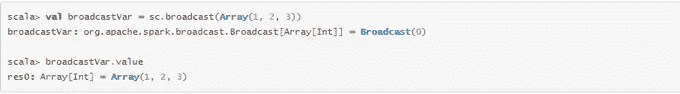

# 火花性能调谐

> 原文：<https://medium.com/analytics-vidhya/spark-performance-tuning-77c911117d9?source=collection_archive---------11----------------------->

Apache Spark 是一个统一的分析引擎，已经被各行各业的企业迅速采用。

在内存中处理数据的能力比使用 MapReduce 处理数据快 10 倍。但是，如果 spark 作业没有得到适当的调整，可能会导致作业失败。

在我们进入 spark 调优之前，让我们回顾一下它的架构。

火花建筑

Spark 有一个驱动程序和许多 worker 节点，这些节点有执行程序来运行任务。输入数据被分成多个分区，每个分区充当一个由执行器执行的任务。

由于大多数 Spark 计算的内存性质，Spark 程序可能会受到集群中任何资源的限制:CPU、网络带宽或内存。

优化火花作业有多种技术:

*   内存调整/垃圾收集调整
*   数据序列化
*   集群配置
*   并行度
*   广播
*   静态数据
*   数据局部性

# 记忆问题

在优化内存问题时，有三个考虑因素:

*   对象使用的内存量
*   访问这些对象的成本
*   垃圾收集的开销

默认情况下，java 对象访问速度很快，但是它们很容易比原始数据多消耗 2-5 倍的空间。

每个不同的 Java 对象都有一个“对象头”，大约 16 个字节，包含诸如指向其类的指针之类的信息。对于一个只有很少数据的对象(比如一个 Int 字段)，这可能比数据大。

Java 字符串在原始字符串数据上有大约 40 字节的开销(因为它们将字符串数据存储在一个字符数组中并保存额外的数据，如长度)，并且由于 string 内部使用 UTF-16 编码，每个字符存储为两个字节。因此，一个 10 个字符的字符串可以轻松地消耗 60 个字节。

常见的集合类(如 HashMap 和 LinkedList)使用链接数据结构，其中每个条目都有一个“包装器”对象(如 Map。条目)。这个对象不仅有一个头，还有指向列表中下一个对象的指针(通常每个指针有 8 个字节)。

## 内存管理概述

*   Spark 中的内存使用主要分为两类:**执行和存储。**用于计算的执行内存，如洗牌、连接、聚合、排序。存储内存用于缓存。
*   在 Spark 中，执行共享一个统一的区域(M)。当不使用执行内存时，存储可以获取所有可用内存，反之亦然
*   执行内存可以驱逐存储内存
*   在(M)内存中有一个子区域(R ),其中执行内存不能驱逐存储内存
*   存储内存无法收回执行内存
*   ***spark . memory . fraction****将大小(M)表示为 JVM 堆的分数(默认为 0.6)*
*   ****spark . memory . storage fraction****将大小(R)表示为 M 的一部分(默认值为 0.5)是 M 内的存储空间，其中缓存的块不会被执行驱逐**

****

**火花存储器管理**

*   **如果在你的项目中使用的缓存很少，考虑减少**spark . memory . storage fraction**的值**

# **调整数据结构**

**减少内存消耗的方法是避免增加开销的 Java 特性，比如基于指针的数据结构和包装对象。**

*   **设计您的数据结构，以优先选择原始时间，而不是像 HashMap 这样的集合类**
*   **考虑对键使用数字 id 而不是字符串**
*   **如果你的 RAM 少于 32GB，设置 JVM 标志*–xx:+UseCompressedOops*使指针为四字节而不是八字节。你可以在 *spark-env.sh* 中添加这些选项**
*   **当对象仍然太大时，减少内存存储的一个更简单的方法是以**序列化形式**存储它们，比如 MEMORY_ONLY_SER**
*   **以序列化形式存储对象的唯一缺点是访问时间较慢，因为要反序列化每个对象**

# **数据序列化**

**序列化在任何分布式应用程序的性能中扮演着重要的角色。将对象序列化的速度较慢或消耗大量字节的格式将大大降低计算速度**

**Spark 提供了两个序列化库:**

*   ****Java 序列化**:默认情况下，Spark 使用 Java 的 ObjetOutputStream 框架序列化对象，可以与您创建的实现 [java.io.Serializable](http://docs.oracle.com/javase/6/docs/api/java/io/Serializable.html) 的任何类一起工作。您还可以通过扩展 [java.io.Externalizable](http://docs.oracle.com/javase/6/docs/api/java/io/Externalizable.html) 来更紧密地控制序列化的性能。Java 序列化很灵活，但通常很慢，并且会导致许多类的大型序列化格式**
*   ****Kryo 序列化:** Spark 还可以使用 Kryo 库(版本 2)更快地序列化对象。Kryo 比 Java 序列化要快得多，也紧凑得多(通常是 Java 序列化的 10 倍)，但是它并不支持所有的可序列化类型，并且需要你提前*注册*你将在程序中使用的类以获得最佳性能。**
*   **您可以通过使用 Spark Conf 初始化作业并调用 *conf.set("spark.serializer "，" org . Apache . Spark . serializer . kryoserializer ")*来切换到 Kryo**
*   **它配置序列化程序，该序列化程序不仅用于在工作节点之间传送数据，还用于将 rdd 序列化到磁盘**
*   **用 Kryo 注册你自己的类，使用 *registerKryoClasses* 方法**

****

# **垃圾收集调整**

****

**碎片帐集**

*   **如果在任务完成之前多次调用全垃圾收集，这意味着没有足够的内存来执行任务**
*   **如果有两个次要 GC 和两个次要 GC，分配更多的 Eden 内存会有所帮助。如果 Eden 内存的大小是 E，那么我们可以将年轻一代的大小设置为–Xmn =(4/3 * E)**
*   **如果 OldGen 快满了，通过降低 *spark.memory.fraction.* 来减少用于缓存的内存量。此外，考虑减小年轻一代的大小**
*   **如果我们的任务是从 HDFS 读取数据，任务使用的内存量可以通过 HDFS 块的大小来估计。通常，解压缩块的大小通常是块大小的 2 到 3 倍。因此，对于 3 或 4 个任务的工作空间，以及 128MB 的 HDFS 块大小，我们可以估计 Eden 空间为(3*4*128 MB)**

# **并行度**

*   **除非我们将分区设置得足够高，否则集群不会得到充分利用**
*   **我们可以将分区号作为第二个参数传递，或者在配置属性*spark . default . parallelism*中设置**
*   **建议在我们的集群中，每个 CPU 使用 2–3 个任务**

# **集群配置**

****调度:**我们可以将 *spark.scheduler.mode* 设置为 *FAIR* 以允许多个用户更好地共享资源。设置*–max-executer-core*，指定我们的应用需要的最大执行器内核数。这确保了我们的应用程序不会占用集群中的所有资源**

****Dynamin Allocation:**Spark 提供了一种机制，可以根据工作负载动态调整应用程序占用的资源。这意味着我们的应用程序可以将不再使用的资源交还给集群，并在以后需要时再次请求它们。当有多个应用程序共享集群时，这很有用。**

# **广播大变量**

*   **广播变量允许程序员在每台机器上缓存一个只读变量，而不是随任务一起发送一个副本**
*   **为了有效地向每个节点提供大量的输入数据集**

****

# **静态数据**

*   **确保我们存储的数据能够有效读取是绝对必要的**
*   **这涉及到选择我们的存储系统，选择数据格式**

## **基于文件的长期数据存储**

*   **有不同类型的文件格式，如 CSV、Apache Parquet**
*   **尽管 CSV 结构良好，但解析起来非常慢**
*   **我们可以选择拼花地板作为更有效的文件格式**
*   **Parquet 使用面向列的存储方式将数据存储在二进制文件中**
*   **可以跳过查询中不需要的数据**

## **可拆分文件类型和压缩**

*   **文件格式应该是可溢出的，这样不同的任务可以并行读取文件的不同部分**
*   **可分割性来自压缩格式**
*   **像 ZIP 和 TAR 这样的压缩格式是不可分割的**
*   **文件格式如 GZIP，BZIP2 是可拆分的**

## **表分区**

*   **表分区是指根据键将文件存储在不同的目录中**
*   **划分我们的数据允许 spark 根据密钥跳过不相关的文件**

## **桶装**

*   **当某些分区中的数据不对称时，我们可以使用分桶**
*   **如果在读取后频繁地对列执行连接，则存储数据可以提高性能和稳定性**

## **文件的数量**

*   **避免大量小文件**
*   **当从块大小为 128MB 的 HDFS 读取数据时，30 个 5MB 的文件每个将请求 30 个块，即使相同的数据可以放在 2 个块中(总共 150 MB)**
*   **大量的小文件会增加网络和调度开销**

# **数据局部性**

**如果数据和对其进行操作的代码在一起，那么计算往往会更快。由于大小的原因，将序列化代码从一个地方运送到另一个地方比将一大块数据运送到另一个地方要快**

**数据局部性有几个级别:**

*   **PROCESS_LOCAL 数据与运行代码在同一个 JVM 中**
*   **NODE_LOCAL 数据在同一节点中**
*   **RACK_LOCAL 数据位于服务器的同一机架上**
*   **任何数据都在网络的其他地方，而不是在同一个机架上**