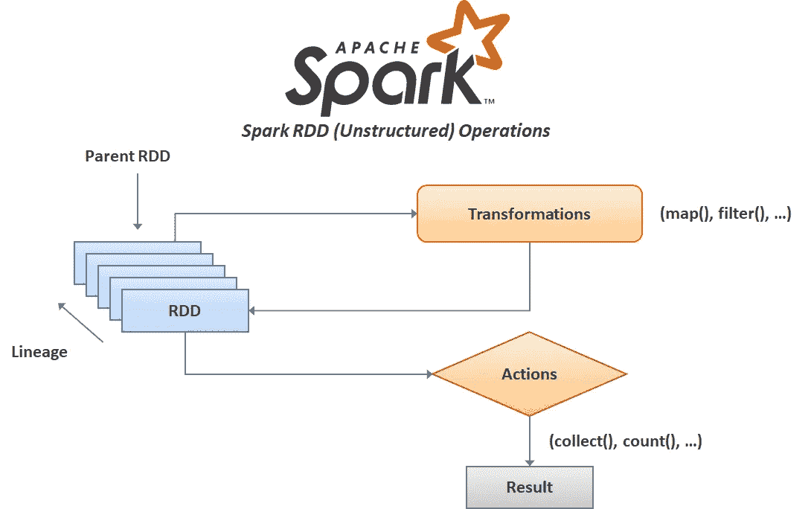
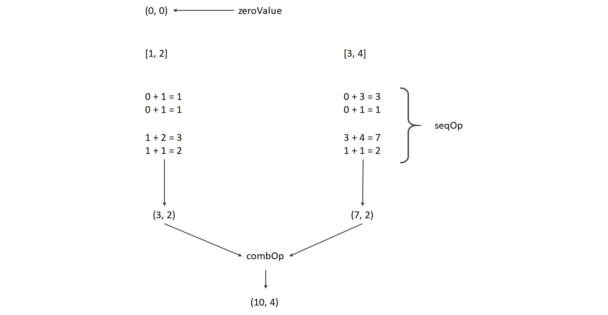

# 使用 Pyspark 的 Spark RDD(低级 API)基础

> 原文：<https://medium.com/analytics-vidhya/spark-rdd-low-level-api-basics-using-pyspark-a9a322b58f6?source=collection_archive---------2----------------------->

虽然建议初学者学习和使用高级 API(Dataframe-Sql-Dataset)，但低级 API - *弹性分布式数据集* (RDD)才是 Spark 编程的基础。主要来说，RDD 是在集群的节点(工作节点)之间划分的元素的集合，它很容易在节点中提供并行操作。

rdd 只能通过两种方式创建:并行化一个已经存在的数据集，收集在您的驱动程序和外部存储中，提供像 Hadoop InputFormats (HDFS，HBase，Cassandra)这样的数据源..)或从已经创建的 rdd 转换而来。

# 创建 RDD 和火花背景

Spark RDDs 可以通过两种方式创建:

第一种方法是使用`SparkContext`的`textFile`方法，该方法通过获取文件的 URI 创建 rdd，并将文件作为行的集合读取:

```
Dataset = sc.**textFile**("mydata.txt")
```

第二种方法是 SparkContext 的`parallelize()`方法，它使用程序中现有的 iterable 或集合:

```
data = [1, 2, 3, 4, 5, 6]myData = sc.**parallelize**(data)
```

# RDD 行动



火花 RDD 操作模式

Spark RDDs 只支持两种类型的操作: ***转换*** ，它通过转换现有的 RDD 来创建新的 RDD，以及 ***动作*** ，它计算一个值并将其写入驱动程序。

Spark 变换都是延迟求值的，也称为“延迟变换”。顾名思义，这意味着它们不执行每一个转换，而是等待一个动作来计算并将结果返回给驱动程序，这使得 Spark 运行得更高效、更快。

# RDD 变换

现在是时候动手了:)从创建我们的第一个 RDD 开始，并通过使用它展示一些转换:

```
mydata=[1, 2, 2, 3, 4, 5, 5, 5, 6]rdd = sc.**parallelize**(mydata)
```

现在让我们开始用我们的第一个 RDD 来玩一些在 Spark 中经常使用的重要和基本的转换:

*   地图()
*   过滤器()
*   独特()
*   联合()
*   交集()
*   减去()
*   样本()

## **地图()**

**map()** 转换将 lambda 函数应用于 RDD 的所有元素，并返回新的 RDD:

注意:*如上所述，转换结果不会返回到驱动程序。所以我们需要用一个动作方法来写结果。比如* `*take()*` *，它取一个 RDD 的所述 n 个元素。*

```
new_RDD = rdd.**map**(lambda x: x*2)new_RDD.**take**(10)[2, 4, 4, 6, 8, 10, 10, 10, 12]
```

## 过滤器()

**filter()** 转换将 lambda 函数应用于 RDD 的所有元素，并通过使用确保函数返回 true 的元素来返回新的 RDD:

```
new_RDD = rdd.**filter**(lambda x: x >= 4)new_RDD.**take**(10)[4, 5, 5, 5, 6]
```

## 独特()

**distinct()** 转换应用于 RDD 的所有元素，并返回包含唯一元素的新 RDD:

```
new_RDD = rdd.**distict**()new_RDD.**take**(10)[1, 2 ,3, 4, 5 ,6]
```

## 联合()

**union()** 转换返回一个新的 RDD，其中包含来自两个 rdd 的所有元素:

```
rdd2 = sc.**parallelize**([2, 2, 3, 5, 6, 6, 7, 8, 9])new_RDD = rdd.**union**(rdd2)new_RDD.**take**(20)[1, 2, 2, 3, 4, 5, 5, 5, 6, 2, 2, 3, 5, 6, 6, 7, 8, 9]
```

## 交集()

**intersection()** 转换返回一个新的 RDD，它包含两个 rdd 中元素的交集:

```
new_RDD = rdd.**intersection**(rdd2)new_RDD.**take**(10)[2, 3, 5, 6]
```

## 减去()

**subtract()** 转换返回一个新的 RDD，其元素存在于第一个 RDD 中，但不存在于第二个 RDD 中:

```
new_RDD = rdd.**subtract**(rdd2)new_RDD.**take**(10)[1, 4]
```

## 样本()

**sample()** 变换返回包含现有 RDD 的 n 倍采样元素子集的新 RDD:

```
new_RDD = rdd.**sample**(False,0.5)new_RDD.**collect**()[2, 3, 5, 5]
```

# **对 RDD 变换**

成对 RDD 变换是指包含像数据元组这样的键/值对的 RDD 的另一种方式。成对 RDD 变换被并行地应用于每个键/元素，其中 RDD 上的正常变换(像 map())被应用于集合的所有元素。因为像具有键值对的字典一样，对 rdd 被广泛使用。

现在让我们看看 Spark 中一些重要且常用的 RDD 对变换:

*   groupByKey()
*   reduceByKey()
*   sortByKey()
*   减法键()
*   计数键()
*   加入()

## groupByKey()

**groupByKey()** 转换在 Pyspark 按键分组中将键-值对转换为键-结果可编辑对:

注意:*正如我们之前提到的，转换的结果不会返回到驱动程序。所以我们需要用一个动作方法来写结果。比如* `*collect()*` *，它获取一个 RDD 的所有元素。*

```
rdd=sc.**parallelize**([(1, 2),(1, 5),(3, 4),(3, 6)])rdd.**groupByKey**().collect()[(1, <pyspark.resultiterable.ResultIterable at 0x2218cd4b430>),
 (3, <pyspark.resultiterable.ResultIterable at 0x2218ccb9c70>)]
```

从上面的例子中可以看出，我们在 Pyspark 中得到一个 key- ResultIterable 对。为了查看`ReslutIterable`对象的样子，我们需要借助 map()转换将它们转换成一个列表:

```
rdd.**groupByKey**().map(lambda x:(x[0],list(x[1]))).collect()[(1, [2, 5]), (3, [4, 6])]
```

## reduceByKey()

**reduceByKey()** 转换将 lambda 函数应用于新的 RDD，并产生一对 RDD，其中包含每个值的总和:

```
 rdd.**reduceByKey**(lambda x,y: x+y).collect()[(1, 7), (3, 10)]
```

## sortByKey()

**sortByKey()** 转换可以根据值对一对 RDD 进行升序或降序排序。通过使用`ascending=False`,我们得到一个升序:

```
rdd.**sortByKey**(ascending=False).collect()[(3, 4), (3, 6), (1, 2), (1, 5)]
```

## 减法键()

**subtractByKey()** 转换返回 self 中的每个键-值对，它与 other 中的键不匹配:

```
rdd2=sc.parallelize([(1,9)])rdd.**subtractByKey**(rdd2).collect()[(3, 4), (3, 6)]
```

## 计数键()

利用 using items()函数，对 RDD 的每个键的元素个数进行统计，并将结果作为字典返回:

```
rdd.**countByKey**().items()dict_items([(1, 2), (3, 2)])
```

## 加入()

**join()** 转换返回一个 RDD，其中包含 self 中具有匹配键的所有元素对，以及 SQL 中类似 RDD 的内部连接函数:

```
rdd.**join**(rdd2).collect()[(3, (4, 9)), (3, (6, 9))]
```

注意:*还有 rightOuter()和 leftOuter()转换，我们可以在类似 SQL right，left join 函数的逻辑中使用。*

# RDD 行动

正如我们在上面的 RDD 操作标题中提到的，由于懒惰，rdd 直到我们使用动作时才把最终结果返回给驱动程序。简而言之，动作是返回非 RDD 值的 RDD 操作。让我们看看在 Spark core 中经常使用的一些常见操作:

*   收集()
*   采取()
*   计数()
*   顶部()
*   减少()
*   首先()
*   总和()
*   聚合()

## 收集()

**collect()** 动作以列表形式返回 RDD 中的所有元素:

```
rdd = sc.**parallelize**([2, 2, 3, 5, 6, 6, 7, 8, 9, 0])rdd.**collect**()[2, 2, 3, 5, 6, 6, 7, 8, 9, 0]
```

## 采取()

**take()** 动作返回 RDD 的第一个 *n* 元素:

```
rdd.**take**(4)[2, 2, 3, 5]
```

## 计数()

**count()** 动作计算 RDD 中元素的数量:

```
rdd.**count**()10
```

## 顶部()

**top()** 动作返回 RDD 的前 n 个元素:

```
rdd.**top**(3)[9, 8, 7]
```

## 减少()

**reduce()** 动作通过应用 lambda 函数从 RDD 的两个元素中返回一个元素:

```
rdd.**reduce**(lambda x, y: x + y)48
```

## 首先()

**first()** 动作返回 RDD 的第一个元素:

```
rdd.**first**()2
```

## 总和()

**sum()** 操作返回 RDD 元素的总和:

```
rdd.**sum**()48
```

## 聚合()

**aggregate()** 动作采用两个函数返回最终结果:

```
new_rdd=sc.**parallelize**([1, 2, 3, 4])rdd.**aggregate**((0,0),(lambda x,y:(x[0]+y,x[1]+1)),(lambda x,y:(x[0]+y[0],x[1]+y[1])))(10, 4)
```

在该模式的帮助下，我们可以逐步总结操作:

## 聚合(零值、seqOp、combOp)



聚合()函数的模式

# 结论

在本文中，我试图简要介绍 Apache Spark 的 RDD，它是 Spark 核心的非结构化部分，基于 Pyspark 中常用的 Spark RDD 转换和动作示例。您可以通过在 Apache Spark 文档中搜索 Spark RDD 编程指南和 pyspark 的 Python Api 文档来提高您的知识。

在下一篇文章中，我将讨论高级 Api (Spark-Sql 和 Dataframes ),它是 Spark core 的结构化部分。

我将很高兴听到您的任何意见或问题。愿数据伴随你！