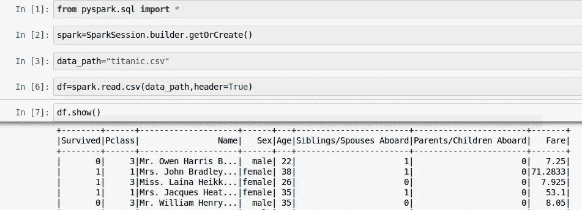
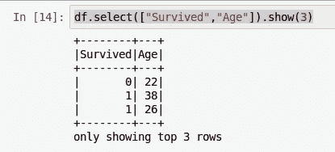
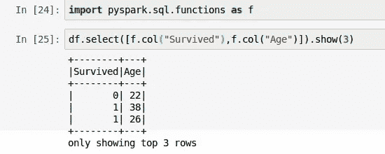
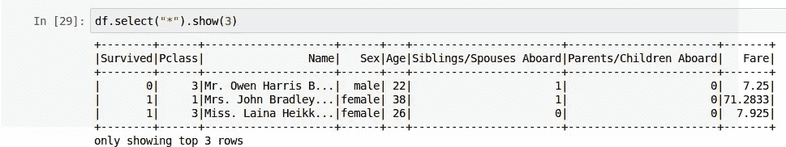
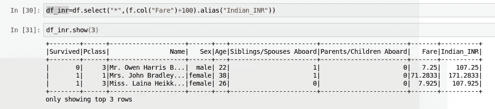
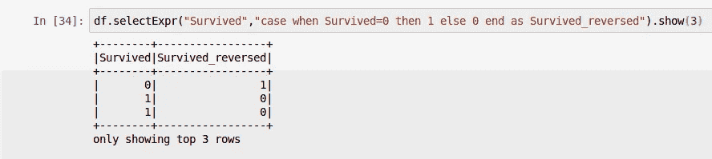
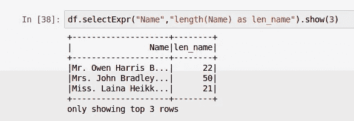
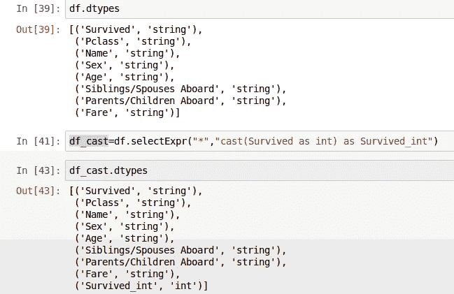
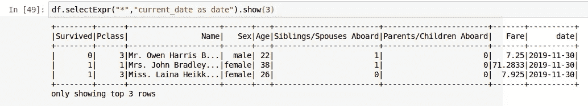
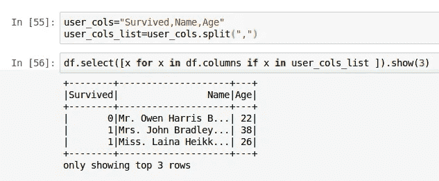

# 火花选择和选择表达式深潜

> 原文：<https://medium.com/analytics-vidhya/spark-select-and-select-expr-deep-dive-d63ef5e04c87?source=collection_archive---------1----------------------->

这是我在 **spark 深潜系列**深潜阅读 csv 之后的第三篇

 [## 火花 CSV 深潜-第二部分

### 这是我上一篇文章的延续

medium.com](/@somanathsankaran/spark-csv-deep-dive-part-ii-6d3389904f71) 

这篇文章包括在 pyspark 中处理选择和过滤表达式

1.  选择 and 和别名列
2.  灵活的 SelectExpr(用于蜂巢人)
3.  通过 select 利用 Python 的强大功能(列表理解)

**第一步:创建输入数据帧**

我们将使用 Spark 会话的 read csv 方法创建 df

**第二步:在 DF 中选择**

根据文件 df .选择接受

1.字符串列表

2.列列表

3 .表情

4.“*”(星形)

**1。字符串列表:**

我们可以将列名作为 python 字符串对象的列表来传递

**2。列表栏**

我们可以从 pyspark.sql.functions 导入 spark 列类并传递列列表

**4。星号(" *"):**

星型语法基本上选择所有类似于 sql 中 select *的列

**第二步:选择别名:**

一个常见的用例是进行一些操作，并将数据指定为新的数据帧，而不是显示

例如，我们将 fair 乘以 70，并将其从美元转换为印度卢比，并将列名指定为 Fare_INR

这里我们选择了所有的列，并添加了一个新列 Indian_INR

**灵活选择表达式和别名列**

如果您是 sql /Hive 用户，我也是，如果您错过了 spark 中的 case 语句。

不要担心 selectExpr 会来救援

1.SelectExpr 对于灵活的 sql 语句和添加字段非常有用

2.使用所有内置的配置单元函数

3.使用 selectExpr 转换数据类型很容易

这里我们将幸存的 dtypes 从 string 转换为 int

4.用 SelectExpr 添加常数

一个常见的用例是添加像 current_date 这样的常量字段

这可以用 SelectExpr 轻松完成

**3。使用 select** 利用 Python 的强大功能(列表理解)

既然选择接受列表，我们可以使用列表理解来选择某些列。假设用户已经给出了一个列列表来操作 df

我们可以使用带有 if 子句的列表理解(或生成器表达式)来选择所需的列

Github 链接:[https://github . com/SomanathSankaran/spark _ medium/tree/master/spark _ CSV](https://github.com/SomanathSankaran/spark_medium/tree/master/spark_csv)

[**下一个教程:https://medium . com/@ somanathsankaran/spark-group-by-and-filter-deep-dive-5326088 dec 80**](/@somanathsankaran/spark-group-by-and-filter-deep-dive-5326088dec80)

***请给我发 spark 中我必须涉及的话题，并给我改进写作的建议:)***

**学习，也让别人学习！！**