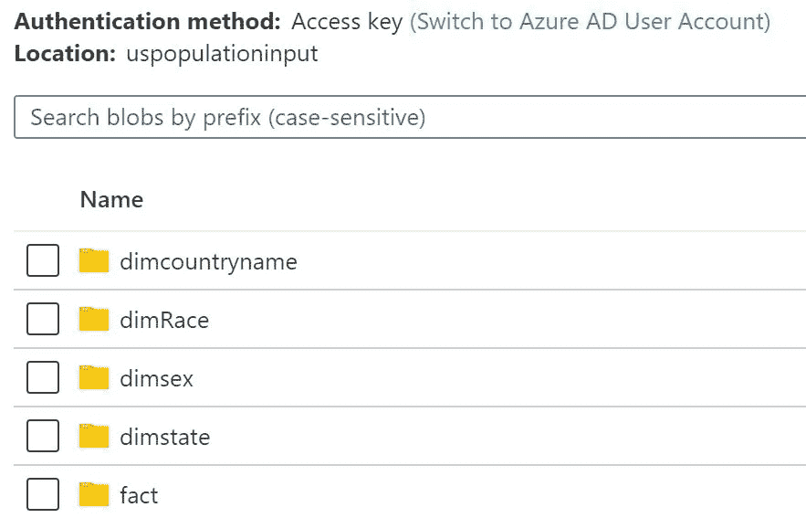
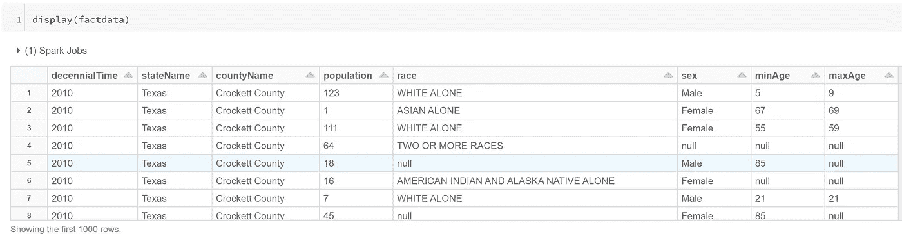
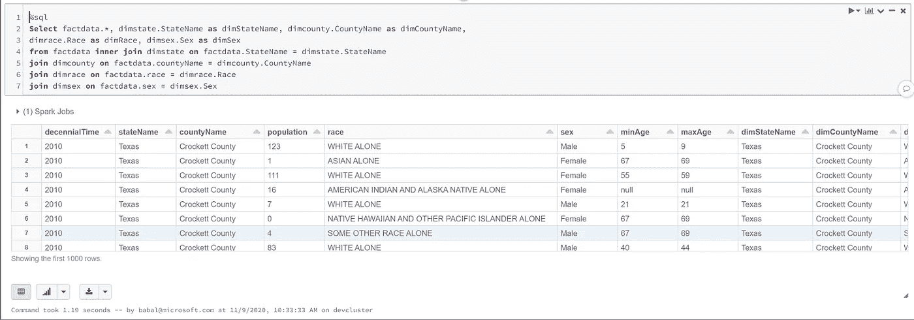

# Spark SQL 配置单元作业转换

> 原文：<https://medium.com/analytics-vidhya/spark-sql-hive-job-conversion-9ec6f9269d94?source=collection_archive---------18----------------------->

# 用例

*   使用事实和维度模型并进行多重连接。
*   所有的事实和维度文件都存储为 parquet
*   创建临时表并连接

# 先决条件

*   Azure 帐户
*   使用 Spark 3.0 创建 Azure 数据块
*   创建一个 Blob 存储来存储文件。
*   Azure keyvault
*   为复制拼花文件
*   事实
*   dimState
*   迪姆县
*   迪姆雷斯
*   迪姆塞克斯
*   所有这些都是根据美国人口数据(公开数据)得出的
*   这只是模拟连接，所以如果需要，请使用您自己的数据集。
*   我正在使用 scala 的 databricks 笔记本
*   我创建了一个名为 uspopulationinput 的容器
*   每个事实和数据都存储在相应的文件夹中。
*   文档来创建本文所需的数据集。[https://github . com/balakreshnan/Accenture/blob/master/cap/population dataset . MD](https://github.com/balakreshnan/Accenture/blob/master/cap/populationdataset.md)



# 获取拼花文件、创建视图和构建连接的步骤

*   首先配置 blob 存储信息，如帐户名和密钥
*   我正在使用 keyvault 获取存储密钥

```
val accbbstorekey = dbutils.secrets.get(scope = "allsecrects", key = "accbbstore")spark.conf.set( "fs.azure.account.key.accbbstore.blob.core.windows.net", accbbstorekey)val factdata = spark.read.parquet("wasbs://containername@storagename.blob.core.windows.net/fact/*.parquet") 
display(factdata)
```



```
%sql 
DROP VIEW factdata
```

*   现在让我们为文件创建临时视图
*   首先是事实数据—视图

```
%sql 
CREATE TEMPORARY VIEW factdata USING org.apache.spark.sql.parquet OPTIONS ( path "wasbs://containername@storagename.blob.core.windows.net/fact/*.parquet" )%sql 
SELECT * FROM factdata;%sql 
CREATE TEMPORARY VIEW dimstate USING org.apache.spark.sql.parquet OPTIONS ( path "wasbs://containername@storagename.blob.core.windows.net/dimstate/*.parquet" )%sql 
CREATE TEMPORARY VIEW dimcounty USING org.apache.spark.sql.parquet OPTIONS ( path "wasbs://containername@storagename.blob.core.windows.net/dimcountryname/*.parquet" )%sql 
CREATE TEMPORARY VIEW dimrace USING org.apache.spark.sql.parquet OPTIONS ( path "wasbs://containername@storagename.blob.core.windows.net/dimRace/*.parquet" )%sql 
CREATE TEMPORARY VIEW dimsex USING org.apache.spark.sql.parquet OPTIONS ( path "wasbs://containername@storagename.blob.core.windows.net/dimsex/*.parquet" )
```

*   现在让我们使用 HiveQL like 查询来加入，看看是否可以加入
*   这个练习是尝试查看 HiveQL(类似的)是否可以移植到 Spark 3.0 的一部分

```
%sql 
Select factdata.*, dimstate.StateName as dimStateName, dimcounty.CountyName as dimCountyName, dimrace.Race as dimRace, dimsex.Sex as dimSex from factdata inner join dimstate on factdata.StateName = dimstate.StateName join dimcounty on factdata.countyName = dimcounty.CountyName join dimrace on factdata.race = dimrace.Race join dimsex on factdata.sex = dimsex.Sex
```



*   正如您在上面看到的，我们正在连接事实和维度，并显示来自两者的列，以确认它是否可以连接。
*   这只是为了验证。
*   从配置单元 QL 移动时，可能存在依赖关系和数据类型不匹配
*   还有 UDF(用户自定义函数)，这是另一个值得关注的东西。
*   这也仅适用于将 HIVEQL 用作 ETL 并希望移植到 Spark SQL 的情况。

*最初发表于*[T5【https://github.com】](https://github.com/balakreshnan/Accenture/blob/master/cap/sparksqlmultijoin.md)*。*