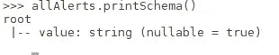
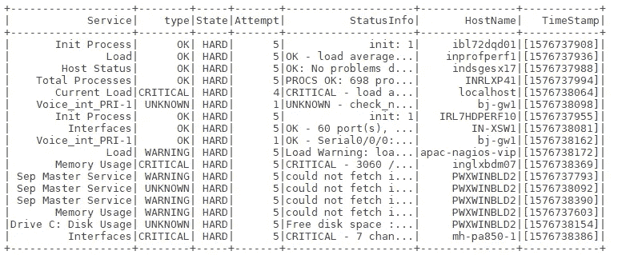

# Nagios 监控中的火花流

> 原文：<https://medium.com/analytics-vidhya/spark-streaming-in-nagios-monitoring-4111bd53b84c?source=collection_archive---------15----------------------->


约书亚·索蒂诺在 [Unsplash](https://unsplash.com?utm_source=medium&utm_medium=referral) 上拍摄的照片

大家好，距离我发表上一篇故事已经有一段时间了。这一次我写的是关于使用 python spark 结构化流和 nagios 在事件管理工具中自动创建事件的博客。

N agios 是一款监控工具，用于监控各种基础设施设备，如服务器、网络设备、应用程序和网站。

## 业务问题:

我们有 3 台 Nagios 服务器，每个区域一台，Ilabs、EMEA、美国和 10K 周围的服务器和网络设备都受到监控。它每分钟发出大约 50–80 个警报。这些包括问题和恢复警报。为所有这些警报手动创建事件是一项繁忙的任务。

## 早期方法:

以前我写过一个 python 插件，它使用 Service NOW REST API 来引发事件。但我们注意到，创建事件和重复事件的延迟也很高。我们已经注意到 nagios 服务器上的高负载和 Service Now 应用程序上的延迟。有时事件甚至不会被创建。因此，我们将其限制为仅为主机故障警报创建事件。由于这些问题，有必要寻找其他的可能性。

## 新方法:

我遇到了 Apache Spark Streaming API，它看起来更好，是我们以前方法的所有问题的解决方案。

在这篇博客中，我将尝试解释我使用 PySpark 在 ServiceNow 中为 Nagios alerts 创建事件的方法。在这篇博客中，我曾使用 pyspark shell 来解释一些事情。

> **步骤:
> *** 你可以按照这个 [***文件***](https://towardsdatascience.com/how-to-get-started-with-pyspark-1adc142456ec) 来安装 spark 和 pyspark
> *确保所有的环境变量都设置好了。
> *将通过端口 9999 从 nagios 服务器读取 nagios.log 中的流数据。
> *这个脚本是用 Python3 & spark 2.4 编写的*

**导入 PySpark 模块**

默认情况下，Spark shell 附带名为“Spark”的 spark 会话，因此您不需要再次启动 spark 会话。如果您正在使用 notebook 或其他 Python IDE，您可能需要使用下面的代码块启动 spark 会话。

```
from pyspark.sql import SparkSession
from pyspark.sql.functions import *
from pyspark.sql.types import StringType, StructType, StructField
```

**现在让我们开始火花会议**

```
spark = SparkSession.builder.appName('Nagios_streaming').load()
```

**创建流对象** 我们通过端口 9999 从 nagios 服务器的控制台读取流。

```
ilabsalerts = spark.readStream.format('socket').option('host','ilabs-nagios').option('port',9999).load()emeaalerts = spark.readStream.format('socket').option('host','emea-nagios').option('port',9999).load()usalerts = spark.readStream.format('socket').option('host','us-nagios').option('port',9999).load()
```

使用 union API 将所有这 3 个流对象合并为一个。

```
allAlerts = ilabsalerts.union(emeaalerts).union(usalerts)
```

最初，这些流对象以字符串形式出现一个名为“值”的列，我们将对该列进行转换，以获得新列，如拆分和过滤等。

使用下面的行查看对象的模式。

`allAlerts.printSchema()`



现在我们必须对`allAlerts`对象进行转换。
实际上，nagios 日志文件包含正在进行的检查的所有信息，但是我们只对警报感兴趣，所以过滤数据帧。

```
filteredAlerts = allAlerts.filter(allAlerts.value.like('%ALERT%'))
```

日志条目的示例如下所示

```
[1576600755] SERVICE ALERT: HOSTNAME;SERVICE;WARNING;HARD;1;Link Down -- GigabitEthernet1/0/24 -- #[V] name Video conference# -- propPointToPointSerial -- down
```

正如您在上面的日志条目中看到的，我们的必填字段用“；”分隔。
因此，我们将使用“；”分割数据帧并提取所有字段。

```
splitAlerts = split(filteredAlerts.value,’;’)
filteredAlerts = filteredAlerts.withColumn('Host',splitAlerts.getItem(0))
filteredAlerts = filteredAlerts.withColumn('Service',splitAlerts.getItem(1))
filteredAlerts = filteredAlerts.withColumn('type',splitAlerts.getItem(2))
filteredAlerts = filteredAlerts.withColumn('State',splitAlerts.getItem(3))
filteredAlerts = filteredAlerts.withColumn('Attempt',splitAlerts.getItem(4))
filteredAlerts = filteredAlerts.withColumn('StatusInfo',splitAlerts.getItem(5))
```

Nagios 有两种状态&软状态和硬状态。警报将处于软状态，直到完成最大检查尝试次数并变为硬状态。nagios 将只发送硬声明警报通知。因此，我们将不得不只寻找硬性规定的警报。

```
result = filteredAlerts.filter(col(‘State’) == ‘HARD’)
```

现在，我们必须从主机列中提取时间戳和主机名，因为它看起来类似于**[1576600559]SERVICE ALERT:Host** 在这里，时间戳用[]括起来，主机名在最后。

```
hostsplit = split(result.Host,' ')
result = result.withColumn('HostName',hostsplit.getItem(3))
result = result.withColumn('TimeStamp',hostsplit.getItem(0))
```

现在让我们从最终的数据框中删除不需要的列。

```
result = result.drop('value','Host')
>>> result.printSchema()
root
 |-- Service: string (nullable = true)
 |-- type: string (nullable = true)
 |-- State: string (nullable = true)
 |-- Attempt: string (nullable = true)
 |-- StatusInfo: string (nullable = true)
 |-- HostName: string (nullable = true)
 |-- TimeStamp: string (nullable = true)>>>
```

在开始接收数据之前，您必须允许通过端口 9999 将 nagios.log 文件打印到套接字。您可以通过从 nagios 服务器控制台运行下面一行代码来做到这一点。

```
root@ilabs-nagios ~]# tail -f /usr/local/nagios/var/nagios.log | nc -lk 9999
root@emea-nagios ~]# tail -f /usr/local/nagios/var/nagios.log | nc -lk 9999
root@us-nagios ~]# tail -f /usr/local/nagios/var/nagios.log | nc -lk 9999
```

现在我们有了最终的流对象，并能够通过端口 9999 接收流，所以我们只需要将数据发送到您需要的任何地方。在本例中，我将输出写入控制台。

```
query = result.writeStream.format('console').outputMode('append')
query.start()query.awaitTermination()
```

它将开始把流数据打印到控制台，输出如下所示。



这只是为了测试，我们不能使用套接字作为输入源，我们必须进行一些基于窗口的转换，并且必须对流数据进行多个聚合。我将在本系列的下一篇博客中解释这一点。

我们可以使用 nagios 中的被动检查概念，通过 spark 流监控关键应用程序、日志和网络设备。

使用 PySpark 继续在这个空间寻找更多关于 Nagios 的内容。

如果你在这篇文章中发现任何错误，请随时通过电子邮件发送反馈或留下评论。

非常感谢您花时间阅读这篇文章！
圣诞快乐！！！！

电子邮件:harimittapalli24@gmail.com