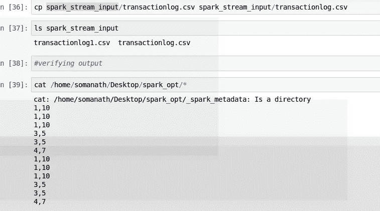

# 火花结构化流深潜

> 原文：<https://medium.com/analytics-vidhya/spark-structured-streaming-deep-dive-79fb236db22c?source=collection_archive---------14----------------------->

Jez Timms 在 [Unsplash](https://unsplash.com?utm_source=medium&utm_medium=referral) 上拍摄的照片

这篇文章是关于 spark 结构化流的。关于 spark 结构化流的一个重要事实是，它基于 **DataFrame API。**

spark dataframe api 的一个重要方面是使用现有的 dataframe 数据源，如 JDBC JSON CSV 等，我们将编写我们的处理逻辑，如过滤无效记录等，然后最终在使用 writeStream 时触发实际计算

让我们看看涉及流式应用程序的步骤

1.  连接到信号源
2.  使用 DataFrame API 在流上应用转换逻辑(创建 DAG)
3.  使用 writeStream 写入接收器时触发写入的逻辑
4.  检查点和为什么我们需要检查点
5.  正在验证输出文件夹和配置单元中的输出
6.  通过添加新文件检查流式应用程序
7.  不同类型的信号源和输出模式选项(续)

**准备输入和输出**

这里的基本用例是在数据持续到达源目录时读取 csv 文件，我们将过滤无效记录，并将清理后的记录存储到输出路径中，然后将输出更新到包含聚合统计信息的配置单元表中。

**第一步:连接信号源**

Spark 现在允许以下来源

1.  战斗支援车
2.  JSON
3.  镶木地板
4.  妖魔
5.  速率-速率源是用于测试目的的测试源(将在另一篇文章中介绍源和目标)

对于我们的示例，我们将使用 csv 作为源

我们将使用 readstream API 从源目录中读取数据

***由于 spark Readstream 返回一个 dataframe 对象，我们可以使用 schema、header 等选项，spark.readStream.csv 如下所示***

我们可以看到 spark 流与批处理查询相同，我们可以使用 is_streaming 检查它是否是一个流，我们还将使用 type 命令验证 readstream 是否为 dataframe 类型

**步骤 2:使用 DataFrame API(创建 DAG)在流上应用转换逻辑**

下一步是我们将创建两个流逻辑

1.  将过滤负交易的 DF_filter
2.  DF_group，它将聚合 opt 并将其写入配置单元

**DF_Filter**

由于上述流式查询是数据帧，我们将使用如下所示的过滤器过滤负面记录

**DF_group**

因为 spark stream 很懒，所以在触发查询之前我们看不到任何结果，

因此，定义任何显示结果的操作都会导致下面的异常

**步骤 3:使用 writeStream 触发写入接收器时写入的逻辑**

1.将过滤后的有效记录写入 opt 文件夹

**将过滤后的有效记录写入 opt 文件夹**

我们可以使用 writestream 启动流，然后如下所示给出 start

**检查点和我们为什么需要检查点**

这里的问题是写入像 csv、orc 这样的持久存储需要一个检查点位置，spark 将从该位置检查以确保相同的数据不会被重新处理，因为它将包含已处理文件的列表

设置检查点目录并重新运行流

在保存流时，我们需要指定 3 个重要选项:

1.  格式-csv
2.  output Mode-默认模式追加-允许更新，追加完成
3.  触发(默认为 0 秒)spark 应用程序应该在多少秒后检查输入目录(将在另一篇文章中讨论)

**验证输出:**

验证过滤的数据选项

正如我们看到的负面记录不见了

**通过添加新文件检查流媒体应用**

当我们添加新文件时，spark 会自动处理流逻辑，如下所示，输出文件夹也会更新，如下所示

今天就到这里吧！！:)

Github 链接:[https://github . com/SomanathSankaran/spark _ medium/tree/master/spark _ CSV](https://github.com/SomanathSankaran/spark_medium/tree/master/spark_csv)

****学习并让别人学习！！****