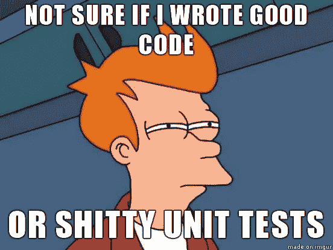
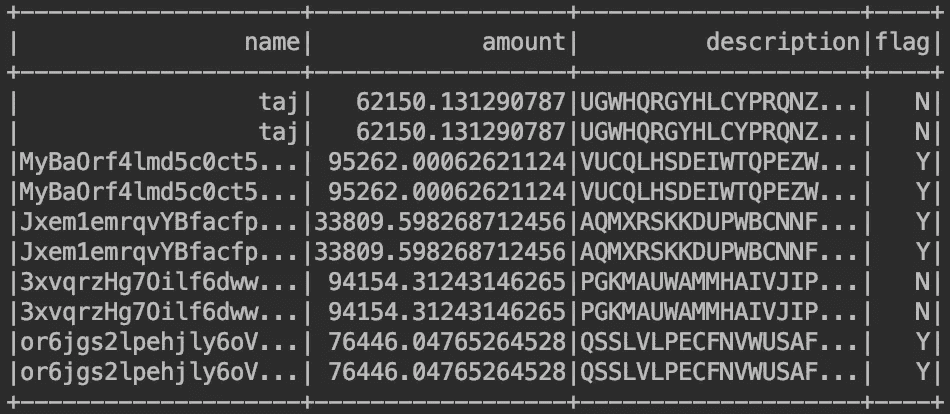

# 火花测试基地:ScalaTest + ScalaCheck

> 原文：<https://medium.com/analytics-vidhya/spark-testing-base-scalatest-scalacheck-808009688245?source=collection_archive---------0----------------------->

[**Apache Spark**](https://spark.apache.org/) 是一个用于分析和大数据处理的大规模分布式计算框架。

分布式计算程序很难在本地或用较小的数据集进行测试。用[**Holden Karau**](https://github.com/holdenk)**:**[**Spark 测试库**](https://github.com/holdenk/spark-testing-base) 提供的几个基类，测试 Spark 代码变得很容易

# 火花试验基地

该库使用基于属性的测试原理来产生火花 RDD、数据帧和数据集以及其他公共基类中的模糊性。

方便的基类:

*   ***SharedSparkContext:***为每个测试用例提供一个 SparkContext
*   ***rdd comparisons:***基类提供函数来比较 RDD
*   ***RDDGenerator:***为 RDD 对象的生成器
*   ***data frame Generator:***data frame 对象的生成器
*   ***数据集生成器:*** 数据集对象的生成器

数据帧/数据集是 Apache Spark 中最常用的，以提高效率和 Spark SQL 用例。编写生成任意数据帧的测试用例对于测试极端条件是非常有用的。

我们可以看到一个定制生成器的例子，模拟我们输入数据的性质。

假设我们有一个有四列的表，

*   名称:字符串(字母数字)
*   金额:Double(范围从 0 到 100000)
*   描述:字符串(大写字母)
*   标志:字符串(“Y”或“N”)

现在，使用 **Spark-Testing-Base :** 生成符合上述标准的数据帧非常简单

让我们为我们的表定义一个模式(StructType):

现在，我们将为每个列定义生成器，这些生成器是自定义的，可以是基于我们领域的任何内容

new Column()是一个 util 类，用于定义稍后在 DataFrameGenerators 上使用的 CustomGenerator

一旦我们为每个列创建了模式和定制生成器，我们将定义 DataFrameGenerator 来创建具有定义标准的数据

上述方法产生了一个任意的数据帧，该数据帧具有数据中定义的模糊性。现在，用上面的数据框架测试代码非常简单。

使用 *forAll()* 我们可以触发之前创建的 data frame generator(***sampledata . generator***)并且 ScalaCheck 提供了 DataFrame size、minSuccessful 等许多选项。

*参考* : [基于属性的测试](/@subashprabakar/property-based-testing-scalatest-scalacheck-52261a2b5c2c)了解 [ScalaCheck](https://www.scalacheck.org/) 的使用方法

生成的样本数据帧如下:

现在使用上面的生成器——我们可以生成数据帧，它可以在我们的测试用例中进一步用来验证我们的代码。

Spark 测试库提供了一些更强大的基类，非常有助于快速高效地编写测试代码。

**参考:**

*完整代码:*

 [## subashprabanantham/hakuna-matata

### 此时您不能执行该操作。您已使用另一个标签页或窗口登录。您已在另一个选项卡中注销，或者…

github.com](https://github.com/subashprabanantham/hakuna-matata/tree/master/spark-testing-base) 

*火花测试基地:*

 [## 霍尔登克/火花测试基地

### 用 Spark 编写测试时使用的基类。您已经在 Spark 中编写了一个很棒的程序，现在是时候编写了…

github.com](https://github.com/holdenk/spark-testing-base)