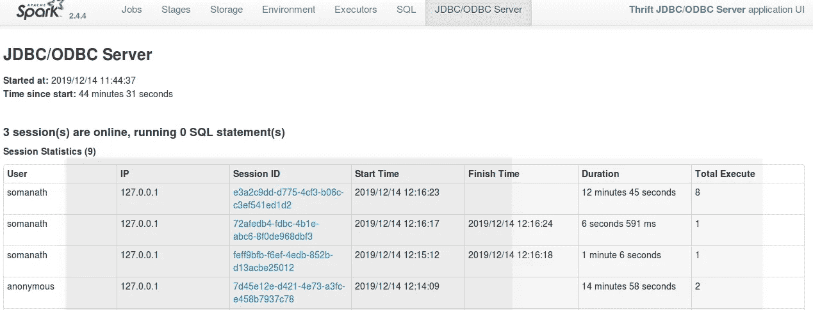

# Spark Thrift 服务器深度挖掘

> 原文：<https://medium.com/analytics-vidhya/spark-thrift-server-deep-dive-fccf6cd7321e?source=collection_archive---------8----------------------->

这是我在星火深潜系列中的一个故事

Jez Timms 在 [Unsplash](https://unsplash.com?utm_source=medium&utm_medium=referral) 上拍摄的照片

 [## 索玛纳特·桑卡兰培养基

### 阅读索马纳特·桑卡兰在媒介上的作品。对 python 和 spark 感兴趣的大数据开发者。每天，索马纳特…

medium.com](/@somanathsankaran) 

一个被低估的有趣的服务是 spark 节俭服务器。让我们详细看看节约服务器的用途。

1.  火花节约服务器
2.  Spark 节俭服务器的使用
3.  启动节俭服务器及其工作原理
4.  用 SQL Alchemy 连接 Thift 服务器
5.  探索节俭服务器用户界面

**星火节俭服务器**:

该服务通过 spark 提供了一种服务器-客户端(jdbc/odbc)设施的风格

服务器客户端设备意味着我们不需要在我们的机器上安装 spark。相反，我们将是一个客户端，我们将获得一个服务器的网址

我们可以通过我们的应用程序连接和使用数据，例如在我们的用例中，我们将使用 Pyhive 客户端连接到在一些服务器上启动的 spark 生态系统

**Spark 节俭服务器的用途**

1.  使用 tablaeu、superset 等 BI 工具进行连接
2.  **在不启动 spark 应用程序的情况下，将 spark 表和查询与用 Java Python 等编写的应用程序连接起来**

**启动节俭服务器**

我们可以在$SPARK_HOME/sbin 下启动 thriftserver

在启动 thriftserver 时，它将显示它将记录在一个文件中

在检查该文件时，我发现它在内部调用 spark 类，所以优点是我们可以用 conf 指定 spark 属性和 start-thrift server

**工作原理**

它在内部调用 hive thriftserver，并且默认情况下将暴露端口 localhost:10000，我们可以向该端口发送 sql 查询以获取结果。spark thriftserver 将使用指定的 executor 内存选项来运行查询

因此，我们必须使用-conf num-executors 参数来增加 executor，以改善延迟

我们可以通过查看 web ui 来验证 thriftserver 是否启动，spark 会显示它正在作为 thrift server 运行

**连接 Thift 服务器和熊猫**

我们将使用 pyhive 来连接 spark 并执行 spark sql 查询

我们必须安装

pip 安装 pyhive

pip 安装节约

pip 安装节约 _sasl

使用 pyhive 创建配置单元连接对象

将连接对象和配置单元查询传递给 pandas.read_sql

选择一个配置单元表

**探索节俭服务器 UI**

在 Spark UI 中的 thrift server 选项卡下，我们将执行查询，查询来自的 IP 和更多细节如下所示

今天就到这里吧！！:)

Github 链接:[https://github . com/SomanathSankaran/spark _ medium/tree/master/spark _ CSV](https://github.com/SomanathSankaran/spark_medium/tree/master/spark_csv)

****学习并让别人学习！！****