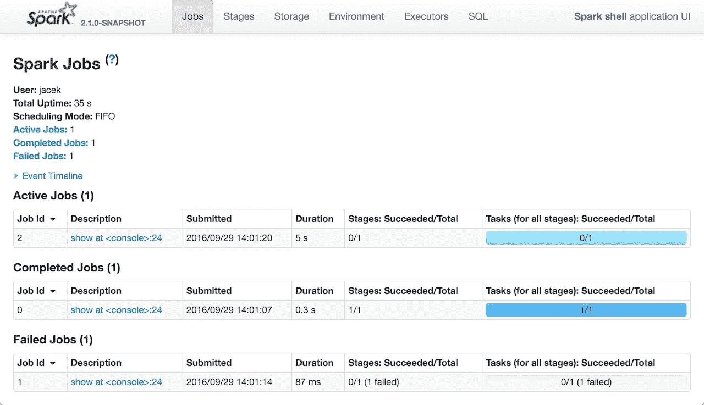

# 火花调谐和调试

> 原文：<https://medium.com/analytics-vidhya/spark-tuning-and-debugging-fe32fded8454?source=collection_archive---------17----------------------->

在前一章中，我们讨论了[结构化 Spark API](/analytics-vidhya/spark-sql-and-dataframes-72e58fe90f94)，例如数据集、数据帧和 Spark SQL。

在本章中，我们将研究如何调试和调整 Spark 程序以提高性能。

***火花设置:***

在执行 spark 作业时，为应用程序提供最佳资源非常重要。为此，您可以设置以下值:

*spark.executor.instances，spark.executor.cores，spark.driver.memory，spark.executor.memory，spark . yarn . executor . memory overhead*

这些配置可以在 spark 程序中设置，也可以在 spark 提交过程中设置，或者在默认 spark 配置文件中设置。

***缓存/持久/检查点:***

每当你运行 RDD 的行动多次，它的重新计算将发生在默认情况下，即使是同一个 RDD。所以如果你想在各种动作中多次使用同一个 RDD，可以使用***rdd . persist()***持久化它，避免每次都要重新读取或者重新计算。如果您只使用一次 RDD/数据集，则没有必要保留它。

***RDD.cache()*** 与 persist 相同，但具有默认存储级别，即它将数据存储在 MEMORY_ONLY(仅用于 RDD)和 MEMORY_AND_DISK(用于数据帧)中。

你也可以 ***检查站()*** 你的 RDD。对于检查点，不会维护 RDD 的沿袭，数据会以物理方式存储到 HDFS，因此即使在 Spark 作业终止后，它仍将可用。在 cache()/persist()的情况下存储沿袭，但是一旦作业完成，数据将被销毁。检查点将有助于处理长操作链的故障。

有以下存储选项可供 rdd 持久存储:

*MEMORY_ONLY* —作为未序列化的 Java 对象存储在 JVM 堆中。如果 RDD 不适合内存，一些分区将不会被缓存，并将在每次需要时动态地重新计算。

*MEMORY _ AND _ DISK*—JVM 中反序列化的 Java 对象。如果 RDD 不适合内存，存储不适合磁盘的分区，并在需要时从那里读取它们。

*MEMORY_ONLY_SER* 和 *MEMORY_AND_DISK_SER* —序列化的 Java 对象

*DISK_ONLY_2* —仅在磁盘上存储 RDD 分区，但在两个集群节点上复制每个分区

在 Python 中，存储的对象总是用 pickle 库序列化。

选择存储选项将基于**内存与 CPU 使用率**。

***火花 UI:***

当您运行 spark 应用程序时，它还会在端口 4040(默认)或任何下一个可用端口上启动 Spark UI。Spark UI 仅在 Spark 应用程序执行期间可用。此后，它将在历史服务器上可用(默认端口为 18080)。处理应用程序日志以显示在历史服务器上需要一些时间。Spark UI 为应用程序的重要信息提供了以下选项卡。



Spark UI

*作业* —提供 Spark 应用程序中所有作业的摘要、事件时间表。单击特定作业后，您可以查看其状态、阶段、事件时间线和 DAG 可视化。

*阶段* —提供所有工作的阶段细节。单击特定阶段，您可以看到其 DAG 可视化、事件时间表和摘要/聚合指标。

*存储* —存储选项卡显示 rdd 和数据帧的详细信息(但只显示持久化的数据帧，如果有的话)，如分区数量、存储级别等。

*环境* —该选项卡显示所有的配置变量。您可以在这里检查您在 spark-submit 或 spark 程序中设置的属性是否设置正确。用户没有明确设置的所有其他属性将由管理员设置，或者是 spark.conf 中的默认 spark 配置。

*执行者* —该选项卡显示为该应用程序创建的所有执行者的信息。它将有一个驱动程序和一个或多个其他执行者的信息，如内存，磁盘使用和洗牌。

*SQL* —显示 SQL 查询的详细信息，如持续时间、作业、DAG 和执行计划(解析的逻辑计划、分析的逻辑计划、优化的逻辑计划和物理计划)。

Dag、计划、任务、汇总指标、使用的内存、混洗数据大小、执行时间等有助于了解执行流程，以及它们是否是需要解决的瓶颈。如果 Spark 作业失败，您可以在 YARN UI 上查看详细的日志。

Rest APIs 可从以下位置获得:*https://<Spark-server>:4040/API/v1*用于 Spark UI，以及*https://<history-server>:18080/API/v1*用于历史服务器。

**共享变量:**

***广播* :** 广播一个变量有助于在每台机器上缓存那个变量(不可变的)，而不是把它的副本和任务一起发送出去。它可以用来复制大型数据集，以便使用高效的广播算法在许多 Spark 操作中重用它，从而降低网络成本。

当 SQL 连接两个数据集/数据帧时，也可以使用广播。我们将给出一个提示，向集群的每个工作节点广播要加入的小数据集。

***累加器:*** 累加一个变量(可变的)有助于将来自不同任务的数据添加/收集到一个共享的结果中。

**Broadcast join:** 使用 pyspark . SQL . functions . Broadcast()，您可以显式地给 SQL join 一个提示，以便将特定的表广播为:

```
broadcast(spark.table(“spark_table”)).join(spark.table(“new_table”), “key”)
```

为了提高性能，应在火花作业中尽早应用过滤器。

如果从数据库中读取数据，将使用查询下推将过滤器推送到 DB，并且可以使用谓词下推将数据并行导入到不相交谓词的各个分区中。

还可以使用 SQL 和 dataframes 之类的高级结构化 API 来实现更好的内部存储和执行优化。

总之，我们讨论了优化和监控 Spark 应用程序的不同方法。