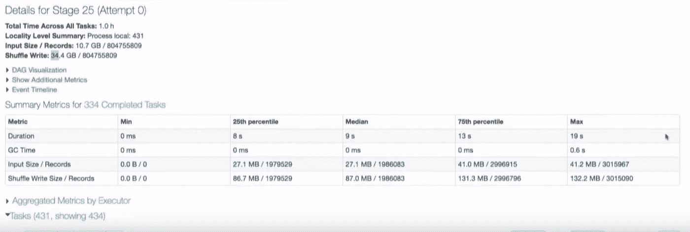

# 了解 Spark UI —第 1 部分

> 原文：<https://medium.com/analytics-vidhya/spark-ui-c7f2ca9ef97f?source=collection_archive---------3----------------------->

Spark 用户界面中的基本元素是
1。乔布斯
2。阶段
3。任务
4。存储
5。环境
6。遗嘱执行人
7。结构化查询语言

**乔布斯**

作业快照

作业可以被认为是您的 ETL 代码的一个物理部分。您希望了解的作业部分的详细信息是它所包含的阶段数。在上图中，它是 4。
第二个需要注意的细节是你工作中运行任务的数量。在这种情况下，它是 97。这是群集中核心的直接计数。

**阶段**

阶段快照

要导航到“阶段”页面，请单击相应作业中的描述。您在“阶段”页面中看到的所有阶段都与您正在处理的特定作业相关。

让我们假设你的工作有两个阶段，这意味着你的工作中发生了一次洗牌。如果你的工作有 5 个阶段，那么就有 4 次洗牌。洗牌的次数总是比级数少 1。在一个理想的工作中，你应该在你的工作中有一个阶段，这意味着没有混乱，你的工作中的每个任务都是并行运行的。
您可以在每个阶段看到的任务数量是 spark 将要处理的分区数量，阶段中的每个任务都是 spark 将要完成的相同工作，但处理的是不同的数据段。

相同的工作在不同的数据分区上完成

**任务**

任务快照

要导航到“任务”页面，请单击相应阶段中的描述。
在任务页面中要查找的关键内容有:
1 .输入大小—阶段的输入。

*   期望输入大小的最小值、第 25 个百分位数、中值、第 75 个百分位数和最大值应该几乎相同，并且必须介于 128 和 256MB 之间。
*   期望不同组的任务大小相同的原因是，在我们为该作业分配的内核上放置等量的数据或等量的数据。
*   在上面的例子中，最小输入大小是 0，第 25 个百分位数是 27.1 MB，这意味着我们有一些核心将在 0 数据量上运行。所以我们没有充分利用内核。
*   在某些情况下，输入大小可能从 1GB 开始，这意味着我们过度利用了内核，我们应该对数据进行分区。

2.随机写入—写入本地装载的磁盘的阶段输出。在下一阶段，这将是输入，它将再次从磁盘中读取。

> 要了解 spark 内存管理，请参考本 [*篇*](/@tharun026/spark-hierarchy-953c1eb56a81)

汇总指标是 Spark UI 最重要的部分之一。它提供了关于数据如何在分区间分布的信息。

**储存**

“存储”选项卡是我们查看持久数据详细信息的地方。

**环境**

该页面为您提供关于 spark 配置的信息。

**遗嘱执行人**

该选项卡帮助您识别节点级问题。

**SQL**

这类似于 SQL 中的执行计划。如果你想优化你的代码，这是一个很好的起点。

想要了解更多关于 Spark UI 中 SQL 的内容，可以参考这篇 [*文章*](/analytics-vidhya/understanding-spark-ui-51585e5e72c2) 。