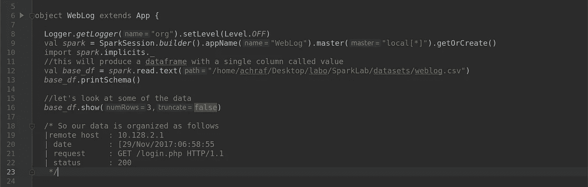
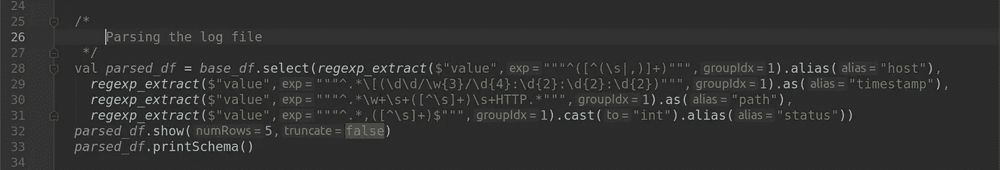
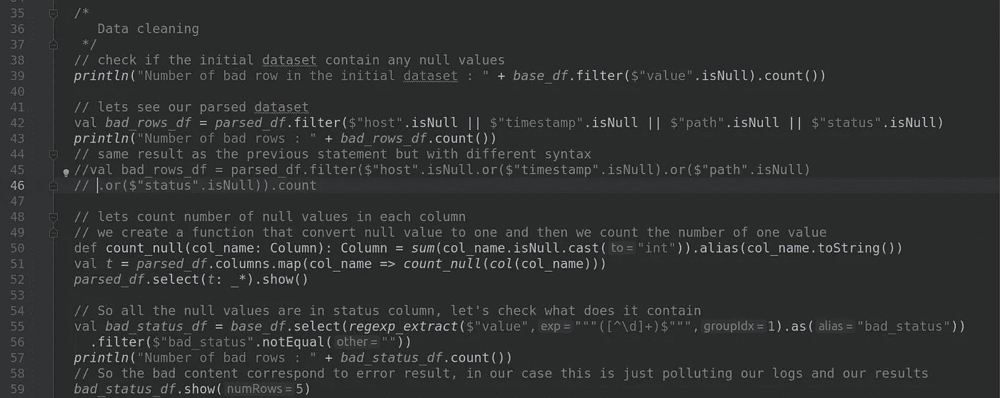
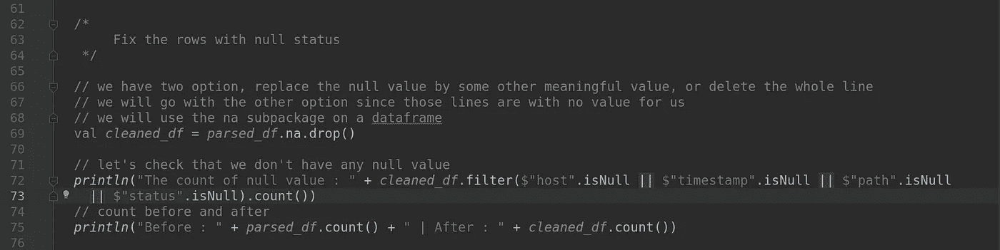
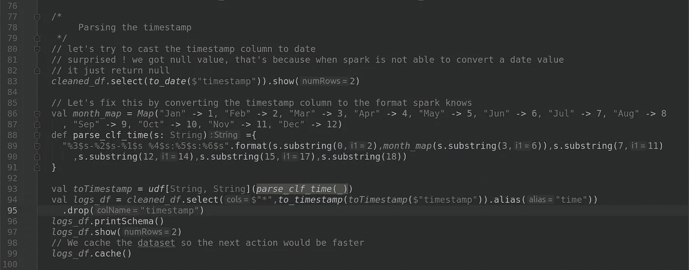
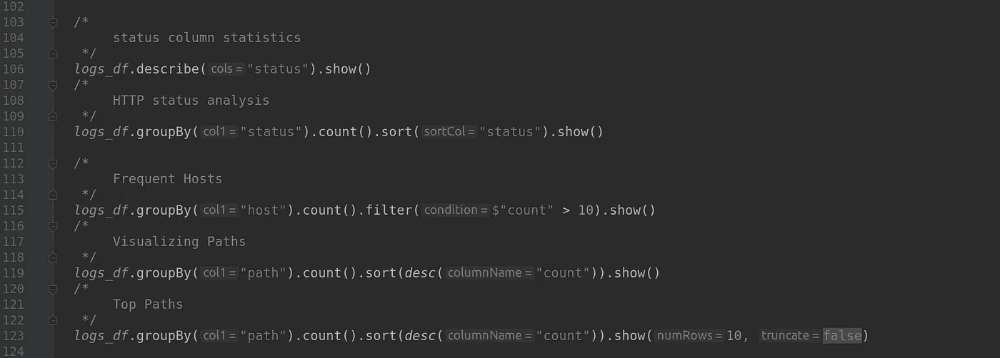
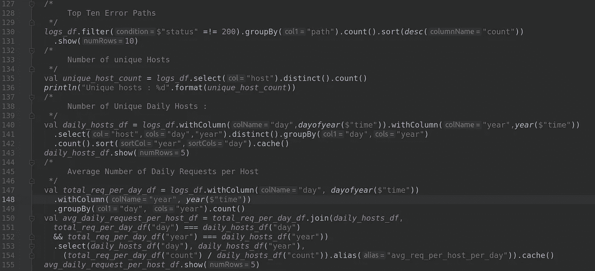
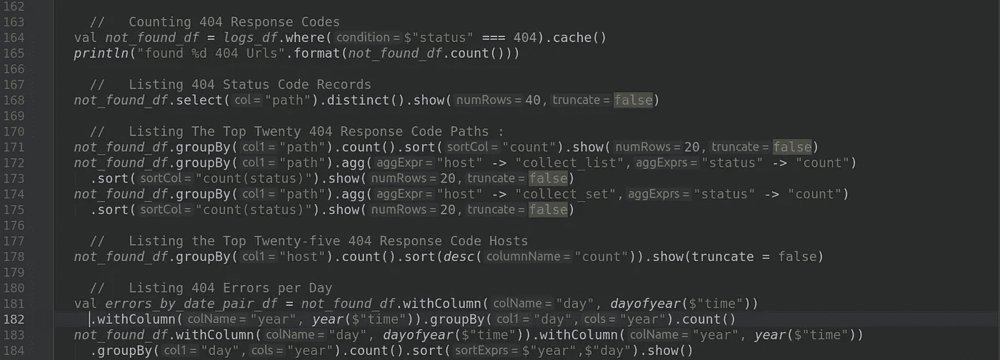

# Spark:使用 Scala 进行 Web 服务器日志分析

> 原文：<https://medium.com/analytics-vidhya/spark-web-server-logs-analysis-with-scala-74e0ece40a4e?source=collection_archive---------3----------------------->


Web 服务器日志分析

欢迎来到 Spark cookbook 系列，在上一篇文章中，我们制作了一个 ETL(提取、转换和加载)示例，在该示例中，我们从 CSV 文件中加载数据，清理数据，对其进行一些转换，最后我们将其加载到 postgreSQL 数据库中，并将其导出为 JSON 文件。

在本文中，我们将向您展示解析 web 服务器日志文件并对其进行一些分析是多么简单。

一般来说，**服务器日志**是一个由服务器自动创建和维护的日志文件(或几个文件),由它执行的活动列表组成。例如，web 服务器日志维护页面请求的历史。 [W3C](https://en.wikipedia.org/wiki/World_Wide_Web_Consortium) 为 web 服务器日志文件维护了一种标准格式([通用日志格式](https://en.wikipedia.org/wiki/Common_Log_Format))。

对于这个实验，我们将使用来自 [Kaggle](https://www.kaggle.com/shawon10/web-log-dataset) 网站的随机数据集，它包含一年的所有 HTTP 请求。

## 通用日志文件格式:

常见的日志文件格式如下:

```
*remotehost rfc931 authuser [date] "request" status bytes*
```

*   **remotehost** :远程主机名(或者 IP 号，如果 DNS 主机名不可用，或者 DNSLookup 关闭。
*   **rfc931** :用户的远程日志名。
*   **authuser** :用户认证自己的用户名
*   **【日期】**:请求的日期和时间。
*   **“请求”**:来自客户端的请求行。
*   **状态**:返回给客户端的 HTTP 状态码。
*   **字节**:传输文件的内容长度。

# 我们开始吧:)

# 先决条件:

这个示例是使用 IntelliJ IDEA 制作的，为了使用 spark，请确保将其库添加到 build.sbt 文件中，如下所示:

```
*name* := "SparkLabs"

*version* := "0.1"

*scalaVersion* := "2.11.0"

// https://mvnrepository.com/artifact/org.apache.spark/spark-core
*libraryDependencies* += "org.apache.spark" %% "spark-core" % "2.4.3"

// https://mvnrepository.com/artifact/org.apache.spark/spark-sql
*libraryDependencies* += "org.apache.spark" %% "spark-sql" % "2.4.3"

// https://mvnrepository.com/artifact/org.postgresql/postgresql
*libraryDependencies* += "org.postgresql" % "postgresql" % "42.2.8"
```

# I)加载日志文件:



数据加载

```
Result : 
root
 |-- value: string (nullable = true)+---------------------------------------------------------------+
|value                                                          |
+---------------------------------------------------------------+
|IP,Time,URL,Staus                                              |
|10.128.2.1,[29/Nov/2017:06:58:55,GET /login.php HTTP/1.1,200   |
|10.128.2.1,[29/Nov/2017:06:59:02,POST /process.php HTTP/1.1,302|
+---------------------------------------------------------------+
only showing top 3 rows
```

正如您在第 12 行中看到的，因为我们的数据是非结构化的，所以我们使用了 text 函数来读取文件，这产生了一个 dataframe，其中只有一个名为“value”的列。

接下来，我们必须将数据解析到各个列中，为此我们将使用特殊函数[***regexp _ extract***](https://spark.apache.org/docs/latest/api/scala/index.html#org.apache.spark.sql.functions$)***()***，它们分别将要解析的列作为参数，要捕获的组的正则表达式和索引如下:

```
def regexp_extract(e: Column, exp: String, groupIdx: Int): ColumnExtract a specific group matched by a Java regex, from the specified string column. If the regex did not match, or the specified group did not match, an empty string is returned.Since
1.5.0
```

如果你不熟悉正则表达式，我建议你查看下面的网站。

 [## 正则表达式-学习正则表达式-第 1 课:介绍，和 ABC

### 正则表达式在从文本中提取信息时非常有用，比如代码、日志文件、电子表格或…

regexone.com](https://regexone.com/lesson/introduction_abcs) 

我想你已经注意到我们的日志文件只包含 4 个字段:

*   远程主机:10.128.2.1
*   日期:[29/11/2017:06:58:55
*   请求:GET /login.php HTTP/1.1
*   状态:200

# II)解析日志文件:



解析 web 服务器日志文件

因此，现在我们将单列“值”分成四个单独的列:主机、时间戳、路径和状态，为了提供正则表达式，我们使用三重引号语法，这样我们就可以使用特殊的正则表达式字符' \d，\s …'，而不会转义反斜杠。^([^(\s|,)]+)意味着我们从行'^'的开头开始解析，然后我们捕获每个不是空格或逗号的字符'[^(\s|,)]'，通常 s 指的是任何空格字符，这就是为什么我们在方括号和'^'.中使用它

我们解析的结果如下:

```
+----------+--------------------+------------------------+------+
|host      |timestamp           |path                    |status|
+----------+--------------------+------------------------+------+
|IP        |                    |                        |null  |
|10.128.2.1|29/Nov/2017:06:58:55|/login.php              |200   |
|10.128.2.1|29/Nov/2017:06:59:02|/process.php            |302   |
|10.128.2.1|29/Nov/2017:06:59:03|/home.php               |200   |
|10.131.2.1|29/Nov/2017:06:59:04|/js/vendor/moment.min.js|200   |
+----------+--------------------+------------------------+------+
only showing top 5 rowsroot
 |-- host: string (nullable = true)
 |-- timestamp: string (nullable = true)
 |-- path: string (nullable = true)
 |-- status: integer (nullable = true)
```

# III)数据清理:

## I)零检查



数据清理

这里，我们检查了初始数据集是否包含任何空值，然后检查了解析的每一列。我们发现解析的数据集包含 **219** 个坏行。

为了统计每一列中空值的数量，我们创建了一个函数' ***count_null*** '，该函数将一列作为参数，然后过滤空值并将其转换为 1，之后我们将所有的 1 值相加得到空值的总数

**结果:**

```
Number of bad row in the initial dataset : 0
Number of bad rows : 219
+----+---------+----+------+
|host|timestamp|path|status|
+----+---------+----+------+
|   0|        0|   0|   219|
+----+---------+----+------+Number of bad rows : 219
+--------------------+
|          bad_status|
+--------------------+
|   IP,Time,URL,Staus|
|chmod:,cannot,'a....|
|chmod:,cannot,'er...|
|rm:,cannot,'*.o':,No|
|rm:,cannot,'a.out...|
+--------------------+
```

## ii)修复具有空状态的行:



使用 na 包删除具有空值的行

这里我们选择删除所有空值的行。

**结果:**

```
The count of null value : 0
Before : 16008 | After : 15789
```

## iii)解析时间戳:



将字符串解析为时间戳

**结果:**

```
+--------------------+
|to_date(`timestamp`)|
+--------------------+
|                null|
|                null|
+--------------------+
only showing top 2 rowsroot
 |-- host: string (nullable = true)
 |-- path: string (nullable = true)
 |-- status: integer (nullable = true)
 |-- time: timestamp (nullable = true)+----------+------------+------+-------------------+
|      host|        path|status|               time|
+----------+------------+------+-------------------+
|10.128.2.1|  /login.php|   200|2017-11-29 06:58:55|
|10.128.2.1|/process.php|   302|2017-11-29 06:59:02|
+----------+------------+------+-------------------+
only showing top 2 rows
```

# IV)分析走查:

## I)我们的数据集的分布:



数据分布

**结果:**

```
status column statistics :
+-------+------------------+
|summary|            status|
+-------+------------------+
|  count|             15789|
|   mean|230.19469250744189|
| stddev| 50.05853522906924|
|    min|               200|
|    max|               404|
+-------+------------------+HTTP status analysis :
+------+-----+
|status|count|
+------+-----+
|   200|11330|
|   206|   52|
|   302| 3498|
|   304|  658|
|   404|  251|
+------+-----+Frequent Hosts :
+----------+-----+
|      host|count|
+----------+-----+
|10.131.2.1| 1626|
|10.128.2.1| 4257|
|10.130.2.1| 4056|
|10.131.0.1| 4198|
|10.129.2.1| 1652|
+----------+-----+ +--------------------+-----+
|                path|count|
+--------------------+-----+
|          /login.php| 3298|
|           /home.php| 2653|
|/js/vendor/modern...| 1417|
|                   /|  862|
|/contestproblem.p...|  467|
|  /css/normalize.css|  408|
|/css/bootstrap.mi...|  404|
|/css/font-awesome...|  399|
|      /css/style.css|  395|
|       /css/main.css|  394|
|/js/vendor/jquery...|  387|
|/bootstrap-3.3.7/...|  382|
|        /process.php|  317|
|        /contest.php|  249|
|        /archive.php|  246|
|/fonts/fontawesom...|  245|
|         /robots.txt|  224|
|       /img/ruet.png|  213|
|/bootstrap-3.3.7/...|  191|
|/js/vendor/moment...|  173|
+--------------------+-----+
only showing top 20 rowsTop Paths :
+--------------------+-----+
|                path|count|
+--------------------+-----+
|          /login.php| 3298|
|           /home.php| 2653|
|/js/vendor/modern...| 1417|
|                   /|  862|
|/contestproblem.p...|  467|
|  /css/normalize.css|  408|
|/css/bootstrap.mi...|  404|
|/css/font-awesome...|  399|
|      /css/style.css|  395|
|       /css/main.css|  394|
+--------------------+-----+
only showing top 10 rows
```

## ii)分析 Web 服务器日志文件:



数据探索

**结果:**

```
Top Ten Error Paths :
+--------------------+-----+
|                path|count|
+--------------------+-----+
|           /home.php| 2167|
|                   /|  741|
|        /process.php|  317|
|         /robots.txt|  224|
|         /action.php|   83|
|/contestproblem.p...|   74|
|/js/vendor/jquery...|   73|
|/js/vendor/modern...|   72|
|/css/bootstrap.mi...|   72|
|       /css/main.css|   68|
+--------------------+-----+
only showing top 10 rowsUnique hosts : 5Number of Unique Daily Hosts :
+---+----+-----+
|day|year|count|
+---+----+-----+
|311|2017|    1|
|312|2017|    5|
|313|2017|    5|
|314|2017|    5|
|315|2017|    5|
+---+----+-----+
only showing top 5 rowsAverage Number of Daily Requests per Host :
+---+----+------------------------+
|day|year|avg_req_per_host_per_day|
+---+----+------------------------+
|335|2017|                    93.6|
|327|2017|                    76.0|
| 60|2018|      10.333333333333334|
|350|2017|      51.666666666666664|
| 46|2018|       6.666666666666667|
+---+----+------------------------+
only showing top 5 rows
```

## iii)探索 404 状态代码:

让我们深入研究错误 404 状态记录，我们都见过那些“404 未找到”的网页。当服务器找不到浏览器客户端请求的资源(页面或对象)时，返回 404 错误。



404 状态代码分析

**结果:**

```
Counting 404 Response Codes :
found 251 404 UrlsListing 404 Status Code Records :
+---------------------------------------+
|path                                   |
+---------------------------------------+
|/css/bootstrap.min.css.map             |
|/robots.txt                            |
|/djs/vendor/bootstrap-datetimepicker.js|
|/favicon.ico                           |
+---------------------------------------+Listing The Top Twenty 404 Response Code Paths :
+---------------------------------------+-----+
|path                                   |count|
+---------------------------------------+-----+
|/css/bootstrap.min.css.map             |1    |
|/djs/vendor/bootstrap-datetimepicker.js|7    |
|/favicon.ico                           |19   |
|/robots.txt                            |224  |
+---------------------------------------+-----++--------------------+--------------------+-------------+
|                path|  collect_list(host)|count(status)|
+--------------------+--------------------+-------------+
|/css/bootstrap.mi...|        [10.130.2.1]|            1|
|/djs/vendor/boots...|[10.131.0.1, 10.1...|            7|
|        /favicon.ico|[10.128.2.1, 10.1...|           19|
|         /robots.txt|[10.131.0.1, 10.1...|          224|
+--------------------+--------------------+-------------++--------------------+--------------------+-------------+
|                path|   collect_set(host)|count(status)|
+--------------------+--------------------+-------------+
|/css/bootstrap.mi...|        [10.130.2.1]|            1|
|/djs/vendor/boots...|[10.130.2.1, 10.1...|            7|
|        /favicon.ico|[10.130.2.1, 10.1...|           19|
|         /robots.txt|[10.130.2.1, 10.1...|          224|
+--------------------+--------------------+-------------+Listing the Top Twenty-five 404 Response Code Hosts :
+----------+-----+
|host      |count|
+----------+-----+
|10.128.2.1|67   |
|10.131.0.1|61   |
|10.130.2.1|52   |
|10.129.2.1|41   |
|10.131.2.1|30   |
+----------+-----+ Listing 404 Errors per Day :
+---+----+-----+
|day|year|count|
+---+----+-----+
|312|2017|    8|
|313|2017|   10|
|314|2017|    6|
|315|2017|   12|
|316|2017|    6|
|317|2017|   10|
|318|2017|   18|
|319|2017|    8|
|320|2017|   10|
|321|2017|    5|
+---+----+-----+
only showing top 10 rows
```

## 总结:

在本实验中，我们学习了如何使用 regexp_extract 函数加载和解析数据，然后在 na 包的帮助下清理数据，然后使用 UDF 将日期列转换为有效的时间戳，最后我们浏览了数据并对其进行了一些分析。

# 附录:

```
import org.apache.log4j.{Level, Logger}
import org.apache.spark.sql.{Column, SparkSession}
import org.apache.spark.sql.functions.{*regexp_extract*,sum,*col*,to_date,udf,to_timestamp,*desc*,*dayofyear*,*year*}

object WebLog extends App {

  Logger.*getLogger*("org").setLevel(Level.*OFF*)
  val *spark* = SparkSession.*builder*().appName("WebLog").master("local[*]").getOrCreate()
  import *spark*.implicits._
  //this will produce a dataframe with a single column called value
  val *base_df* = *spark*.read.text("/home/achraf/Desktop/labo/SparkLab/datasets/weblog.csv")
  *base_df*.printSchema()

  //let's look at some of the data
  *base_df*.show(3,false)

  /* So our data is organized as follows
  |remote host  : 10.128.2.1
  | date        : [29/Nov/2017:06:58:55
  | request     : GET /login.php HTTP/1.1
  | status      : 200
   */

  /*
      Parsing the log file
   */
  val *parsed_df* = *base_df*.select(*regexp_extract*($"value","""^([^(\s|,)]+)""",1).alias("host"),
    *regexp_extract*($"value","""^.*\[(\d\d/\w{3}/\d{4}:\d{2}:\d{2}:\d{2})""",1).as("timestamp"),
    *regexp_extract*($"value","""^.*\w+\s+([^\s]+)\s+HTTP.*""",1).as("path"),
    *regexp_extract*($"value","""^.*,([^\s]+)$""",1).cast("int").alias("status"))
  *parsed_df*.show(5,false)
  *parsed_df*.printSchema()

  /*
     Data cleaning
   */
  // check if the initial dataset contain any null values
  *println*("Number of bad row in the initial dataset : " + *base_df*.filter($"value".isNull).count())

  // lets see our parsed dataset
  val *bad_rows_df* = *parsed_df*.filter($"host".isNull || $"timestamp".isNull || $"path".isNull || $"status".isNull)
  *println*("Number of bad rows : " + *bad_rows_df*.count())
  // same result as the previous statement but with different syntax
  //val bad_rows_df = parsed_df.filter($"host".isNull.or($"timestamp".isNull).or($"path".isNull)
  // .or($"status".isNull)).count

  // lets count number of null values in each column
  // we create a function that convert null value to one and then we count the number of one value
  def count_null(col_name: Column): Column = *sum*(col_name.isNull.cast("int")).alias(col_name.toString())
  val *t* = *parsed_df*.columns.map(col_name => *count_null*(*col*(col_name)))
  *parsed_df*.select(*t*: _*).show()

  // So all the null values are in status column, let's check what does it contain
  val *bad_status_df* = *base_df*.select(*regexp_extract*($"value","""([^\d]+)$""",1).as("bad_status"))
    .filter($"bad_status".notEqual(""))
  *println*("Number of bad rows : " + *bad_status_df*.count())
  // So the bad content correspond to error result, in our case this is just polluting our logs and our results
  *bad_status_df*.show(5)

  /*
       Fix the rows with null status
   */

  // we have two option, replace the null value by some other meaningful value, or delete the whole line
  // we will go with the other option since those lines are with no value for us
  // we will use the na subpackage on a dataframe
  val *cleaned_df* = *parsed_df*.na.drop()

  // let's check that we don't have any null value
  *println*("The count of null value : " + *cleaned_df*.filter($"host".isNull || $"timestamp".isNull || $"path".isNull
    || $"status".isNull).count())
  // count before and after
  *println*("Before : " + *parsed_df*.count() + " | After : " + *cleaned_df*.count())

  /*
       Parsing the timestamp
   */
  // let's try to cast the timestamp column to date
  // surprised ! we got null value, that's because when spark is not able to convert a date value
  // it just return null
  *cleaned_df*.select(*to_date*($"timestamp")).show(2)

  // Let's fix this by converting the timestamp column to the format spark knows
  val *month_map* = *Map*("Jan" -> 1, "Feb" -> 2, "Mar" -> 3, "Apr" -> 4, "May" -> 5, "Jun" -> 6, "Jul" -> 7, "Aug" -> 8
    , "Sep" -> 9, "Oct" -> 10, "Nov" -> 11, "Dec" -> 12)
  def parse_clf_time(s: String) ={
    "%3$s-%2$s-%1$s %4$s:%5$s:%6$s".format(s.substring(0,2),*month_map*(s.substring(3,6)),s.substring(7,11)
      ,s.substring(12,14),s.substring(15,17),s.substring(18))
  }

  val *toTimestamp* = *udf*[String, String](*parse_clf_time*(_))
  val *logs_df* = *cleaned_df*.select($"*",*to_timestamp*(*toTimestamp*($"timestamp")).alias("time"))
    .drop("timestamp")
  *logs_df*.printSchema()
  *logs_df*.show(2)
  // We cache the dataset so the next action would be faster
  *logs_df*.cache()

  //       ====<  Analysis walk-trough  >====

  /*
       status column statistics
   */
  *logs_df*.describe("status").show()
  /*
       HTTP status analysis
   */
  *logs_df*.groupBy("status").count().sort("status").show()

  /*
       Frequent Hosts
   */
  *logs_df*.groupBy("host").count().filter($"count" > 10).show()
  /*
       Visualizing Paths
   */
  *logs_df*.groupBy("path").count().sort(*desc*("count")).show()
  /*
       Top Paths
   */
  *logs_df*.groupBy("path").count().sort(*desc*("count")).show(10)

  //       ====< Analyzing Web Server Log File >====

  /*
       Top Ten Error Paths
   */
  *logs_df*.filter($"status" =!= 200).groupBy("path").count().sort(*desc*("count"))
    .show(10)
  /*
       Number of unique Hosts
   */
  val *unique_host_count* = *logs_df*.select("host").distinct().count()
  *println*("Unique hosts : %d".format(*unique_host_count*))
  /*
       Number of Unique Daily Hosts :
   */
  val *daily_hosts_df* = *logs_df*.withColumn("day",*dayofyear*($"time")).withColumn("year",*year*($"time"))
    .select("host","day","year").distinct().groupBy("day","year")
    .count().sort("year","day").cache()
  *daily_hosts_df*.show(5)
  /*
       Average Number of Daily Requests per Host
   */
  val *total_req_per_day_df* = *logs_df*.withColumn("day", *dayofyear*($"time"))
    .withColumn("year", *year*($"time"))
    .groupBy("day", "year").count()
  val *avg_daily_request_per_host_df* = *total_req_per_day_df*.join(*daily_hosts_df*,
    *total_req_per_day_df*("day") === *daily_hosts_df*("day")
    && *total_req_per_day_df*("year") === *daily_hosts_df*("year"))
    .select(*daily_hosts_df*("day"), *daily_hosts_df*("year"),
      (*total_req_per_day_df*("count") / *daily_hosts_df*("count")).alias("avg_req_per_host_per_day")).cache()
  *avg_daily_request_per_host_df*.show(5)

  //      ====< Exploring 404 status codes >====
  /*
      Let's drill down and explore the error 404 status records, We've all seen those "404 Not Found" web pages.
      404 errors are returned when the server cannot find the resource (page or object) the browser client requested.
   */

    //   Counting 404 Response Codes
  val *not_found_df* = *logs_df*.where($"status" === 404).cache()
  *println*("found %d 404 Urls".format(*not_found_df*.count()))

    //   Listing 404 Status Code Records
  *not_found_df*.select("path").distinct().show(40,false)

    //   Listing The Top Twenty 404 Response Code Paths :
  *not_found_df*.groupBy("path").count().sort("count").show(20,false)
  *not_found_df*.groupBy("path").agg("host" -> "collect_list","status" -> "count")
    .sort("count(status)").show(20)
  *not_found_df*.groupBy("path").agg("host" -> "collect_set","status" -> "count")
    .sort("count(status)").show(20)

    //   Listing the Top Twenty-five 404 Response Code Hosts
  *not_found_df*.groupBy("host").count().sort(*desc*("count")).show(truncate = false)

    //   Listing 404 Errors per Day
  val *errors_by_date_pair_df* = *not_found_df*.withColumn("day", *dayofyear*($"time"))
    .withColumn("year", *year*($"time")).groupBy("day","year").count()
  *not_found_df*.withColumn("day", *dayofyear*($"time")).withColumn("year", *year*($"time"))
    .groupBy("day","year").count().sort($"year",$"day").show(10)

}
```