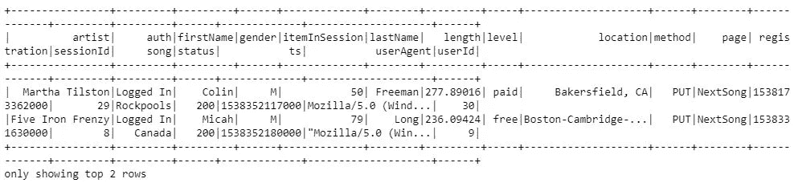

# Sparkify:流失预测的一个用例

> 原文：<https://medium.com/analytics-vidhya/sparkify-a-use-case-on-churn-prediction-c9ba14d23df8?source=collection_archive---------9----------------------->

## 在大量数据上，如何使用 Spark 解决现实世界的问题


由[韦斯利·廷吉](https://unsplash.com/@wesleyphotography?utm_source=medium&utm_medium=referral)在 [Unsplash](https://unsplash.com?utm_source=medium&utm_medium=referral) 拍摄的照片

# 概观

很容易认为获得新客户是决定企业成功的核心指标。然而，客户维系对任何企业的持续发展都同样重要，在当今时代的数字环境中更是如此。

Sparkify 与 Spotify & Pandora 一样，是一家音乐流媒体服务公司，希望通过预测客户可能流失的方式来遏制客户流失。对其有利的是，它可以访问其服务的所有客户使用日志数据，并希望利用 PySpark 的功能通过确定客户流失来获得其数据的价值。

由于数据量很大，使用 Spark 框架成为必须。本研究更侧重于如何使用 PySpark 处理小样本数据，这些数据可以在以后扩展到整个数据。

# 让我们看看数据

迷你文件(128 Mb)是一个 json 文件，可以在工作区目录中找到。使用 spark.read 命令将该文件加载到工作簿中



这些数据包含客户在应用程序上的大部分用户活动，包括会话信息、听的歌曲和艺术家、反馈和体验功能、帐户信息以及一些人口统计信息

# 定义客户流失

被搅动的顾客被定义为有`Cancellation Confirmation`事件的人，这种事件对付费用户和免费用户都发生。

# 使用其他功能探索客户流失

通过可视化，尝试探索流失和非流失群组如何与数据中的不同特征相关


基于探索性分析，我们可以清楚地推断出一些见解。与非搅动者相比，搅动者在寿命(系统上的年龄)、听的艺术家和歌曲的数量、上下重击以及性别和级别混合方面具有不同的行为。

# 我们可以从数据中创建什么特征来馈入模型？

衍生的特征类别有:

*   系统中的天数
*   相关歌曲
*   艺术家相关
*   会话相关
*   相关页面上的活动
*   人口统计(性别)
*   经验相关(上下重击)

这些功能将衡量客户对应用程序的参与度和忠诚度。让我们看一个关于如何在 PySpark 中获得这些特性的示例代码。


# 获得流失预测模型的步骤

在下一步中，对特征进行处理，以在用标准缩放器进行变换之后创建所需的向量。

这些处理过的数据被分成训练、测试和验证集


对训练数据进行 Logistic、决策树和梯度推进分类器训练，得到初始分类模型。F-1 被用作性能度量，因为 F-1 分数是精确度和召回率的加权平均值。因此，这个分数同时考虑了误报和漏报。


# 模型总结结果:

```
-  Logistic Classifier gives a F1 score of 0.79 on train data and 0.25 on validation data
-  DT Classifier gives a F1 score of 0.75 on train data and 0.60 on validation data
-  GB Classifier gives a F1 score of 0.74 on train data and 0.60 on validation data
```

最后，利用 GB 分类器对参数进行调整，选出最佳模型。

# 识别推动客户流失的重要特征


从功能重要性来看，我们可以看到天数(系统运行天数)成为最重要的变量。探索部分也强调了这一点，我们发现 Sparkify 上任期较短的客户更有可能流失。其他功能，如每次会议重击，添加朋友和最小会议时间也是很重要的功能。每次点击次数多的客户对他们看到的内容不满意，更有可能流失。

要查看更多关于分析的内容，请点击这里查看我的 **Github** 可用[的链接](https://github.com/Akhil-Anurag/Sparkify)