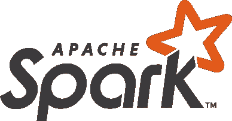
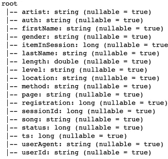
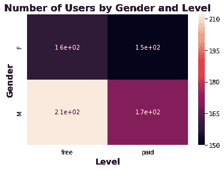
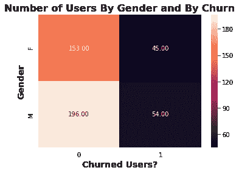
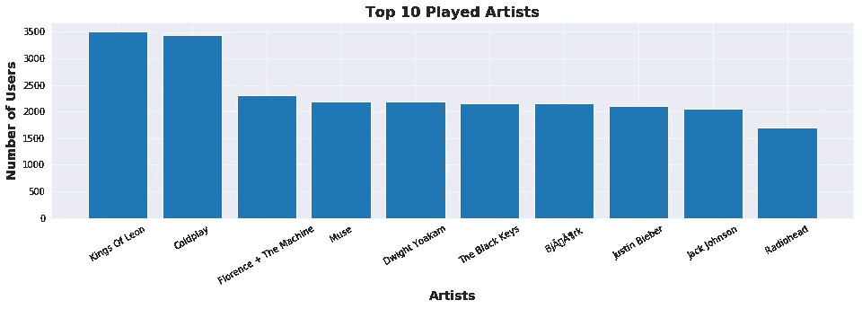
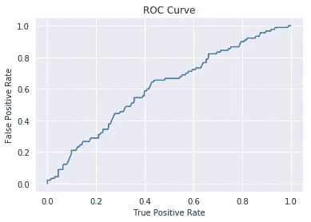

# Sparkify:用 Spark 为一家音乐流媒体公司预测用户流失

> 原文：<https://medium.com/analytics-vidhya/sparkify-predicting-churn-with-spark-for-a-music-streaming-company-f3fe90df608d?source=collection_archive---------12----------------------->

([来源](https://www.evergent.com/tag/churn/))

> **客户** C **hurn** 是指现有客户、用户、玩家、订户或任何类型的回头客停止业务或终止与某公司的关系。
> 
> 例如，这可能意味着取消订阅、终止会员资格、关闭某种账户、不续签服务协议或合同，甚至顾客决定在另一家商店购买他或她的食品杂货[1]。

正如你所想象的，这个项目是关于客户流失的。而且也全是关于数据科学，机器学习，大数据！具体来说，在这个项目中，我们将共同构建一个针对大数据问题的端到端数据科学项目:预测客户流失。

我们将使用 **IBM Watson Studio** ，它为我们提供了一个 **Lite free** 帐户，允许我们使用 Spark 进行分布式计算。然而，请记住，这个免费帐户提供的计算能力是有限的，因此，我们不能使用太大的数据集，也不能应用太复杂的算法。

## **稍微介绍一下 Apache Spark**

Apache Spark 是一个开源集群计算框架，也是目前最流行的大数据分析工具之一。从理论上讲，Spark 对于我们的计算机内存无法容纳的大数据是有用的。然而，考虑到 IBM Watson 免费提供的计算能力，我们将使用一个 250MB 的数据集，这并不算大。

## IBM Watson 工作室

在这个项目中，我将使用 IBM 提供的免费 Lite 帐户，它允许我们使用一个 Jupyter 笔记本，该笔记本使用**一个带有 1 个 vCPU 和 4 GB RAM 的驱动程序，以及 2 个各带有 1 个 vCPU 和 4 GB RAM 的执行器。**因此，我将使用安装了 Python 3.6 和 **PySpark** 的笔记本。

## 项目概述

该项目将分为以下几个主要主题:

*   **ETL +解释性数据分析**
*   **机器学习**

**提取负荷变换和解释性数据分析**

这个项目中使用的数据由一个虚构的音乐流媒体公司 Sparkify 的用户日志文件组成。数据由 **Udacity** 提供，作为**数据科学家纳米学位项目的一部分。**

数据集的主要结构如下图所示。

正如我们所看到的，我们有关于每个用户交互的大量信息，以及相应的时间戳，这为我们创建预测客户流失的功能提供了强大的数据！

让我们试着从这个数据集中获得一些见解！

探索这些数据，我最终发现了一些有趣的信息:

*   在数据集中，我们有大约 499351 个独特的时间戳(用户交互)，平均而言，每个用户有大约 1140 次交互。
*   **从这个数据中，我们有 4470 个独特的会话。**
*   **平均来说，用户在进入主页之前会听大约 24 首音乐。**

由于我们使用的是精简的数据集，可以注意到我们总共有 448 个用户，按性别和级别(免费或付费)分布，如左图所示。

此外，Sparkify 还提供以下页面:

*   取消，提交降级，拇指向下，主页
*   降级、滚动广告、注销、保存设置
*   保存设置
*   **取消确认**
*   关于，设置，添加到播放列表，添加朋友，下一首歌曲
*   竖起大拇指，帮助，升级，错误，提交升级

为了这个项目，**我将把客户流失定义为取消确认的行为。**因此，取消 Sparkify 服务的用户将被标记为 1，Sparkify 的当前用户将被标记为 0。

考虑到客户流失的定义，按性别和级别划分的用户分布可以重新计算如下。

人们也可能对哪些艺术家用户最喜欢听感兴趣。下图显示了收听率最高的 10 位艺术家。

## 特征工程

作为 ETL 过程的一部分，我使用上面描述的数据集来创建我发现对预测客户流失有用的特性。工程特性列表如下所述:

*   **用户在访问主页期间平均收听的歌曲数量**
*   **每个用户收听的不同艺术家的数量**
*   **每个用户收听的歌曲数量**
*   **根据最大观察时间戳，用户多久前注册**
*   **如果用户在历史中曾经是付费级别用户**
*   **用户性别**
*   **用户听一首歌的总时间**
*   **每个用户每次收听的平均歌曲数量**

要查看关于这些特性的更多细节以及它们是如何被每个用户分发的，请查看我的 [**GitHub**](https://github.com/GiulioCMSanto/sparkify_predicting_churn_with_spark) **上的项目。**

## 机器学习

上述特征然后被用于预测流失。数据清理和特性工程过程在 ETL 管道中进行了转换，以使该过程更加容易。

在这个项目中使用了两条不同的机器学习流水线:一条包含一个**逻辑回归器** **分类器**，另一条包含一个**随机森林分类器**。两个管道都使用标准的缩放器来缩放创建的特征以及 PySpark 运行模型所需的汇编器和索引器。

两种模型的结果如下所示:

**逻辑回归**

*   **精度:0.8**
*   **F1 得分:0.7**
*   **ROC 下面积:0.61**

在包含 90%数据的训练集上，使用三重交叉验证来训练管道。10%验证数据用于计算这些指标。考虑到机器的限制，在交叉验证中尝试了不同的参数组合。

**随机森林分类器**

随机森林分类器也使用三重交叉验证来训练。在这种情况下,“基尼”杂质用于测量信息增益，并在网格搜索中尝试不同的深度。

*   **精度:0.75**
*   **F1 得分:0.74**

# 结论

一个完整的数据科学项目成功建立，以预测流失。清除数据中的空值和重复值，并进行解释性数据分析。然后创建了一些功能，以允许人们执行能够预测用户是否会流失的机器学习算法。

考虑到可用的计算能力，由此产生的交叉验证指标是令人满意的。如果您愿意获得更好的结果，您可以升级您的 IBM Watson 机器，或者使用来自 Amazon AWS 的 EMR 来对所用模型中的参数以及更多的功能进行更深入的搜索。使用本项目中描述的机器，每个模型需要大约 25 分钟来训练，并搜索一些参数。

## 参考

[1][https://www . netigate . net/articles/customer-satisfaction/customer-churn-meaning/](https://www.netigate.net/articles/customer-satisfaction/customer-churn-meaning/)