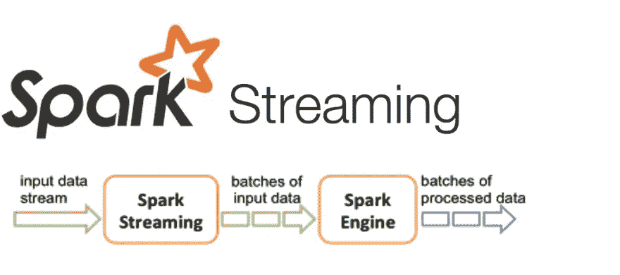

# Spark 在大数据中的角色

> 原文：<https://medium.com/analytics-vidhya/sparks-role-in-big-data-9db392228638?source=collection_archive---------34----------------------->

今天，大数据是一个热门话题。软件应用程序每天产生如此多的数据，与二十年前产生的数据量不可同日而语。此外，这些数据的传输速度很快，可以在几秒钟内接收数十亿字节的数据。大企业面临的共同问题是有效利用这些数据提高利润。

本文将描述典型问题如何变成大数据问题，以及 Spark 如何支持它。

您想到的第一个问题是，我们如何识别大数据问题。为此，我们有著名的**四 V** 定义。任何至少具有以下属性之一的问题都将是大数据问题。

**卷**

**速度**

**品种**

**准确性**

在大数据世界中，容量意味着万亿字节或千兆字节的数据。谈到速度，我们谈论的是每秒数百万个数据点。以不同结构出现的数据被视为大数据的变体。最后，准确性意味着我们在大数据世界中获得的不正确或有偏见的数据。

与数量相关的大数据问题的一个例子是分析数 Pb 的销售数据，以获得决策所需的洞察力。这么多数据无法加载到一台机器上进行分析。为了解决这个问题，分布式文件系统应运而生。

速度相关问题的一个例子是分析实时 Twitter feed。在这种情况下，我们需要每秒分析数百万条推文。为了解决这一问题，流处理应运而生。

当我们考虑多样性如何成为一个大数据问题时，我们需要考虑为我们提供数据的来源。大数据的多样性意味着不同的数据源以不同的格式发送数据。不同来源的数据结构不同，因此很难从不同来源的数据中提取所需的字段。

最后，大数据中的准确性意味着数据中的偏差和错误。例如，我们来看一个 twitter feed。twitter feed 中包含的信息有时可能不正确，有时对于特定社区可能是正确的。所以很难鉴别什么是真什么是假。

现在我们根据上面提到的**四个** **V 的**有了一个典型问题如何变成大数据问题的想法。因此，让我们来看看什么是 Spark 及其在大数据中的作用。

**Spark** 是 **Apache** 软件基金会下的开源项目。它是一个运行在集群之上的计算系统。虽然 Spark 是用 **Scala** 编写的，但它支持像 **Java** 、 **Scala** 、 **Python** 和 **R** 这样的语言。Spark 使用 RDDs(弹性分布式数据集)作为底层数据结构。我们可以对这些 RDD 进行转换。例如，假设我们需要增加 RDD 中的一个字段并获得结果。然后 Spark 将创建一个新的 RDD，其值递增。与此同时，Spark 将使用下划线集群来满足任何计算要求，从而从旧的 RDD 创建新的。

与传统的分布式计算方法(如 map-reduce)相比，Spark 的速度更快，因为它具有内存处理行为。说到部署 Spark 作业，我们有几个选项，如**独立部署模式**、 **Apache Mesos** 、 **Hadoop YARN** 和 **Kubernetes** 。在这些选项中，最常见的选项是在 yarn 集群上部署 spark 作业。典型的纱线簇将至少具有一个主节点和一个从节点。当我们在客户机模式下将一个 Spark 作业部署到一个 yarn 集群中时，它将类似于独立模式。该作业将在主节点上运行并执行计算。另一方面，如果我们在集群模式下将 Spark 作业部署到 yarn 集群中，主节点将执行协调作业，并使用从节点来执行计算。需要记住的一点是，一些在客户机模式下运行良好的作业有时在集群模式下无法运行，因为集群模式意味着我们使用分布式计算。

来源:[https://spark . Apache . org/docs/latest/img/cluster-overview . png](https://spark.apache.org/docs/latest/img/cluster-overview.png)

借助 Spark，我们获得了解决大数据问题所必需的整套功能。在处理大型数据集时， **SparkSQL** 工具将为开发人员提供传统的 **MySQL** 风格。 **MLlib** 机器学习库提供在 Spark 应用内部使用的机器学习算法。除此之外，Spark 还提供了**数据集**，这是 rdd 之上的一个抽象。这类似于我们熟悉的 **Python** 和 **R** 中的数据帧。

Spark 最重要的功能是批处理和流处理。这两项功能允许解决大数据中与容量和速度相关的问题。这里需要记住的一点是，Spark 流不是实时流。在 Spark streaming 中，我们拥有的是批处理。Spark 将一组小批量流水线化为流。因此，如果你的需求是实时流，最好使用 **Apache Storm** 或 **Apache Flink** 。

来源:https://spark.apache.org/docs/latest/img/streaming-flow.png

最后，我要说的是，Spark 提供了一个适合解决大数据问题的完整生态系统。为什么我这样说，是火花为我们提供了几乎一切。看，我们有批处理，实时处理(实际上它不是实时的，但对大多数情况来说已经足够了。)和一个机器学习库。此外，不要忘记 Spark 有一个非常好的开源社区，在那里你可以随时获得支持。