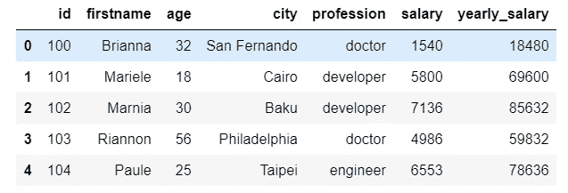

# 使用 Pyspark 的 SparkSQL 和 DataFrame(高级 API)基础知识

> 原文：<https://medium.com/analytics-vidhya/sparksql-and-dataframe-high-level-api-basics-using-pyspark-eaba6acf944b?source=collection_archive---------5----------------------->

在上一篇文章中，我们讨论了 Spark RDDs，它是 Spark core 的基础部分(非结构化)。在本文中，我们将研究 Spark 核心的结构化部分；SparkSQL 和 DataFrames。SparkSQL 是 Spark 中也使用数据帧处理结构化数据的模块。

# 数据帧

DataFrame 是由行组成的结构化数据集合，分布在 Spark 的工作节点(执行器)上。基本上，数据帧就像关系数据库中的表，有自己的模式和标题。

数据帧由不同数据格式(如文件、csv、json)创建的数据行组成..)或者 Spark 自己的 RDDs。

在本文中，我将解释使用 PySpark API 对 Spark 数据帧进行的重要查询操作。让我们从创建一个数据帧开始。

# 创建数据框架

数据帧可以从 txt、csv、json 和 parquet 文件格式创建，也可以从现有的 rdd 创建。让我们从创建 RDD 的 DataFrame 开始；

```
from pyspark.sql.types import Rowlist_rdd=sc.parallelize([('Messi',33),('Ronaldo',35),('Salah',28),('Neymar',28),('Mbappe',21)])

players = list_rdd.map(lambda x: Row(name=x[0], age=int(x[1])))players_df = spark.createDataFrame(players)players_df.show()+-------+---+
|   name|age|
+-------+---+
|  Messi| 33|
|Ronaldo| 35|
|  Salah| 28|
| Neymar| 28|
| Mbappe| 21|
+-------+---+
```

现在让我们从不同类型的文件格式创建数据帧；

```
dataframe_json = spark.read.json('data\json_data.json')dataframe_txt = spark.read.text('data\text_data.txt')dataframe_csv = spark.read.csv('data\csv_data.csv')dataframe_parquet = spark.read.load('data\parquet_data.parquet')
```

既然我们已经学习了如何创建数据帧，我们可以通过使用示例数据集来深入研究一些重要的数据帧方法。

首先，我们将从用于检查数据帧中的数据的方法开始。

```
df= spark.read\
.option('header','true')\
.option('inferschema','true')\
.csv('data\customers.csv')
```

## **显示()**

函数的作用是:显示数据帧的内容，包括前 20 行。另外，show(n)方法返回 DataFrame 的前 n 行。

```
df.show(5)+---+---------+---+------------+----------+------+
| id|firstname|age|        city|profession|salary|
+---+---------+---+------------+----------+------+
|100|  Brianna| 32|San Fernando|    doctor|  1540|
|101|  Mariele| 18|       Cairo| developer|  5800|
|102|   Marnia| 30|        Baku| developer|  7136|
|103|  Riannon| 56|Philadelphia|    doctor|  4986|
|104|    Paule| 25|      Taipei|  engineer|  6553|
+---+---------+---+------------+----------+------+
only showing top 5 rows
```

## **printSchema()**

函数的作用是:以树的形式打印数据帧的模式。

```
df.printSchema()root
 |-- id: integer (nullable = true)
 |-- firstname: string (nullable = true)
 |-- age: integer (nullable = true)
 |-- city: string (nullable = true)
 |-- profession: string (nullable = true)
 |-- salary: integer (nullable = true)
```

## 计数()

count()函数计算 DataFrame 中的行数。

```
df.count()100
```

## 列()

columns()函数返回 DataFrame 的列。

```
df.columns()['id', 'firstname', 'age', 'city', 'profession', 'salary']
```

## 描述()

describe(n)函数计算 DataFrame 中选定的(n)列的汇总统计信息。

```
df.describe("age","salary").show()+-------+------------------+------------------+
|summary|               age|            salary|
+-------+------------------+------------------+
|  count|               100|               100|
|   mean|             41.87|           4788.18|
| stddev|14.444358585603409|2042.7282577351048|
|    min|                17|              1051|
|    max|                65|              7985|
+-------+------------------+------------------+
```

到目前为止，我们已经学习了许多用于检查数据的函数。现在我们可以继续查询操作。

## 选择()

select()函数只显示数据帧中选定的一列或多列。

```
df.select("firstname","age").show(5)+---------+---+
|firstname|age|
+---------+---+
|  Brianna| 32|
|  Mariele| 18|
|   Marnia| 30|
|  Riannon| 56|
|    Paule| 25|
+---------+---+
```

## 当()

when()函数根据我们要求的指定列的条件显示选定的列和指定的事例。

```
df.select("firstName",when(df.age > 30, 1).otherwise(0)).show(5)+---------+--------------------------------------+
|firstName|CASE WHEN (age > 30) THEN 1 ELSE 0 END|
+---------+--------------------------------------+
|  Brianna|                                     1|
|  Mariele|                                     0|
|   Marnia|                                     0|
|  Riannon|                                     1|
|    Paule|                                     0|
+---------+--------------------------------------+
```

## 喜欢()

like()函数显示选定的列，并通过指定“真”或“假”来筛选出我们要寻找的条件。

```
df.select("firstName",df.city.like("Baku")).show(5)+---------+--------------+
|firstName|city LIKE Baku|
+---------+--------------+
|  Brianna|         false|
|  Mariele|         false|
|   Marnia|          true|
|  Riannon|         false|
|    Paule|         false|
+---------+--------------+
```

## 开始于()

函数的作用是:从指定列中第一个单词的开头开始搜索括号中的字母。

```
df.select("firstName",df.profession.startswith("dev")).show(5)+---------+---------------------------+
|firstName|startswith(profession, dev)|
+---------+---------------------------+
|  Brianna|                      false|
|  Mariele|                       true|
|   Marnia|                       true|
|  Riannon|                      false|
|    Paule|                      false|
+---------+---------------------------+
```

## 端点()

函数的作用是:从指定列中最后一个单词的末尾开始搜索括号中的字母。

```
df.select("firstName",df.profession.endswith("er")).show(5)+---------+------------------------+
|firstName|endswith(profession, er)|
+---------+------------------------+
|  Brianna|                   false|
|  Mariele|                    true|
|   Marnia|                    true|
|  Riannon|                   false|
|    Paule|                    true|
+---------+------------------------+
```

## 子字符串()

substring()函数从指定长度的列中提取子串。

```
df.select(df["firstName"].substr(1, 3).alias("name")).show(5)+----+
|name|
+----+
| Bri|
| Mar|
| Mar|
| Ria|
| Pau|
+----+
```

## 介于()

between()函数在提供的条件之间过滤列。

```
df.select("firstName",df.age.between(22, 28)).show(5)+---------+-----------------------------+
|firstName|((age >= 22) AND (age <= 28))|
+---------+-----------------------------+
|  Brianna|                        false|
|  Mariele|                        false|
|   Marnia|                        false|
|  Riannon|                        false|
|    Paule|                         true|
+---------+-----------------------------+
```

Spark 高级 API 中还提供了添加、更新和删除列的功能。下面让我们来看看其中的一些功能。

## withColumn()

withcolumn()函数在现有数据帧中添加或替换列。它还可以用于转换数据帧中现有列的数据类型。

```
df.withColumn("yearly_salary",df.salary*12).show(5)+---+---------+---+------------+----------+------+-------------+
| id|firstname|age|        city|profession|salary|yearly_salary|
+---+---------+---+------------+----------+------+-------------+
|100|  Brianna| 32|San Fernando|    doctor|  1540|        18480|
|101|  Mariele| 18|       Cairo| developer|  5800|        69600|
|102|   Marnia| 30|        Baku| developer|  7136|        85632|
|103|  Riannon| 56|Philadelphia|    doctor|  4986|        59832|
|104|    Paule| 25|      Taipei|  engineer|  6553|        78636|
+---+---------+---+------------+----------+------+-------------+ df.withColumn("yearly_salary",col("yearly_salary").cast("float"))\
.show(5)+---+---------+---+------------+----------+------+-------------+
| id|firstname|age|        city|profession|salary|yearly_salary|
+---+---------+---+------------+----------+------+-------------+
|100|  Brianna| 32|San Fernando|    doctor|  1540|      18480.0|
|101|  Mariele| 18|       Cairo| developer|  5800|      69600.0|
|102|   Marnia| 30|        Baku| developer|  7136|      85632.0|
|103|  Riannon| 56|Philadelphia|    doctor|  4986|      59832.0|
|104|    Paule| 25|      Taipei|  engineer|  6553|      78636.0|
+---+---------+---+------------+----------+------+-------------+
```

## withColumnRenamed()

顾名思义，withColumnRenamed()函数重命名 DataFrame 的现有列。

```
df.withColumnRenamed("firstname","name").show(5)+---+-------+---+------------+----------+------+-------------+
| id|   name|age|        city|profession|salary|yearly_salary|
+---+-------+---+------------+----------+------+-------------+
|100|Brianna| 32|San Fernando|    doctor|  1540|        18480|
|101|Mariele| 18|       Cairo| developer|  5800|        69600|
|102| Marnia| 30|        Baku| developer|  7136|        85632|
|103|Riannon| 56|Philadelphia|    doctor|  4986|        59832|
|104|  Paule| 25|      Taipei|  engineer|  6553|        78636|
+---+-------+---+------------+----------+------+-------------+
```

## toDF()

函数的作用是:返回一个新的数据帧，并对它的所有列进行重命名。

```
people.toDF("id_no", "name", "years_old","address","job","wage","yearly_wage").show(5)+-----+-------+---------+------------+---------+----+-----------+
|id_no|   name|years_old|     address|      job|wage|yearly_wage|
+-----+-------+---------+------------+---------+----+-----------+
|  100|Brianna|       32|San Fernando|   doctor|1540|      18480|
|  101|Mariele|       18|       Cairo|developer|5800|      69600|
|  102| Marnia|       30|        Baku|developer|7136|      85632|
|  103|Riannon|       56|Philadelphia|   doctor|4986|      59832|
|  104|  Paule|       25|      Taipei| engineer|6553|      78636|
+-----+-------+---------+------------+---------+----+-----------+
```

## 丢弃()

drop()函数从 DataFrame 中删除一个现有列。

```
df.drop("yearly_salary").show(5)+---+---------+---+------------+----------+------+
| id|firstname|age|        city|profession|salary|
+---+---------+---+------------+----------+------+
|100|  Brianna| 32|San Fernando|    doctor|  1540|
|101|  Mariele| 18|       Cairo| developer|  5800|
|102|   Marnia| 30|        Baku| developer|  7136|
|103|  Riannon| 56|Philadelphia|    doctor|  4986|
|104|    Paule| 25|      Taipei|  engineer|  6553|
+---+---------+---+------------+----------+------+
```

最后，我们可以进行一些对数据分析非常有用的其他功能。在这里，我们将触及一些我们通常在 pyspark 中使用的流行元素。

## groupBy()

groupBy()函数根据相同的值将数据分成不同的组。

```
df.groupBy("age").count().show(5)+---+-----+
|age|count|
+---+-----+
| 31|    1|
| 65|    2|
| 34|    1|
| 28|    1|
| 27|    1|
+---+-----+
```

## 过滤器()

filter()函数按要求的条件过滤数据。

```
df.filter((df.age>30 )&(df.firstname.startswith("B"))).show(5))+---+----------+---+------------+----------+------+-------------+
| id| firstname|age|        city|profession|salary|yearly_salary|
+---+----------+---+------------+----------+------+-------------+
|100|   Brianna| 32|San Fernando|    doctor|  1540|        18480|
|173|Bernardine| 54|     Chennai|  engineer|  5399|        64788|
|198|    Babita| 41|    Chişinău|     pilot|  7158|        85896|
+---+----------+---+------------+----------+------+-------------+
```

## agg()

agg()函数使用 sum、avg、max、min、count 等函数计算聚合并将结果作为 DataFrame 的列返回。

```
df.agg(sum("salary"),avg("salary"),max("salary"),min("salary"),count("salary")).show(5)+-----------+-----------+-----------+-----------+-------------+
|sum(salary)|avg(salary)|max(salary)|min(salary)|count(salary)|
+-----------+-----------+-----------+-----------+-------------+
|     478818|    4788.18|       7985|       1051|          100|
+-----------+-----------+-----------+-----------+-------------+
```

## 加入()

join()函数通过使用选择的连接表达式匹配指定的公共列，将一个数据帧与另一个数据帧连接起来。

```
df.show()+---+---------+---+------------+----------+------+
| id|firstname|age|        city|profession|salary|
+---+---------+---+------------+----------+------+
|100|  Brianna| 32|San Fernando|    doctor|  1540|
|101|  Mariele| 18|       Cairo| developer|  5800|
|102|   Marnia| 30|        Baku| developer|  7136|
|103|  Riannon| 56|Philadelphia|    doctor|  4986|
|104|    Paule| 25|      Taipei|  engineer|  6553|
+---+---------+---+------------+----------+------+df2.show()+---+------+----------+--------------+
| id|gender|   country|marital_status|
+---+------+----------+--------------+
|100|female|     Spain|        single|
|101|female|     Eygpt|        single|
|102|female|Azerbaijan|       married|
|103|female|       USA|      divorced|
|104|female|    Taiwan|       married|
+---+------+----------+--------------+df_join=df.join(df2,"id","inner").show()+---+---------+---+------------+----------+------+------+----------+--------------+
| id|firstname|age|        city|profession|salary|gender|   country|marital_status|
+---+---------+---+------------+----------+------+------+----------+--------------+
|100|  Brianna| 32|San Fernando|    doctor|  1540|female|     Spain|        single|
|101|  Mariele| 18|       Cairo| developer|  5800|female|     Eygpt|        single|
|102|   Marnia| 30|        Baku| developer|  7136|female|Azerbaijan|       married|
|103|  Riannon| 56|Philadelphia|    doctor|  4986|female|       USA|      divorced|
|104|    Paule| 25|      Taipei|  engineer|  6553|female|    Taiwan|       married|
+---+---------+---+------------+----------+------+------+----------+--------------+
```

## 联合()

union()函数返回一个新的数据帧，它将当前数据帧中的行与另一个数据帧绑定在一起。

```
df2.show()+---+---------+---+--------------+--------------+------+
| id|firstname|age|          city|    profession|salary|
+---+---------+---+--------------+--------------+------+
|105|   Averyl| 35|Guatemala City|      engineer|  5767|
|106|     Mady| 23|      Freetown|police officer|  6087|
|107|   Ardeen| 36|          Suez|      musician|  2879|
|108|   Audrie| 17|        Puebla|      musician|  7792|
|109|   Mignon| 34|  Saint-Pierre|     developer|  2922|
+---+---------+---+--------------+--------------+------+df.union(df2).show()+---+---------+---+--------------+--------------+------+
| id|firstname|age|          city|    profession|salary|
+---+---------+---+--------------+--------------+------+
|100|  Brianna| 32|  San Fernando|        doctor|  1540|
|101|  Mariele| 18|         Cairo|     developer|  5800|
|102|   Marnia| 30|          Baku|     developer|  7136|
|103|  Riannon| 56|  Philadelphia|        doctor|  4986|
|104|    Paule| 25|        Taipei|      engineer|  6553|
|105|   Averyl| 35|Guatemala City|      engineer|  5767|
|106|     Mady| 23|      Freetown|police officer|  6087|
|107|   Ardeen| 36|          Suez|      musician|  2879|
|108|   Audrie| 17|        Puebla|      musician|  7792|
|109|   Mignon| 34|  Saint-Pierre|     developer|  2922|
+---+---------+---+--------------+--------------+------+
```

## 别名()

alias()函数在显示 DataFrame 时重命名新的 DataFrame 列。

```
df.agg(sum("salary").alias("sum"),avg("salary").alias("average")).show(5)+------+-------+
|   sum|average|
+------+-------+
|478818|4788.18|
+------+-------+
```

## 排序()&排序依据()

sort()和 orderBy()函数以升序或降序对字母或数字列的数据进行排序。

```
df.sort("age").show(5)+---+---------+---+---------+--------------+------+-------------+
| id|firstname|age|     city|    profession|salary|yearly_salary|
+---+---------+---+---------+--------------+------+-------------+
|108|   Audrie| 17|   Puebla|      musician|  7792|        93504|
|101|  Mariele| 18|    Cairo|     developer|  5800|        69600|
|129|   Kerrin| 18|Cartagena|         pilot|  1093|        13116|
|123| Joceline| 18|    Konya|        worker|  4468|        53616|
|134|   Estell| 18|Milwaukee|police officer|  5102|        61224|
+---+---------+---+---------+--------------+------+-------------+df.orderBy(desc("age")).show(5)+---+---------+---+--------------------+-----------+------+-------------+
| id|firstname|age|                city| profession|salary|yearly_salary|
+---+---------+---+--------------------+-----------+------+-------------+
|138|   Tracey| 65|           Port Vila|    teacher|  3978|        47736|
|141| Tomasina| 65|Santa Cruz de Ten...|firefighter|  2333|        27996|
|127|    Sadie| 64|            Helsinki|   musician|  1051|        12612|
|151|   Philis| 64|            Timbuktu|firefighter|  3194|        38328|
|110|Konstance| 62|             Fukuoka|  developer|  1507|        18084|
+---+---------+---+--------------------+-----------+------+-------------+
```

## 替换()

replace()函数用指定的新值替换匹配的值。

```
df.replace("Cairo","Egypt","city")\
.replace(["Brianna", "Paule"], ["Maria", "Pepper"], "firstname")\
.show(5)+---+---------+---+------------+----------+------+-------------+
| id|firstname|age|        city|profession|salary|yearly_salary|
+---+---------+---+------------+----------+------+-------------+
|100|    Maria| 32|San Fernando|    doctor|  1540|        18480|
|101|  Mariele| 18|       Egypt| developer|  5800|        69600|
|102|   Marnia| 30|        Baku| developer|  7136|        85632|
|103|  Riannon| 56|Philadelphia|    doctor|  4986|        59832|
|104|   Pepper| 25|      Taipei|  engineer|  6553|        78636|
+---+---------+---+------------+----------+------+-------------+
```

## 菲尔娜

fillna()函数用我们设计的值替换空值。

```
df_null.show(6)+---+---------+----+--------------+----------+------+
| id|firstname| age|          city|profession|salary|
+---+---------+----+--------------+----------+------+
|100|  Brianna|null|  San Fernando|    doctor|  1540|
|101|  Mariele|  18|         Cairo| developer|  5800|
|102|   Marnia|  30|          Baku| developer|  7136|
|103|  Riannon|  56|  Philadelphia|    doctor|  null|
|104|    Paule|  25|        Taipei|  engineer|  6553|
|105|   Averyl|  35|Guatemala City|  engineer|  5767|
+---+---------+----+--------------+----------+------+df_null.fillna({"age":20,"salary":5000}).show(5)+---+---------+---+------------+----------+------+
| id|firstname|age|        city|profession|salary|
+---+---------+---+------------+----------+------+
|100|  Brianna| 20|San Fernando|    doctor|  1540|
|101|  Mariele| 18|       Cairo| developer|  5800|
|102|   Marnia| 30|        Baku| developer|  7136|
|103|  Riannon| 56|Philadelphia|    doctor|  5000|
|104|    Paule| 25|      Taipei|  engineer|  6553|
+---+---------+---+------------+----------+------+
```

## 德罗普纳()

dropna()函数删除包含空值的行。

```
df_null.dropna().show(5)+---+---------+---+--------------+--------------+------+
| id|firstname|age|          city|    profession|salary|
+---+---------+---+--------------+--------------+------+
|101|  Mariele| 18|         Cairo|     developer|  5800|
|102|   Marnia| 30|          Baku|     developer|  7136|
|104|    Paule| 25|        Taipei|      engineer|  6553|
|105|   Averyl| 35|Guatemala City|      engineer|  5767|
|106|     Mady| 23|      Freetown|police officer|  6087|
+---+---------+---+--------------+--------------+------+
```

## 托伊森

函数的作用是:将 DataFrame 中的行转换成 JSON 文档。

```
df.toJSON().take(5)['{"id":100,"firstname":"Brianna","age":32,"city":"San Fernando","profession":"doctor","salary":1540,"yearly_salary":18480}',
 '{"id":101,"firstname":"Mariele","age":18,"city":"Cairo","profession":"developer","salary":5800,"yearly_salary":69600}',
 '{"id":102,"firstname":"Marnia","age":30,"city":"Baku","profession":"developer","salary":7136,"yearly_salary":85632}',
 '{"id":103,"firstname":"Riannon","age":56,"city":"Philadelphia","profession":"doctor","salary":4986,"yearly_salary":59832}',
 '{"id":104,"firstname":"Paule","age":25,"city":"Taipei","profession":"engineer","salary":6553,"yearly_salary":78636}']
```

## 托潘达斯

toPandas()将 Spark 数据帧返回到 Pandas 数据帧中。

```
df.toPandas().head()
```



## 缓存()

cache()函数将结果缓存到内存中的 Spark RDD 中，这样，缓存数据帧的任何重新运行都将在处理时间方面获得显著的性能优势。

```
df.cache()df.is_cachedTrue
```

## rdd

rdd 函数将火花数据帧转换成火花 RDD。

```
df.rdd.take(5)[Row(id=100, firstname='Brianna', age=32, city='San Fernando', profession='doctor', salary=1540, yearly_salary=18480),
 Row(id=101, firstname='Mariele', age=18, city='Cairo', profession='developer', salary=5800, yearly_salary=69600),
 Row(id=102, firstname='Marnia', age=30, city='Baku', profession='developer', salary=7136, yearly_salary=85632),
 Row(id=103, firstname='Riannon', age=56, city='Philadelphia', profession='doctor', salary=4986, yearly_salary=59832),
 Row(id=104, firstname='Paule', age=25, city='Taipei', profession='engineer', salary=6553, yearly_salary=78636)]
```

## 列

columns 函数以列表格式返回所有列名。

```
people.columns['id', 'firstname', 'age', 'city', 'profession', 'salary', 'yearly_salary']
```

## 数据类型

dtypes 函数以列表格式返回所有列名及其数据类型。

```
df.dtypes[('id', 'int'),
 ('firstname', 'string'),
 ('age', 'int'),
 ('city', 'string'),
 ('profession', 'string'),
 ('salary', 'int'),
 ('yearly_salary', 'int')]
```

## (计划或理论的)纲要

schema 函数将数据帧的模式作为 StructType 返回。

```
df.schemaStructType(List(StructField(id,IntegerType,true),StructField(firstname,StringType,true),StructField(age,IntegerType,true),StructField(city,StringType,true),StructField(profession,StringType,true),StructField(salary,IntegerType,true),StructField(yearly_salary,IntegerType,true)))
```

## 写入并保存

写入和保存功能以指定的格式将数据帧保存到存储器中。

```
df.write.save("customers.csv",format="csv")df.select("firstname","city").write.save("customers.csv",format="csv")
```

# 数据清理示例

到目前为止，我们已经看到了大量用于数据处理的函数。现在最好通过一个关于数据清理的例子来添加一些其他的功能，作为我文章的最后一部分。

```
df_dirty.show(10)+---+---------+---+--------------+----------+------+
| id|firstname|age|          city|profession|salary|
+---+---------+---+--------------+----------+------+
|100|  BRianna| 32|  San Fernando|    Doctor|  1540|
|101|  Mariele| 18|       Cairo  | Developer|  null|
|102| marnia  | 30|          Baku| Developer|  7136|
|103|  Riannon| 56|  Philadelphia|    Doctor|  4986|
|104|    Paule| 25|       Taipei |  Engineer|  6553|
|105|   Averyl| 35|Guatemala City|  engineer|  5767|
|106|     Mady| 23|      Freetown|      null|  6087|
|107|   Ardeen| 36|          Suez|  musician|  2879|
|108|   Audrie| 17|        Puebla|  musician|  7792|
|109|   Mignon| 34|  Saint-Pierre| developer|  2922|
+---+---------+---+--------------+----------+------+df_dirty.withColumn("firstname",trim(initcap("firstname")))\
.withColumn("city",trim("city"))\
.withColumn("profession",lower(when(df_dirty.profession.isNull(),"unknown")\
.otherwise(df_dirty.profession)))\
.withColumn("salary",when(df_dirty.salary.isNull(),df_dirty.agg(round(avg("salary"))).head()[0])\
.otherwise(df_dirty.salary).cast("float")).show(10)+---+---------+---+--------------+----------+------+
| id|firstname|age|          city|profession|salary|
+---+---------+---+--------------+----------+------+
|100|  Brianna| 32|  San Fernando|    doctor|1540.0|
|101|  Mariele| 18|         Cairo| developer|4778.0|
|102|   Marnia| 30|          Baku| developer|7136.0|
|103|  Riannon| 56|  Philadelphia|    doctor|4986.0|
|104|    Paule| 25|        Taipei|  engineer|6553.0|
|105|   Averyl| 35|Guatemala City|  engineer|5767.0|
|106|     Mady| 23|      Freetown|   unknown|6087.0|
|107|   Ardeen| 36|          Suez|  musician|2879.0|
|108|   Audrie| 17|        Puebla|  musician|7792.0|
|109|   Mignon| 34|  Saint-Pierre| developer|2922.0|
+---+---------+---+--------------+----------+------+
```

# 结论

在本文中，我试图向您简要介绍在 Apache Spark 中使用 Pyspark API 对数据帧(结构化部分)进行的一些最常见的操作，我们在处理数据时会用到这些操作。DataFrame 上还定义了一些操作，您可以通过在 Apache Spark 文档中搜索 SparkSQL 编程指南和 pyspark 的 Python Api 文档来提高您的知识。

我希望这篇文章对你有所帮助。在下一篇文章中，我将讨论 Spark 流，这也是 Apache Spark 编程的另一个非常重要的部分。

我将很高兴听到您的任何意见或问题。愿数据伴随你！