# 基于 CUDA 的稀疏矩阵向量乘法

> 原文：<https://medium.com/analytics-vidhya/sparse-matrix-vector-multiplication-with-cuda-42d191878e8f?source=collection_archive---------1----------------------->

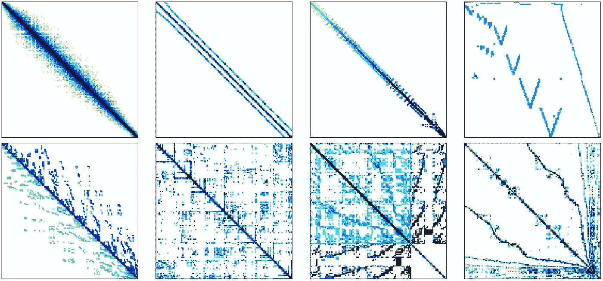

# **简介**

微分方程离散化的标准方法通常导致线性方程组。产生式系统的一般特征是每个方程中的条目数取决于离散化的局部拓扑特征。因此，这些系统生成的矩阵包含许多零(图 1)。通过将矩阵存储在特殊的数据结构中，可以利用关于零的位置的知识。这些结构的抽象数据类型称为稀疏矩阵。当我阅读另一种矩阵格式时，我决定实现不同矩阵格式的性能比较。这篇文章回顾了基本稀疏矩阵数据结构在 GPU 上的稀疏矩阵向量乘法(SpMV)环境中的效率。

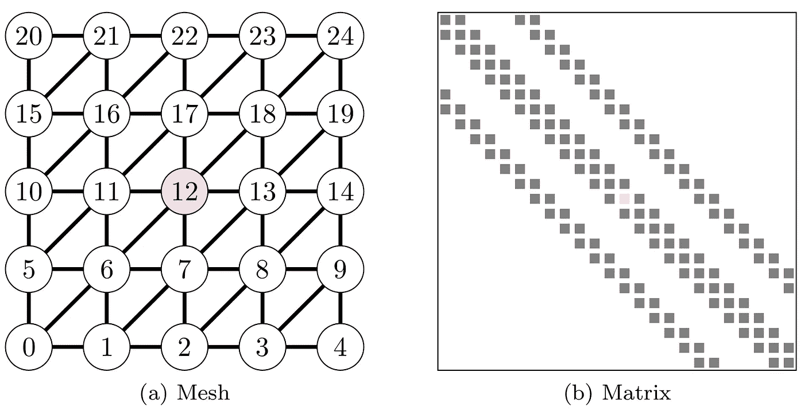

图 1:一个简单的有限元网格模型

# **稀疏矩阵的数据结构**

一般来说，SpMV 性能受到内存带宽的限制。用于稀疏矩阵的存储格式定义了 SpMV 算法。每种算法都有自己的粒度，这会影响性能。稀疏矩阵表示之间的主要区别是稀疏模式，或者非零项的结构，这是它们最适合的。然而，我将从一般的稀疏矩阵格式开始。

为了评估 SpMV 在不同稀疏矩阵格式上的效率，我从 Florida Sparse Matrix Collection 收集了一般矩阵的性能数据。所有的实验都是在一个配有 NVIDIA RTX 2080 GPU 和英特尔酷睿 i7–7700k CPU 的系统上运行的。每个测量值是 30 次试验的平均值(算术平均值)。在测量性能之前，CPU 和 GPU 频率都是固定的。
通过将单线程 CSR SpMV 执行时间除以 GPU 来计算加速比。

# **CSR**

*压缩稀疏行* (CSR)格式是一种通用的稀疏矩阵格式。CSR 格式由三个数组组成: *row_ptr* ，非零的*列*，矩阵*值*(图 2)。该行的非零值按顺序存储在一维*值*数组中。 *row_ptr* 数组用于将值数组分成单独的行。它的大小等于 n_rows + 1。row_ptr 中的最后一个条目存储矩阵中的多个非零值(nnz)。这允许快速查询特定行中的非零数字*(row _ ptr[row+1]—row _ ptr[row])*。对于每个非零值，列索引存储在列数组中。

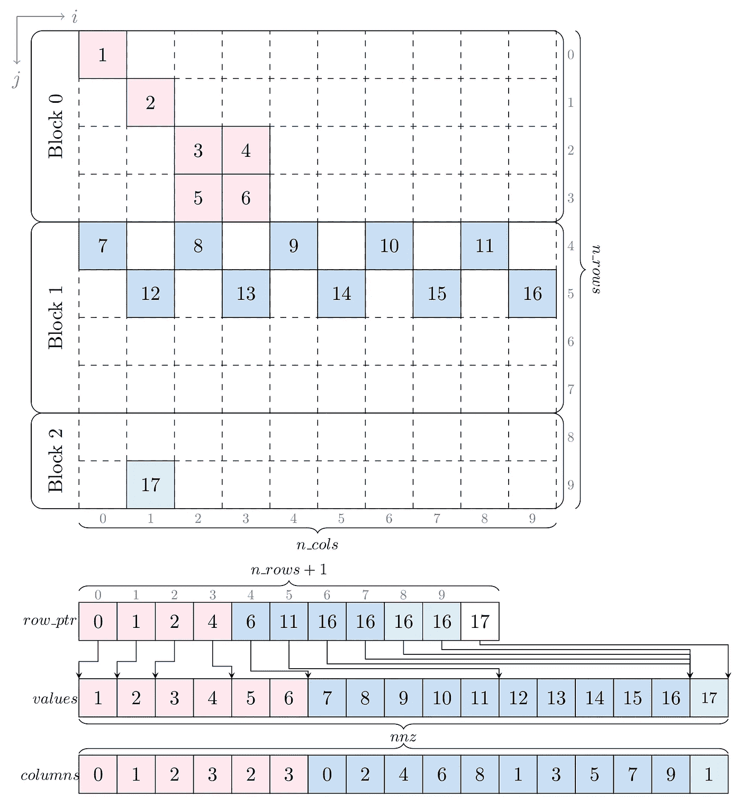

图 2:压缩稀疏行(CSR)矩阵格式示例

为了简单起见，我们假设每个 CUDA 线程块中有四个线程。一般的 CSR SpMV 实现在每行线程的粒度上工作(图 3)。因此，图 2 中的矩阵由三个线程块处理。这种实现通常被称为 CSR-Scalar(列表。1).

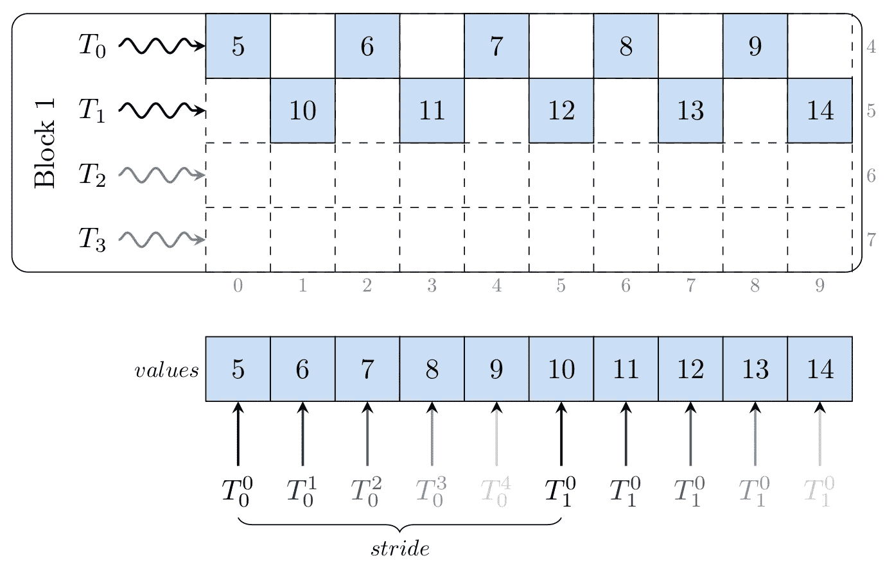

图 3:CSR-标量工作分布

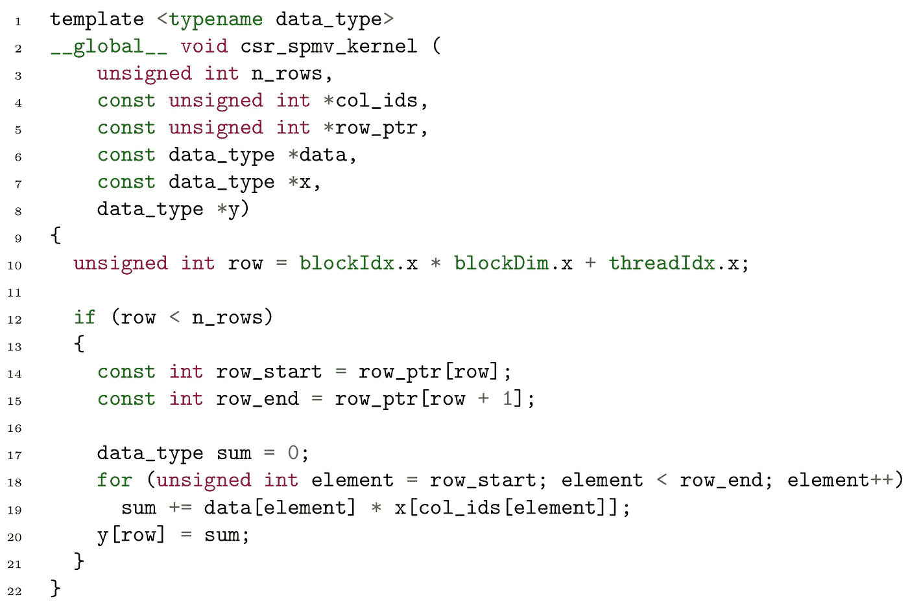

清单 CSR 标量稀疏矩阵格式的朴素 SpMV 核

CSR SpMV 算法在 GPU 上的实现通常被认为是非常低效的。低效率的原因是负载平衡、线程分歧和内存访问模式。如图
3 所示，只有一半的块线程有非零线程要处理。因此，当所有其他内核空闲时，单个密集行可以任意延迟执行。此外，如图 3 所示，相邻线程以步进方式访问矩阵
的值。当并发线程同时访问物理内存中相距甚远的内存地址时，硬件就没有机会组合这些访问。表 1 给出了简单 CSR-Scalar 实现的性能结果
。

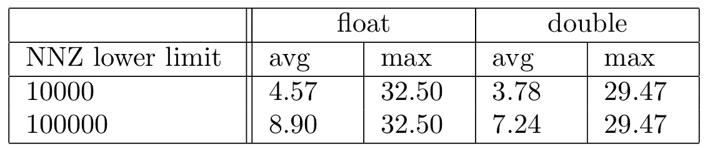

表 1:CSR-标量加速

加速分布如下图所示。为了回答这个问题，我将它与 NVIDIA CUDA 稀疏矩阵库(cuSPARSE)的 CSR 实现进行了比较。2)，平均加速比更好。

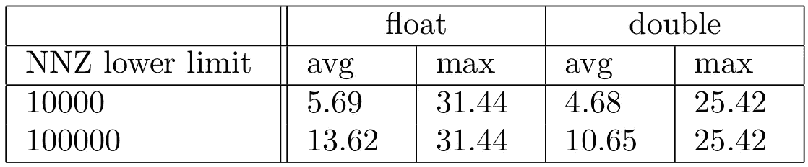

表 2: CSR (cuSPARSE)加速

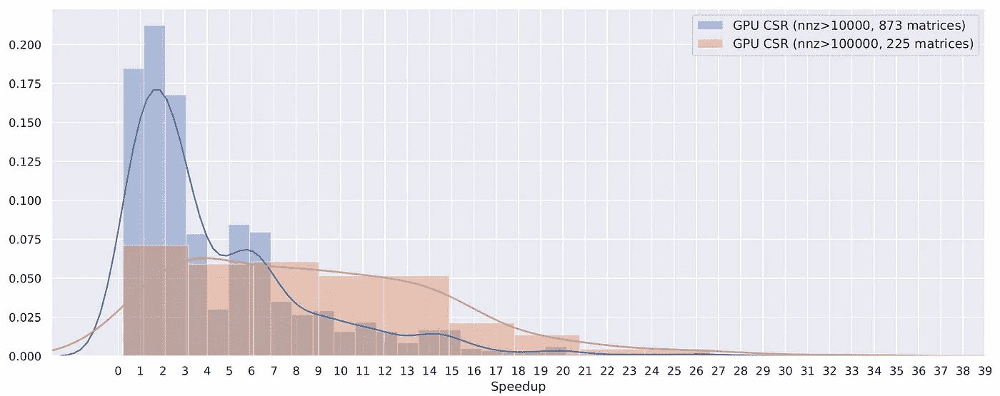

图 4(a):CSR-标量加速(浮点)

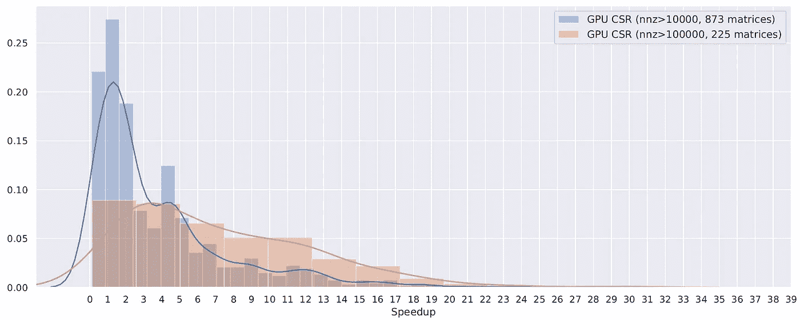

图 4(b):CSR-标量加速(双倍)

这些结果表明，中国南车 SpMV 公司还有优化的空间。第一个可能的优化是指定每行的经线，而不是线程。这个算法(列表。3)称为 CSR-Vector。向量内核连续访问索引和数据(图 4)，因此克服了
标量方法的主要缺陷。与之前每个矩阵行使用一个线程的 CSR 实现不同，这种优化需要在同一 warp 中的线程之间进行协调。

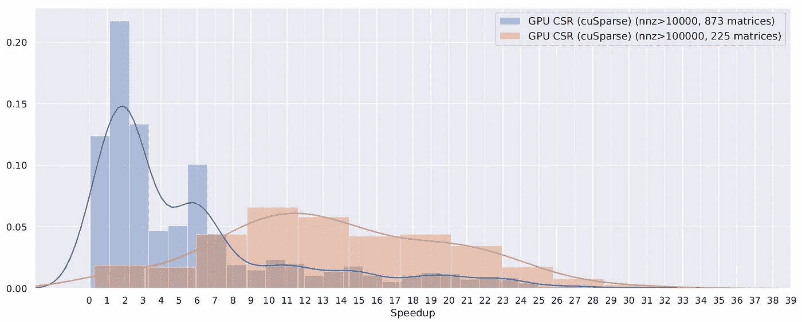

CSR cuSPARSE 加速(浮点)

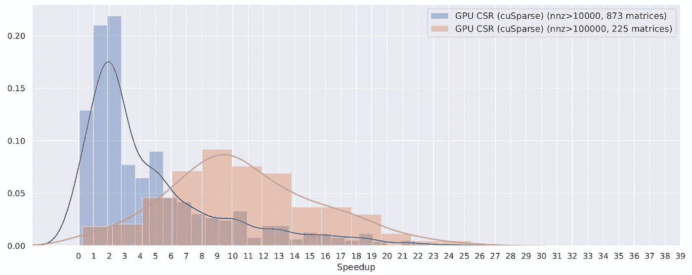

CSR cuSPARSE 加速(双倍)

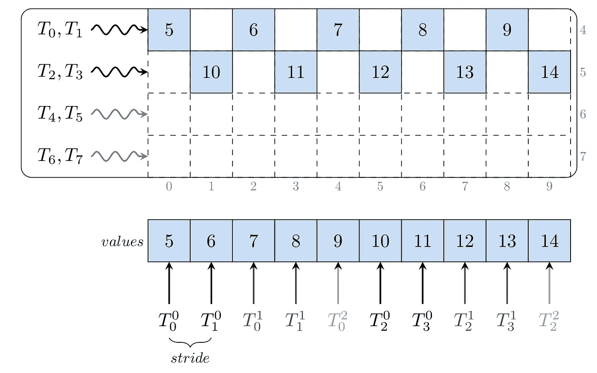

图 4:CSR-向量工作分布

在 CSR 的情况下，向量减少可以使用扭曲级别的图元(列表。2).在这种情况下，数据交换在寄存器之间执行，比通过共享内存更有效，共享内存需要加载、存储和额外的寄存器来保存地址。

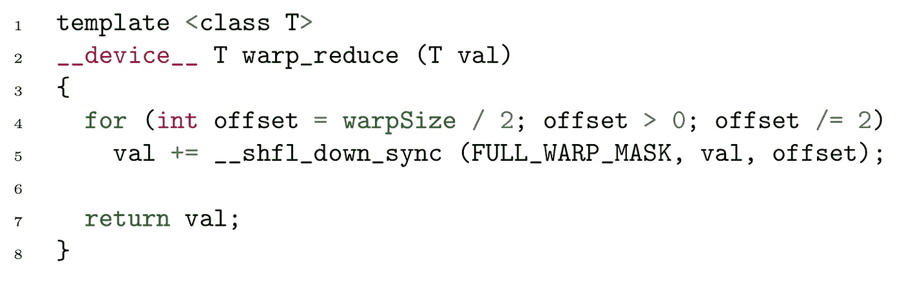

清单 2:扭曲减少

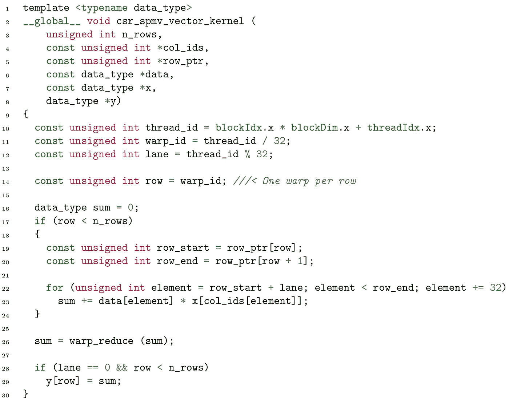

清单 CSR 向量的 SpMV 内核

CSR-Vector 具有更好的加速比(表。4)以及比 CSR-Scalar(对于浮点和 double 矩阵)和 cuSPARSE 实现(对于浮点矩阵)更快的分布。

表 3: CSR 矢量加速

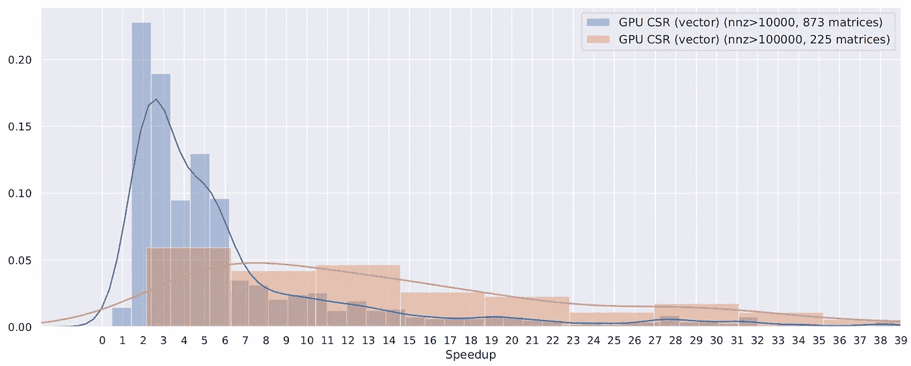

CSR-矢量加速(浮点)

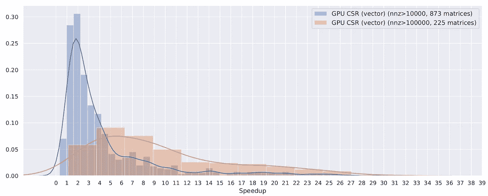

CSR-矢量加速(双倍)

然而，在大约 33%的下限为 10000 nnz 的浮点矩阵和 40%的下限为 100000 nnz 的浮点矩阵上，CSR-Scalar 优于 CSR-Vector。在这些矩阵上，CSR 显示平均加速比为 8.57，而 CSR-Vector 仅为 4.80。

为了发现 CSR SpMV 实施的进一步改进，我们需要考虑图 2 的第一个矩阵部分。在矩阵的前四行中，每行只有一个非零值。在这种情况下，除了第一根经纱外，所有经纱都是空闲的。在这种情况下，天真的 CSR SpMV 实现有可能胜过矢量实现。对于 CSR 矩阵格式，有一种不依赖于 nnz/row 比率的 SpMV 算法。CSR-Adaptive 根据每行(列表)中的 nnz 改变其行为。4).在选择每个块的非零值之后，构建用于存储块的行的附加数组(行块)。如果一些行包含小的 nnz，它们将被聚集到一个块中。然后 CUDA 线程块被分配给每个行块。一个行块中有多行的情况称为 CSR-Stream。如果行块中只有一行，将调用 CSR-Vector。如果该行超过 *nnz_per_wg* ，则将使用 CSR-VectorL 变量。CSR-Vector 和 CSR-VectorL 的主要区别在于，CSR-VectorL 允许在一行上执行多个 CSR-VectorL，然后通过使用原子操作来减少结果。

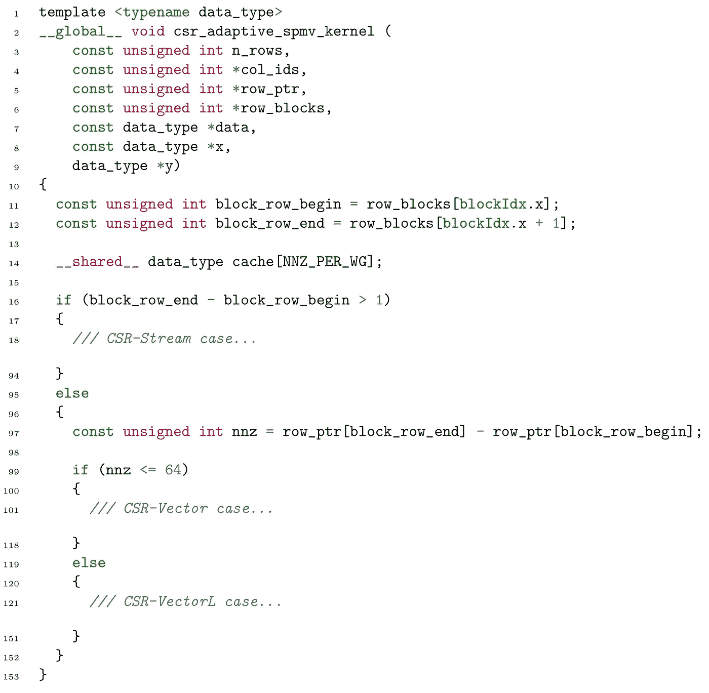

清单 CSR 自适应稀疏矩阵格式的 SpMV 内核

CSR-Vector 和 CSR-VectorL 部分非常相似，所以我不会在这里列出。图 5 说明了 CSR 流部分的存储器访问模式。它将部分和存储在 GPU 的共享内存中，然后将它们减少。图 5 中缓存的部分结果是用 x 填充 1 计算的。CSR-Stream 的
源代码如清单 5 所示。

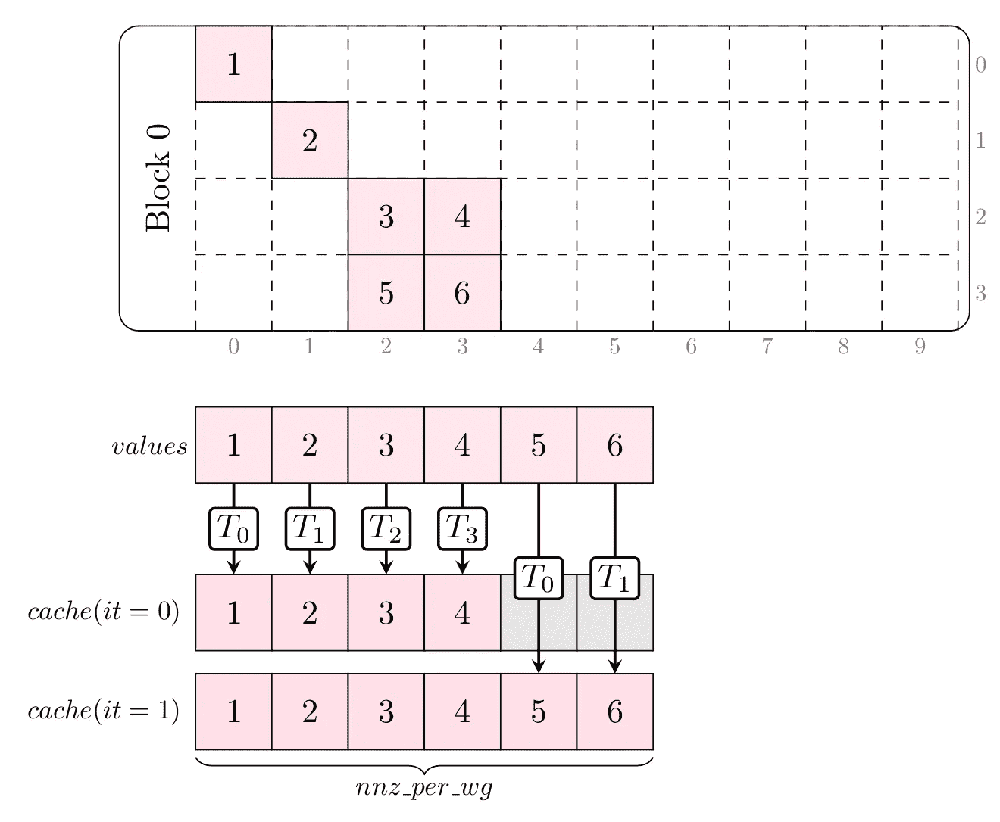

图 5: CSR 流内存访问模式

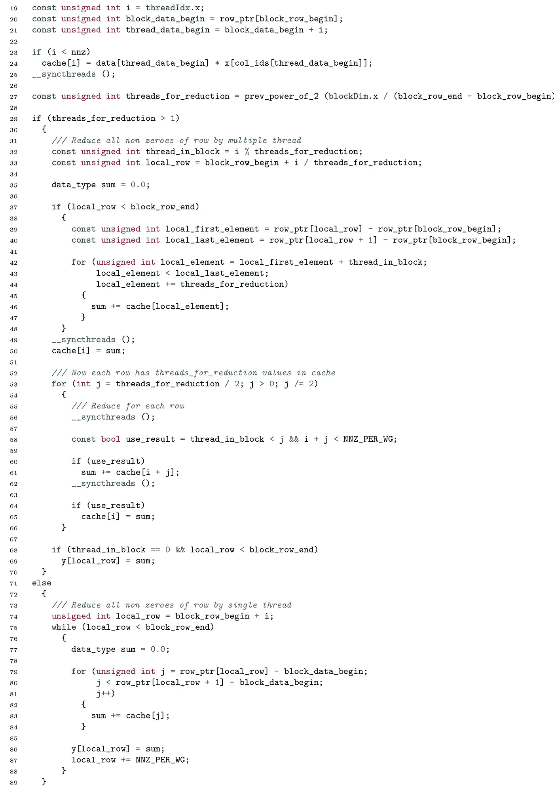

清单 5: CSR 流实现

在讨论的矩阵集上，CSR 优于 CSR-Vector，CSR-Adaptive 显示了更好的加速比。在这 291 个矩阵上，CSR-Adaptive 优于 CSR-Scalar。虽然 CSR-Adaptive 在一些长行矩阵上的性能可能优于 CSR-Vector，但它平均具有更好的加速比。4).CSR-Adaptive 的主要优点是，如果您的代码已经使用了 CSR，您就不需要更改生成矩阵的代码。下面介绍的矩阵格式不具备这种品质。

表 4: CSR 自适应加速

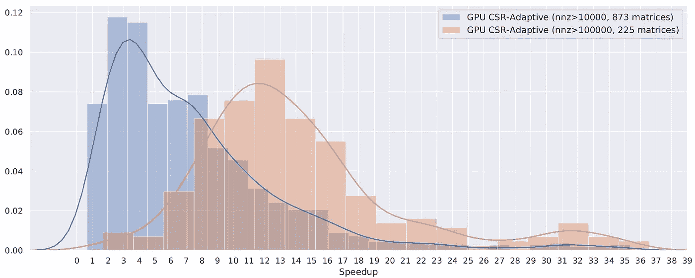

CSR-自适应加速(浮点)

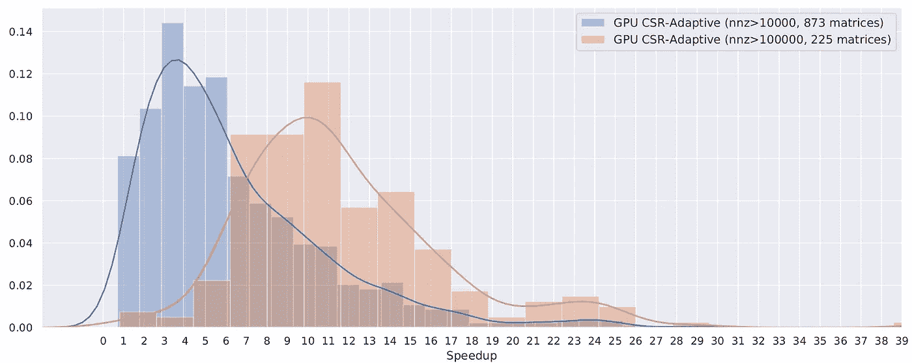

CSR-自适应加速(双倍)

# **埃尔**

CSR 的非聚集存储器访问问题可以通过对稀疏矩阵数据应用数据填充和转置来解决(图 6)。Ellpack-Itpack (ELL)稀疏矩阵格式假设每行最多包含 rows 中的元素，rows 中的元素很少。所有行都以零填充到该值。与 CSR 不同，不需要行指针数组。当每行非零值的最大数量与平均值相差不大时，ELL 效率最高。

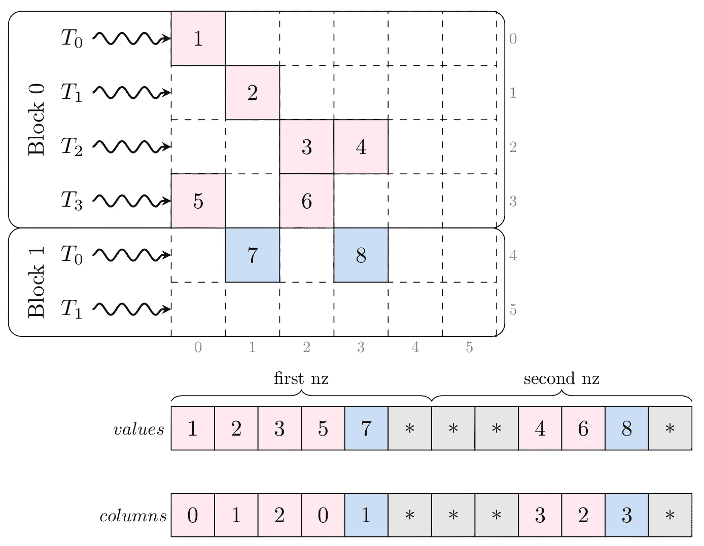

图 ELL 矩阵格式示例

清单 6 给出了 ELL 矩阵格式的内核。使用 ELL 格式的元素填充，很容易通过简单地添加矩阵中的行数来获得下一行的元素位置。填充还会固定每个线程的迭代次数，因此扭曲中没有控制流分歧。控制流发散的消除和内存合并的启用使得 ELL SpMV 内核在许多矩阵上的性能优于 CSR 标量实现(表。5).

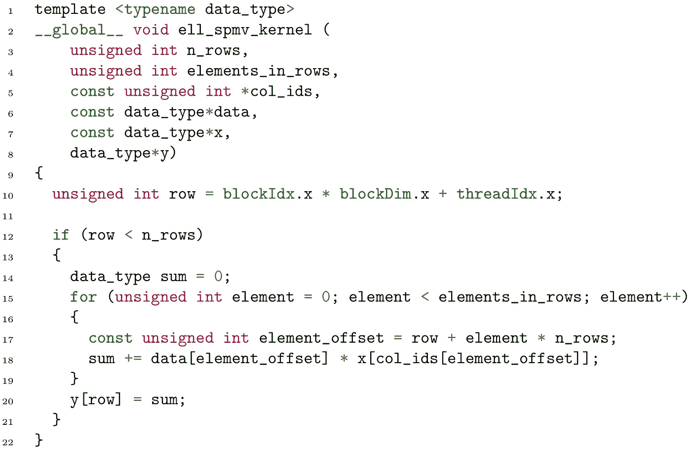

清单 6: ELL 实现

表 5: ELL 加速

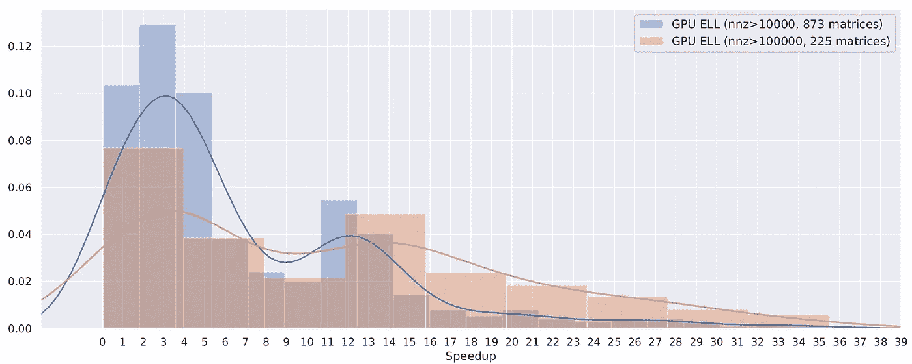

ELL 加速(浮点)

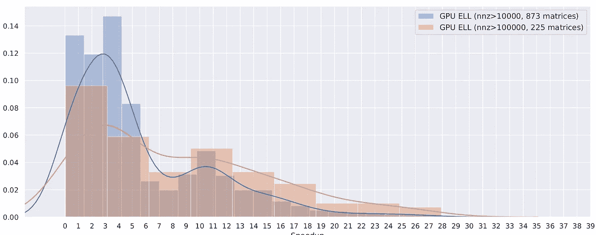

ELL 加速(双倍)

ELL 格式的明显缺点包括填充本身。在矩阵有几个长行的情况下，ELL 格式将导致过多的填充元素。佛罗里达收集了许多矩阵，由于 ELL 的填充，这些矩阵无法放入我的 8GB GPU 中。在某些情况下，这会导致 CSR-Scalar 优于 ELL 实现的情况。为了消除这个问题，可以将长行的额外 nnz 从 ELL 矩阵中移除到不同的矩阵中。值得注意的是，提取的矩阵会有一个无序的方案。该方案中可能会缺少许多行，因此 CSR 的使用将是低效的。可以处理这种情况的格式之一是首席运营官。

# **首席运营官**

坐标(首席运营官)矩阵格式是最简单的一种。对于每个 NZ，它存储它的列和行索引。因此，首席运营官不按行映射元素。这就引出了首席运营官内核中原子操作的必要性(清单 7)。

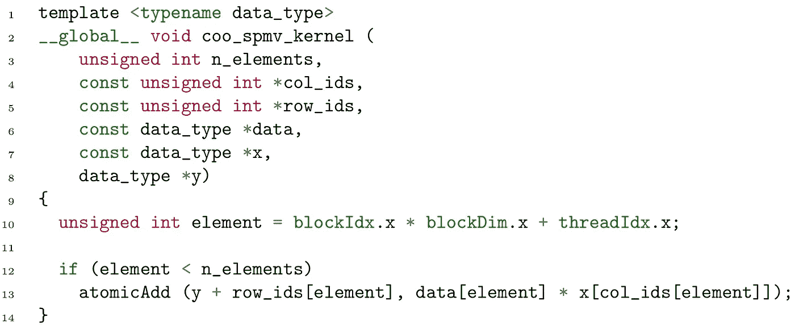

清单 7:首席运营官实现

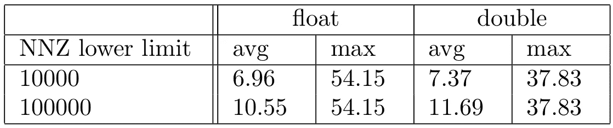

表 6:首席运营官加速

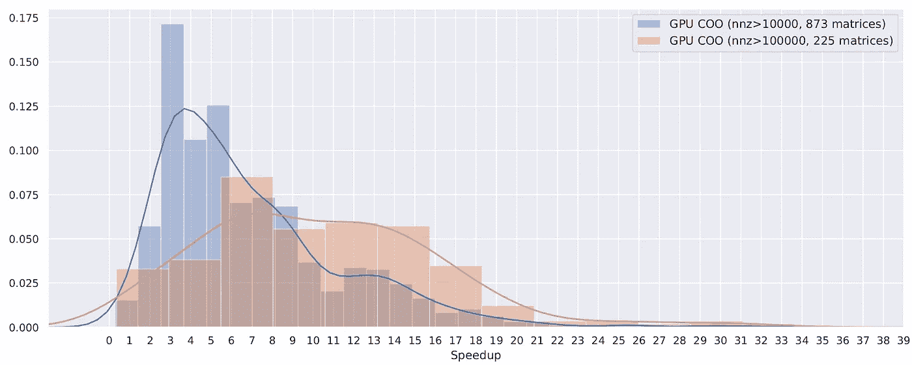

首席运营官加速(浮点)

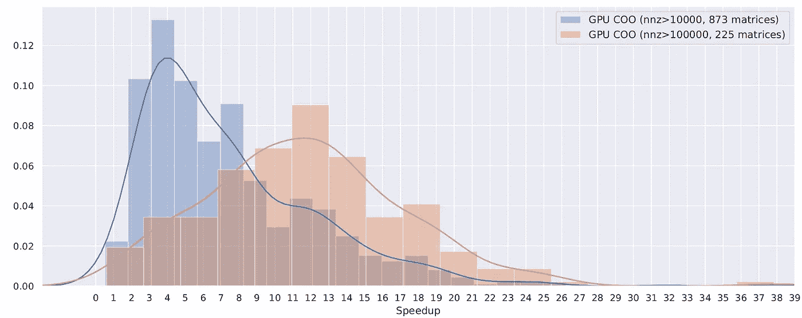

首席运营官加速(双倍)

首席运营官 SpMV 实现在每个元素线程的粒度上工作(7)。对结果向量的原子更新会降低性能。首席运营官格式的行越宽，SpMV 的序列化程度越高。这个事实可以在图 7 中看到。为了提高这种格式的性能，可以用适合共享内存的行数来分割矩阵信息块。

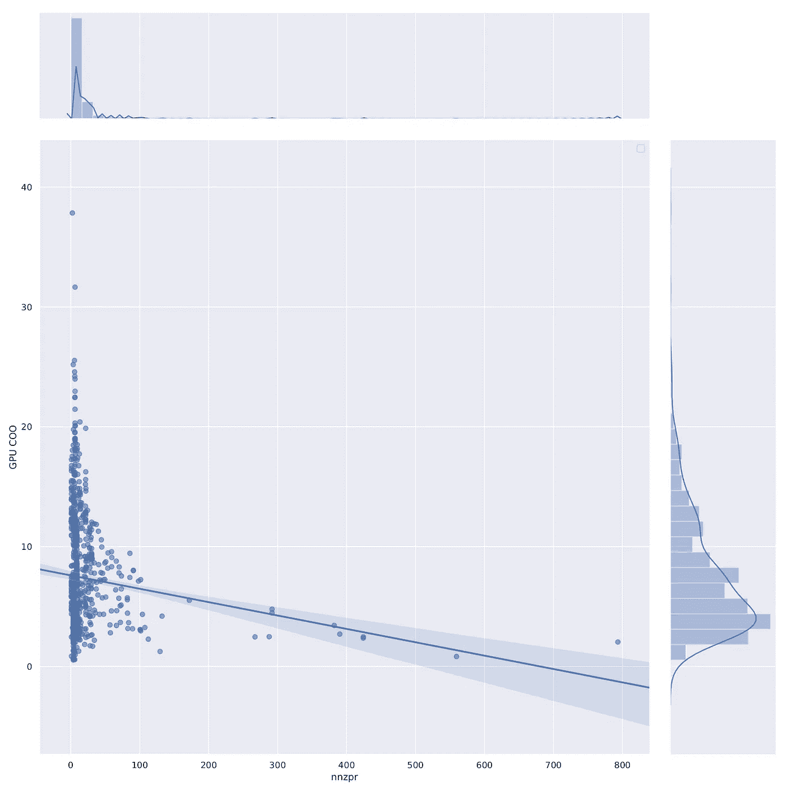

图 7:首席运营官加速对平均 nnz 的依赖

在首席运营官 SpMV 使用共享内存来提高原子操作性能的矩阵格式被称为分片首席运营官(SCOO)。为了减少共享存储器组冲突，SCOO 允许共享存储器中的多个通道用于更新单行的中间结果。减小切片大小会增加通道的大小，从而有更多的共享内存通道可用。

表 7: SCOO 加速

# **杂交**

可以对矩阵的常规部分使用 ELL 矩阵格式，对从超长行中移除的元素使用首席运营官。该方案显著减少了 ELL 格式中填充元素的数量。这种
方法通常被称为混合。将厄尔和首席运营官·SpMV 的结果结合起来有不同的选择。在这篇文章中，我使用原子案例(列表。8).

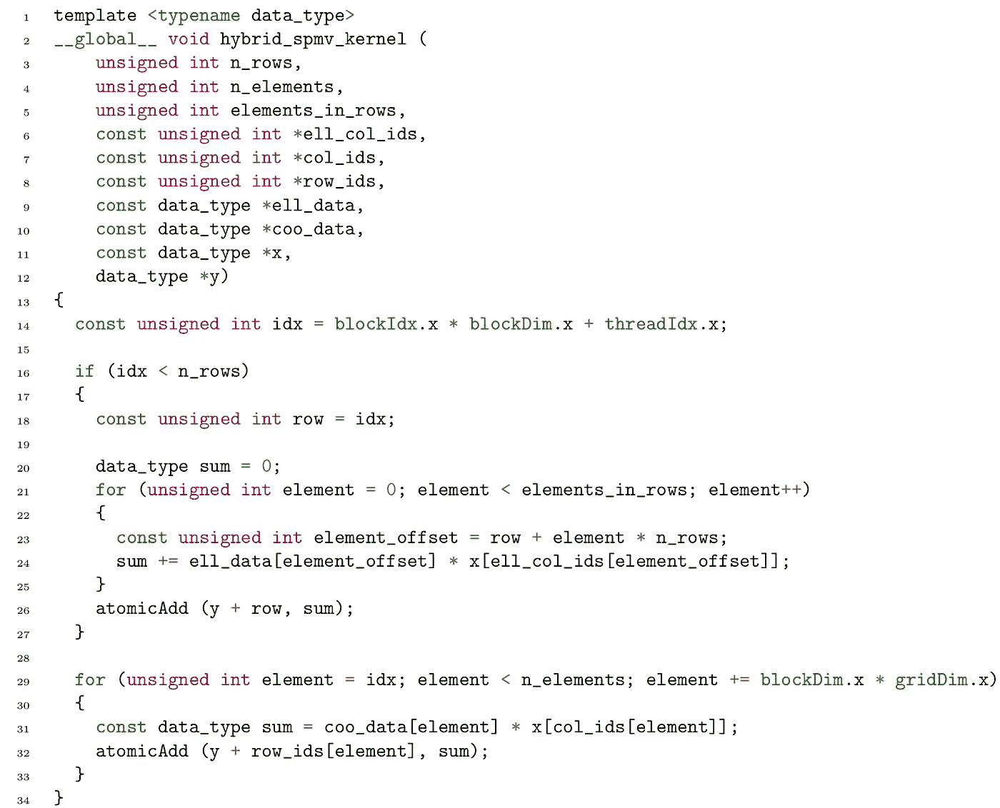

清单 8:混合实现

尽管平均性能结果(表。8)非常接近 CSR 自适应 SpMV，混合格式需要对分裂矩阵的额外操作，这可能需要重写矩阵计算代码库。

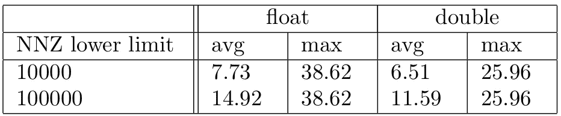

表 8:混合加速

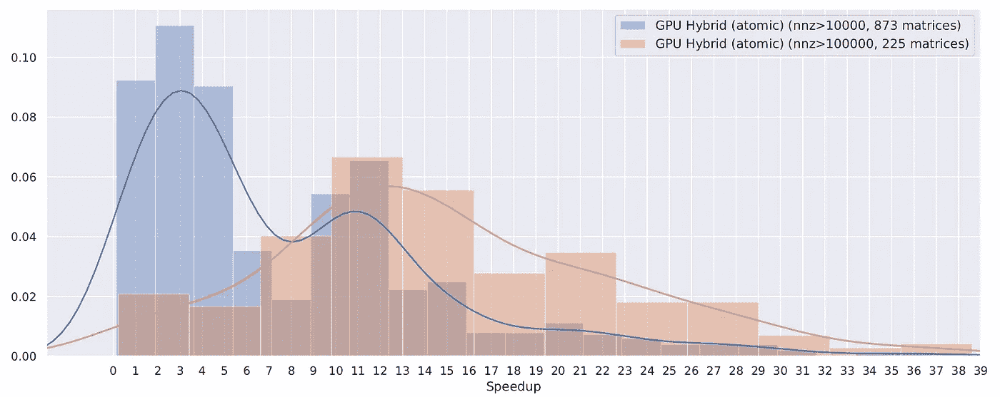

混合加速(浮点)

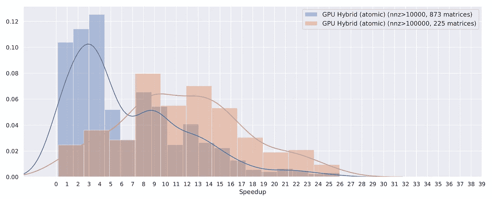

混合加速(双倍)

# **结论**

最后，我想给你看一些误导性的结果。我选择了一些矩阵(表。9)为了表明不存在通用矩阵格式的明显事实。即使在数据类型改变后，引出线也会改变。在我的下一篇文章中，我将重点关注实际应用程序生成的块矩阵格式。这篇文章的源代码和 pdf 版本可以在 [github](https://github.com/senior-zero/matrix_format_performance) 中找到。

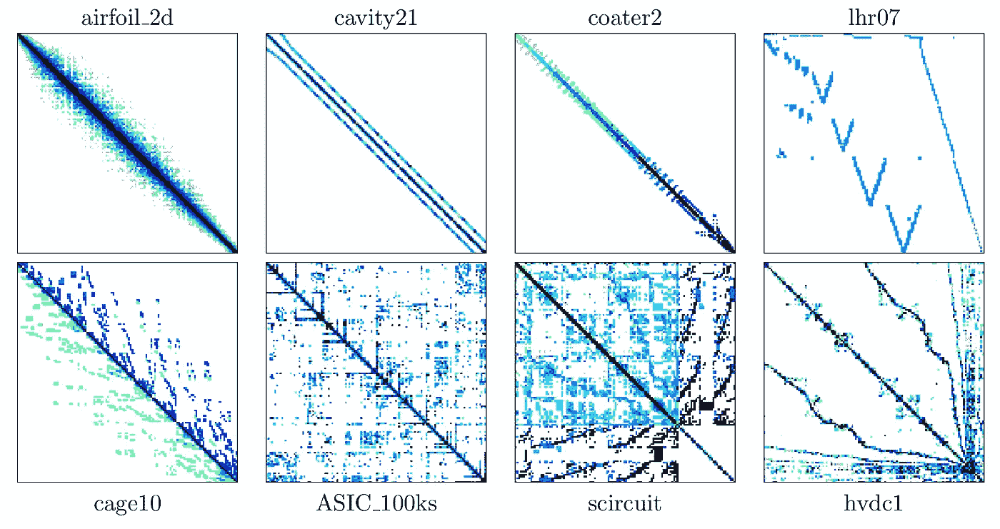

表 9:选定矩阵的结构

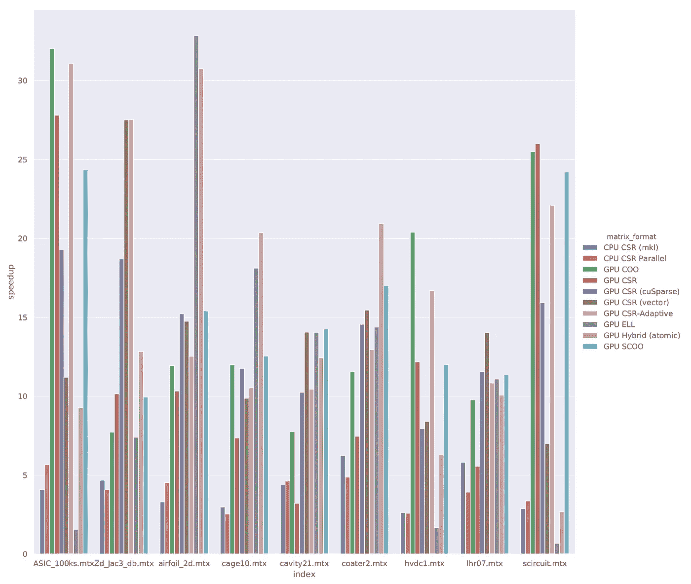

所选矩阵的加速(浮点)

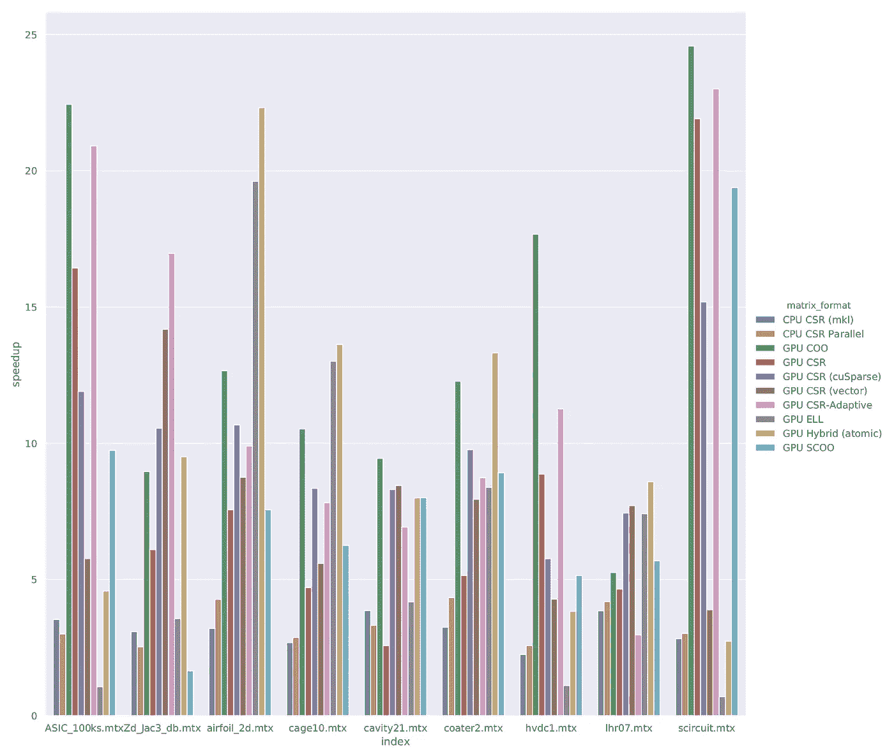

所选矩阵的加速(双倍)