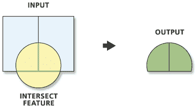

# 与地理区域的空间相交

> 原文：<https://medium.com/analytics-vidhya/spatial-intersects-with-geopandas-420c98915ca9?source=collection_archive---------1----------------------->

*关于如何在 python geopandas 中相交面边界内的点要素的教程*

交集是地理信息系统中最常用的地理空间分析工具之一。最简单的相交方法是将各种输入几何要素(点、面、线)彼此重叠，以获得作为输出的重叠要素。

来源:[https://pro . ArcGIS . com/en/pro-app/tool-reference/analysis/intersect . htm](https://pro.arcgis.com/en/pro-app/tool-reference/analysis/intersect.htm)