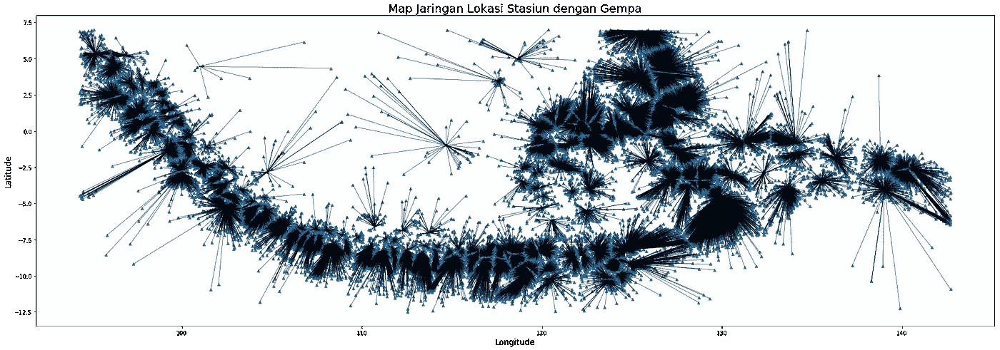

# 基于 Geo Pandas Python 的空间可视化和网络分析

> 原文：<https://medium.com/analytics-vidhya/spatial-visualization-and-network-analysis-with-geo-pandas-python-60bfc48396c8?source=collection_archive---------2----------------------->


空间数据是指存在于地理空间或视野中的所有类型的数据对象或元素。它能够在全球范围内查找和定位世界上任何地方的个人或设备。

空间数据用于地理信息系统和其他地理定位或定位服务。空间数据由点、线、多边形和其他地理和几何数据图元组成，可以通过位置进行映射。空间数据可以分为标量数据或矢量数据。每一个都提供关于地理或空间位置的不同信息。在本节中，我们可以解释两种类型的数据空间点、空间线和空间面。

# 1.空间多边形

在 python 中使用 geo pandas 进行构建，您可以在 jupyter 笔记本中安装 Geo pandas 和 environmental Anaconda，


```
pip install geopandas
```

然而，如果你的笔记本电脑有问题，你可以在 kaggle.com 使用笔记本，在 Kaggle 笔记本中你不需要安装包，Kaggle 已经有了 geopandas 包。要得到数据框多边形你可以在网上搜索，例如，你可以在我的链接中下载[https://www.kaggle.com/imammuhajir/map-data/settings](https://www.kaggle.com/imammuhajir/map-data/settings)

或者

[http://www . info-geospasial . com/2015/10/data-shp-selu ruh-Indonesia . html](http://www.info-geospasial.com/2015/10/data-shp-seluruh-indonesia.html)

我们去 Kaggle 笔记本里试试:

```
import numpy as np
import pandas as pd 
import matplotlib.pyplot as plt
import geopandas as gpdimport os
for dirname, _, filenames in os.walk('/kaggle/input'):
    for filename in filenames:
        print(os.path.join(dirname, filename))
```

导入数据 shp

```
indo = gpd.read_file("/kaggle/input/map-data/INDONESIA_PROP.shp")
indo.head()
```


现在，您可以尝试使用多边形数据进行可视化，使用包 geopandas 使可视化变得如此简单…

```
indo.plot(column='Propinsi', cmap='Set1', legend=True, figsize = (30,40))
plt.title('TITIK GEMPA')
plt.show()
```


这是可视化多边形，现在你可以尝试过滤区域，你可以做…

# 过滤地理熊猫

我们只得到地区' ' ' "苏门答腊" "苏门答腊巴拉特" " JAWA 腾格里" "普罗班登" "迪"。亚齐”、“JAWA 帖木儿”、“JAWA 巴拉特”、“楠榜”、“DKI 雅加达”、“RIAU”、“占碑”、“邦加勿里洞”、“苏门答腊塞拉坦”、“达拉伊斯提梅瓦日惹”

```
# get data 
geo_df = gpd.read_file("/kaggle/input/map-data/INDONESIA_PROP.shp")# data can get 
filter_sumatra_jawa = [ "SUMATERA UTARA", "SUMATERA BARAT","JAWA TENGAH","PROBANTEN","DI. ACEH","JAWA TIMUR","JAWA BARAT" ,"LAMPUNG" ,"DKI JAKARTA","RIAU", "JAMBI","BANGKA BELITUNG" ,"SUMATERA SELATAN","DAERAH ISTIMEWA YOGYAKARTA"]ori_len = len(geo_df)
geo_df['Wilayah'] = list(range(len(geo_df)))# filter data 
for i in range(ori_len):
    if geo_df['Propinsi'][i] in filter_sumatra_jawa :
        geo_df['Wilayah'][i] = 1
    else:
        geo_df['Wilayah'][i] = 0
geo_df = geo_df[geo_df['Wilayah'] == 1]geo_df.head()
```


再次可视化…

```
leg_kwds = {'title':'NAMA WILAYAH', 'loc':'upper left','bbox_to_anchor':(1,1.05), 'ncol':1}geo_df.plot(column='Propinsi', cmap='Set1', legend=True, legend_kwds = leg_kwds, figsize = (20,50))plt.title('TITIK GEMPA')
plt.show()
```


# 2.空间点和空间多边形

在这个可视化中我们可以使用地震数据，你可以从链接【https://www.kaggle.com/imammuhajir/data-gempa 下载数据

这个数据包含坐标位置(纬度和经度)，两个变量的组合可以使点定位在你的地图上。

```
train_09 = pd.read_csv('/kaggle/input/data-gempa/2009.csv')
train_10 = pd.read_csv('/kaggle/input/data-gempa/2010.csv')
train_11 = pd.read_csv('/kaggle/input/data-gempa/2011.csv')
train_12 = pd.read_csv('/kaggle/input/data-gempa/2012.csv')
train_13 = pd.read_csv('/kaggle/input/data-gempa/2013.csv')
train_14 = pd.read_csv('/kaggle/input/data-gempa/2014.csv')
train_15 = pd.read_csv('/kaggle/input/data-gempa/2015.csv')
train_16 = pd.read_csv('/kaggle/input/data-gempa/2016.csv')
train_17 = pd.read_csv('/kaggle/input/data-gempa/2017.csv')
train_18 = pd.read_csv('/kaggle/input/data-gempa/2018.csv')
train_all = [train_09,train_10,train_11,train_12,train_13,train_14,train_15,train_16,train_17,train_18 ]# me replace name stiap data
for i in train_all:
    i.columns = ['index', 'Date', 'Time', 'Latitude', 'Longitude','Depth',
              'Magnitude', 'TypeMag', 'smaj', 'smin', 'az', 'rms', 'cPhase',
               'Region']
    i.drop(0,axis=0,inplace=True)

# menyatukan data mendjadi 1 
train = pd.concat(train_all)
```


t

这些数据非常脏，仍然有多种类型的数据，为了计算或可视化，我们必须更改为数字数据，所以让我们转到**清理数据…**

```
# mengsplit data dan membersihkan nilai menjadi number
train["Longitude"] = train.Longitude.apply(lambda x : x.split()[0])
train["Depth"] = train.Depth.apply(lambda x : x.split()[0])
train["Magnitude"] = train.Magnitude.apply(lambda x : x.split()[0])
train["Time"] = train.Time.apply(lambda x : x.split()[0])# meng ekstrak data 
train["year"] = train.Date.apply(lambda x : x.split('/')[2])
train["date"] = train.Date.apply(lambda x : x.split('/')[1])
train["month"] = train.Date.apply(lambda x : x.split('/')[0])
train["hour"] = train.Time.apply(lambda x : x.split(':')[0])train["Date"] = train.Date.apply(lambda x : x.split()[0])
train['Date'] = train[['Date', 'Time']].apply(lambda x : ' '.join(x), axis = 1)
train['Date'] = pd.to_datetime(train['Date'])train.index = train['Date']train_len = len(train)
for i in range(train_len):
    if train['Latitude'][i].split()[1] == 'LS':
        train['Latitude'][i] = float(train['Latitude'][i].split()[0]) * -1
    else:
        train['Latitude'][i] = train['Latitude'][i].split()[0]train.head()
```


将印度尼西亚国家的数据格式更改为浮动和过滤

```
#convert type data ke float
columns = ['Latitude','Longitude', 'Depth', 'Magnitude']
for var in columns:
    train[var] = train[var].astype("float64")# Filter indonesia
train = train.loc[((train['Latitude'] >= -12.5) & (train['Latitude'] <= 7) &  (train['Longitude'] >= 94.31644) & (train['Longitude'] <= 142.71813) )]
```

背景多边形数据和坐标数据的空间数据可视化。

```
leg_kwds = {'title':'NAMA WILAYAH', 'loc':'upper left', 'bbox_to_anchor':(1,1.05), 'ncol':1}
geo_df.plot(column='Propinsi', cmap='Set1', legend=True, legend_kwds = leg_kwds, figsize = (30,30))
plt.title('TITIK GEMPA')plt.scatter(y= train.Latitude, x = train.Longitude , c = train.Magnitude, alpha=0.8);
plt.show()
```


基于量值过滤数据…

```
train5 = train[train['Magnitude'] >= 5.5]leg_kwds = {'title':'NAMA WILAYAH', 'loc':'upper left', 'bbox_to_anchor':(1,1.05), 'ncol':1}
geo_df.plot(column='Propinsi', cmap='Set1', legend=True, legend_kwds = leg_kwds, figsize = (30,30))
plt.title('TITIK GEMPA')plt.scatter(y= train5.Latitude, x = train5.Longitude , c = train5.Magnitude, alpha=0.8);
plt.show()
```

# 3.用地震分析网站地震

要对地震进行地震台站网络分析，第一阶段我们必须确定地震台站本身，因为数据不知道台站的位置。为了确定地震台的位置，我们假设“smin”小于 0.3 的地震是靠近地震台的地震。
注:“smin”是地震到最近台站的距离

让我们看看过滤的结果

```
train_loc = train.copy()train_loc = train_loc[train_loc.smin < 0.3]leg_kwds = {'title':'NAMA WILAYAH', 'loc':'upper left', 'bbox_to_anchor':(1,1.05), 'ncol':1}
geo_df.plot(column='Propinsi', cmap='Set1', legend=True, legend_kwds = leg_kwds, figsize = (30 ,30))
plt.title('TITIK GEMPA')plt.scatter(y= train_loc.Latitude, x = train_loc.Longitude, alpha=0.8);
plt.show()
```


了解了台站附近的地震数据分布后。我们必须确定地震台站的准确位置，因此我们使用 K-均值聚类来确定该位置。

```
from sklearn.cluster import KMeanstrain_clus = train_loc[['Latitude', 'Longitude']]
num_clusters = 152km = KMeans(n_clusters=num_clusters, random_state = 1)
km.fit(train_clus)
clusters = km.labels_.tolist()train_clus['Clustering'] = clustersloc_statiun = train_clus.groupby('Clustering').mean()
loc_statiun = loc_statiun.reset_index()
```

可视化结果:

```
leg_kwds = {'title':'NAMA WILAYAH', 'loc':'upper left', 'bbox_to_anchor':(1,1.05), 'ncol':1}
geo_df.plot(column='Propinsi', cmap='Set1', legend=False, legend_kwds = leg_kwds, figsize = (30,30))
plt.title('Lokasi Statiun Gempa')plt.scatter(y= loc_statiun.Latitude, x = loc_statiun.Longitude, marker='^', alpha=1, c = '#1f77b4');
plt.show()
```


# 最近震点地震台网分析

创建一个新要素:站点和地震点之间的距离，最近的地震站点的名称

```
#from pandas.tools.plotting import scatter_matrix
from sklearn.model_selection import StratifiedShuffleSplit
from sklearn.preprocessing import LabelBinarizer
from sklearn.preprocessing import StandardScaler
from geopy.distance import vincentyimport gcstatiun_coords = {}for dat in loc_statiun.iterrows():
    row = dat[1]

    statiun_coords[int(row['Clustering'])] = (float(row['Latitude']), float(row['Longitude']))
```

功能:寻找最近的地震点。

```
def closest_point(location, location_dict):
    """ take a tuple of latitude and longitude and 
        compare to a dictionary of locations where
        key = location name and value = (lat, long)
        returns tuple of (closest_location , distance) """
    closest_location = None
    for city in location_dict.keys():
        distance = vincenty(location, location_dict[city]).kilometers
        if closest_location is None:
            closest_location = (city, distance)
        elif distance < closest_location[1]:
            closest_location = (city, distance)
    return closest_locationtrain_clus['close_station'] = train_clus.apply(lambda x: closest_point((x['Latitude'],x['Longitude']), statiun_coords), axis = 1)train_clus['close_station_name'] = [x[0] for x in train_clus['close_station'].values]
train_clus['close_station_dist'] = [x[1] for x in train_clus['close_station'].values]train['close_station'] = train.apply(lambda x: closest_point((x['Latitude'],x['Longitude']), statiun_coords), axis = 1)
train['close_station_name'] = [x[0] for x in train['close_station'].values]
train['close_station_dist'] = [x[1] for x in train['close_station'].values]train.head()
```


可视化网络

```
train.plot(kind='scatter', x='Longitude', y='Latitude',  marker='^', alpha=1, c = '#1f77b4', figsize= (30, 10 )
    )for line in train.iterrows():
 dat = line[1]
 x1 = dat['Longitude']
 y1 = dat['Latitude']
 p2 = statiun_coords[dat['close_station_name']]
 x2 = p2[1]
 y2 = p2[0]
 plt.plot([x1,x2],[y1, y2], 'k-',linewidth=0.5)

#plt.imshow(peta_gempa,  extent=[ 93 , 118.5, -13.3 , 7.7], alpha=0.9)
#plt.imshow(peta_gempa,  extent=[ 90 , 115.5, -14.7 , 7.9], alpha=1)
plt.ylabel("Latitude", fontsize=14)
plt.xlabel("Longitude", fontsize=14)
plt.title("Map Jaringan Lokasi Stasiun dengan Gempa", fontsize = 20)
plt.show()
```



具有 5.5 级滤波器的网络

```
train5 = train[train['Magnitude'] >= 5.5]# graph of vectors connecting points to their nearest citytrain5.plot(kind='scatter', x='Longitude', y='Latitude',  marker='^', alpha=1, c = '#1f77b4', figsize = (30, 10)
    )for line in train5.iterrows():

 dat = line[1]
 x1 = dat['Longitude']
 y1 = dat['Latitude']
 p2 = statiun_coords[dat['close_station_name']]
 x2 = p2[1]
 y2 = p2[0]

 plt.plot([x1,x2],[y1, y2], 'k-',linewidth=0.5)

#plt.imshow(peta_gempa,  extent=[ 93 , 118.5, -13.3 , 7.7], alpha=0.9)
```


感谢您的阅读，您可以在我的 Kaggle 笔记本中找到完整的代码

[](https://www.kaggle.com/imammuhajir/visualisation) [## 形象化

### 使用来自多个数据源的数据

www.kaggle.com](https://www.kaggle.com/imammuhajir/visualisation)