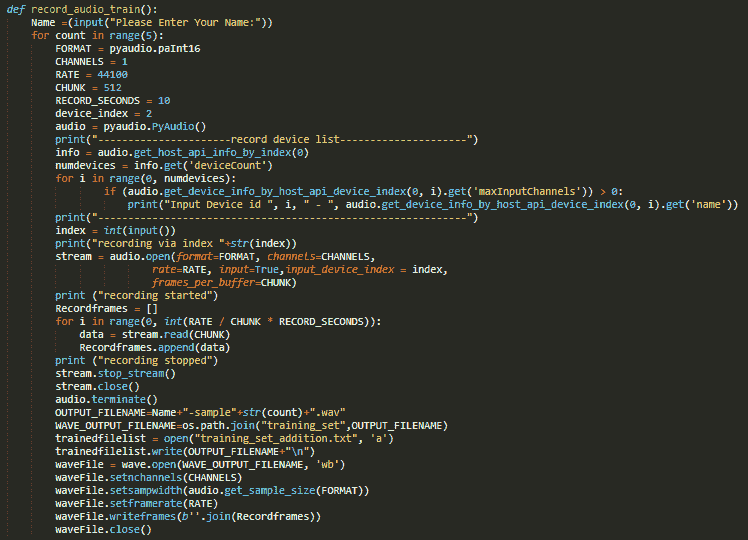
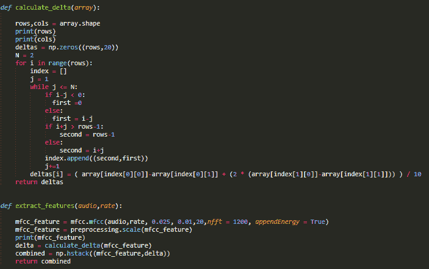
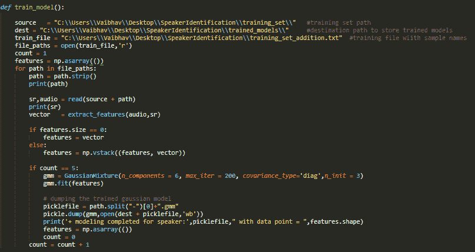
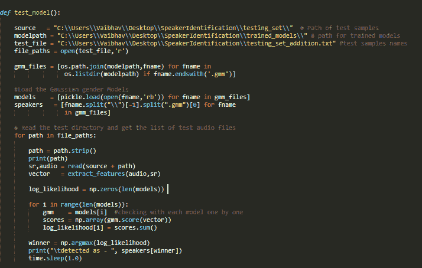

# 使用机器学习的说话人识别

> 原文：<https://medium.com/analytics-vidhya/speaker-identification-using-machine-learning-3080ee202920?source=collection_archive---------4----------------------->

杰森·罗斯韦尔在 [Unsplash](https://unsplash.com?utm_source=medium&utm_medium=referral) 上的照片

## 简介:

在当今的数据技术时代，音频信息在增加数据量方面起着重要的作用；因此需要一种方法来揭开这些内容的神秘面纱，从中获得有意义的见解。语音识别是一种旨在识别说话人而不是单词本身的方法。随着技术的发展，语音识别已经越来越多地嵌入到我们的日常生活中，在每天的数字设备中都有语音驱动的应用。语音识别主要分为说话人确认和说话人识别两部分。说话人识别从一组已知的说话人中确定哪个注册的说话人提供给定的话语。说话人确认接受或拒绝说话人的身份声明。

## 程序:

1)使用 Pyaudio 记录音频样本:

2)从音频样本中提取特征:

其思想是通过使用高斯混合模型来进行说话人的正确识别。处理音频样本的第一步是从中提取特征，即从音频信号中识别成分。我们使用梅尔频率倒谱系数(MFCC)从音频样本中提取特征。MFCC 将信号映射到模拟人类听觉的非线性 Mel 尺度上，并提供单独描述单个帧的功率谱包络的 MFCC 特征向量。

我们考虑了具有调谐参数的 MFCC 作为主要特征，以及也被称为微分和加速度系数的δMFCC，其被用于处理与动力学相关的语音信息，即 MFCC 系数随时间的轨迹，其结果是这些轨迹的计算。

3)使用 GMM 训练机器学习模型:

高斯混合模型(GMM)是处理音频数据时最常用的训练模型之一，所以我们使用 MFCC 和 GMM 来达到正确识别说话人的目的。GMM 用于在(MFCC+德尔塔 MFCC)提取的特征上训练模型。

4)用于预测样本语音的说话人的测试模型:

GMM 模型将用于计算所有模型的特征分数。具有最大得分的说话人模型被预测为测试语音的被识别的说话人。

> 您可以在下面资源库中查看代码库，

 [## VaibhavBhapkar/使用机器学习的说话人识别

### 按照下面的步骤执行这个项目，下载存储库。执行 SpeakerIdentification.py 文件。安装…

github.com](https://github.com/VaibhavBhapkar/Speaker-Identification-Using-Machine-Learning) 

谢谢大家！！

> 你可以在这里联系我，
> 
> 领英:[https://www.linkedin.com/in/vaibhav-bhapkar](https://www.linkedin.com/in/vaibhav-bhapkar)
> 
> 电子邮件:vaibhavbhapkar.medium@gmail.com