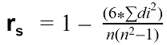
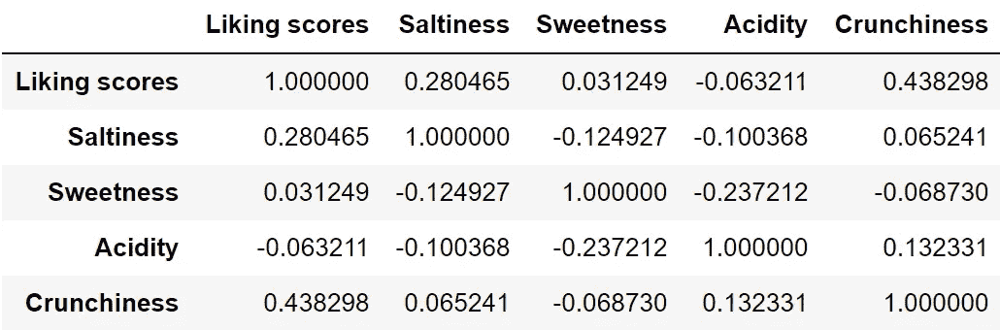
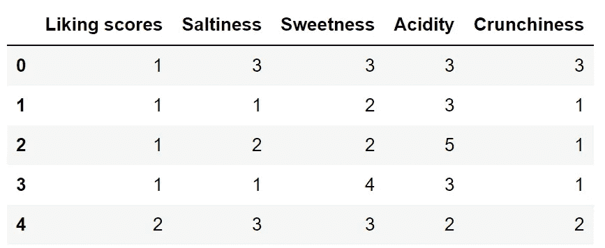
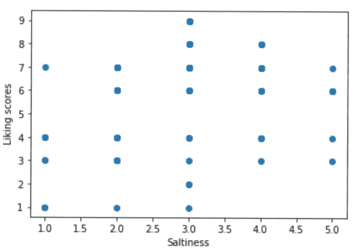
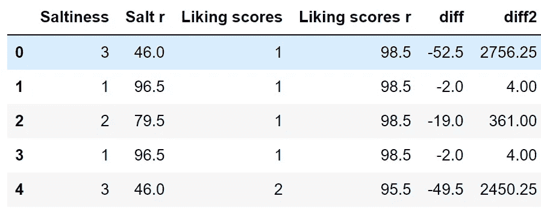
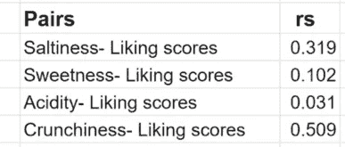
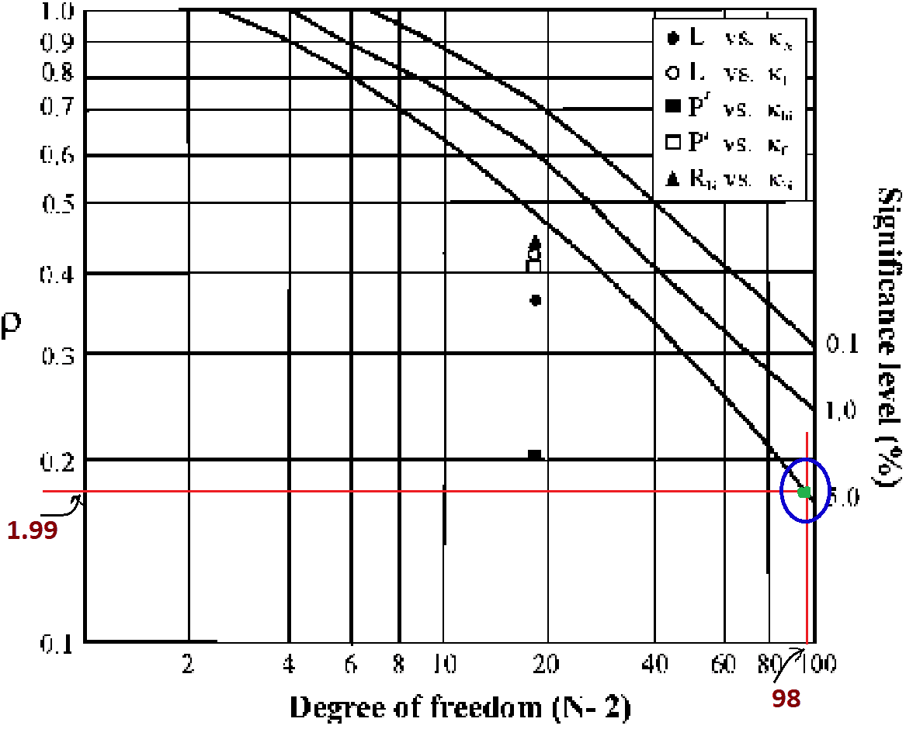
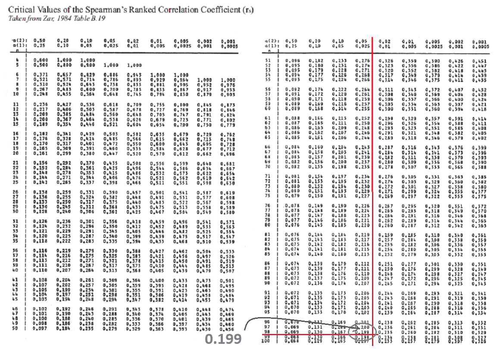

# 配对数据的 Spearman 相关分析

> 原文：<https://medium.com/analytics-vidhya/spearmans-correlation-analysis-for-paired-data-b8302f1f4a35?source=collection_archive---------6----------------------->

## 斯皮尔曼相关和显著性检验

在 [Unsplash](https://unsplash.com?utm_source=medium&utm_medium=referral) 上由 [Gláuber Sampaio](https://unsplash.com/@glaubersampaio?utm_source=medium&utm_medium=referral) 拍摄的照片

参考:小吃数据

a)找出所有有序属性的 Spearman 相关矩阵。

b)确定决定系数。

c)解释两个表中的结果。

d)在每种情况下，以 95%的置信水平进行显著性检验。

我们会看到斯皮尔曼相关系数，决定系数，显著性检验的概念。

**相关性:**用于衡量两个变量之间的某种形式的关联，即变量对的相关程度。

*   r = 0，意味着没有相关性。
*   r = +1(完全正相关)。
*   r = -1(完全负相关)。
*   更接近于 **+1 或-1** 的 r 值表示两个变量之间的高度相关。

**查尔斯·斯皮尔曼相关系数:**

*   它用于查找两个**序数属性之间的相关系数。**
*   这种相关性测量也被称为**等级相关性**。
*   这种技术适用于在有序数据的情况下确定两个变量之间的相关程度。
*   它评估使用单调函数描述两个变量之间的关系有多好。

**我们可以找到 rs 如下:**

首先，我们将计算各自列中的等级，取它们等级的差，并求和它们等级差的平方。

之后，我们可以使用下面的公式，

其中，di =两个变量的 i^th 对的秩之间的差

n =观察对数。

-1 <= rs <=1

**决定系数:**

*   它用于测量拟合模型的可变性比例。
*   它是相关(r)的平方，因此在 0 和 1 之间变化。
*   R2 为 0 意味着因变量不能从自变量预测。
*   R2 为 1 意味着因变量可以从自变量中准确预测出来。

**显著性检验:**

我们可以分 5 步进行显著性检验:

**步骤 1-** 定义假设。

**第 2 步-** 寻找 rs(使用他们的等级)。

**步骤 3-** 从 Spearman 表/图中找出给定自由度和显著性水平的 rs 值。

**步骤 4-** 验证计算的 rs 是否高于或低于表格/图表中的 rs。

**步骤 5-** 拒绝(如果计算的 rs 较高)或拒绝假设失败。

最后的评论。

# **计算:**

皮尔逊相关是最常见的，我们可以在 python 中找到如下相关矩阵:

**data.corr()** #数据是小吃数据的数据帧

相关矩阵

**a)斯皮尔曼相关系数-**

让我们为我们的**“零食”**数据计算斯皮尔曼相关系数( **rs** )。

我们将**零食**数据集存储在**“数据”数据框架**中。

我们可以看到它的前 5 行使用:

**data.head()**

我们可以尝试绘制特征与目标变量的关系图，

例如，咸度与喜欢分数的散点图，所有的图都非常复杂，我们不能说它们之间是否有任何相关性。

现在，我们来计算一下 **rs** ，

通过使用 Python 的 **scipy.stats.spearmanr 我们可以计算 spearman 的相关矩阵。**

但是由于我们只对特征和目标变量之间的配对感兴趣。为了简化和更详细的解释，让我们逐个单独计算。

**i)喜欢咸味的分数**

我们可以使用“咸度”和“喜欢分数”列，计算它们的等级，然后按照理论部分讨论的过程:

这里，打印表格的前 5 行:

所以我们得到，d^2 = 2756.25+4.00+361.00+4.00+2450.25 = 113467.0

n = 100

因此，

**RS = 1–6 * 2450.25100(1002–1)= 0.3191299≈0.319**

类似地，我们可以计算所有其他对。

**ii)喜欢甜味的分数**

d^2 = 149718.5

n = 100

**RS = 0.101599159915≈0.102**

**iii)喜欢酸度的分数**

d^2= 161404.5

n = 100

**rs = 0.0314761476 ≈ 0.031**

**iv)喜欢松脆的分数**

d^2 =81737.0

n = 100

**rs = 0.5095289528 ≈ 0.509**

最后，我们得到了不同对的**斯皮尔曼相关系数(rs)** ，如下所示:

**b)决定系数(R2):**

决定系数用于解释一个因素与另一个因素的关系会导致多大程度的可变性。

由于 **R2 = rs*rs**

**决定系数**为:

*   咸度-喜欢分数= 0.319*0.319 = **0.102**
*   喜欢甜味的分数= 0.102*0.102 = **0.010**
*   喜欢酸度得分= 0.031*0.031= **0.00099**
*   脆度-喜欢分数= 0.509*0.509 = **0.259**

**c)解释来自(a)和(b)的结果:**

**从(a)**从 **rs** 的计算值我们可以说**【咸度】****【脆度】****(公平单调关系)与“喜欢分数”相当等级相关，而“甜度”和“酸度”不显著相关。**

****从(b)** 中，我们已经计算出**决定系数(R2)** ，我们可以说**因变量**与自变量**的关系引起的方差水平**在**【咸度】****【脆度】**的情况下高于【甜度】和【酸度】。**

****d)显著性检验:****

**我们可以用斯皮尔曼系数作为证明或否定假设的统计方法。**

****置信区间= 95%****

**所以[**α**](https://en.wiktionary.org/wiki/%CE%B1)**= 5% = 0.05**(双尾检验)**

****假设:****

****H0:** 变量**在数据中没有**的**位序关系**。**

****拒绝 H0:** 就是说数据中的变量之间存在**的位次关系**。**

****N = 100****

****自由度(DOF)= 100–2 = 98****

******= 0.05******

****************

****从**斯皮尔曼等级相关系数图** **和表**中我们可以发现**斯皮尔曼系数为 0.199。******

******i)喜欢咸味的分数******

******rs = 0.319******

****Spearman 等级显著性表中的 Spearman 等级相关系数为 0.199。****

****由于 **0.319 > 0.199，** **我们拒绝假设**，即在“咸度”和“喜欢分数”属性中有超过 95%的几率**关系是显著的(非随机的)**。****

******同样，我们可以测试剩余的线对******

******ii)喜欢甜味的分数(** **rs = 0.102)******

****我们**未能拒绝**假设，变量**在数据中不具有**显著的秩次关系。****

******iii)喜欢酸度的分数(** **rs = 0.031)******

****我们**未能拒绝**假设，变量**在数据中不具有**显著的位序关系。****

******iv)喜欢松脆的分数(rs = 0.509)******

****我们**拒绝**假设，即**关系显著(非随机)**。****

******实验结果:******

*   ****由于**喜欢甜味的分数**和**喜欢酸味的分数**的 **rs** 值非常低**(接近 0)** ，我们可以得出结论，甜味和喜欢分数**等级相关性不大**，喜欢酸味的分数对也是如此。由于**咸度和喜好度得分**、**脆度和喜好度得分**的 **rs** 值**更接近于 0.5** ，属性**相当等级相关**。由于**松脆度和喜好评分**的 rs 值相对较高，这些变量比其他变量更相关。同样，一个因素的可变性的量度可以由它与另一个因素的关系引起，其顺序是:****
*   ******喜欢脆度的分数>喜欢咸度的分数>喜欢甜味的分数>喜欢酸味的分数。******

****即，与其他特征相比，可以用更少的误差从“松脆度”计算“喜欢分数”。****

*   ******来自显著性检验:******

****I)我们**拒绝**喜欢咸味的分数**和**喜欢松脆的分数**中的假设。我们可以得出结论，咸度&喜欢分数和脆度&喜欢分数之间存在**显著关系(即非随机)**。******

**ii)在**甜味喜爱分数**和**酸度喜爱分数**中，我们**未能拒绝**假设(H0)并得出结论“甜味”和“喜爱分数”**没有显著的等级顺序关系**,“酸度”和“喜爱分数”也是如此。**

**下面是 Github 资源库的数据链接和代码:**

**[https://github . com/nraghute/Data-Science/tree/master/Spearman ' s % 20 rank % 20 correlation % 20 coefficient](https://github.com/nraghute/Data-Science/tree/master/Spearman's%20rank%20correlation%20coefficient)**

# ****谢谢！****